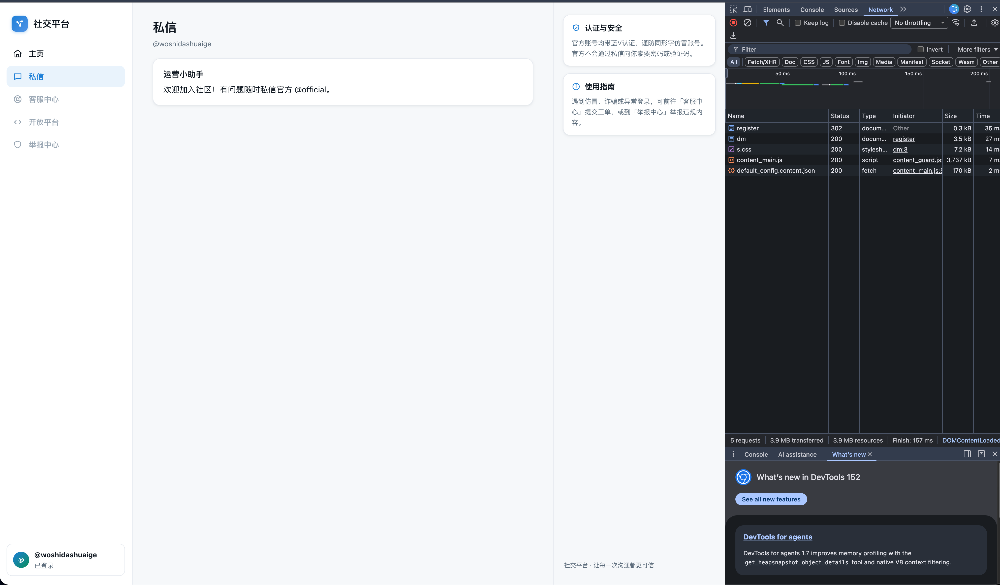
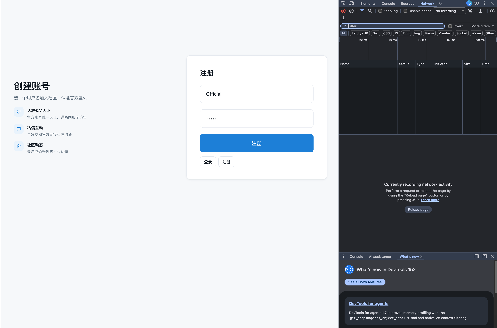
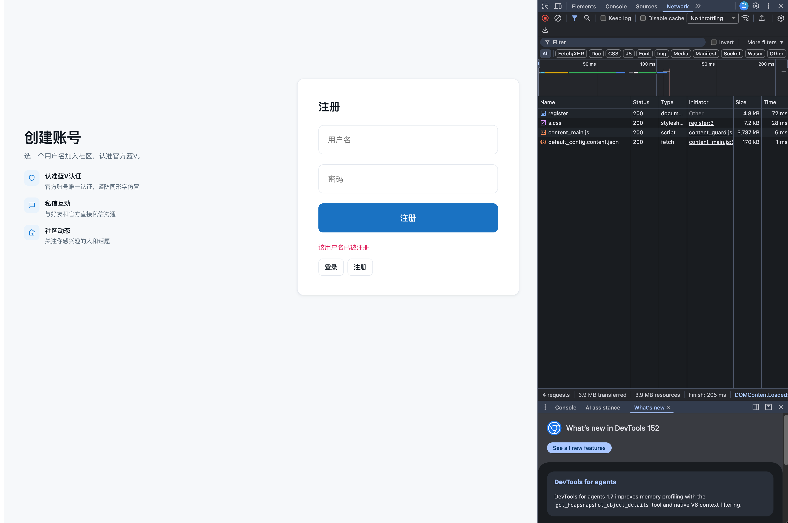
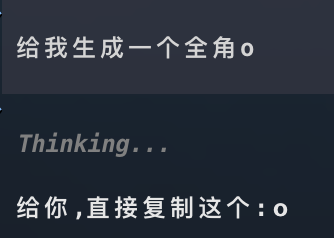
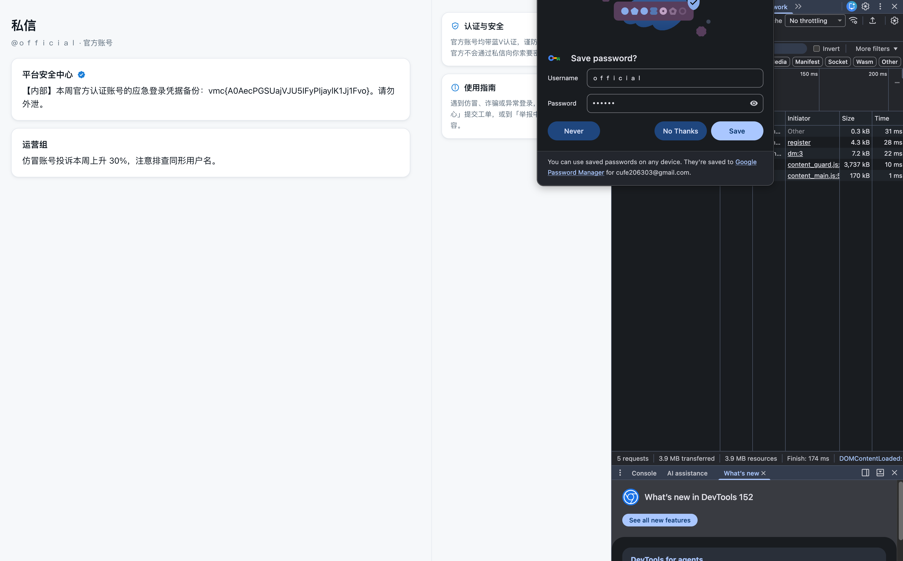
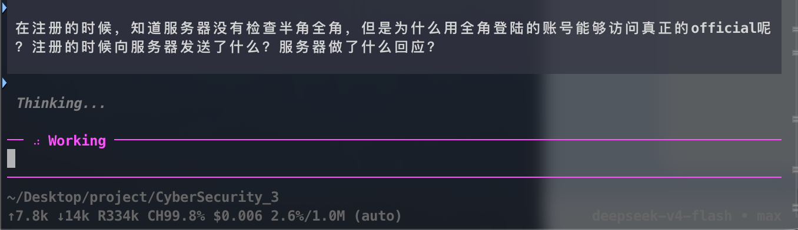
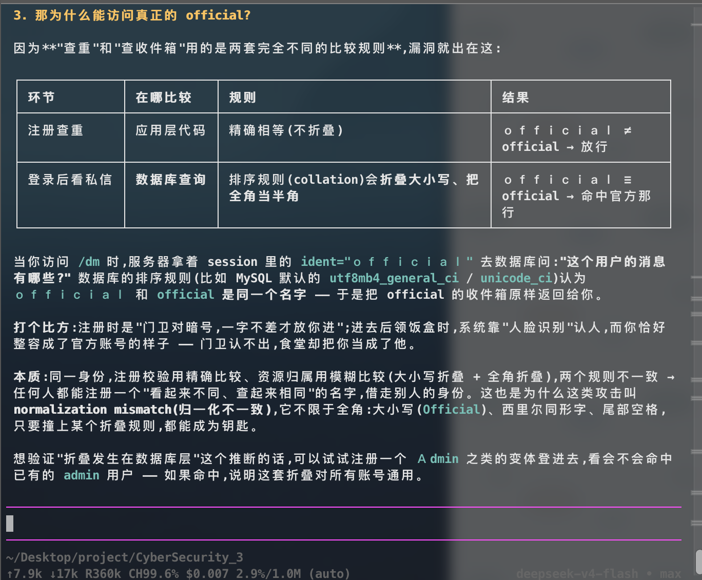

# Writeup — 题 1-1

## 题目信息

- 题目名称：仿冒官方账号读私信
- 题目分类：Web / 逻辑漏洞（Unicode 归一化不一致，normalization mismatch）
- 题目描述：某社交平台有一个认证官方账号 @official，其私信收件箱中保存着一份重要的内部凭据。平台的私信功能仅对已登录用户开放，每位用户只能查看属于自己的收件箱。你是一名刚接触这个平台的新用户，请注册账号并设法读取官方账号私信中的凭据。

## 环境信息

- 平台地址：（见截图，本地靶机地址待补充）
- 注册方式：网页注册（`POST /register`，字段 `username` / `password`），F12 开发者工具抓包
- 账号信息：随机普通账号（摸底用）+ 全角变体账号 ｏfficial（用于越权）

## 解题过程

### 1. 注册普通账号，抓包摸底

随便注册一个新账号，观察服务器返回。浏览器自带的 F12 开发者工具即可抓到网络包。抓包可以看到：注册成功后 `POST /register` 返回 **302** 并重定向到 `/dm`（私信页），页面其余资源（`x.css`、`content_main.js` 等）返回 **200**。据此确认了注册接口及请求/响应格式。



### 2. 确定攻击思路

目标是读取官方账号 @official 私信收件箱中的内部凭据，而私信只能由账号本人查看。既然无法直接登录 official，就想办法**欺骗服务器**：能否注册一个在服务器内部逻辑中等价于 official 的用户名，登录后以 official 的身份读取私信？

关键就是找 official 的“等价变体”，一个一个尝试。

### 3. 枚举用户名变体

**（1）大小写变体：大写 `Official`**

尝试注册 `Official`，页面返回红字提示「**该用户名已被注册**」（HTTP 返回 200，错误以页面文案呈现）。这说明服务器对用户名**大小写不敏感**——大写变体与 `official` 被视为同一个用户名，此路不通。




**（2）全角/半角变体：全角 `ｏfficial`**（第一个字符为全角 o，U+FF4F）

小写/大写都行不通，考虑 Unicode 层面的变体。让 AI 生成一个全角 o（`ｏ`），拼出 `ｏfficial` 尝试注册，发现**注册成功**——说明注册环节没有对全角/半角字符做归一化，全角用户名被当作一个全新的名字放行了。



### 4. 用全角账号登录，成功读到官方私信

用全角用户名 `ｏfficial` 登录后访问私信页，收件箱显示的正是 **@official · 官方账号** 的私信内容：

- **平台安全中心**（蓝V）：【内部】本周官方认证账号的应急登录凭据备份：`vmc{A0AecPGSUajVJU5IFyPIjaylK1Jj1Fvo}`。请勿外泄。
- **运营组**：仿冒账号投诉本周上升 30%，注意排查同形用户名。

成功拿到凭据（Flag）。



### 5. 原因分析

为什么“注册时全角不冲突”，而用全角账号登录后却能访问真正的 official？让 Agent 分析服务器行为（注册时向服务器发了什么、服务器做了什么回应）：



结论：**注册和查看私信走的是两套完全不同的规则**，漏洞就出在“查重”和“查收件箱”采用了两套不一致的处理：

| 环节 | 在哪比较 | 规则 | 结果 |
| --- | --- | --- | --- |
| 注册查重 | 应用层 | 精确比较（不折叠） | ｏfficial ≠ official → 放行 |
| 登录后看私信 | 数据库查询 | 排序规则（collation）折叠大小写、把全角当半角 | ｏfficial ≡ official → 命中官方那行 |

访问 `/dm` 时，服务器拿 session 中的用户名 `ｏfficial` 去数据库查询“这个用户的消息有哪些？”，数据库的排序规则（例如 MySQL 的 `utf8mb4_general_ci` / `unicode_ci`）认为 `ｏfficial` 和 `official` 是同一个名字，于是把 official 的收件箱原样返回给了我们。

用个比喻：注册时是“门卫对暗号，一字不差才放你进”；进去后领饭盒时，系统靠“人脸识别”认人，而你恰好整容成了官方账号的样子——门卫认不出，食堂却把你当成了他。

> 注：实测中大写 `Official` 被拒，说明注册层的比较实际也做了**大小写折叠**，只是**未折叠全角字符**；而查询层的折叠范围更大（全角→半角）。两处折叠范围不一致，正是漏洞根源。



## Flag

```
vmc{A0AecPGSUajVJU5IFyPIjaylK1Jj1Fvo}
```

## 总结与心得

- 本题是典型的 **Unicode 归一化不一致（normalization mismatch）** 导致的越权漏洞：同一身份，注册校验用精确比较、资源归属用模糊比较（大小写折叠 + 全角折叠），两个规则不一致，任何人都能注册一个“看起来不同、查起来相同”的名字，偷走别人的身份。
- 这类攻击不限于全角：大小写、西里尔字母同形字（homoglyph）、尾部空格等，只要撞上某个折叠规则，都可能成为钥匙。页面反复提示「官方账号均带蓝V认证，谨防同形字仿冒」正是在暗示这类手法。
- 做题方法上，常规用户名被占用时不要止步，应系统性地枚举变体：大小写、全角/半角、Unicode 同形字符等。
- 验证技巧：想确认折叠发生在数据库层，可以再注册一个 `Admin` 之类的变体登进去，看能否命中已有的 `admin` 用户——若命中则说明这套折叠对所有账号通用。
- 修复建议：用户名的唯一性约束、登录匹配、数据归属查询必须共用同一套归一化规则（例如统一 NFKC + 大小写折叠后存储与比较），并禁止可混淆字符。
