# 4-1 内网渗透与高级社工 · 终端 EDR 绕过（命令行特征审计的转义 / 通配符绕过）

## 题目信息

| 项目 | 内容 |
| --- | --- |
| 题目名称 | 内网渗透与高级社工-终端EDR绕过-G1（sectionID 7269，实战 Flag 题 11237） |
| 分类 | 内网渗透 / 终端 EDR 绕过 / 命令行特征审计绕过（LotL 参数层规避） |
| 题目描述 | 目标主机部署了终端检测响应（EDR）代理，运维面板把下发的每条命令交给它做命令行特征审计，命中恶意特征即实时阻断。需要在**不触发命令行告警**的前提下执行命令，读取主机上的 `/flag`。 |

Flag 题（questionID=11237）题干原文：

> 目标主机部署了终端检测响应（EDR）代理，对运维面板下发的每条命令做命令行特征审计，命中恶意特征的命令会被实时阻断。你需要在不触发命令行告警的前提下执行命令，读取主机上的 `/flag`。

章节另附两份材料：`C085-终端EDR绕过.md`（EDR 与 AV 的差别、LotL、AMSI、注入选型等概念与实验方法，以 Windows 场景举例）与 `内网渗透与高级社工-终端EDR绕过-G1.md`（本题教学 WriteUp，给出 `ca\t /f???` 的思路）。

## 环境信息

| 项目 | 内容 |
| --- | --- |
| 平台 | VMCourse 国产化教学实训平台，课程 ID 1639（<https://vmc.hust.edu.cn>） |
| 章节 | 内网渗透与高级社工-终端EDR绕过-G1（课程 number=14），sectionID `7269` |
| 环境 / 实例 | C085-G1-F（envID `1411`），podID `ntbfvwqm0qqf9rtm08ibjpd2l`，交付时 state=Running |
| 靶机 Web | 「主机运维执行面板」`http://172.17.0.13:12083/`（nginx 反代到容器内 `127.0.0.1:8000` 的 Python `http.server`，页面 `POST /run`，JSON 字段 `cmd`） |
| SSH | `172.17.0.13:12082`（本机无口令，本次全程未使用；本题只需 Web 交互） |
| 靶机系统 | 容器 hostname `a2bbfdbd3322`，面板以 `subprocess.run(["/bin/sh", "-c", cmd])` 执行命令，当前用户 `uid=1000(ctf)` |
| 应用源码 | `/opt/app/app.py`（`root:root 644`，任意用户可读，6191 字节） |
| /flag | 38 字节，`ctf` 用户可直接读取 |
| 题型 | 3 道单选（11149 / 11151 / 11153）+ 1 道多选（11155）+ 1 道 Flag 填空（11237） |
| 账号 | 平台账号口令只保存在本地未跟踪的 `.local/` 目录（不入库），本文不记录任何凭据、cookie 或私有地址 |
| 操作方式 | HTTP JSON 请求 `/run` 下发命令并观察回显（本地辅助脚本 `probe.py`，内置 `--noproxy`）；截图用 headless Chrome（playwright-core）采集 |
| 备注 | 选择题与 Flag 题均已提交，`GET /api/student/get/answerHistory?sectionID=7269&contestMode=0` 复核 5 题 `isCorrect=true`（判分页见步骤 13）；按惯例本文不展开选择题解析 |

## 解题过程

### 1. 侦察运维面板：单命令框 + `/run` 接口（截图 01）

打开 `http://172.17.0.13:12083/`，页面标题「主机运维执行面板」，顶部状态标签是「命令行行为审计 · 运行中」，正文自述：

> 本机部署了终端检测响应（EDR）代理，对下发的运维命令做命令行特征审计，命中恶意特征的命令将被实时阻断。

页面只有一个 textarea（占位符 `例如：id`）和一个「下发执行」按钮，前端逻辑是：

```javascript
const r = await fetch('/run', {
  method: 'POST',
  headers: { 'Content-Type': 'application/json' },
  body: JSON.stringify({ cmd: document.getElementById('cmd').value })
});
// j.blocked → 红色显示 j.alert；否则显示 j.output
```

所以命令行统一走：

```bash
curl -sS --noproxy '*' -X POST http://172.17.0.13:12083/run \
  -H 'Content-Type: application/json' -d '{"cmd":"<命令>"}'
```

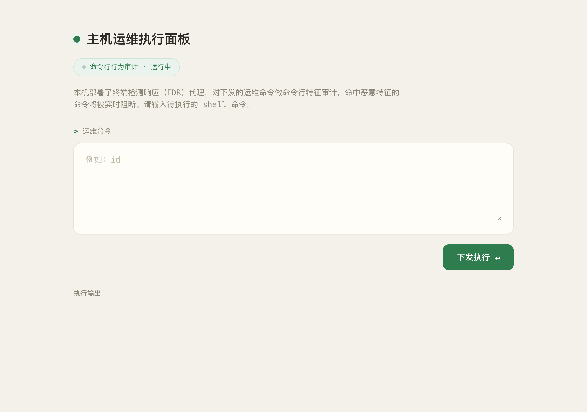

### 2. 基线验证：命令可执行、低权限用户、根目录有 flag（截图 02、03）

```text
下发 id     → uid=1000(ctf) gid=1000(ctf) groups=1000(ctf)
下发 whoami → ctf
下发 ls /   → bin boot dev etc flag home init.sh lib lib64 media mnt opt proc root run sbin srv sys tmp usr var
```

确认两件事：命令确实被 shell 执行（不是模拟回显），当前是低权限用户 `ctf`；根目录下存在目标文件 `flag`。

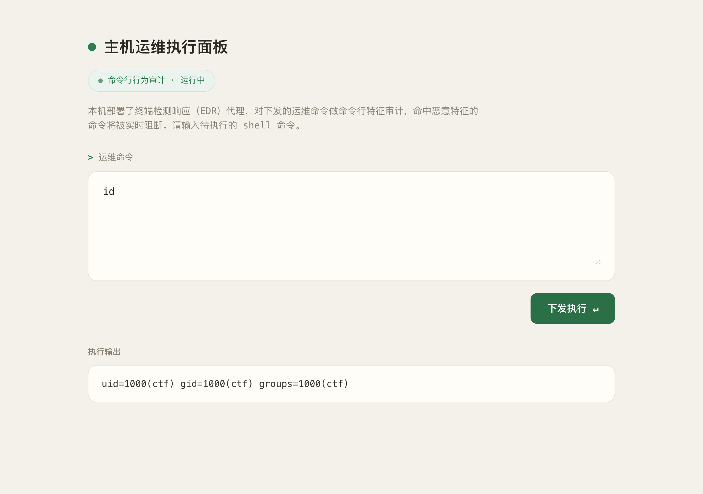

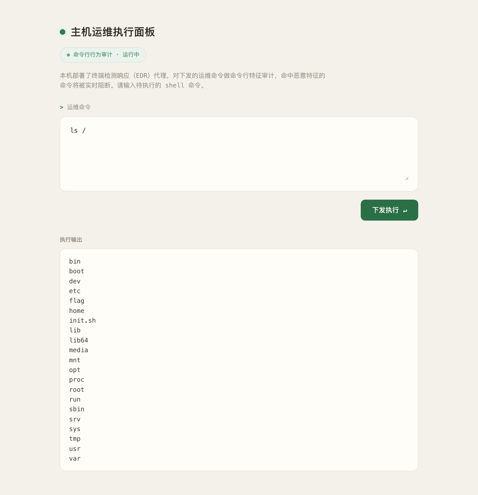

### 3. 失败尝试一：`cat /flag` 命中 «flag»（截图 04）

```text
下发 cat /flag
结果 ⛔ EDR 告警：命令行命中恶意特征 «flag»，已阻断执行
```

告警里直接给出了**命中词**，说明这是一套「敏感子串匹配」式审计，且告警信息会把规则泄露给使用者。


调整思路：既然匹配的是文件名里的 `flag` 这个子串，就用 shell 的通配符把真实路径藏起来——`/f???` 在执行时展开成 `/flag`，而命令行文本里不含 `flag`。

### 4. 失败尝试二：`cat /f???` 命中 «cat»（截图 05）

```text
下发 cat /f???
结果 ⛔ EDR 告警：命令行命中恶意特征 «cat»，已阻断执行
```

通配符这一步是对的（告警词从 `flag` 变成了 `cat`），但**命令名本身也在黑名单里**：审计看的是整条命令行，`cat` 这个子串照样命中。也就是说，必须同时消掉「命令名」和「文件名」两处敏感子串。


### 5. 失败尝试三：大小写变体 `CAT /FLAG` 仍被拦（截图 06）

在 3-4 那道题里，特征库用 `strpos` 区分大小写，`FLAG`、`File` 这类变体可以直接绕过；先验证本题是否同样如此：

```text
下发 CAT /FLAG
结果 ⛔ EDR 告警：命令行命中恶意特征 «flag»，已阻断执行
```

大小写混淆**无效**——告警命中词是小写的 `flag`，说明检测前对命令行做了 `lower()` 之类的规范化（后续读源码证实），大小写不敏感匹配把这条捷径堵死了。这一对照实验也说明：**同一个「关键词黑名单」题目，匹配实现的细节不同，绕过手法就完全不同，必须实测而不能照搬上一题的经验。**

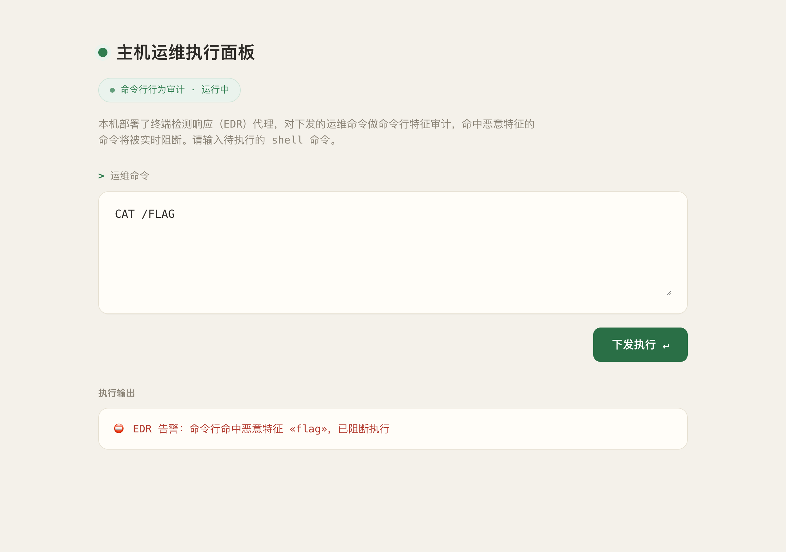

### 6. 逐词探测：黑名单的命中与误伤

在拿到源码前，先用「把候选词单独作为一条命令下发」的方式摸一遍边界（`probe_list.py`，观察 `blocked` 与告警里的命中词）：

| 类别 | 探测结果 |
| --- | --- |
| 被拦（与源码 18 条一致） | `cat` `tac` `head` `tail` `more` `less` `sed` `awk` `grep`（含 `egrep`/`fgrep`）`strings` `xxd` `base64` `curl` `wget` `hexdump` `flag` |
| 因含 `cat` 被**误伤** | `ncat` `netcat` `socat` `locate` `zcat`（告警均显示命中 «cat»） |
| 放行 | `dd` `od` `rev` `sort` `tr` `cut` `cp` `mv` `rm` `ln` `tar` `gzip` `python3` `perl` `bash` `sh` `env` `find` `ls` `wc` `ps` `ss` `mount` … |

两类信号同时出现：一方面是**漏**（大量未被列入的读文件方式，如 `dd`/`sort`/`od`/`rev`），另一方面是**误**（`locate`、`netcat` 这类完全无关的命令因为名字里带 `cat` 被拦）。这正是子串黑名单的典型缺陷。

### 7. 读源码：18 条 `BLACKLIST` 全文（截图 07）

面板本身可以执行任意未被拦的命令，而应用源码 `app.py` 是 644 权限、`ctf` 用户可读；`dd` 不在黑名单里，于是直接把它读回来：

```text
下发 dd if=/opt/app/app.py bs=1 count=400
回显 import http.server / import json / import subprocess /
     # 模拟命令行遥测规则：命中任一敏感子串即告警拦截，命令不执行。
     BLACKLIST = [ "flag", "cat", "tac", "head", "tail", "less", "more",
                   "xxd", "hexdump", "strings", "grep", "awk", "sed",
                   "base64", "curl", "wget", "/etc", "/proc" ]
```

判定逻辑原文：

```python
BLACKLIST = [
    "flag", "cat", "tac", "head", "tail", "less", "more",
    "xxd", "hexdump", "strings", "grep", "awk", "sed",
    "base64", "curl", "wget", "/etc", "/proc",
]

def run_cmd(cmd: str) -> dict:
    low = cmd.lower()
    for kw in BLACKLIST:
        if kw in low:
            return {"blocked": True,
                    "alert": "EDR 告警：命令行命中恶意特征 «%s»，已阻断执行" % kw}
    p = subprocess.run(["/bin/sh", "-c", cmd], capture_output=True, timeout=10, text=True)
    return {"blocked": False, "output": (p.stdout + p.stderr)[:8000]}
```

四个要点：

1. **只有一层静态文本检测**：18 条子串对整条命令行做包含判断，命中即拒绝，命令**根本不会进入 shell**——这是本题唯一防线；
2. 检测前执行了 `cmd.lower()`，所以是**大小写不敏感**匹配（步骤 5 的实测由此得到解释）；
3. 名单同时覆盖读文件程序（`cat/tac/head/tail/less/more/xxd/hexdump/strings/grep/awk/sed`）、下载器（`curl/wget`）、编码器（`base64`）和两个路径前缀（`/etc`、`/proc`）外加关键词 `flag`；
4. **检测对象是原始命令行字符串，而不是最终执行的程序**——只要文本里写不出敏感子串，就能通过审计；而 shell 层面有大量「写法」可以做到这一点（反斜杠转义、引号、变量拼接、通配符、`$IFS` 等）。

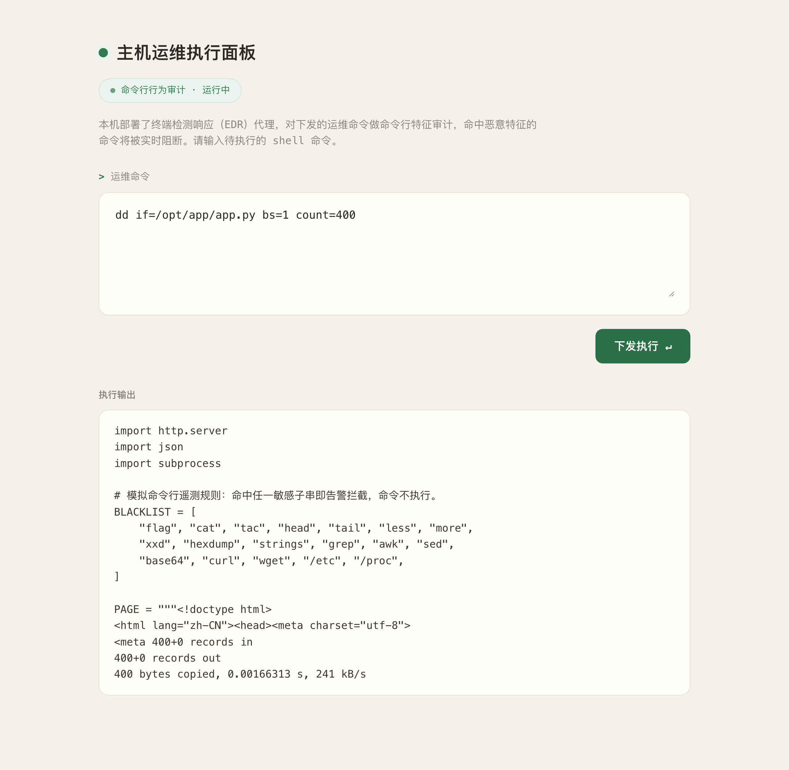

### 8. 主题解法：反斜杠转义 + 通配符，`ca\t /f???`（截图 08）

针对两个不同的敏感点分别用两种 shell 层「写法」消掉：

- **命令名**：`cat` → `ca\t`。命令行文本里是 `c`、`a`、`\`、`t` 四个字符，不含子串 `cat`；`/bin/sh` 解析时反斜杠只作用于紧随的 `t`（去掉其特殊含义，仍是字符 `t`），最终拼回 `cat`（注意：`\t` 在 shell 中**不是**制表符）；
- **文件名**：`/flag` → `/f???`。命令行文本里不含 `flag`；shell 在执行前做路径展开（globbing），把 `/f???` 匹配成唯一存在的文件 `/flag`。

两者组合，下发：

```text
下发 ca\t /f???
结果 vmc{Q4bVBlcHqCR6sp4thm1fBAwE7qAp6kye}
```

EDR 的子串匹配找不到任何敏感关键词，命令通过审计；shell 把它还原为 `cat /flag` 并执行，flag 直接回显。等价的写法还有 `\cat /f???`、`c'a't /f???`、`c${x}at /f???` 等，原理都是「字符串层面不出现敏感子串、执行层面还原成敏感命令」。


### 9. 备选解法：不靠转义，直接 `sort /f???`（截图 09）

既然黑名单只是 18 条子串，**换一个不在名单里的读文件程序**同样可行，不需要任何转义技巧：

```text
下发 sort /f???      → vmc{Q4bVBlcHqCR6sp4thm1fBAwE7qAp6kye}
下发 wc -c /f???     → 38 /flag        （确认 flag 文件长度 38 字节）
```

`/f???` 负责藏文件名，`sort`（或 `dd`/`od`/`rev`）负责绕过命令名黑名单——这条路线说明本题的防线比「转义绕过」所能体现的还要薄。

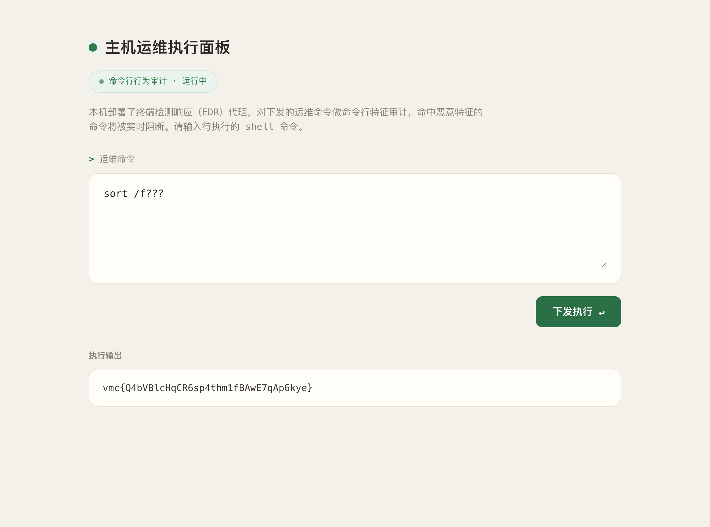

### 10. 失败尝试与调整思路汇总

| # | 尝试 | 现象 | 原因 | 调整 |
| --- | --- | --- | --- | --- |
| 1 | `cat /flag` | ⛔ 命中 «flag» | 目标关键词直接出现在命令行 | 用通配符把文件名藏起来 |
| 2 | `cat /f???` | ⛔ 命中 «cat» | 文件名解决了，但 `cat` 命令名本身在黑名单里 | 命令名也要做变形 |
| 3 | `CAT /FLAG` | ⛔ 命中 «flag» | 源码里 `cmd.lower()`，匹配大小写不敏感 | 放弃大小写混淆，改用 shell 层转义 |
| 4 | `dd if=/f???` | `failed to open '/f???': No such file` | 通配符只对**整个单词**展开，`if=/f???` 整体不是一个匹配到的文件名 | 改用独立单词形式（`sort /f???`） |
| 5 | `dd < /f???` | `/bin/sh: 1: cannot open /f???: No such file` | 靶机是 dash，重定向词不做通配符展开 | 同上 |
| 6 | `ca\t /f???` | ✅ 读出 flag | 命令行文本无敏感子串，shell 解析后还原为 `cat /flag` | 主题解法 |
| 7 | `sort /f???` | ✅ 读出 flag | `sort` 不在 18 条黑名单里 | 记录为备选（更简单，但不如转义方案通用） |

截图对应：第 1 条 → 截图 04；第 2 条 → 截图 05；第 3 条 → 截图 06；第 6 条 → 截图 08；第 7 条 → 截图 09；第 4、5 条为命令行实测（过程记录留存，未单独截图）。

其中第 3 条和第 7 条最有信息量：**第 3 条**说明「关键词黑名单」这类题的关键实现细节（是否大小写敏感、是否规范化）必须实测，直接照搬 3-4 的「大小写变体绕过」会失效；**第 7 条**说明只要换一个未列入名单的工具，连转义都不需要——**黑名单的完备性在原理上不可能成立**。

### 11. 教学问答：转义原理、遥测盲区与蓝队加固（截图 10–14）

围绕本题主题向课程教学问答平台（Qwen2.5）提了 5 个问题，问答原文另存 `.local/process/4-1-qa-transcript.json`（会话 5266–5270）：

**问题 1：为什么 `ca\t` 能绕过子串审计、差异出现在哪个阶段**（截图 10）——模型指出差异出现在「命令解释阶段」：审计看到的是提交的原始字符串，shell 解释之后才得到真正执行的程序，两者不是同一个东西。这一点说对了。

> 口径说明：该回答同时把 `\t` 描述成「水平制表符」，并称 `ca\t` 会执行成 `ca` 加一个制表符——这与 POSIX shell 的行为不符：反斜杠只是去掉下一个字符的特殊含义，`ca\t` 解析结果就是 `cat`。本机实测 `ca\t /f???` 回显 flag，本文以实测为准。

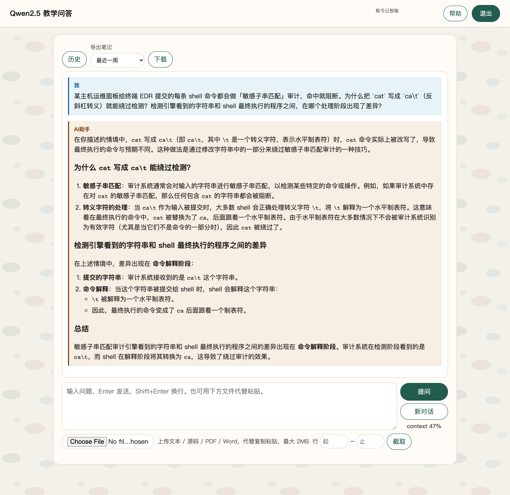

**问题 2：shell 通配符展开发生在什么阶段，EDR 只读命令行会漏掉什么**（截图 11）——展开发生在命令执行之前、由 shell 完成，因此 EDR 在命令行文本里看到的是 `f???`，只有展开后才是真实文件名；要还原真实访问行为，必须补充文件操作日志、进程与文件的关联信息等终端遥测，而不能只看命令行字符串。

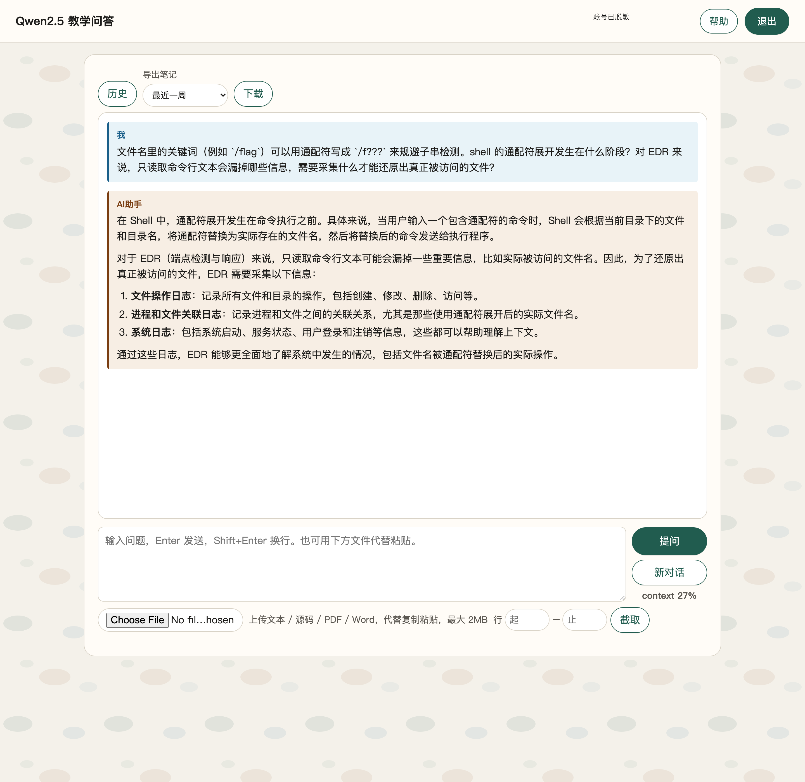

**问题 3：命令行黑名单还有哪些绕过手法、大小写混淆为何无效、检测侧如何对抗**（截图 12）——除变量拼接、`$IFS`、引号插入、管道解码外，还提到环境变量注入、转义字符、多进程等手法；大小写混淆对**大小写不敏感**的匹配自然无效（与步骤 5 实测一致）；检测侧应从关键词黑名单转向正则匹配、行为审计、白名单和沙箱。

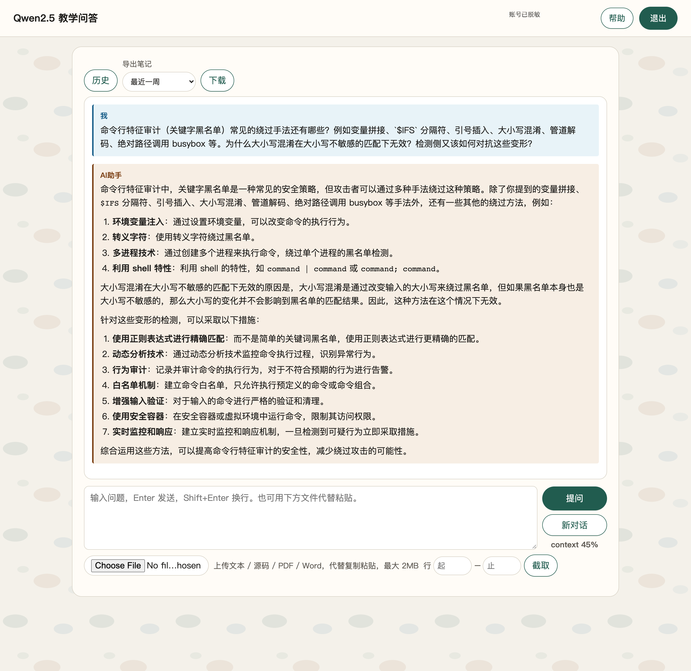

**问题 4：把用户输入交给 `/bin/sh -c` 的架构如何加固、只靠 EDR 黑名单的局限**（截图 13）——输入校验、最小权限、命令白名单、参数化调用、沙箱、日志监控多管齐下；黑名单的固有局限是滞后性、误报漏报、缺乏上下文与单层防御。

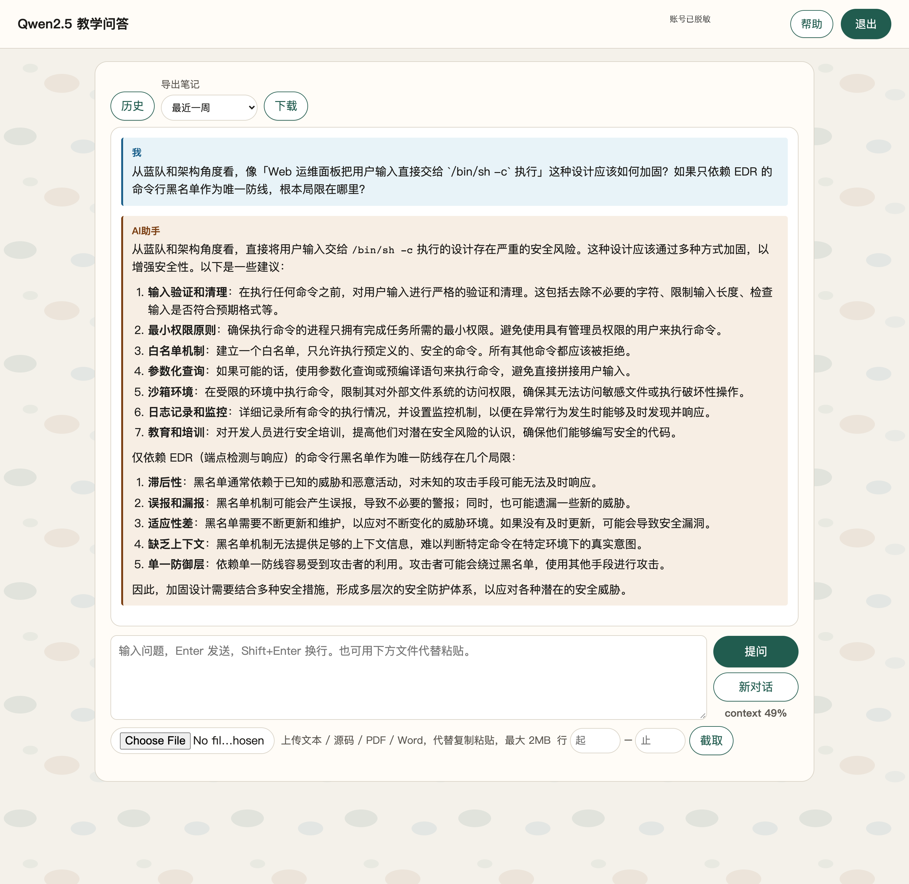

**问题 5：绕过发生后，蓝队应优先查哪些遥测与日志**（截图 14）——auditd 的 `execve` 审计（可看到真实执行的程序与参数）、进程树父子关系、文件访问记录、shell history，各自的覆盖范围与局限（性能开销、日志轮转、可被清除或篡改）都做了梳理，结论是要多源交叉验证。

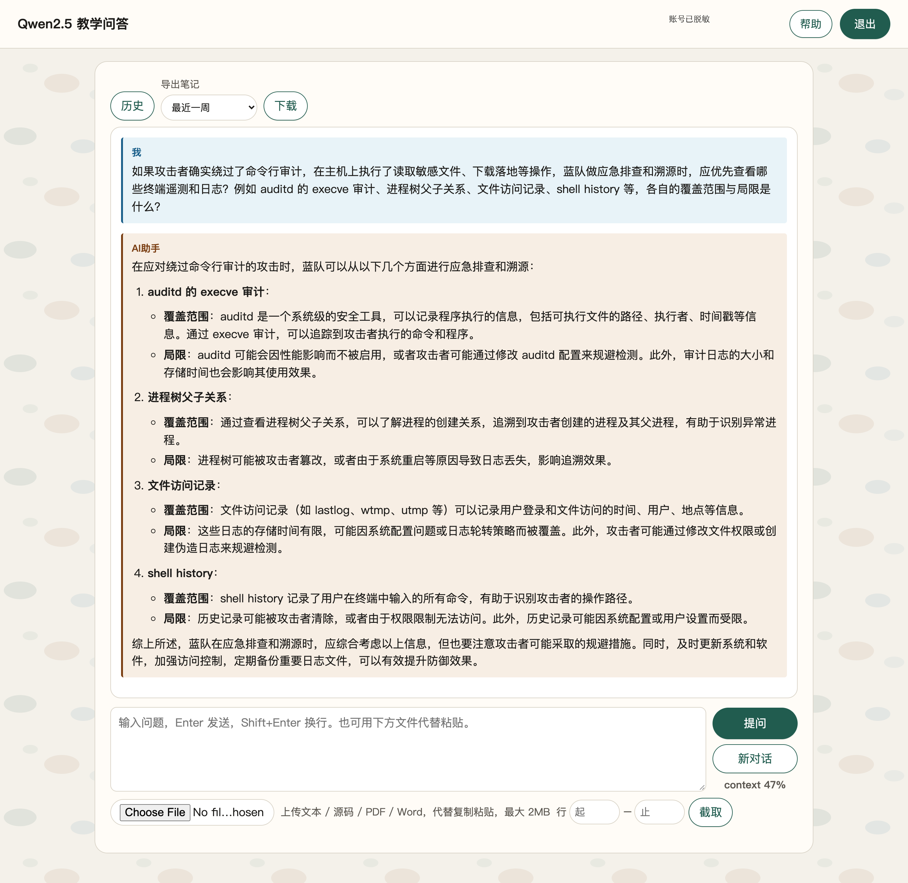

### 12. 提交答案与平台判分（截图 15）

读取到 flag 后在平台一次性提交 5 题：

```bash
curl -sS -k --noproxy '*' -m 60 -b .local/vmc-cookies.txt \
  -X POST "$VMC_BASE/api/student/submitAnswers" \
  -F "sectionID=7269" \
  -F 'answers={"questionID":11149,"answer":"{\"answer\":[\"B\"],\"num\":1}"}' \
  -F 'answers={"questionID":11151,"answer":"{\"answer\":[\"A\"],\"num\":1}"}' \
  -F 'answers={"questionID":11153,"answer":"{\"answer\":[\"D\"],\"num\":1}"}' \
  -F 'answers={"questionID":11155,"answer":"{\"answer\":[\"A\",\"B\",\"D\"],\"num\":3}"}' \
  -F 'answers={"questionID":11237,"answer":"{\"num\":3,\"answer\":[\"\",\"\",\"vmc{Q4bVBlcHqCR6sp4thm1fBAwE7qAp6kye}\"]}"}' \
  -F "contestMode=0"
# code=0, msg=success
```

`GET /api/student/get/answerHistory?sectionID=7269&contestMode=0` 复核结果：

| questionID | 题型 | 提交内容 | 答案要点 | isCorrect |
| --- | --- | --- | --- | --- |
| 11149 | 单选 | `{"answer":["B"],"num":1}` | EDR 与 AV 的关键区别：持续采集终端行为遥测并支持时间线回溯与自动化响应，而非只做静态扫描 | true |
| 11151 | 单选 | `{"answer":["A"],"num":1}` | Linux 上记录交互式登录与权限切换的是 `/var/log/auth.log` 的 PAM 认证记录 | true |
| 11153 | 单选 | `{"answer":["D"],"num":1}` | IoC 依赖预定义特征的精确匹配，对未知威胁覆盖有限、但对已知威胁误报率较低 | true |
| 11155 | 多选 | `{"answer":["A","B","D"],"num":3}` | 终端遥测类别：进程生命周期、文件系统操作、用户与认证事件（C 项属网络边界，不是终端遥测） | true |
| 11237 | Flag 填空 | `{"num":3,"answer":["","","vmc{Q4bVBlcHqCR6sp4thm1fBAwE7qAp6kye}"]}` | 反斜杠转义 + 通配符绕过命令行审计读 `/flag` | true |

平台答题页 5 题全部显示「作答正确」。顶层 `scoreRate` 常显示 0，属平台历史显示现象，判分以 `answerHistory.isCorrect` 为准；按惯例本文不展开选择题解析。

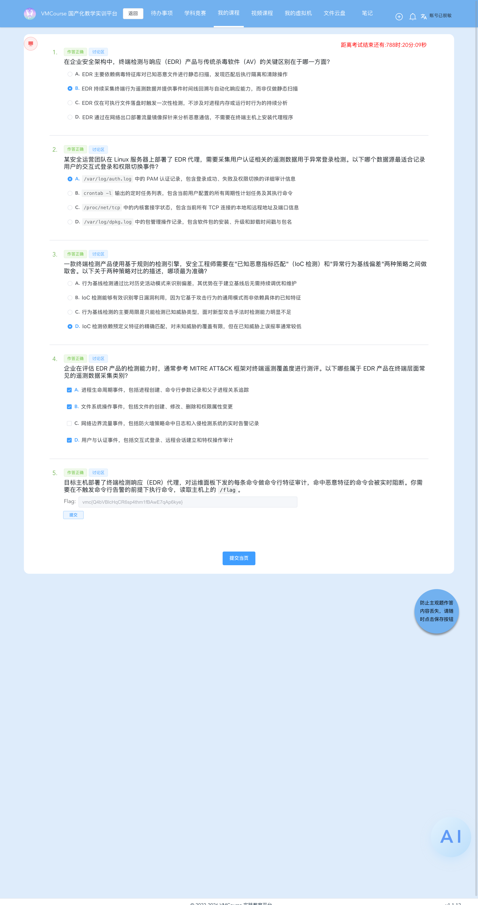

### 13. 靶机遗留物

**无**。本轮全程只做读取与探测（`id`/`ls`/`cat`/`dd`/`sort`/`wc` 等），未向靶机写入任何文件，未改动配置与服务，未使用 SSH。实例保持 Running（`saveTime` 约 3 小时，平台自动回收）。

## Flag

```text
vmc{Q4bVBlcHqCR6sp4thm1fBAwE7qAp6kye}
```

## 总结与心得

### 漏洞原理

1. **把「命令行文本」当作检测对象，是本题防线的根本错位**：EDR 审计的是用户提交的原始字符串，而 shell 在执行前还要做引用去除、反斜杠转义、参数展开、通配符展开、变量替换等一整套解析。`ca\t` 在文本里不是 `cat`，`/f???` 在文本里不是 `/flag`，但执行时它们就是这两个东西——**检测点和执行点看到的是两个不同的字符串**，这个空隙就是全部绕过空间（对应 AI 问答 1、2）。
2. **18 条子串黑名单既不完备也不精确**：`cat/chr` 类子串会误伤 `locate`、`netcat`、`socat`、`zcat` 等无关程序；而未被列入的 `dd`、`sort`、`od`、`rev`、`tr` 等同样能读文件——只要换一个工具就绕过了，连变形都不需要。黑名单本质是「已知威胁枚举」，攻击面的写法空间远大于名单空间（对应 AI 问答 3、4）。
3. **黑名单命中还会主动泄露规则**：告警文案直接回显命中词（«flag» → «cat»），等价于把检测规则逐步喂给使用者——从「先藏文件名」到「再藏命令名」的推理几乎是被告警推着走的，也说明**告警内容本身应当收敛**。
4. **同一类题的实现差异决定了绕过手法**：3-4 题的 `strpos` 区分大小写，大小写变体即可绕过；本题在检测前做了 `lower()`，`CAT /FLAG` 直接被拦。**必须先实测规范化行为，再选绕过手法**，照搬经验会翻车（步骤 5）。
5. **根因是「用户可控命令 + 敏感资产在同一权限域」**：面板以 `sh -c` 执行任意输入，进程是 `ctf`（uid 1000），而 `/flag` 对 `ctf` 可读；命令行审计只是贴在入口的一层文本过滤，既拦不住变形，也拦不住换工具，还不阻拦任何实际的文件访问行为。

### 做题方法

- **先摸基线再定策略**：`id`、`ls /` 确认执行链路与目标文件，再用 `cat /flag` 让告警暴露关键词（告警里直接写了命中词，是本题最重要的信息泄露点）；
- **一次只改一个变量**：先只藏文件名（`cat /f???`）→ 告警词由 `flag` 变成 `cat`，据此推出「命令名也在名单里」；再叠加命令名变形，形成 `ca\t /f???`；
- **对照实验证伪经验**：把上一题（3-4）的大小写变体拿来试一次，确认本题大小写不敏感，避免在错误假设上浪费时间；
- **读源码定边界**：用不在名单里的 `dd` 把 `/opt/app/app.py` 读回来，拿到 18 条黑名单原文与 `cmd.lower()` 的规范化逻辑，从此「按名单构造」而非「猜规则」；
- **善用 shell 的两个层面**：命令行文本层（反斜杠转义、引号、变量拼接、`$IFS`）解决「名字不能出现」，执行层（通配符展开）解决「路径不能出现」，两者组合即可覆盖命令名 + 文件名两个敏感点；
- **注意 shell 的细节差异**：通配符只对完整单词展开（`dd if=/f???` 失败），dash 也不对重定向词做展开（`dd < /f???` 失败）——这些失败本身就是有价值的记录；
- **保留备选方案做对照**：`sort /f???` 证明「换工具」比「变形」更省事，也侧面说明黑名单防线不成立。

### 修复建议

- **不要以命令行文本匹配作为安全边界**：关键词黑名单既拦不全（换工具即可绕过）又易误伤（`locate` 被 `cat` 误拦）；若必须做审计，应基于**执行后的真实行为**（`execve` 的实际 `argv`/`exe` 路径、文件打开事件）而非提交字符串，并对引号、转义、变量展开、通配符做归一化还原后再匹配；
- **运维面板不要用 `sh -c` 执行自由文本**：改为「预定义动作 + 参数白名单」的模式，例如只暴露 `restart(service_name)`、`tail_log(service_name)` 这类结构化操作，参数做严格校验与转义，从根本上消除拼接任意命令的可能（对应 AI 问答 4）；
- **最小权限 + 敏感资产隔离**：执行面板的进程使用专用低权用户，配合容器/命名空间隔离、只读根文件系统；`/flag`、凭据、`/etc`、`/proc` 等敏感位置不应与「能执行任意命令的进程」处于同一可读域（本题 `ctf` 直读 `/flag` 就是直接后果）；
- **补充多源遥测与行为检测**：只靠命令行审计会漏掉通配符、转义、编码等一切形变；应结合 `execve` 审计（auditd/eBPF）、进程树父子关系、文件访问监控与 shell 日志做关联分析，并对「低权进程读取敏感路径」「未在白名单内的可执行文件被执行」这类行为告警（对应 AI 问答 5）；
- **告警内容收敛**：返回给使用者的告警不要回显命中的具体特征词，避免把检测规则变成可迭代的提示；
- **把「关掉/绕过传感器」当作违规而不是绕过**：本题的合规边界是「保留遥测、走允许的行为链」，防御侧也应把防护进程的存活、遥测完整性纳入监控（章节材料对此有明确表述）。

原始过程记录：`.local/process/4-1-ctf-process.md`；教学问答原文：`.local/process/4-1-qa-transcript.json`；复现脚本：`.local/process/4-1-scripts/`（`probe.py`/`probe_list.py` 命令下发与黑名单探测、`ask_qa.py` 提问、`panel_shots.mjs`/`qa_shots.mjs`/`vmc_grade.mjs` 截图）。

---

## 截图脱敏说明（2026-09-29 补充）

本题目录下的截图在首次入库时未处理平台账号信息，交付复核时已统一补做（处理脚本 `.local/process/redact_personal_info.py`，复核脚本 `.local/process/verify_redaction.py`）：

| 截图 | 个人信息位置 | 处理方式 |
| --- | --- | --- |
| AI 问答截图（5 张） | 页头右侧账号胶囊显示登录账号的**显示名 + 学号**（device px `(W-770, 28)-(W-380, 122)`，W 为图片宽度） | 该矩形重绘为页面背景色，并标注「账号已脱敏」 |
| 平台判分截图（1 张） | 实训平台答题页页头右上角显示账号**真实姓名**（device px `(2504+(W-2800), 58)-(+176, 128)`） | 同上，重绘为页头蓝底并标注「账号已脱敏」 |

复核结论：逐图比对脱敏前后备份，**脱敏矩形之外像素零改动**；矩形内容与确定性重绘逐点一致；AI 问答截图重新做 OCR 后不再出现姓名与学号。截图中的提问、回答与判分结果均完整可读，未做其它改动。
